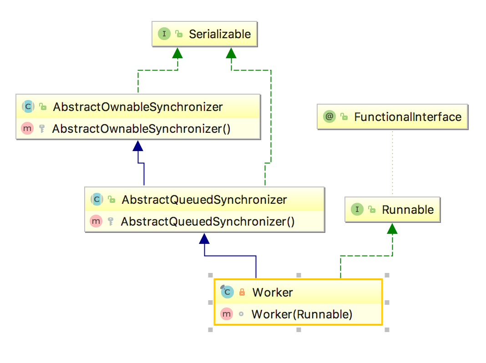
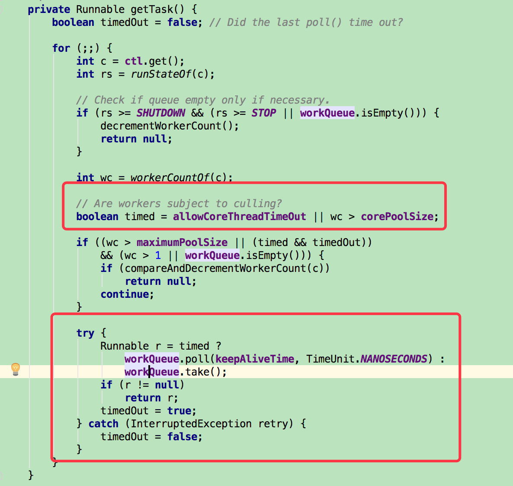
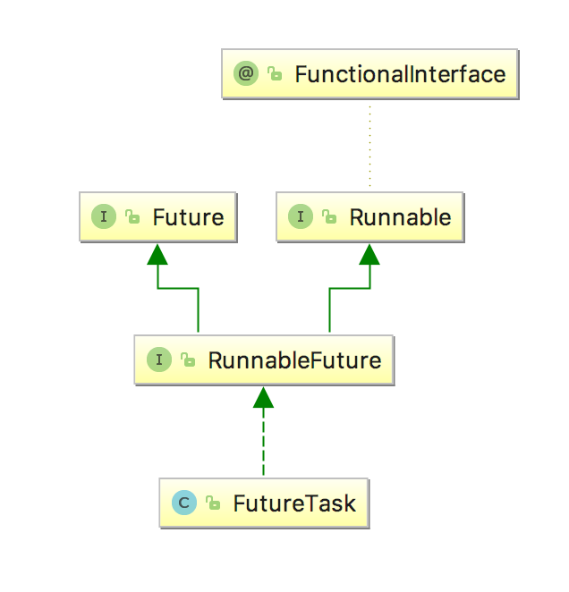

概述
====

此次源码解析，主要实现以下目标：

1.  基本使用

2.  基本源码结构查看

3.  submit和execute的区别

源码解析
========

基本使用
--------

引用网络上对线程池的优点描述：

1.  降低资源消耗。通过重复利用已创建的线程降低线程创建和销毁造成的消耗。

2.  提高响应速度。当任务到达时，任务可以不需要的等到线程创建就能立即执行。

3.  提高线程的可管理性。线程是稀缺资源，如果无限制的创建，不仅会消耗系统资源，还会降低系统的稳定性，使用线程池可以进行统一的分配，调优和监控。

当开发者使用线程池时，就基本知道线程池的好处了。通常为了为了能区分出代线程池的用处，最好对业务进行归类，线程归类，方便统一操作。指定线程池的名称，并设定当线程发生未捕获异常时的处理（只对execute提交的task有用）。

例如：

+----------------------------------------------------------------------+
| **private static class** SnifferPoolExecutor **extends**             |
| ThreadPoolExecutor {                                                 |
|                                                                      |
| SnifferPoolExecutor(**int** corePoolSize, **int** maximumPoolSize,   |
|                                                                      |
| **long** keepAliveTime,                                              |
|                                                                      |
| TimeUnit unit,                                                       |
|                                                                      |
| BlockingQueue\<Runnable\ workQueue) {                               |
|                                                                      |
| **super**(corePoolSize, maximumPoolSize, keepAliveTime, unit,        |
| workQueue,                                                           |
|                                                                      |
| **new**                                                              |
| Bas                                                                  |
| icThreadFactory.Builder().namingPattern(**\"数据抓取工作线程-%d\"**) |
|                                                                      |
| .uncaughtExceptionHandler(**new** UncaughtExceptionHandler() {       |
|                                                                      |
| \@Override                                                           |
|                                                                      |
| **public void** uncaughtException(Thread t, Throwable e) {           |
|                                                                      |
| ***log***.warn(**\"线程\[\"** + t.getName() +                        |
| **\"\]发生未捕获异常\"**, e);                                        |
|                                                                      |
| }                                                                    |
|                                                                      |
| }).build());                                                         |
|                                                                      |
| }                                                                    |
|                                                                      |
| }                                                                    |
+----------------------------------------------------------------------+

参数描述
--------

+----------------------------------------------------------------------+
| **public** ThreadPoolExecutor(**int** corePoolSize,                  |
|                                                                      |
| **int** maximumPoolSize,                                             |
|                                                                      |
| **long** keepAliveTime,                                              |
|                                                                      |
| TimeUnit unit,                                                       |
|                                                                      |
| BlockingQueue\<Runnable\ workQueue,                                 |
|                                                                      |
| ThreadFactory threadFactory,                                         |
|                                                                      |
| RejectedExecutionHandler handler) {                                  |
|                                                                      |
| **if** (corePoolSize \< 0 \|\|                                       |
|                                                                      |
| maximumPoolSize \<= 0 \|\|                                           |
|                                                                      |
| maximumPoolSize \< corePoolSize \|\|                                 |
|                                                                      |
| keepAliveTime \< 0)                                                  |
|                                                                      |
| **throw new** IllegalArgumentException();                            |
|                                                                      |
| **if** (workQueue == **null** \|\| threadFactory == **null** \|\|    |
| handler == **null**)                                                 |
|                                                                      |
| **throw new** NullPointerException();                                |
|                                                                      |
| **this**.**corePoolSize** = corePoolSize;                            |
|                                                                      |
| **this**.**maximumPoolSize** = maximumPoolSize;                      |
|                                                                      |
| **this**.**workQueue** = workQueue;                                  |
|                                                                      |
| **this**.**keepAliveTime** = unit.toNanos(keepAliveTime);            |
|                                                                      |
| **this**.**threadFactory** = threadFactory;                          |
|                                                                      |
| **this**.**handler** = handler;                                      |
|                                                                      |
| }                                                                    |
+----------------------------------------------------------------------+

-   corePoolSize

 核心线程数量，用来描述worker的数量。worker是线程池真正能够执行的线程。提交的Runnable就像个工单，submit或execute后，worker是真正执行Runnable的线程。

-   maximumPoolSize

 最大线程数量，用来描述worker的最大数量。

-   keepAliveTime

 是指线程池worker所允许的空闲时间。当线程池中的worker数量大于corePoolSize的时候，如果这时没有新的Runnable提交，核心线程外的worker不会立即销毁，而是会等待，直到等待的时间超过keepAliveTime

-   unit

 时间的单位

-   workQueue

 Runnable提交的队列。这里需要注意的是，这个队列是用来存放Runnable任务的，这个参数和corePoolSize用来决定何时执行任务。提交的Runnable是否被立即执行，判断顺序为：先判断是否小于corePoolSize，如果当前worker数小于CorePoolSize，那就启动worker执行任务，如果大于了corePoolSize，那就先放workQueue，如何workQueue也放不下了，那就再启动worker立即执行当前的Runnable。举个例子，当corePoolSize为2，workQueue为10，当提交了2个Runnable时，将会启动两个worker工作，当提交了3-12时，都还是只有2个worker，只有当提交到13个时，队列装不下了，就在启动一个worker进行执行Runnable。

-   threadFactory

 用来创建新线程。默认使用Executors.defaultThreadFactory()
 来创建线程。建议自己实现该类，提供业务相应的名称，并在newThread方法中实现自己业务的Thread，并实现setUncaughtExceptionHandler方法设定线程发生未捕获异常后的处理，例如打日志，该方法对submit无效。

-   handler

 表示线程池的饱和策略。如果阻塞队列满了并且没有空闲的线程，这时如果继续提交任务，就需要采取一种策略处理该任务。

 线程池提供了4种策略：

-   AbortPolicy：直接抛出异常，这是默认策略；

-   CallerRunsPolicy：用调用者所在的线程来执行任务；

-   DiscardOldestPolicy：丢弃阻塞队列中靠最前的任务，并执行当前任务；

-   DiscardPolicy：直接丢弃任务

{width="5.768055555555556in"
height="4.600694444444445in"}

worker的概念
------------

在线程池中，池里装的就是worker，他也是个线程实现了Runnable接口，他会从workQueue里面去获得Runnable，然后执行。并继承AbstractQueuedSynchronizer，以完成锁的相关操作。

{width="5.768055555555556in"
height="4.309722222222222in"}

+-----------------------------------------------------+
| private final class Worker                          |
|                                                     |
| extends AbstractQueuedSynchronizer                  |
|                                                     |
| implements Runnable                                 |
|                                                     |
| {                                                   |
|                                                     |
| //省略                                              |
|                                                     |
| Worker(Runnable firstTask) {                        |
|                                                     |
| setState(-1); // inhibit interrupts until runWorker |
|                                                     |
| this.firstTask = firstTask;                         |
|                                                     |
| this.thread = getThreadFactory().newThread(this);   |
|                                                     |
| }                                                   |
|                                                     |
| public void run() {                                 |
|                                                     |
| //执行ThreadPoolExecutor的runWorker                 |
|                                                     |
| runWorker(this);                                    |
|                                                     |
| }                                                   |
|                                                     |
| //省略                                              |
|                                                     |
| }                                                   |
+-----------------------------------------------------+

当Worker启动后，会执行ThreadPoolExecutor的runWorker方法，通过代码可以看到，worker启动后就会循环通过getTask从workQueue中获得Runnable来执行。除非获得不到Runnable了，就跳出循环，这个worker的run也就即将走完，完成任务了，在最后的processWorkerExit方法，用来判断是否还需要再addWorker重新启动woker，以满足corePoolSize，这里应该只是一个再次确认的操作，因为在getTask里有相应的处理。{width="5.768055555555556in"
height="5.987936351706037in"}

{width="5.768055555555556in"
height="1.0313713910761155in"}

{width="5.768055555555556in"
height="5.476388888888889in"}

timed用于判断对满足corePoolSize以内worker的策略，allowCoreThreadTimeOut意思为是否允许核心worker
timeout，默认为false，而wc为当前worker的数量。通过以上的红框就能知道，当worker的数量没有超过corePoolSize是不启用超市策略的，也就是使用workQueue的take进行阻塞，否则就等待keepAliveTime的时间，返回null时，就是上面的runWorker方法的处理了。

submit和execute的区别
---------------------

+----------------------------------------------------------------------+
| **public** Future\<?\ submit(Runnable task) {                       |
|                                                                      |
| **if** (task == **null**) **throw new** NullPointerException();      |
|                                                                      |
| RunnableFuture\<Void\ ftask = newTaskFor(task, **null**);           |
|                                                                      |
| execute(ftask);                                                      |
|                                                                      |
| **return** ftask;                                                    |
|                                                                      |
| }                                                                    |
|                                                                      |
| **public void** execute(Runnable command) {                          |
|                                                                      |
| **if** (command == **null**)                                         |
|                                                                      |
| **throw new** NullPointerException();                                |
|                                                                      |
| **int** c = **ctl**.get();                                           |
|                                                                      |
| //判断当前worker大小是否超过了核心大小                               |
|                                                                      |
| **if** (*workerCountOf*(c) \< **corePoolSize**) {                    |
|                                                                      |
| //没有超过就增加worker                                               |
|                                                                      |
| **if** (addWorker(command, **true**))                                |
|                                                                      |
| **return**;                                                          |
|                                                                      |
| c = **ctl**.get();                                                   |
|                                                                      |
| }                                                                    |
|                                                                      |
| //当线程池在运行并且添加到队列成功                                   |
|                                                                      |
| **if** (*isRunning*(c) && **workQueue**.offer(command)) {            |
|                                                                      |
| **int** recheck = **ctl**.get();                                     |
|                                                                      |
| //再次确认，如果添加成功后，线                                       |
| 程池不是运行中了，就删除刚刚添加的Runnable，并执行相应策略。否则wor  |
| ker大小为0了，就启动一个worker，通过getTask阻塞着等待workQueue的任务 |
|                                                                      |
| **if** (! *isRunning*(recheck) && remove(command))                   |
|                                                                      |
| reject(command);                                                     |
|                                                                      |
| **else if** (*workerCountOf*(recheck) == 0)                          |
|                                                                      |
| addWorker(**null**, **false**);                                      |
|                                                                      |
| }                                                                    |
|                                                                      |
| //如                                                                 |
| 果添加到队列失败，就直接启动worker执行任务，如果失败了则执行拒绝操作 |
|                                                                      |
| **else if** (!addWorker(command, **false**))                         |
|                                                                      |
| reject(command);                                                     |
|                                                                      |
| }                                                                    |
+----------------------------------------------------------------------+

sumbit同样也会执行execute方法，只不过在之前将Runnable在封装了一层FutureTask，同样它也实现了Runnable接口。所以当submit中的execute方法执行的其实就是FutureTask了。

{width="2.8750503062117234in"
height="2.9927384076990378in"}

+----------------------------------------------------------------------+
| **public** Future\<?\ submit(Runnable task) {                       |
|                                                                      |
| **if** (task == **null**) **throw new** NullPointerException();      |
|                                                                      |
| RunnableFuture\<Void\ ftask = newTaskFor(task, **null**);           |
|                                                                      |
| execute(ftask);                                                      |
|                                                                      |
| **return** ftask;                                                    |
|                                                                      |
| }                                                                    |
|                                                                      |
| **protected** \<T\ RunnableFuture\<T\ newTaskFor(Runnable          |
| runnable, T value) {                                                 |
|                                                                      |
| **return new** FutureTask\<T\(runnable, value);                     |
|                                                                      |
| }                                                                    |
|                                                                      |
| **public** FutureTask(Runnable runnable, V result) {                 |
|                                                                      |
| **this**.**callable** = Executors.*callable*(runnable, result);      |
|                                                                      |
| **this**.**state** = ***NEW***; *// ensure visibility of callable*   |
|                                                                      |
| }                                                                    |
|                                                                      |
| **public void** run() {                                              |
|                                                                      |
| **//省略**                                                           |
|                                                                      |
| **try** {                                                            |
|                                                                      |
| //这里就是Runnable的run方法                                          |
|                                                                      |
| result = c.call();                                                   |
|                                                                      |
| ran = **true**;                                                      |
|                                                                      |
| } **catch** (Throwable ex) {                                         |
|                                                                      |
| result = **null**;                                                   |
|                                                                      |
| ran = **false**;                                                     |
|                                                                      |
| //封装异常                                                           |
|                                                                      |
| setException(ex);                                                    |
|                                                                      |
| }                                                                    |
|                                                                      |
| **if** (ran)                                                         |
|                                                                      |
| set(result);                                                         |
|                                                                      |
| **//省略**                                                           |
|                                                                      |
| }                                                                    |
+----------------------------------------------------------------------+

执行流程为worker的run \--\ FutureTask 的run \--\ 业务的run。

并且当FutureTask发生异常后，并不会将异常执行抛出，而是封装起来，而对于worker的run，Throwable就不可兼了，当调用get方法时才能捕获到Exception。这也就是为什么当使用submit方法提交Runnable时，setUncaughtExceptionHandler不能捕获到异常。

{width="2.234303368328959in"
height="3.0434930008748906in"}{width="3.491428258967629in"
height="2.07259186351706in"}

{width="3.757515310586177in"
height="4.760204505686789in"}

当调用worker的run方法时，执行的业务的run报出RuntimeException、Error、Throwable时，会直接抛出。而异常将会由jvm的底层代码调用Thread的dispatchUncaughtException这个方法，执行线程未捕获异常后的处理。http://a-ray-of-sunshine.github.io/2016/08/22/%E7%BA%BF%E7%A8%8B-%E5%88%9B%E5%BB%BA%E5%92%8C%E5%90%AF%E5%8A%A8/\#Thread-UncaughtExceptionHandler

{width="4.45918416447944in"
height="1.2337882764654418in"}

其他
====
