GC相关

GC的三大基础算法
================

垃圾（Garbage）
---------------

垃圾就是需要回收的对象。

作为编写程序的人是可以做出"这个对象已经不再需要"的判断，但计算机是做不到的，因此，如果程序（通过某个变量等等）可能会直接或间接的引用一个对象，那么对象就被视为"存活"；与之相反，已经引用不到的对象被视为"死亡"。将这些"死亡"对象找出来，然后作为垃圾进行回收，这就是GC的本质。

根（root）
----------

根是判断对象是否可被引用的起点。

哪里是根，不同的语言和编译器都有不同的规定，但基本上是将变量和运算栈空间作为根。

标记清除/编辑压缩法
-------------------

标记清除（Mark and sweep）是最早开发出的GC算法（1960年）。原理是从根开始将肯呢个被引用的对象用递归的方式进行标记，然后没有标记到的对象作为垃圾进行回收。

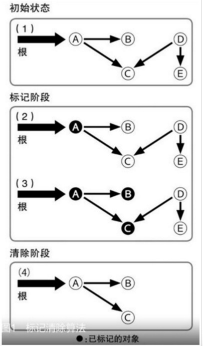{:width="30%" :height="20%"}

图1中的（1）部分显示了随着程序的运行而分配出一些对象的状态，一个对象可以对其他的对象进行引用。图中（2）部分中，GC开始执行，从根开始对可能被引用的对象打上"标记"，大多数情况下，这种标记是通过对象内部的标志来实现的。图中（3）部分中，被标记的对象所能够引用的对象也被打上标记。重复这一步骤的话，可以将从根开始可能被间接引用到的对象都上标记。到此为止，称为标记阶段（Mark
phase）。

标记阶段完成时，被标记的对象就被视为"存活"对象。图1中的（4）部分中，将全部对象按照顺序扫描一遍，将没有被标记的对象进行回收。这一操作被称为清除阶段（Sweep
phase）。

在扫描同时，还需要将存活对象的标记清除掉，以便为下一次GC操作做好准备。标记清除算法的处理时间，是和存活对象数与对象总数的总和相关的。作为标记清除的变形，还有一种叫做标记压缩（Mark
and Compact）的算法，它不是将被标记的对象清除，而是将它们不断压缩。

复制收集算法
------------

标记清除算法还有一个缺点，就是在分配了大量对象，并且其中只有一小部分存活的情况下，所消耗的时间会大大超过必要的值，这是因为在清除阶段还需要对大量死亡对象进行扫描。复制收集（Copy
and
Collection）则试图克服这一缺点。在这种算法中，会将从根开始被引用的对象复制到另外的空间中，然后再将复制到对象所能够引用的对象用递归的方式不断复制下去。

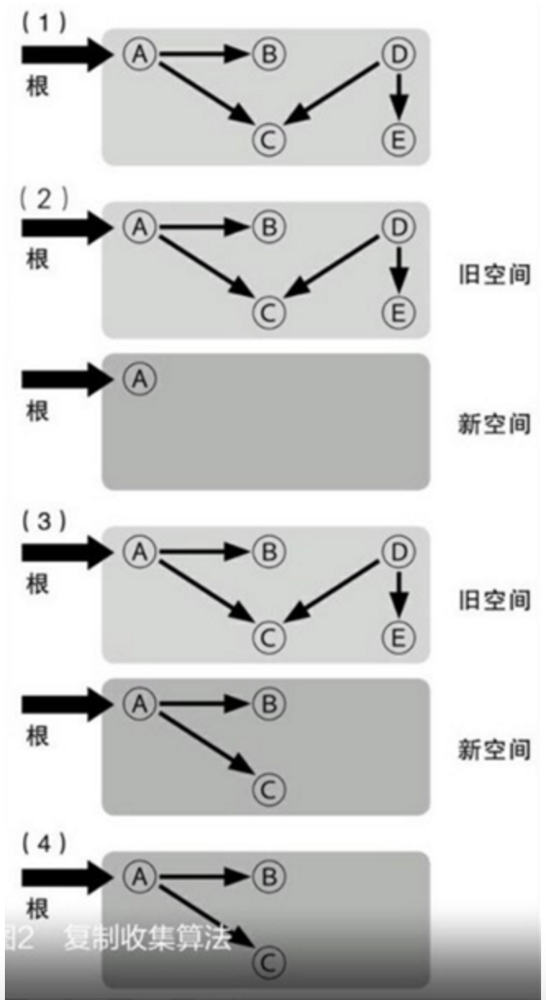{:width="30%" :height="20%"}

图2的（1）部分是GC开始前的内存状态，这和图1的（1）部分是一样的。图2的（2）部分中，在旧对象所在的"旧空间"以外，再准备出一块"新空间"，并将可能从根被引用的对象复制到新空间中。图中（3）部分中，从已经复制的对象开始，再将可以被引用的对象复制到新空间中，复制完成后，"死亡"对象就被留在了旧空间中。图中（4）部分中，将旧空间废弃掉，就可以将死亡对象所占用的空间全部回收，而没有必要在此扫描每个对象。下次GC的时候，现在的心空间也就变成了将来的旧空间。通过图2可以发现，复制收集方式中，值存在相当于标记清除方式中的标记阶段。由于清除阶段中需要对现存的所有对象进行扫描，在存在大对象且其中大部分都即将死亡的情况下，全部扫描一次的开销很大。

但是，和标记相比，将对象复制一份所需要的开销则比较大，因此在"存活"对象比例比较高的情况下，反而会比较不利。这种算法的另外一个好处是她具有局部性（Lo-cality）。在复制收集过程中，会按照对象被引用的顺序将对象复制到新空间中，于是关系较近的对象被放在距离较近的内存空间的可能性提高，这被称为局部性。这种情况下，内存缓存会更容易有效运作，程序的运行能力也能够提高。

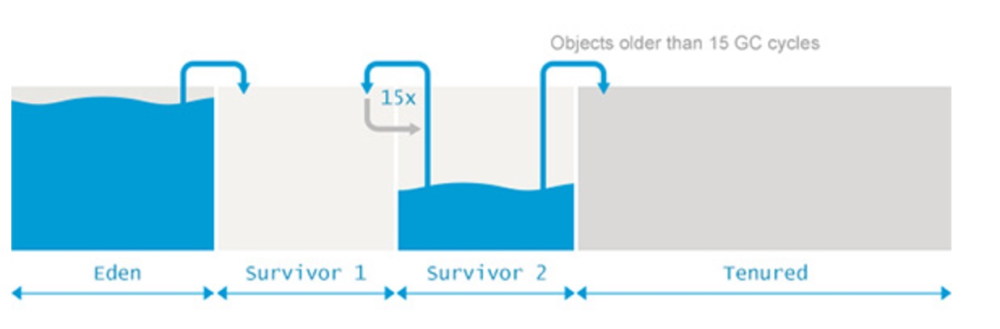{width="5.768055555555556in"
height="1.8993175853018374in"}

算法可以分为几个阶段：

1.  划分区域：

 将内存区域按比例划分为1个Eden区作为分配对象的"主战场"和2个幸存区（即Suvivor空间，划分为2个等比例的from区和to区）。

2.  复制：

 收集时，打扫"战场"，将Eden区中仍存活的对象复制到另外一块幸存区中。

3.  清除：

 由于上一阶段已确保仍存活的对象已被妥善安置，现在可以"清理战场"了，释放Eden去和另外一块幸存区。

4.  晋升：

 若在"复制"阶段，一块幸存区接纳不了所有的"幸存"对象，则直接晋升到老年代。

详情查看：分代收集。

引用计数法
----------

引用计数（Reference
count）方式是GC算法中最简单也最容易实现的一种，他和标记清除方法差不多是在同一时间发明出来的。他的基本原理是，在每个对象中保存该对象的引用计数，当引用发生增减时对计数进行更新。引用计数的增减，一般发生在变量赋值、对象内存更新、函数结束（局部变量不再被引用）等时间点。当一个对象的引用计数变为0时，则说明它将来不会再被引用，因此可以释放相应的内存空间。

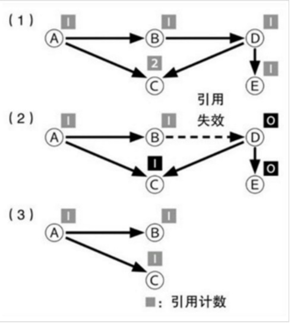{:width="30%" :height="20%"}

图3的（1）部分中，所有对象都保存着自己被多少个其他对象引用的数量（引用计数）。图中（2）部分中，当对象引用发生时，引用计数也会变化。示例中，由对象B到对象D的引用失效了，于是对象D的引用计数变为0.由于对象D的引用计数为0，因此由对象D到对象C和E的引用数也分别相应减少。结果对象E的引用计数也变为0，于是对象E也被释放了。图3的（3）部分中，引用计数变为0的对象被释放，"存活"对象则保留了下来。这个过程不需要对所有的对象进行扫描。

实现容易是引用计数算法最大的优点，标记清除和复制收集这些GC机制在实现上都有一定的难度；除此之外，当对象不再被引用的瞬间就会被释放，这也是个优点，其他GC机制中，要预约一个对象何时会被释放时困难的，而在引用计数方式中则是立即被释放的。而且，由于释放操作时争对每个对象个别执行的，因此和其他算法相比，由GC而产生的中断时间（Pause
time）就比较短，这也是优点。

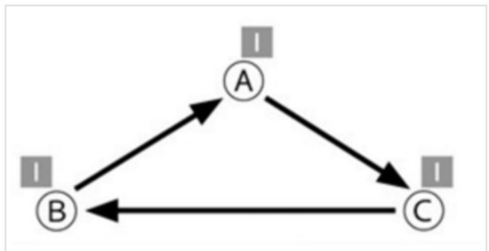{:width="30%" :height="20%"}

图4中，A、B、C三个对象没有被其他对象引用，而是互相之间循环引用，因此它们的引用计数永远不会为0，结果这些对象就永远不会被释放。引用计数的第二个缺点，就是必须在引用发生增减时对引用计数做出正确的增减，而如果漏掉了某个增减的话，就会引发很难找到原因的内存错误。引用数忘了增加的话，会对不恰当的对象进行释放；而引用数忘了减少的话，对象会一直残留在内存中，从而导致内存泄漏。如果语言编译器本身对引用计数进行管理的话还好，否则，如果是手动管理引用计数的话，那将成为孕育bug的温床。

最后一个缺点就是，引用计数管理并不适合并行处理。如果多个线程同时对引用计数进行增减的话，引用计数的值就可能会产生不一致的问题（结果则会导致内存错误）。为了避免这种情况的发生，对引用计数的操作必须采用独占的方式来进行。如果引用操作频繁发生，每次都要使用加锁等并发控制机制的话，其开销也是不可小觑的。综上所述，引用计数方式的原理和实现虽然简单，但缺点也很多，因此最近基本上不再使用了。现在，依然采用引用计数方式的语言主要有Perl和Python，但它们为了避免循环引用的问题，都配合使用了其他的GC机制。这些语言中，GC基本上是通过引用计数方式来进行的，但偶尔也会用其他的算法来执行GC，这样就可以将引用计数方式无法回收的那些对象处理掉。

分代收集
========

{width="5.768055555555556in"
height="1.8993055555555556in"}

当代商业虚拟机的垃圾收集都采用"分代收集"（Generationanl
Collection）算法，java堆分为新生代和老年代，这样就可以根据各个年代的特点采用最适合的收集算法，在新生代中，每次垃圾收集时都发现有大量的对象死去，只有少量的存活，那就选择复制算法。老年代中因为对象存活率高、没有而外的空间对它进行分配担保，就必须使用"标记-清理"或者"标记-整理"算法进行回收。

堆内存划分为 Eden、Survivor 和 Tenured/Old 空间。

从年轻代空间（包括Eden和Survivor区域）回收内存被称为Minor GC。

Major GC是清理老年代，Full
GC是清理整个堆空间，包括年轻代和老年代，但实际上它还有点复杂且令人困惑，首先，许多Major
GC是由Minor
GC触发的，所以很多情况下将两种GC分离是不太可能的。另一方面，许多现代垃圾收集机制会清理部分永久带空间，所以使用"cleaning"一词只是部分正确。这使得我们不用去关心到底是叫Major
GC还是叫Full
GC，大家应该关注当前的GC是否停止了所有的应用程序的线程，还是能够并发的处理而不用停掉应用程序的线程。

有个错误的理解"所有的Minor
GC都会触发Stop-the-world"，停止应用程序的线程，对于大部分应用程序，停顿导致的延迟都是可以忽略不计的。其中的真相就是，大部分Eden去的对象能够被认为是垃圾，永远不会复制到Survivor区或老年代空间。如果正好相反，Eden区大部分新生对象不符合GC条件，Minor
GC执行时暂停的时间将会长很多。因为在GC时会消耗在执行可达性分析上（判断对象是否存活），这时候会触发GC停顿，因为这项分析工作必须在一个能够确保一致性的快照中进行-这里的"一致性"的意思是指在整个分析期间整个执行系统看起来就向被冻结在某个时间点上，不可以出现分析过程中对象引用关系还在不断变化的情况，该点不满足的话分析结果准确性就无法得到保证。这点是导致GC进行时必须停顿所有java执行线程的其中一个重要的原因，即使在号称几乎不会发生停顿的CMS收集器中，枚举根节点时也是必须要停顿的。

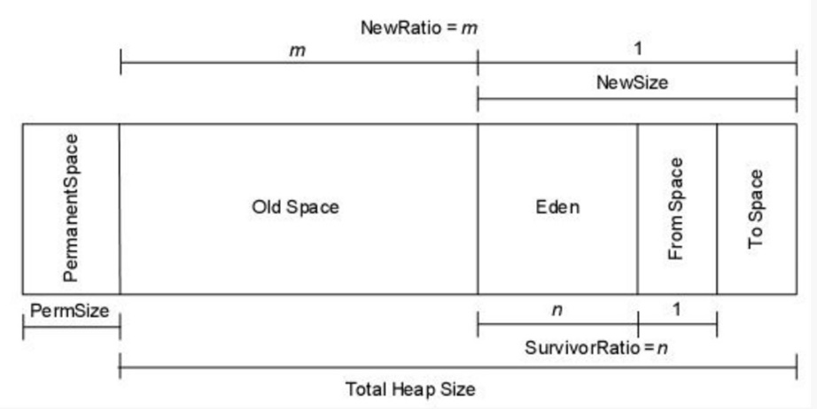{width="4.183098206474191in"
height="2.096484033245844in"}

新生代的对象98%是"朝生夕死"的，所有并不需要按照1:1的比例来划分内存空间，而是将内存分为一块较大的Eden空间和两块较小的Survivor空间，每次使用Eden和其中一块Survivor，当回收时将Eden和Survivor中还存活着的对象一次性复制到另外一块的Survivor空间上，最后清理掉Eden和刚才用过的Survivor空间。HotSpot虚拟机默认Eden和Survivor的大小比例是8：1（SurvivorRatio=8），也就是每次新生代中可用内存空间为整个新生代容量的90%（80+10），只有10%的内存被"浪费"。默认老年代和新生代的比例是2：1（NewRatio=2）。

垃圾收集器
==========

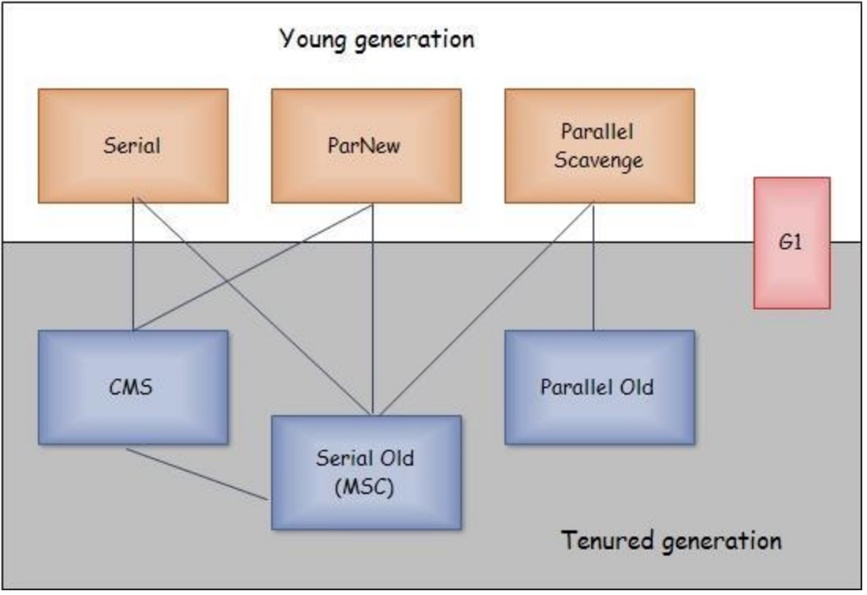{width="3.9436614173228346in"
height="2.7027285651793527in"}

并发和并行在谈论垃圾收集的上下文语境中，可以解释如下：

并行（Parallel）：指多条垃圾收集线程并行工作，但此时用户线程仍然处于等待状态。

并发（Concurrent）：指用户线程与垃圾收集线程同时执行（但不一定是并行的，可能会交替执行），用户程序在继续执行，而垃圾收集程序运行于另一个CPU上。

吞吐量就是CPU用于运行用户代码的时间与CPU总耗时的比例：

吞吐量=运行用户代码时间/（运行用户代码时间+垃圾收集时间）

虚拟机总共运行了100分钟，其中垃圾收集花掉1分钟，那吞吐量就是99%。

Serial收集器
------------

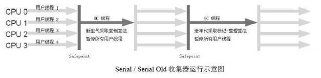{width="5.768055555555556in"
height="1.4126093613298338in"}

这个收集器是一个单线程的收集器，但它的"单线程"的意义并不仅仅说明它只会使用一个CPU或一条收集线程去完成垃圾收集工作，更重要的是在它进行垃圾收集时，必须暂停其他所有的工作线程，直到它收集结束。Serial收集器是虚拟机运行在Client模式下的默认新生代收集器。

ParNew收集器
------------

{width="5.768055555555556in"
height="1.4676148293963254in"}

ParNew收集器其实就是Serial收集器的多线程版本，除了使用多条线程进行垃圾收集之外，其余行为包括Serial收集器可用的所有控制参数、收集算法、Stop
The
World、对象分配规则、回收策略等都与Serial收集器完全一样，在实现上，这两种收集器也共用了相当多的代码。ParNew收集器是许多运行在Server模式下的虚拟机中首选的新生代收集器。

除了Serial收集器外，目前只有它能与CMS收集器配合工作。

在JDK
1.5时期，HotSpot推出了一款在强交互应用中几乎可认为有划时代意义的垃圾收集器------CMS收集器，这款收集器是HotSpot虚拟机中第一款真正意义上的并发收集器，它第一次实现了让垃圾收集线程与用户线程同时工作。

不幸的是，CMS作为老年代的收集器，却无法与JDK
1.4.0中已经存在的新生代收集器Parallel Scavenge配合工作，所以在JDK
1.5中使用CMS来收集老年代的时候，新生代只能选择ParNew或者Serial收集器中的一个

ParallelScavenge收集器
----------------------

Parallel
Scavenge收集器是一个新生代收集器，它也是使用复制算法的收集器，又是并行的多线程收集器。Parallel
Scavenge收集器的特点是它的关注点与其他收集器不同，CMS等收集器的关注点是尽可能地缩短垃圾收集时用户线程的停顿时间，而Parallel
Scavenge收集器的目标则是达到一个可控制的吞吐量（Throughput）。由于与吞吐量关系密切，Parallel
Scavenge收集器也经常称为"吞吐量优先"收集器。Parallel
Scavenge收集器提供了两个参数用于控制吞吐量，分别是控制最大停顿时间的-XX:MaxGCPauseMillis参数和设置吞吐量大小的-XX:GCTimeRatio参数。

Parallel
Scavenge收集器有一个参数-XX:+UseAdaptiveSizePolicy。当这个参数打开之后，就不需要手工指定新生代的大小、Eden与Survivor区的比例、晋升老年代对象年龄等细节参数了，虚拟机会根据当前系统的运行情况收集性能监控信息，动态调整这些参数以提供最合适的停顿时间或者最大的吞吐量，这种调节方式称为GC自适应的调节策略（GC
Ergonomics）。

Serial Old收集器
----------------

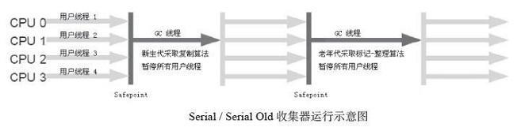{width="5.768055555555556in"
height="1.4559120734908138in"}

Serial
Old是Serial收集器的老年代版本，它同样是一个单线程收集器，使用标记－整理算法。如果在Server模式下，那么它主要还有两大用途：一种用途是在JDK
1.5以及之前的版本中与Parallel
Scavenge收集器搭配使用，另一种用途就是作为CMS收集器的后备预案，在并发收集发生Concurrent
Mode Failure时使用

Parallel Old收集器
------------------

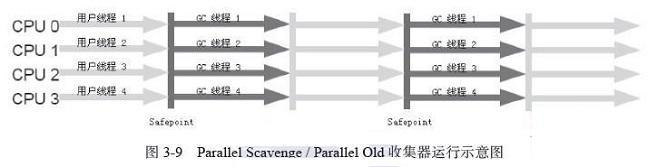{width="5.768055555555556in"
height="1.4676148293963254in"}

Parallel Old是Parallel
Scavenge收集器的老年代版本，使用多线程和"标记－整理"算法。

这个收集器是在JDK 1.6中才开始提供的，在此之前，新生代的Parallel
Scavenge收集器一直处于比较尴尬的状态。原因是，如果新生代选择了Parallel
Scavenge收集器，老年代除了Serial Old收集器外别无选择（Parallel
Scavenge收集器无法与CMS收集器配合工作）。由于老年代Serial
Old收集器在服务端应用性能上的"拖累"，使用了Parallel
Scavenge收集器也未必能在整体应用上获得吞吐量最大化的效果，由于单线程的老年代收集中无法充分利用服务器多CPU的处理能力，在老年代很大而且硬件比较高级的环境中，这种组合的吞吐量甚至还不一定有ParNew加CMS的组合"给力"。直到Parallel
Old收集器出现后，"吞吐量优先"收集器终于有了比较名副其实的应用组合

CMS收集器
---------

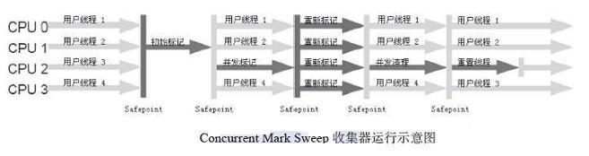{width="5.768055555555556in"
height="1.5273031496062992in"}

CMS（Concurrent Mark
Sweep）收集器是一种以获取最短回收停顿时间为目标的收集器。目前很大一部分的Java应用集中在互联网站或者B/S系统的服务端上，这类应用尤其重视服务的响应速度，希望系统停顿时间最短，以给用户带来较好的体验。CMS收集器就非常符合这类应用的需求。

CMS收集器是基于"标记---清除"算法实现的，它的运作过程相对于前面几种收集器来说更复杂一些，整个过程分为4个步骤：

-   初始标记（CMS initial mark）

初始标记仅仅只是标记一下GC Roots能直接关联到的对象，速度很快，需要"Stop
The World"。

-   并发标记（CMS concurrent mark）

并发标记阶段就是进行GC Roots Tracing的过程。

-   重新标记（CMS remark）

重新标记阶段是为了修正并发标记期间因用户程序继续运作而导致标记产生变动的那一部分对象的标记记录，这个阶段的停顿时间一般会比初始标记阶段稍长一些，但远比并发标记的时间短，仍然需要"Stop
The World"。

-   并发清除（CMS concurrent sweep）

并发清除阶段会清除对象。

由于整个过程中耗时最长的并发标记和并发清除过程收集器线程都可以与用户线程一起工作，所以，从总体上来说，CMS收集器的内存回收过程是与用户线程一起并发执行的。

缺点：

-   CMS收集器对CPU资源非常敏感

其实，面向并发设计的程序都对CPU资源比较敏感。在并发阶段，它虽然不会导致用户线程停顿，但是会因为占用了一部分线程（或者说CPU资源）而导致应用程序变慢，总吞吐量会降低。

CMS默认启动的回收线程数是（CPU数量+3）/
4，也就是当CPU在4个以上时，并发回收时垃圾收集线程不少于25%的CPU资源，并且随着CPU数量的增加而下降。但是当CPU不足4个（譬如2个）时，CMS对用户程序的影响就可能变得很大。

-   CMS收集器无法处理浮动垃圾

CMS收集器无法处理浮动垃圾，可能出现"Concurrent Mode
Failure"失败而导致另一次Full GC的产生。

由于CMS并发清理阶段用户线程还在运行着，伴随程序运行自然就还会有新的垃圾不断产生，这一部分垃圾出现在标记过程之后，CMS无法在当次收集中处理掉它们，只好留待下一次GC时再清理掉。这一部分垃圾就称为"浮动垃圾"。

也是由于在垃圾收集阶段用户线程还需要运行，那也就还需要预留有足够的内存空间给用户线程使用，因此CMS收集器不能像其他收集器那样等到老年代几乎完全被填满了再进行收集，需要预留一部分空间提供并发收集时的程序运作使用。要是CMS运行期间预留的内存无法满足程序需要，就会出现一次"Concurrent
Mode Failure"失败，这时虚拟机将启动后备预案：临时启用Serial
Old收集器来重新进行老年代的垃圾收集，这样停顿时间就很长了。

-   CMS收集器会产生大量空间碎片

CMS是一款基于"标记---清除"算法实现的收集器，这意味着收集结束时会有大量空间碎片产生。

空间碎片过多时，将会给大对象分配带来很大麻烦，往往会出现老年代还有很大空间剩余，但是无法找到足够大的连续空间来分配当前对象，不得不提前触发一次Full
GC。

G1收集器
--------

{width="5.768055555555556in"
height="1.3611132983377079in"}

G1（Garbage-First）是一款面向服务端应用的垃圾收集器。HotSpot开发团队赋予它的使命是未来可以替换掉JDK
1.5中发布的CMS收集器。与其他GC收集器相比，G1具备如下特点。

-   并行与并发

G1能充分利用多CPU、多核环境下的硬件优势，使用多个CPU来缩短Stop-The-World停顿的时间，部分其他收集器原本需要停顿Java线程执行的GC动作，G1收集器仍然可以通过并发的方式让Java程序继续执行。

-   分代收集

与其他收集器一样，分代概念在G1中依然得以保留。虽然G1可以不需要其他收集器配合就能独立管理整个GC堆，但它能够采用不同的方式去处理新创建的对象和已经存活了一段时间、熬过多次GC的旧对象以获取更好的收集效果。

-   空间整合

与CMS的"标记---清理"算法不同，G1从整体来看是基于"标记---整理"算法实现的收集器，从局部（两个Region之间）上来看是基于"复制"算法实现的，但无论如何，这两种算法都意味着G1运作期间不会产生内存空间碎片，收集后能提供规整的可用内存。这种特性有利于程序长时间运行，分配大对象时不会因为无法找到连续内存空间而提前触发下一次GC。

-   可预测的停顿

这是G1相对于CMS的另一大优势，降低停顿时间是G1和CMS共同的关注点，但G1除了追求低停顿外，还能建立可预测的停顿时间模型，能让使用者明确指定在一个长度为M毫秒的时间片段内，消耗在垃圾收集上的时间不得超过N毫秒。

在G1之前的其他收集器进行收集的范围都是整个新生代或者老年代，而G1不再是这样。使用G1收集器时，Java堆的内存布局就与其他收集器有很大差别，它将整个Java堆划分为多个大小相等的独立区域（Region），虽然还保留有新生代和老年代的概念，但新生代和老年代不再是物理隔离的了，它们都是一部分Region（不需要连续）的集合。

G1收集器之所以能建立可预测的停顿时间模型，是因为它可以有计划地避免在整个Java堆中进行全区域的垃圾收集。G1跟踪各个Region里面的垃圾堆积的价值大小（回收所获得的空间大小以及回收所需时间的经验值），在后台维护一个优先列表，每次根据允许的收集时间，优先回收价值最大的Region（这也就是Garbage-First名称的来由）。这种使用Region划分内存空间以及有优先级的区域回收方式，保证了G1收集器在有限的时间内可以获取尽可能高的收集效率。

G1收集器的运作大致可划分为以下几个步骤：

-   初始标记（Initial Marking）

初始标记阶段仅仅只是标记一下GC
Roots能直接关联到的对象，并且修改TAMS（Next Top at Mark
Start）的值，让下一阶段用户程序并发运行时，能在正确可用的Region中创建新对象，这阶段需要停顿线程，但耗时很短。

-   并发标记（Concurrent Marking）

并发标记阶段是从GC
Root开始对堆中对象进行可达性分析，找出存活的对象，这阶段耗时较长，但可与用户程序并发执行。

-   最终标记（Final Marking）

最终标记阶段是为了修正在并发标记期间因用户程序继续运作而导致标记产生变动的那一部分标记记录，虚拟机将这段时间对象变化记录在线程Remembered
Set Logs里面，最终标记阶段需要把Remembered Set
Logs的数据合并到Remembered Set中，这阶段需要停顿线程，但是可并行执行。

-   筛选回收（Live Data Counting and Evacuation）

筛选回收阶段首先对各个Region的回收价值和成本进行排序，根据用户所期望的GC停顿时间来制定回收计划，这个阶段其实也可以做到与用户程序一起并发执行，但是因为只回收一部分Region，时间是用户可控制的，而且停顿用户线程将大幅提高收集效率

JVM参数
=======

垃圾收集参数
------------



  参数                                 描述
  ------------------------------------ -------------------------------------------------------------------------------------------------------------------------------------------------------------------
  -XX:+UseSerialGC                     年轻代串行收集器，虚拟机运行在Client模式下的默认值，打开此开关后，使用Serial+Serial Old的收集器组合进行内存回收
  -XX:+UseParNewGC                     年轻代并行收集器，打开此开关后使用ParNew+Serial Old收集器组合，可以与CMS进行组合。
  -XX:+UseConcMarkSweepGC              老年代并行收集器，打开开关后，使用ParNew+CMS+Serial Old的收集器组合进行内存回收，Serial Old收集器将作为CMS收集器出现Concurrent Mode Failure失败后的后背收集器使用
  -XX:+UseParallelGC                   虚拟机运行在server模式下的默认值，打开此开关后，使用Parallel Scavenge（PS Scavenge） +Serial Old（PS MarkSweep）的收集器组合进行内存回收。
  -XX:+UseParallelOldGC                打开此开关后，使用Parallel Scavenge +Parallel Old的收集器组合进行内存回收
  -XX:SurvivorRatio                    年轻代中Eden区域与Survivor区域的容量壁纸，默认8：1
  -XX:PretenureSizeThreshold           直接晋升到老年代的对象大小，设置这个参数后，大于这个参数的对象将直接在老年代分配
  -XX:MaxTenuringThreshold             晋升到老年代对象的年龄，每个对象坚持过一次Minor GC后，年龄就增加1，当超过这个参数值时就进入老年代
  -XX:+UseAdaptiveSizePolicy           动态调整Java对中各个区域的大小以及进入老年代的年龄
  -XX:ParallelGCThreads                设置并行GC时进行内存回收的线程数
  -XX:GCTimeRatio                      GC时间占总时间的比例，默认为99，即允许1%的GC时间，仅在使用Parallel Scavenge收集器时生效
  -XX:MaxGCPauseMillis                 设置GC的最大停顿时间，仅在使用Parallel Scavenge收集器时生效
  -XX:CMSInitiatingOccupancyFraction   设置CMS收集器在老年代被使用多少后出发垃圾收集，默认为68%，仅适用CMS
  -XX:+UseCMSCompactAtFullCollection   设置CMS收集器在完成垃圾收集后是否要进行一次内存碎片整理，仅适用CMS
  -XX:CMSFullGCsBeforeCompaction       设置CMS收集器在进行若干次垃圾收集后再启动一次内存碎片整理，仅适用CMS
  -XX:+CMSScavengeBeforeRemark         在执行CMS remark之前进行一次youngGC，这样能有效降低remark的时间



JVM参数
-------

| 参数                             | 含义                             |
+==================================+==================================+
| -Xmx                             | 最大堆大小                       
| -Xms                             | 最小堆大小                       
| -Xmn                             | 年轻代大小                       
| -XX:NewSize                      | 年轻代大小                       
| -XX:NewRatio                     | 老年代与年轻代的比例，如果是2，老年代和年轻代比例为2：1  
| -XX:SurvivorRatio                | 年轻代中Eden区与两个Survivor区的比值 
| -XX:PermSize                     | 永久代的值                       
| -XX:MaxPermSize                  | 永久代最大值                     
| -Xss                             | 线程堆栈大小，默认1M             
| -XX:+UseBiasedLocking            | 开启偏向锁，提高带有同步但无竞争的程序性能
| -XX:UseSpinning                  | 1.6后默认开启，自旋锁，多CPU下，当共享数据的锁定状态只会持续很短时间，就不使用线程挂起，而是自旋重试，免去线程切换 
| -XX:+DisableExplicitGC           | 忽略System.gc调用                |
| -XX:+ExplicitGCInvokesConcurrent | 命令JVM无论什么时候调用系统GC，都执行CMSGC，而不是Full GC                
| -XX:+ExplicitGCInvokesConcurrentAndUnloadsClasses                | 保证当有系统GC调用时，永久代也被包括进CMS垃圾回收的范围内  
| -XX:+UseBiasedLocking            | 开启偏向锁，提高带有同步但无竞争的程序性能-  
| -XX:UseSpinning                  | 1.6后默认开启，自旋锁，          


辅助信息
--------


  参数                                    含义
  --------------------------------------- ------------------------------------------------------------
  -XX:+PrintGC                            打印日志
  -XX:+PrintGCDetails                     打印详细日志
  -XX:+PrintGCTimeStamps                  添加时间戳
  -XX:+PrintGCApplicationConcurrentTime   打印每次垃圾回收前，程序未中断的执行时间。可与上面混合使用
  -XX:+PrintGCApplicationStoppedTime      打印垃圾回收期间程序暂停的时间
  -XX:+PrintHeapAtGC                      打印GC前后的详细堆栈信息
  -Xloggc:filename:                       gc log地址
  -XX:PermSize                            永久代的值
  -XX:MaxPermSize                         永久代最大值
  -Xss                                    线程堆栈大小，默认1M

GC日志
------

+PrintGCDetails开启。

Young GC：

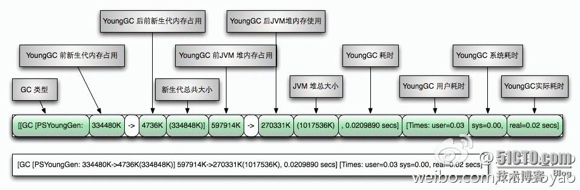{width="5.768055555555556in"
height="1.8992432195975504in"}

Full GC

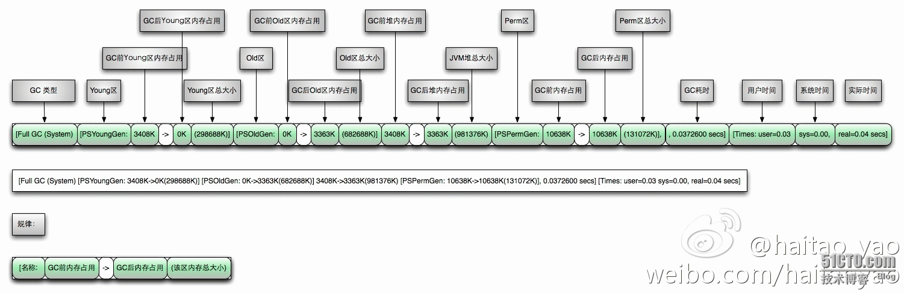{width="5.768055555555556in"
height="1.879300087489064in"}
