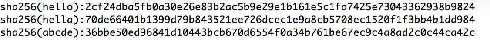
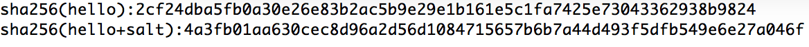
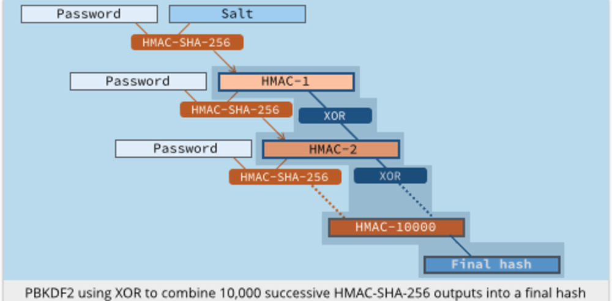

概述
====

密码机
------

密码机是提供加解密操作的高安全性、稳定性的设备，内置安全加密芯片。通过网口对密码机进行维护管理和监控。

密码机提供如下功能：

-   **非对称算法加/解密/签名/验签功能**:

 密码机能够实现不同算法强度的 SM2 和 SM9、RSA 算法的加密、解密、

 签名、验签功能。

-   **随机数生成功能:**

 密码机内部有物理噪声发生器及噪声检测算法，可以生成满足要求的随机
 数，用于生成密钥参数等。

-   **密钥生成与管理功能:**

 提供 192、256 位 SM2 密钥生成算法及密钥备份及恢复工作;

 提供不同算法强度的对称密钥，RSA、SM9 密钥生成算法及密钥备份及
 恢复工作;

 密码机具有非对称密钥对导入、导出功能，便于密钥对的备份、恢复。在
 密钥导入、导出时，私钥是加密的。

-   **密码算法及密钥防护功能:**

 密码机的密码算法及密钥的安全依靠密钥库的安全措施予以保证。

-   **API**系统调用接口:

 服务器密码机提供了符合国家标准的 API 调用接口，可供应用系统调用。

 支持相应的中间件调用。

注：以上描述功能由深圳市奥联科技有限公司SJY137 系列密码机提供

数字信封
--------

数字信封是将对称密钥通过非对称加密的结果分发对称密钥的方法。它综合利用了对称加密技术和非对称加密技术两者的优点进行信息安全传输。数字信封既发挥了对称加密算法速度快、安全性好的优点，又发挥了非对称加密算法密钥管理方便的优点。

在数字信封中，信息发送方采用对称密钥来加密信息内容，然后将此对称密钥用接收方的公开密钥来加密（这部分称数字信封）之后，将它和加密后的信息一起发送给接收方，接收方先用相应的私有密钥打开数字信封，得到对称密钥，然后使用对称密钥解开加密信息。这种技术的安全性相当高。数字信封主要包括数字信封打包和数字信封拆解，数字信封打包是使用对方的公钥将加密密钥进行加密的过程，只有对方的私钥才能将加密后的数据(通信密钥)还原；数字信封拆解是使用私钥将加密过的数据解密的过程。

确定性加密
----------

<https://en.wikipedia.org/wiki/Deterministic_encryption>

确定性加密方案指对于给定的明文和密钥总是会产生相同的密文，即使是在加密算法的单独执行也是如此。例如：没有padding
的RSA，以及在块密码中使用ECB模式或者是使用常量的IV。

为了解决这个问题，密码学家提出了"随机化"或"概率加密"的概念。（
\"randomized\" or probabilistic encryption.）概率加密（probabilistic
encryption）是在算法中使用了随机性，因此多次加密相同的消息时，通常会产生不同的密文。参考public
key encryption algorithms（RSA-OAEP）和CBC模式。

注意：CBC模式是要求IV不能重复使用，利用IV进行随机化。

当使用了"随机化"机制后，相同的明文将会生成不同的密文，提高了数据的安全性但在业务使用过程中出现了新的问题：两次加密的内容是不相同的，场景为表现为注册时的手机号密文和登录时的手机号密文无法匹配。

认证加密
--------

<https://en.wikipedia.org/wiki/Authenticated_encryption>

认证加密（AE）或具有关联数据的认证加密（AEAD）是一种加密形式，可同时对数据进行提供机密性、完整性、和真实性保证。

注:在通用密码学中，保密性用加密实现，消息认证用MAC实现。这两种算法配合使用，有如下三种：Encrypt-then-MAC、MAC-then-Encrypt、Encrypt-and-MAC，后两者都有安全问题。为了安全实现同时实现cipher+MAC成为AEAD，目前常用的AES-GCM

确定认证加密
------------

DAE（Deterministic Authenticated
Encryption），DAE结合了对称加密和消息认证的功能，可防止密文非法篡改。根据明文动态计算的IV（合成初始化向量:
Synthetic Initialization Vector
）保证明文与密文的对应关系的同时抵消ECB模式、固定IV的CBC模式的安全性风险。

相对确定确定加密，此加密方式对同一明文加密后的内容相同。但对不同明文使用的iv不同。

确定认证加密的基本过程如下：

加密过程：

输入：消息m,认证密钥k1,加密密钥 k2

输出：密文

1\. 使用基于对称加密算法F的消息认证码函数H计算消息认证码IV = H(k1,m)

2\. 使用IV作为初始向量，基于对称加密算法F的加密函数E计算密文C=E(k2，IV,
m)

3\. 输出IV\|C作为完整密文

解密过程：

输入：完整密文C,认证密钥k1,加密密钥 k2

输出：明文或者解密失败符

1\. 使用IV作为初始向量，基于对称加密算法F的解密函数D计算明文x=D(k2，IV,
C)

2\. 使用基于对称加密算法F的消息认证码函数H计算消息认证码IV' = H(k1,x)

3\. 比较IV 与IV\'是否相等，如果相等输出x作为明文，否则输出解密失败符

以上过程中的加密算法F可以是SM4或者AES,消息认证码H可以是F-CMAC，加解密函数E、D可以是F算法在CTR模式下工作。具体过程可以参见RFC
5297。

本方案的确定认证加密相较于传统的ECB模式或者初始向量固定的CBC加密模式的主要优点是：密文数据长度短(无需填充明文到块长）；有消息认证功能，可防止密文非法篡改；IV和消息相关可以抵消ECB模式、固定IV的CBC模式的安全性风险。DAE中用的密钥是放在密码机中的，总共用了256位，其中128位用于认证，128位用于加密。

国密
====

国密即国家密码局认定的国产密码算法，即商用密码。商用密码，是指能够实现商用密码算法的加密、解密和认证等功能的技术。（包括密码算法编程技术和密码算法芯片、加密卡等的实现技术）。商用密码技术是商用密码的核心，国家将商用密码技术列入国家秘密，任何单位和个人都有责任和义务保护商用密码技术的秘密。

+------------+-----------------------+
| 种类       | 算法                  |
+============+=======================+
| 对称算法   | SSF33                 |
|            |                       |
|            | SM1（原SCB2）         |
|            |                       |
|            | SM4（原SMS4）         |
|            |                       |
|            | SM7                   |
|            |                       |
|            | 祖冲之算法（ZUC算法） |
+------------+-----------------------+
| 非对称算法 | SM2                   |
|            |                       |
|            | SM9                   |
+------------+-----------------------+
| 杂凑算法   | SM3                   |
+------------+-----------------------+

算法概述
--------

### SM1

SM1分组密码算法是我国自主设计的通用的分组对称加解密算法，分组长度为128位，密钥长度都为128比特，算法安全保密强度及相关软硬件实现性能与AES相当，算法不公开，仅以IP核的形式存在于芯片中。采用该算法已经研制了系列芯片、智能IC卡、智能密码钥匙、加密卡、加密机等安全产品，广泛应用于电子政务、电子商务、VPN加密、文件加密、通信加密、数字电视、电子认证及国民经济的各个应用领域（包括国家政务通、警务通等重要领域）。读卡器与卡片之间采用APDU格式，每次通过密钥索引号、分散因子和卡片内的真随机数，导出相关保护密钥加密保护的密钥密文。由于国密SM1算法由卡片硬件实行，即使被一些非法设备侦听到这些加密密文，但没有解密密钥和相关算法，无法在卡片外解密出数据明文。因此不存在密钥泄露，且可以实行一次一密，安全性极高。

### SM2

在商用密码体系中，SM2主要用于替换RSA加密算法，其算法公开。据国家密码管理局表示，SM2基于ECC，其效率较低，安全性与NIST
Prime256相当。

### SM3

在商用密码体系中，SM3主要用于数字签名及验证、消息认证码生成及验证、随机数生成等，其算法公开。据国家密码管理局表示，其安全性及效率与SHA-256相当。

### SM4

在商用密码体系中，SM4主要用于数据加密，其算法公开，分组长度与密钥长度均为128bit，加密算法与密钥扩展算法都采用32轮非线性迭代结构，S盒为固定的8比特输入8比特输出。

### SM7

SM7算法，是一种分组密码算法，分组长度为 128 比特，密钥长度为 128 比特。SM7的算法文本目前没有公开发布。SM7适用于非接IC卡应用包括身份识别类应用(门禁卡、工作证、参赛证)，票务类应用(大型赛事门票、展会门票)，支付与通卡类应用（积分消费卡、校园一卡通、企业一卡通、公交一卡通）。

### SM9

在商用密码体系中，SM9主要用于用户的身份认证。SM9的加密强度等同于3072位密钥的RSA加密算法。

#### 密钥

术语：

-   KGC

 Key generation
 center密钥生成中心，负责选择系统参数、生成加密主密钥并产生用户加密私钥的可信机构。

-   加密主密钥

 处于标识密码密钥分层结构最顶层的密钥，包括加密主私钥和加密主公钥，其中加密主公钥公开，
 加密主私钥由 KGC 秘密保存。KGC
 用加密主私钥和用户的标识生成用户的加密私钥。在标识密码中，加密主私钥一般由
 KGC 通过随机数发生器产生，加密主公钥由加密主私钥结合系统参数产生

-   标识 identity

 可唯一确定一个实体身份的信息。标识应由实体无法否认的信息组成，如实体的可识别名称、电子邮箱、身份证号、电话号码、街道地址等

-   hid

 在本部分中，用一个字节表示的加密私钥生成函数识别符，由 KGC
 选择并公开。

#### 与RSA操作比较


        签名                                    验签
  ----- --------------------------------------- ---------------------
  RSA   私钥+内容                               公钥+内容+签名
  SM9   主公钥+内容+用户私钥（加密主私钥+ID）   主公钥+内容+签名+ID

        加密             解密
  ----- ---------------- ------------------------------------
  RSA   公钥+内容        内容密文+私钥
  SM9   主公钥+ID+内容   加密私钥（加密主私钥+ID）+内容密文
 

\*还有其他标识没有描述进来，例如hid、系统参数等。

SM9与RSA相比，在签名和验签过程中，都需要主公钥的参与。

#### 短签名

Moni
Naor发现一个标识加密算法中的标识私钥生成方法都是一个公钥签名方法。根据这个发现：研究人员构造了一些非常著名的公钥签名算法，包括：BBS的"Short
Signatures from the Weil Pairing"，ZSS的"An Efficient Signature Scheme
from Bilinear Pairings and Its Applications"。

同理，SM9的标识私钥生成方法也是一个签名算法。这些签名算法都具有以下特点：

1）签名结果非常短（在128位安全级别上，签名值只有32个字节）。

2）签名速度非常快。基于SM9标识私钥生成方法的签名算法签名时只需要一个点乘运算。

和SM2和RSA-3072的比较

SM9短签名的签名值长度为34字节，SM2压缩后为64字节，RSA-3072为384字节。

加密数据在明文长度上增加33，数据签名长度为34。短签名删除了部分校验的信息，所以会短。

短签名通过两台加密机进行操作，在实现中更加贴近RSA等非对称算法，而不是IBC算法，算法中没有使用到身份标识进行操作，具体操作如下：

1.  A密码机生成加密主私钥和主公钥

2.  使用主私钥对内容签名

3.  将主公钥和内容、签名发送给B

4.  B通过主公钥对数据进行验证

案例描述
--------

### SM9加解密

### SM9长数据加密封装

SM9不能对2048
byte以上的数据进行加密操作，对于数据超过2048byte长度的数据需要进行封装加密（数字信封），封装后的输入输出与封装前相同（加密内容，公钥）。

具体加密操作如下：

1.  加密机生成SM4随机密钥

2.  使用SM4密钥对数据进行对称加密

3.  使用SM9算法对SM4密钥进行加密

4.  将SM4加密后的密文（需要加密的数据）和SM9加密后的密文（对称密钥）拼装并返回

 解密操作如下：

1.  获得需要解密的数据（加密后的内容和加密后的SM4密钥）

2.  使用SM9对SM4密钥进行解密

3.  使用SM4对加密后的内容进行解密

### 密码机SM9集群

密码机不支持集群模式，每个密码机都是独立的个体，如果需要集群模式需要使用业务手法进行负载均衡。

加密机使用SM9时，会初始化会生成主密钥，每台密码机的默认配置都会不同，所以一般情况下，密码机A加密过的数据不能被密码机B解密。

为了让两台密码机能处理相同的数据，需要将密码机的配置参数进行统一。配置参数应该是主密钥运算过程中的参数值。

### 全国联销促销系统（SM9）

在全国联销促销系统中，终端设备和密码机都拥有独立的SM9环境。需求是在终端上对数据进行签名并解密数据，在密码机上进行验签并解密数据。

由于它们分别有独立的SM9参数体系，所以是不能直接做解密验签操作。

为了完成相应的业务需要做以下操作：

1.  将密码机的系统参数和加密主公钥信息提供给终端设备

2.  终端设备将参数配置和加密主公钥信息提供给密码机

3.  终端设备使用加密私钥对数据进行签名，使用加密机的加密主公钥、系统参数、身份标识（省码、终端号）对数据进行加密

4.  密码机使用终端设备的加密主公钥和系统参数进行验签，使用身份标识（省码、终端号）获得加密私钥进行解密

### 电话投注福利彩票SM9案例

 数据用到了密码签名，没有用到密码解密，所以当用户密码丢失的情况下可以解开。

 电话销售福利彩票系统中，需要存储用户信息，其中设计到了很多用户敏感信息，例如身份证号码、银行卡号吗、手机号码等。

-   明文存储

 当以明文的形式存储用户信息时，将无法保证数据不被泄漏。所以该类信息不能以明文方式存储。

-   密文存储

 将用户信息进行加密处理后，再存储到数据库中。当发生数据库被拖库，密文数据泄漏时，保证密钥安全的情况下，密文不能够被攻击者解开，防止了明文信息泄漏的危险。当系统使用对称密钥加密的情况下，数据将不具备防篡改性，攻击者获得了密钥后可以对任何数据进行篡改。在密码学中，一般使用非对称算法对数据进行签名，并对数据进行验证，保证数据的防篡改性。

-   密文加签名

 密文加签名实现的方法使用非对称算法，可以是：

1.  先为用户生成一对公私钥，私钥由用户自己保管

2.  用公钥对明文进行加密操作生成密文

3.  用私钥对密文进行签名

4.  当需要使用数据时，先使用密文和签名进行验证处理

5.  验证通过，说明密文没有被篡改

 如果使用PKI技术实现方案，系统需要存储和管理所有账户的密钥，当密钥的数量达到上亿时，系统会面临密钥管理的难题。对此我们使用基于标识的密码技术（IBC），算法为SM9算法。用户的私钥是根据用户唯一标识产生的，如果攻击者同时获得了SM9算法需要的参数内容（例如获得了加密机使用权限）、密文和签名，就可以对数据进行修改。针对这个问题，我们使用增加两个安全机制，一个是加密机增加稽核功能，另一个是增加用户参与机制。

 \*验证是使用专门的验证方法，是传入密文数据和签名内容，进行验证操作。不可以先生称签名，然后根据数据再次生成签名，比较签名内容。安全的签名算法增加了随机数，相同的内容，两次签名的结构将会不同。

 使用标准的非对称算法才具有法律意义上的不可抵赖性，SM9的私钥是由密码机生成不是由用户自己保管，所以在法律意义上不具有不可抵赖性。

-   用户参与机制

 在防篡改业务场景中，系统需要使用数据的签名，校验数据没有被篡改。由于密文和私钥都存储在系统中，所有我们对签名内容增加了一个系统中不存在的因子。我们称之为"用户参与机制"，该机制是指对用户的敏感信息相关操作，需要让用户参与其中，参与方式是使用必须只有用户自己知道信息，将此类信息同用户信息一起签名，用于重要数据的验签。此类消息可以是用户登录密码的哈希值。

 以转账为例，步骤如下：

1.  用户提交银行卡信息，并提交登录密码

2.  对银行卡信息使用SM9加密，将密文连接登录密码哈希，使用SM9签名，将签名和银行卡存储到数据库中

3.  用户资金提现时，需要用户输入登录密码

4.  系统将银行卡信息密文和登录密码哈希值连接，并获得数据存储的签名，使用SM9验签算法

5.  验证成功，进行资金提现操作

 如果有攻击者在获得了加密相关参数或加密机权限，修改了银行卡密码信息也修改了银行卡密文，但在不知道用户登录密码的情况下，无法产生正确的签名，验证将不能通过。

-   密码机稽核

 密码机提供了将操作记录统计导出的功能，为稽核提供了支持。将通过路由器或交换机（需要确认）抓取指定的请求，与加密机的处理统计进行核对，能够判断出是否有非业务调用加密机操作。由于业务日志权限较低，可被攻击者模拟，所以直接用网络抓包，并且需要判断该请求的确是用户发起。

Hmac
====

密钥散列消息认证码（英语：Keyed-hash message authentication
code，缩写为HMAC），又称散列消息认证码（Hash-based message
authentication
code），是一种通过特别计算方式之后产生的消息认证码（MAC），使用密码散列函数，同时结合一个加密密钥。它可以用来保证数据的完整性，同时可以用来作某个消息的身份验证。

定义
----

根据RFC 2104，HMAC的数学公式为： 

HMAC（K，M）=H（K⊕opad∣H（K⊕ipad∣M））

其中：

 *H*为密码散列函数（如MD5或SHA-1）

 *K*为密钥（secret key）

 *m*是要认证的消息

 *K\'*是从原始密钥*K*导出的另一个秘密密钥（如果K短于散列函数的输入块大小，则向右[填充](https://zh.wikipedia.org/wiki/%E5%A1%AB%E5%85%85_(%E5%AF%86%E7%A0%81%E5%AD%A6))（Padding）零；如果比该块大小更长，则对K进行散列）

 \|\| 代表[串接](https://zh.wikipedia.org/wiki/%E4%B8%B2%E6%8E%A5)

 ⊕ 代表[异或](https://zh.wikipedia.org/wiki/%E5%BC%82%E6%88%96)（XOR）

 *opad* 是外部填充（0x5c5c5c...5c5c，一段[十六进制](https://zh.wikipedia.org/wiki/%E5%8D%81%E5%85%AD%E8%BF%9B%E5%88%B6)常量）

 *ipad* 是内部填充（0x363636...3636，一段十六进制常量）

定义HMAC需要一个加密用散列函数（表示为H，可以是MD5或者SHA-1）和一个密钥K。我们用B来表示数据块的字节数。（以上所提到的散列函数的分割数据块字长B=64），用L来表示散列函数的输出数据字节数（MD5中L=16,SHA-1中L=20）。鉴别密钥的长度可以是小于等于数据块字长的任何正整数值。应用程序中使用的密钥长度若是比B大，则首先用使用散列函数H作用于它，然后用H输出的L长度字符串作为在HMAC中实际使用的密钥。一般情况下，推荐的最小密钥K长度是L个字节。

我们将定义两个固定且不同的字符串ipad,opad：（'i\',\'o\'标志内部与外部）

ipad = the byte 0x36 重复 B 次

opad = the byte 0x5C 重复 B 次.

计算'text\'的HMAC：

HMAC　＝ H( K XOR opad, H(K XOR ipad, text))

即为以下步骤:

\(1\)
在密钥K后面添加0来创建一个字长为B的字符串。(例如，如果K的字长是20字节，B＝64字节，则K后会加入44个零字节0x00)

\(2\) 将上一步生成的B字长的字符串与ipad做异或运算。

\(3\) 将数据流text填充至第二步的结果字符串中。

\(4\) 用H作用于第三步生成的数据流。

\(5\) 将第一步生成的B字长字符串与opad做异或运算。

\(6\) 再将第四步的结果填充进第五步的结果中。

\(7\) 用H作用于第六步生成的数据流，输出最终结果

HMAC的典型应用
--------------

HMAC的一个典型应用是用在"挑战/响应"（Challenge/Response）身份认证中，认证流程如下：

        (1) 先由客户端向服务器发出一个验证请求。

        (2)
服务器接到此请求后生成一个随机数并通过网络传输给客户端（此为挑战）。

        (3)
客户端将收到的随机数提供给ePass，由ePass使用该随机数与存储在ePass中的密钥进行HMAC-MD5运算并得到一个结果作为认证证据传给服务器（此为响应）。

        (4)
与此同时，服务器也使用该随机数与存储在服务器数据库中的该客户密钥进行HMAC-MD5运算，如果服务器的运算结果与客户端传回的响应结果相同，则认为客户端是一个合法用户

安全性浅析
----------

由上面的介绍，我们可以看出，HMAC算法更象是一种加密算法，它引入了密钥，其安全性已经不完全依赖于所使用的HASH算法，安全性主要有以下几点保证：

        （1）
使用的密钥是双方事先约定的，第三方不可能知道。由3.2介绍的应用流程可以看出，作为非法截获信息的第三方，能够得到的信息只有作为"挑战"的随机数和作为"响应"的HMAC结果，无法根据这两个数据推算出密钥。由于不知道密钥，所以无法仿造出一致的响应。

        （2）
王教授的研究成果不适用。王教授的研究成果是在已知输出时，可以较容易地构造出一个输入，使输入经过HASH后，与已知的输出一致。而在HMAC应用中，第三方不可能事先知道输出（如果知道，不用构造输入，直接将输出送给服务器即可）。

        （3）
HMAC与一般的加密重要的区别在于它具有"瞬时"性，即认证只在当时有效，而加密算法被破解后，以前的加密结果就可能被解密。

综上所述，MD5和SHA-1被破解，对实际应用的冲击要远远小于它的理论意义。而且，它的冲击集中在PKI和数字签名体系中，对使用MD5和SHA-1的HMAC算法并不构成威胁。特别是象"挑战/响应"身份认证应用中，由于攻击者无法事先获得HMAC的计算结果，对系统的攻击只能使用穷举或"生日攻击"的方法，但计算量巨大，基本不可行。所以，在目前的计算能力下，可以认为HMAC算法在"挑战/响应"身份认证应用中是安全的

密码存储
========

根据安全级别通常分为：

1.  明文

2.  hash

3.  hash加盐

4.  慢hash

5.  硬件设备

明文
----

2011年12月，CSDN的安全系统遭到黑客攻击，600万用户的登录名、密码及邮箱遭到泄漏。随后，CSDN\"密码外泄门\"持续发酵，天涯、世纪佳缘等网站相继被曝用户数据遭泄密。

hash
----

散列函数（或散列算法，又称哈希函数，英语：Hash
Function）是一种从任何一种数据中创建小的数字"指纹"的方法。

所有散列函数都有如下一个基本特性：如果两个散列值是不相同的（根据同一函数），那么这两个散列值的原始输入也是不相同的。这个特性是散列函数具有确定性的结果，具有这种性质的散列函数称为单向散列函数。

但另一方面，散列函数的输入和输出不是唯一对应关系的，如果两个散列值相同，两个输入值很可能是相同的，但也可能不同，这种情况称为"哈希碰撞"，这通常是两个不同长度的输入值，刻意计算出相同的输出值。输入一些数据计算出散列值，然后部分改变输入值，一个具有强混淆特性的散列函数会产生一个完全不同的散列值。

{width="5.768055555555556in"
height="0.49166666666666664in"}

### hash算法

+----------------+----------------+--------------+--------------+
| **算法**       | **变体**       | **输出长度** | **安全性**   |
+================+================+==============+==============+
| MD5            |                | 128          | 已发现碰撞   |
+----------------+----------------+--------------+--------------+
| SHA-0          |                | 160          | 已发现碰撞   |
+----------------+----------------+--------------+--------------+
| SHA-1          |                | 160          | 出现理论攻击 |
+----------------+----------------+--------------+--------------+
| SHA-2          | SHA-224        | 224          | 安全         |
|                |                |              |              |
|                | SHA-256        | 256          |              |
|                |                |              |              |
|                | *SHA-384*\     | 384          |              |
|                | *SHA-512*\     |              |              |
|                | *SHA-512/224*\ | 512          |              |
|                | *SHA-512/256*  |              |              |
|                |                | 224          |              |
|                |                |              |              |
|                |                | 256          |              |
+----------------+----------------+--------------+--------------+
| SHA-3          | SHA3-224       | 224          | 安全         |
|                |                |              |              |
| (2015-8-5发布) | SHA3-256       | 256          |              |
|                |                |              |              |
|                | SHA3-384       | 384          |              |
|                |                |              |              |
|                | SHA3-512       | 512          |              |
|                |                |              |              |
|                | SHAKE128       | 可变         |              |
|                |                |              |              |
|                | SHAKE256       | 可变         |              |
+----------------+----------------+--------------+--------------+

### 破解

破解哈希加密最简单的方法是尝试猜测密码，哈希每个猜测的密码，并对比猜测密码的哈希值是否等于被破解的哈希值。如果相等，则猜中。猜测密码攻击的两种最常见的方法是字典攻击和暴力攻击
。

**字典攻击**使用包含单词、短语、常用密码和其他可能用做密码的字符串的字典文件。对文件中的每个词都进行哈希加密，将这些哈希值和要破解的密码哈希值比较。如果它们相同，这个词就是密码。字典文件是通过大段文本中提取的单词构成，甚至还包括一些数据库中真实的密码。还可以对字典文件进一步处理以使其更为有效：如单词
"hello" 按网络用语写法转成 "h3110" 。

**暴力攻击**是对于给定的密码长度，尝试每一种可能的字符组合。这种方式会消耗大量的计算，也是破解哈希加密效率最低的办法，但最终会找出正确的密码。因此密码应该足够长，以至于遍历所有可能的字符组合，耗费的时间太长令人无法承受，从而放弃破解。

**目前没有办法来组织字典攻击或暴力攻击。只能想办法让它们变得低效。**如果密码哈希系统设计是安全的，破解哈希的唯一方法就是进行字典攻击或暴力攻击遍历每一个哈希值了。

**查表法**对于破解相同类型的哈希值，查表法是一种非常高效的方式。主要理念是预先计算（
pre-compute）出密码字典中的每个密码的哈希值，然后把他们相应的密码存储到一个表里。一个设计良好的查询表结构，即使包含了数十亿个哈希值，仍然可以实现每秒钟查询数百次哈希。

**反向查表法**,
这种攻击允许攻击者无需预先计算好查询表的情况下同时对多个哈希值发起字典攻击或暴力攻击。首先，攻击者从被黑的用户帐号数据库创建一个用户名和对应的密码哈希表，然后，攻击者猜测一系列哈希值并使用该查询表来查找使用此密码的用户。通常许多用户都会使用相同的密码，因此这种攻击方式特别有效。

**彩虹表**是一种以空间换时间的技术。与查表法相似，只是它为了使查询表更小，牺牲了破解速度。因为彩虹表更小，所以在单位空间可以存储更多的哈希值，从而使攻击更有效。能够破解任何最多8位长度的
MD5 值的彩虹表已经出现。

hash加盐
--------

{width="5.768055555555556in"
height="0.3458333333333333in"}

查表法和彩虹表只有在所有密码都以完全相同的方式进行哈希加密才有效。如果两个用户有相同的密码，他们将有相同的密码哈希值。我们可以通过"随机化"哈希，当同一个密码哈希两次后，得到的哈希值是不一样的，从而避免了这种攻击。

我们可以通过在密码中加入一段随机字符串再进行哈希加密，这个被加的字符串称之为盐值。如上例所示，这使得相同的密码每次都被加密为完全不同的字符串。我们需要盐值来校验密码是否正确。通常和密码哈希值一同存储在帐号数据库中，或者作为哈希字符串的一部分。

盐值无需加密。由于随机化了哈希值，查表法、反向查表法和彩虹表都会失效。因为攻击者无法事先知道盐值，所以他们就没有办法预先计算查询表或彩虹表。如果每个用户的密码用不同的盐再进行哈希加密，那么反向查表法攻击也将不能奏效。为使攻击者无法构造包含所有可能盐值的查询表，盐值必须足够长。一个好的经验是使用和哈希函数输出的字符串等长的盐值。例如，
SHA256 的输出为256位（32字节），所以该盐也应该是32个随机字节。

慢hash
------

加盐可以确保攻击者无法使用像查询表和彩虹表攻击那样对大量哈希值进行破解，但依然不能阻止他们使用字典攻击或暴力攻击。高端显卡（
GPU
）和定制的硬件每秒可以进行十亿次哈希计算，所以这些攻击还是很有效的。为了降低使这些攻击的效率，我们可以使用一个叫做密钥扩展（
key stretching）的技术。

这样做的初衷是为了将哈希函数变得非常慢，即使有一块快速的 GPU
或定制的硬件，字典攻击和暴力攻击也会慢得令人失去耐心。终极目标是使哈希函数的速度慢到足以令攻击者放弃，但由此造成的延迟又不至于引起用户的注意。

密钥扩展的实现使用了一种 CPU 密集型哈希函数（ CPU-intensive hash
function）。不要试图去创造你自己的迭代哈希加密函数。迭代不够多的话，它可以被高效的硬件快速并行计算出来，就跟普通的哈希一样。要使用标准的算法，比如
PBKDF2 或 bcrypt 。

{width="5.768055555555556in"
height="2.8381944444444445in"}

这类算法采取安全因子或迭代次数作为参数。此值决定哈希函数将会如何缓慢。对于桌面软件或智能手机应用，确定这个参数的最佳方式是在设备上运行很短的性能基准测试，找到使哈希大约花费半秒的值。通过这种方式，程序可以尽可能保证安全而又不影响用户体验。

如果您想在一个 Web
应用使用密钥扩展，须知你需要额外的计算资源来处理大量的身份认证请求，并且密钥扩展也容易让服务端遭受拒绝服务攻击（
DoS
）。尽管如此，我还是建议使用密钥扩展，只不过要设定较低一些的迭代次数。这个次数需要根据自己服务器的计算能力和预计每秒需要处理的认证请求次数来设置。消除拒绝服务的威胁可以通过要求用户每次登陆时输入验证码（
CAPTCHA ）来做到。系统设计时要将迭代次数可随时方便调整。

如果你担心计算带来负担，但又想在 Web
应用中使用密钥扩展，可以考虑在浏览器中使用 JavaScript 完成。斯坦福大学的
JavaScript 加密库就包含了 PBKDF2
的实现。迭代次数应设置足够低，以适应速度较慢的客户端，如移动设备。同时，如果用户的浏览器不支持
JavaScript
，服务端应该接手进行计算。客户端密钥扩展并不能免除服务端端进行哈希加密的需要。你必须对客户端生成的哈希值再次进行哈希加密，就跟普通口令的处理一样。

bcrypt是专门为密码存储而设计的算法，基于Blowfish加密算法变形而来，由Niels
Provos和David Mazières发表于1999年的USENIX。

bcrypt最大的好处是有一个参数（work
factor)，可用于调整计算强度。随着攻击者计算能力的提高，使用者可以逐步增大work
factor，而且不会影响已有用户的登陆。一般认为它比PBKDF2更能承受随着计算能力加强而带来的风险。

bcrypt到底有多慢？如果和MD5一起来比较的话，如果使用值为12的work
factor的话，如果加密"cool"的话，bcrypt需要0.3秒，而MD5只需要一微秒（百万分之一秒）。假设口令的长度是6位，M只需要40秒就可以穷举完所有的可能的MD5编码的口令的算法，在使用bcrypt下，需要12年。

硬件设备
--------

只要攻击者可以使用哈希来检查密码的猜测是对还是错，那么他们可以进行字典攻击或暴力攻击。

下一步是将密钥（ secret
key）添加到哈希加密，这样只有知道密钥的人才可以验证密码。有两种实现的方式，使用ASE算法对哈希值加密；或者使用密钥哈希算法
HMAC 将密钥包含到哈希字符串中。

这个密钥必须在任何情况下，即使系统因为漏洞被攻陷，也不能被攻击者获取。如果攻击者完全进入系统，密钥不管存储在何处，总能被找到。因此，密钥必须密钥必须被存储在外部系统，例如专用于密码验证一个物理上隔离的服务端，或者连接到服务端，例如一个特殊的硬件设备。

计算公式如下：

Hmac(key,sha256(password,salt))

在hash加盐的基础下，使用使用密码机设备，使用HMAC-SM3，(SM3的安全级别相当于sha256)密钥存储在加密机指定索引中（256位），即使所有的数据被脱库了，攻击者获得了所有的密码数据，也获得不到密码机中的key。

密码机不但能提供访问限制功能还提供了稽核功能，密码机可将相关操作流水发送到指定平台，与业务日志进行稽核，预警等功能。

相关技巧
--------

### 固定时间按比较

使用固定的时间来比较哈希值可以防止攻击者在在线系统使用基于时间差的攻击，以此获取密码的哈希值，然后进行本地破解。

比较两个字节序列（字符串）是否相同的标准做法是，从第一个字节开始，每个字节逐一顺序比较。只要发现某个字节不同，就可以知道它们是不同的，立即返回false。如果遍历整个字符串没有找到不同的字节，可以确认两个字符串就是相同的，可以返回true。这意味着比较两个字符串，如果它们相同的长度不一样，花费的时间不一样。开始部分相同的长度越长，花费的时间也就越长。

例如，字符串 "XYZABC" 和 "abcxyz"
的标准比较，会立即看到，第一个字符是不同的，就不需要检查字符串的其余部分。相反，当字符串
"aaaaaaaaaaB" 和 "aaaaaaaaaaZ"
进行比较时，比较算法就需要遍历最后一位前所有的 "a"
，然后才能知道他们是不同的。

假设攻击者试图入侵一个在线系统，这个系统限制了每秒只能尝试一次用户认证。还假设攻击者已经知道密码哈希所有的参数（盐值、哈希函数的类型等），除了密码的哈希值和密码本身。如果攻击者能精确测量在线系统耗时多久去比较他猜测的密码和真实密码，那么他就能使用时序攻击获取密码的哈希值，然后进行离线破解，从而绕过系统对认证频率的限制。

首先攻击者准备256个字符串，它们的哈希值的第一字节包含了所有可能的情况。他将每个字符串发送给在线系统尝试登陆，并记录系统响应所消耗的时间。耗时最长的字符串就是第一字节相匹配的。攻击者知道第一字节后，并可以用同样的方式继续猜测第二字节、第三字节等等。一旦攻击者获得足够长的哈希值片段，他就可以在自己的机器上来破解，不受在线系统的限制。

在网络上进行这种攻击似乎不可能。然而，有人已经实现了，并已证明是实用的。这就是为什么本文提到的代码，它利用固定时间去比较字符串，而不管有多大的字符串。


+-----------------------------------------------------------+
| private static boolean slowEquals(byte\[\] a, byte\[\] b) |
| {                                                         |
| int diff = a.length \^ b.length;                          |
| for(int i = 0; i \< a.length && i \< b.length; i++)       |
| diff \|= a\[i\] \^ b\[i\];                                |
| return diff == 0;                                         |
| }                                                         |
+-----------------------------------------------------------+


该代码使用异或运算符"\^"来比较两个整数是否相等，而不是"=="运算符。下面解释原因。

当且仅当两位相等时，异或的结果将是零。这是因为：0 XOR 0 = 0，1 XOR 1 =
0，0 XOR 1 = 1，1 XOR 0 =
1如果我们将其应用到整数中每一位，当且仅当字节两个整数各位都相等，结果才是0。

所以，在代码的第一行中，如果a.length等于b.length
，相同的话得到0，否者得到非零值。然后使用异或比较数组中各字节，并且将结果和diff求或。如果有任何一个字节不相同，diff就会变成非零值。因为或运算没有"置0"的功能，所以循环结束后diff是0的话只有一种可能，那就是循环前两个数组长度相等（a.length
== b.length），并且数组中每一个字节都相同（每次异或的结果都非0）。

### 模糊错误信息

永远不要告诉用户输错的究竟是用户名还是密码。就像通用的提示那样，始终显示："无效的用户名或密码。"就行了。这样可以防止攻击者在不知道密码的情况下枚举出有效的用户名。
