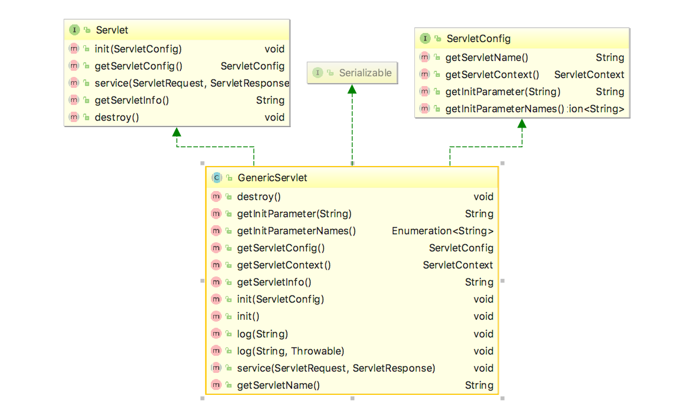
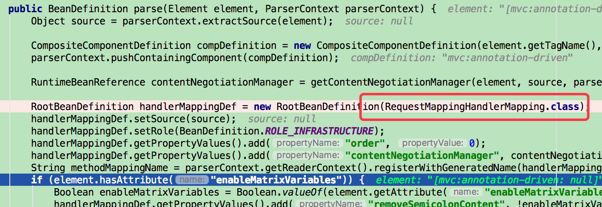
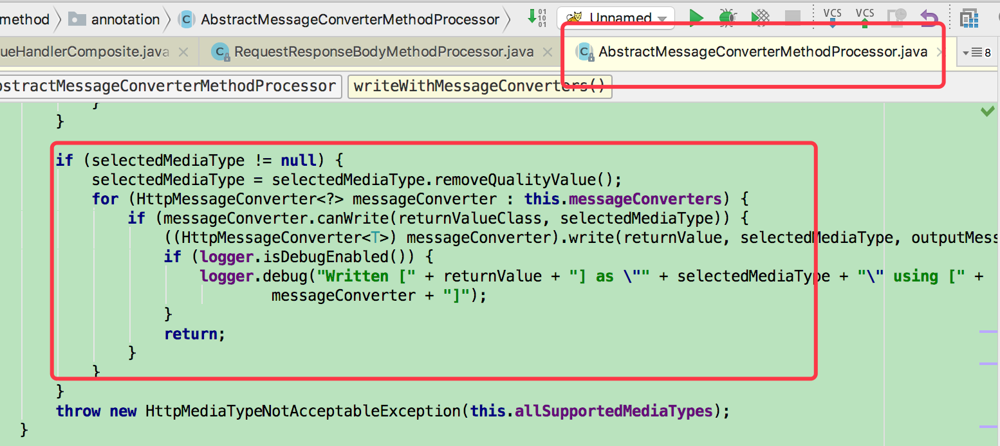

概述
====

信息版本为：3.1.x

springmvc支持纯javaconfig模式，这里记录的为xml配置模式。

这次代码解析主要想弄明白以下几个部分内容：

-   标签如何被加载（例如：RequestMapping）

-   请求如何被处理到指定处理类

-   如何用标签进行数据格式的转换

-   异常是如何处理

-   请求参数如何映射

-   Servlet多线程在哪里实现

标签如何被加载
==============

RequestMapping标签的加载必然是在启动过程中了，web项目直接加载web.xml。

以下为一个简单的web.xml配置，里面常用的配置用颜色标注。

+----------------------------------------------------------------------+
| \<?xml version=\"1.0\" encoding=\"UTF-8\"?\                         |
|                                                                      |
| \<web-app xmlns:xsi=\"http://www.w3.org/2001/XMLSchema-instance\"    |
|                                                                      |
| xmlns=\"http://java.sun.com/xml/ns/javaee\"                          |
|                                                                      |
| xsi:schemaLocation=\"http://java.sun.com/xml/ns/javaee               |
| http://java.sun.com/xml/ns/javaee/web-app\_3\_0.xsd\"                |
|                                                                      |
| version=\"3.0\"\                                                    |
|                                                                      |
| \<display-name\webtest\</display-name\                             |
|                                                                      |
| \<!\-- 提供ContextLoaderListener 并设置相关参数 \--\                |
|                                                                      |
| \<context-param\                                                    |
|                                                                      |
| \<param-name\contextConfigLocation\</param-name\                   |
|                                                                      |
| \<param-value\classpath:spring-core.xml\</param-value\             |
|                                                                      |
| \</context-param\                                                   |
|                                                                      |
| \<listener\                                                         |
|                                                                      |
| \<listener-class\org.                                               |
| springframework.web.context.ContextLoaderListener\</listener-class\ |
|                                                                      |
| \</listener\                                                        |
|                                                                      |
| \<servlet\                                                          |
|                                                                      |
| \<servlet-name\webtest\</servlet-name\                             |
|                                                                      |
| \<servlet-class\                                                     |
| org.springframework.web.servlet.DispatcherServlet\</servlet-class\ |
|                                                                      |
| \<load-on-startup\1\</load-on-startup\                             |
|                                                                      |
| \</servlet\                                                         |
|                                                                      |
| \<servlet-mapping\                                                  |
|                                                                      |
| \<servlet-name\webtest\</servlet-name\                             |
|                                                                      |
| \<url-pattern\/\</url-pattern\                                     |
|                                                                      |
| \</servlet-mapping\                                                 |
|                                                                      |
| \<filter\                                                           |
|                                                                      |
| \<filter-name\Set Character Encoding\</filter-name\                |
|                                                                      |
| \<filter-class\org                                                  |
| .springframework.web.filter.CharacterEncodingFilter\</filter-class\ |
|                                                                      |
| \<init-param\                                                       |
|                                                                      |
| \<param-name\encoding\</param-name\                                |
|                                                                      |
| \<param-value\utf8\</param-value\                                  |
|                                                                      |
| \</init-param\                                                      |
|                                                                      |
| \</filter\                                                          |
|                                                                      |
| \<filter-mapping\                                                   |
|                                                                      |
| \<filter-name\Set Character Encoding\</filter-name\                |
|                                                                      |
| \<url-pattern\/\*\</url-pattern\                                   |
|                                                                      |
| \</filter-mapping\                                                  |
|                                                                      |
| \</web-app\                                                         |
+----------------------------------------------------------------------+

主要分为三类标签（其他标签作为辅助），listener、servlet、filter。

先看一下tomcat是如何加载它们的，tomcat启动时会调用
StandardContext的startInternal：

+----------------------------------------------------------------------+
| //省略之前                                                           |
|                                                                      |
| *// 加载listener*                                                    |
|                                                                      |
| **if** (ok) {                                                        |
|                                                                      |
| **if** (!listenerStart()) {                                          |
|                                                                      |
| ***log                                                               |
| ***.error(***sm***.getString(**\"standardContext.listenerFail\"**)); |
|                                                                      |
| ok = **false**;                                                      |
|                                                                      |
| }                                                                    |
|                                                                      |
| }                                                                    |
|                                                                      |
| //省略                                                               |
|                                                                      |
| *// 加载fileter*                                                     |
|                                                                      |
| **if** (ok) {                                                        |
|                                                                      |
| **if** (!filterStart()) {                                            |
|                                                                      |
| ***l                                                                 |
| og***.error(***sm***.getString(**\"standardContext.filterFail\"**)); |
|                                                                      |
| ok = **false**;                                                      |
|                                                                      |
| }                                                                    |
|                                                                      |
| }                                                                    |
|                                                                      |
| *// 加载初始化"load on startup"的servlet*                            |
|                                                                      |
| *// Load and initialize all \"load on startup\" servlets*            |
|                                                                      |
| **if** (ok) {                                                        |
|                                                                      |
| **if** (!loadOnStartup(findChildren())){                             |
|                                                                      |
| ***lo                                                                |
| g***.error(***sm***.getString(**\"standardContext.servletFail\"**)); |
|                                                                      |
| ok = **false**;                                                      |
|                                                                      |
| }                                                                    |
|                                                                      |
| }                                                                    |
+----------------------------------------------------------------------+

以上内容省略了其他的加载执行步骤，但是可以看到这三个加载顺序，在这里内容如下：

-   listener

 在web.xml中加载spring
 web的ContextLoaderListener，启动会调用contextInitialized方法，会根据加载spring容器，示例中会加载spring-core.xml配置文件。

-   filter

 加载配置中的Fileter，例如示例中的encoding处理

-   servlet

 servlet的加载和处理，在示例中就是springmvc核心的DispatcherServlet，在启动时会springmvc的配置文件，默认以项目名加"-servlet.xml"的配置文件，启动后所有的servlet请求都会到这里进行统一分发处理。

DispatcherServlet是springmvc的核心，所有的请求都是通过它来处理的，类的结构如下：

{width="5.768055555555556in"
height="3.7979166666666666in"}

通过上图能够看出DispatcherServlet是实现了Servlet，集成了GenericServlet、HttpServlet，这三个都是javax.servlet.http包中的，Servlet提供了基本的init、service、destroy方法，GenericServlet提供了通用的实现，而HttpServlet实现了具体的Http相关的功能（例如：doGet、doPut、doPost、doDelete、doHead、doTrace、doOption）。

HttpServletBean就是Springmvc的具体的实现了。在FrameworkServlet中实现了构造Springmvc容器（parent
为spring容器）。

servlet的基本操作如下图：

{width="5.768055555555556in"
height="3.428472222222222in"}

比较重要的就是servlet的init、service、destroy了。在tomcat的代码中，tomcat启动项目时，会在StandardWrapper的loadServlet方法中new
Instance出DispatcherServlet，然后执行init方法。

+----------------------------------------------------------------------+
| package org.apache.catalina.core;                                    |
|                                                                      |
| public class StandardWrapper extends ContainerBase                   |
|                                                                      |
| implements ServletConfig, Wrapper, NotificationEmitter {             |
|                                                                      |
| //省略                                                               |
|                                                                      |
| public synchronized Servlet loadServlet() throws ServletException {  |
|                                                                      |
| //省略                                                               |
|                                                                      |
| InstanceManager instanceManager =                                    |
| ((StandardContext)getParent()).getInstanceManager();                 |
|                                                                      |
| try {                                                                |
|                                                                      |
| //这里的servletClass                                                 |
| 就是org.springframework.web.servlet.DispatcherServlet                |
|                                                                      |
| // newInstance                                                       |
| 方法实现为通过类加载器找到class，然后clazz.newInstance()             |
|                                                                      |
| servlet = (Servlet) instanceManager.newInstance(servletClass);       |
|                                                                      |
| } catch (ClassCastException e) {                                     |
|                                                                      |
| //省略                                                               |
|                                                                      |
| //调用servlet的init方法                                              |
|                                                                      |
| initServlet(servlet);                                                |
|                                                                      |
| //省略                                                               |
|                                                                      |
| }                                                                    |
|                                                                      |
| }                                                                    |
+----------------------------------------------------------------------+

在init方法执行后，会调用FrameworkServlet的initServletBean方法，进行springmvc的容器加载。加载过程中，会将spring容器设为parent容器，并加载servlet配置文件。

{width="5.768055555555556in"
height="4.315972222222222in"}

加载配置文件会进行解析，解析过程使用org.springframework.web.servlet.config.
AnnotationDrivenBeanDefinitionParser进行处理，例如\<mvc:annotation-driven\、\<mvc:argument-resolvers\等等标签。在处理这些标签的同时，会构建RequestMappingHandlerMapping实例的定义，并注册到Springmvc容器中。

{width="5.768055555555556in"
height="1.9854166666666666in"}

然后会执行ApplicationContext的refresh动作，对类进行实例化。

{width="5.768055555555556in"
height="3.642652012248469in"}

方法如何执行
============

由于对tomcat注册了DispatchServlet，所以当有符合该项目路径进行请求后，tomcat会分配当该模块中，例如请求时个Post方法，则会调用doPost方法。

{width="5.768055555555556in"
height="1.8624376640419948in"}

然后会调用到DispatchServlet的doService，最后会执行到doDispatch方法。

+----------------------------------------------------------------------+
| **protected void** doDispatch(HttpServletRequest request,            |
| HttpServletResponse response) **throws** Exception {                 |
|                                                                      |
| HttpServletRequest processedRequest = request;                       |
|                                                                      |
| HandlerExecutionChain mappedHandler = **null**;                      |
|                                                                      |
| **boolean** multipartRequestParsed = **false**;                      |
|                                                                      |
| WebAsyncManager asyncManager =                                       |
| WebAsyncUtils.*getAsyncManager*(request);                            |
|                                                                      |
| **try** {                                                            |
|                                                                      |
| ModelAndView mv = **null**;                                          |
|                                                                      |
| Exception dispatchException = **null**;                              |
|                                                                      |
| **try** {                                                            |
|                                                                      |
| processedRequest = checkMultipart(request);                          |
|                                                                      |
| multipartRequestParsed = processedRequest != request;                |
|                                                                      |
| *// Determine handler for the current request.根据请求，找到handler* |
|                                                                      |
| mappedHandler = getHandler(processedRequest, **false**);             |
|                                                                      |
| **if** (mappedHandler == **null** \|\| mappedHandler.getHandler() == |
| **null**) {                                                          |
|                                                                      |
| noHandlerFound(processedRequest, response);                          |
|                                                                      |
| **return**;                                                          |
|                                                                      |
| }                                                                    |
|                                                                      |
| *// Determine handler adapter for the current                        |
| request.获得handler的adapter*                                        |
|                                                                      |
| HandlerAdapter ha = getHandlerAdapter(mappedHandler.getHandler());   |
|                                                                      |
| *// Process last-modified header, if supported by the handler.*      |
|                                                                      |
| *//如果是get或者head，可以考虑换从相关的内容*                        |
|                                                                      |
| String method = request.getMethod();                                 |
|                                                                      |
| **boolean** isGet = **\"GET\"**.equals(method);                      |
|                                                                      |
| **if** (isGet \|\| **\"HEAD\"**.equals(method)) {                    |
|                                                                      |
| **long** lastModified = ha.getLastModified(request,                  |
| mappedHandler.getHandler());                                         |
|                                                                      |
| **if** (**logger**.isDebugEnabled()) {                               |
|                                                                      |
| **logger**.debug(**\"Last-Modified value for \[\"** +                |
| *getRequestUri*(request) + **\"\] is: \"** + lastModified);          |
|                                                                      |
| }                                                                    |
|                                                                      |
| **if** (**new** ServletWebRequest(request,                           |
| response).checkNotModified(lastModified) && isGet) {                 |
|                                                                      |
| **return**;                                                          |
|                                                                      |
| }                                                                    |
|                                                                      |
| }                                                                    |
|                                                                      |
| **if** (!mappedHandler.applyPreHandle(processedRequest, response)) { |
|                                                                      |
| **return**;                                                          |
|                                                                      |
| }                                                                    |
|                                                                      |
| **try** {                                                            |
|                                                                      |
| *// Actually invoke the handler.*                                    |
|                                                                      |
| *//执行方法*                                                         |
|                                                                      |
| mv = ha.handle(processedRequest, response,                           |
| mappedHandler.getHandler());                                         |
|                                                                      |
| }                                                                    |
|                                                                      |
| **finally** {                                                        |
|                                                                      |
| **if** (asyncManager.isConcurrentHandlingStarted()) {                |
|                                                                      |
| **return**;                                                          |
|                                                                      |
| }                                                                    |
|                                                                      |
| }                                                                    |
|                                                                      |
| applyDefaultViewName(request, mv);                                   |
|                                                                      |
| mappedHandler.applyPostHandle(processedRequest, response, mv);       |
|                                                                      |
| }                                                                    |
|                                                                      |
| **catch** (Exception ex) {                                           |
|                                                                      |
| dispatchException = ex;                                              |
|                                                                      |
| }                                                                    |
|                                                                      |
| processDispatchResult(processedRequest, response, mappedHandler, mv, |
| dispatchException);                                                  |
|                                                                      |
| }                                                                    |
|                                                                      |
| **catch** (Exception ex) {                                           |
|                                                                      |
| triggerAfterCompletion(processedRequest, response, mappedHandler,    |
| ex);                                                                 |
|                                                                      |
| }                                                                    |
|                                                                      |
| **catch** (Error err) {                                              |
|                                                                      |
| triggerAfterCompletionWithError(processedRequest, response,          |
| mappedHandler, err);                                                 |
|                                                                      |
| }                                                                    |
|                                                                      |
| **finally** {                                                        |
|                                                                      |
| **if** (asyncManager.isConcurrentHandlingStarted()) {                |
|                                                                      |
| *// Instead of postHandle and afterCompletion*                       |
|                                                                      |
| mappedHandler.applyAfterConcurrentHandlingStarted(processedRequest,  |
| response);                                                           |
|                                                                      |
| **return**;                                                          |
|                                                                      |
| }                                                                    |
|                                                                      |
| *// Clean up any resources used by a multipart request.*             |
|                                                                      |
| **if** (multipartRequestParsed) {                                    |
|                                                                      |
| cleanupMultipart(processedRequest);                                  |
|                                                                      |
| }                                                                    |
|                                                                      |
| }                                                                    |
|                                                                      |
| }                                                                    |
+----------------------------------------------------------------------+

通过上面代码可以看到，先是根据request请求，找到模块启动时注册的handler，然后进行执行。具体的执行方法在InvocableHandlerMethod类中的invokeForRequest体现。

+----------------------------------------------------------------------+
| **public final** Object invokeForRequest(NativeWebRequest request,   |
| ModelAndViewContainer mavContainer,                                  |
|                                                                      |
| Object\... providedArgs) **throws** Exception {                      |
|                                                                      |
| //获得请求参数                                                       |
|                                                                      |
| Object\[\] args = getMethodArgumentValues(request, mavContainer,     |
| providedArgs);                                                       |
|                                                                      |
| //通过反射执行                                                       |
|                                                                      |
| Object returnValue = invoke(args);                                   |
|                                                                      |
| **return** returnValue;                                              |
|                                                                      |
| }                                                                    |
+----------------------------------------------------------------------+

该方法先是获得请求内容，也就是方法中的具体参数，然后执行invoke反射，执行具体的RequestMapping方法。

而获得参数的方法，这里会进行数据转换的判断和具体的转换方案。

{width="5.768055555555556in"
height="3.5730391513560806in"}

而argumentResolver就是请求的转换处理了，比如常用的\@RequestParam、\@PathVariable等。

{width="5.768055555555556in"
height="5.798038057742782in"}

当请求处理完成后，就会进行返回内容的处理。

{width="5.768055555555556in"
height="3.7222222222222223in"}

通常我们使用的\@ResponseBody标签就是在AbstractMessageConverterMethodProcessor中进行处理。

{width="5.768055555555556in"
height="2.5756944444444443in"}

而转换的内容就是在配置文件中的具体转换器，例如json、xml的格式转换。

{width="5.768055555555556in"
height="0.7720253718285215in"}
