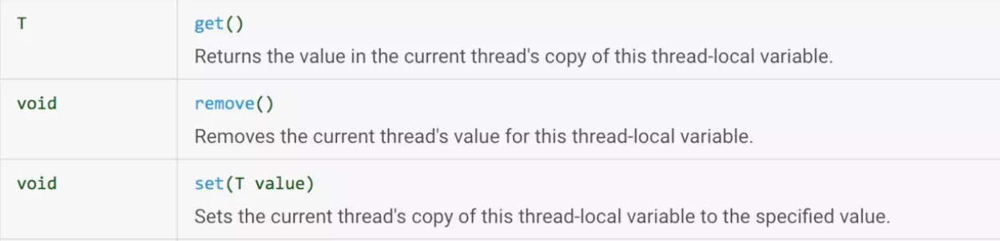
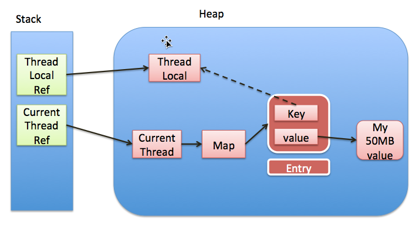

概述
====

ThreadLocal类用来提供线程内部的局部变量。这种变量在多线程环境下访问(通过get或set方法访问)时能保证各个线程里的变量相对独立于其他线程内的变量。ThreadLocal实例通常来说都是private
static类型的，用于关联线程和线程的上下文。

源码解析
========

ThreadLocal
在很多开源框架中使用的还是比较广泛的，通常使用时都是用set、get、remove还有initialValue。jdk8源码示例如下，李东initialValue方法和get方法可以获得一个获得线程id的方法。get方法线程安全，每个线程都会获得不一样的id编号。

+-----------------------------------------------------------------------+
| private static final AtomicInteger nextId = new AtomicInteger(0);     |
|                                                                       |
| // Thread local variable containing each thread\'s ID                 |
|                                                                       |
| private static final ThreadLocal\<Integer\ threadId =                |
|                                                                       |
| new ThreadLocal\<Integer\() {                                        |
|                                                                       |
| \@Override                                                            |
|                                                                       |
| protected Integer initialValue() {                                    |
|                                                                       |
| return nextId.getAndIncrement();                                      |
|                                                                       |
| }                                                                     |
|                                                                       |
| };                                                                    |
|                                                                       |
| // Returns the current thread\'s unique ID, assigning it if necessary |
|                                                                       |
| public static int get() {                                             |
|                                                                       |
| return threadId.get();                                                |
|                                                                       |
| }                                                                     |
+-----------------------------------------------------------------------+

在我们普遍使用过程中，通常会是使用set、get、remove。

{width="5.768055555555556in"
height="1.3908912948381453in"}

Set方法
-------

+----------------------------------------------------------------+
| public void set(T value) {                                     |
|                                                                |
| Thread t = Thread.currentThread();                             |
|                                                                |
| //获得一个map，map是当前线程的threadLocals变量                 |
|                                                                |
| ThreadLocalMap map = getMap(t);                                |
|                                                                |
| if (map != null)                                               |
|                                                                |
| //map 的key 是ThreadLocal value是set的值                       |
|                                                                |
| map.set(this, value);                                          |
|                                                                |
| else                                                           |
|                                                                |
| createMap(t, value);                                           |
|                                                                |
| }                                                              |
|                                                                |
| //返回的map是当前线程的threadLocals变量                        |
|                                                                |
| ThreadLocalMap getMap(Thread t) {                              |
|                                                                |
| return t.threadLocals;                                         |
|                                                                |
| }                                                              |
|                                                                |
| //new了个ThreadLocalMap，并设置给了当前线程的threadLocals 变量 |
|                                                                |
| void createMap(Thread t, T firstValue) {                       |
|                                                                |
| t.threadLocals = new ThreadLocalMap(this, firstValue);         |
|                                                                |
| }                                                              |
+----------------------------------------------------------------+

可以看出来，当调用ThreadLocal的Set方法的时候，是从当前线程里面拿出了一个Map，也就是每个线程都有自己的Map，所以这个方法是绝对安全的，不涉及到共享数据。而这个map以ThreadLocal这个对象为key，需要set的值为value，set到map里。

也就是这个值存在了每个线程的threadLocals
里，对应的类型为ThreadLocalMap。它是ThreadLocal的一个内部类。而存储使用Entry数组，Entry继承了弱引用，如果有这个key（ThreadLocal）没有外部强引用引用它，在系统GC的时候，Key会被回收，变为null。

+-----------------------------------------------------------------+
| static class ThreadLocalMap {                                   |
|                                                                 |
| static class Entry extends WeakReference\<ThreadLocal\<?\\ {  |
|                                                                 |
| Object value;                                                   |
|                                                                 |
| Entry(ThreadLocal\<?\ k, Object v) {                           |
|                                                                 |
| super(k);                                                       |
|                                                                 |
| value = v;                                                      |
|                                                                 |
| }                                                               |
|                                                                 |
| }                                                               |
|                                                                 |
| ThreadLocalMap(ThreadLocal\<?\ firstKey, Object firstValue) {  |
|                                                                 |
| // INITIAL\_CAPACITY 为16，指定一个entry数组用于存储            |
|                                                                 |
| table = new Entry\[INITIAL\_CAPACITY\];                         |
|                                                                 |
| int i = firstKey.threadLocalHashCode & (INITIAL\_CAPACITY - 1); |
|                                                                 |
| table\[i\] = new Entry(firstKey, firstValue);                   |
|                                                                 |
| size = 1;                                                       |
|                                                                 |
| setThreshold(INITIAL\_CAPACITY);                                |
|                                                                 |
| }                                                               |
+-----------------------------------------------------------------+

ThreadLocalMap 的set方法如下：

+-------------------------------------------------------------+
| private void set(ThreadLocal\<?\ key, Object value) {      |
|                                                             |
| Entry\[\] tab = table;                                      |
|                                                             |
| int len = tab.length;                                       |
|                                                             |
| //获得该ThreadLocal的索引位置                               |
|                                                             |
| int i = key.threadLocalHashCode & (len-1);                  |
|                                                             |
| //通过索引位置查找存储的Entry，                             |
|                                                             |
| for (Entry e = tab\[i\];                                    |
|                                                             |
| e != null;                                                  |
|                                                             |
| e = tab\[i = nextIndex(i, len)\]) {                         |
|                                                             |
| ThreadLocal\<?\ k = e.get();                               |
|                                                             |
| //Entry的ThreadLocal对象对应上了，就赋值                    |
|                                                             |
| if (k == key) {                                             |
|                                                             |
| e.value = value;                                            |
|                                                             |
| return;                                                     |
|                                                             |
| }                                                           |
|                                                             |
| //key已经是null，说明被回收了，                             |
|                                                             |
| //该索引Entry没用了，用要保存的键值替换该位置上的 Entry     |
|                                                             |
| if (k == null) {                                            |
|                                                             |
| replaceStaleEntry(key, value, i);                           |
|                                                             |
| return;                                                     |
|                                                             |
| }                                                           |
|                                                             |
| }                                                           |
|                                                             |
| //要存放的索引位置没有 Entry，                              |
|                                                             |
| //将当前键值作为一个 Entry 保存在该位置                     |
|                                                             |
| tab\[i\] = new Entry(key, value);                           |
|                                                             |
| int sz = ++size;                                            |
|                                                             |
| //清除一些无效的条目并判断 table 中的条目数是否已经超出阈值 |
|                                                             |
| if (!cleanSomeSlots(i, sz) && sz \= threshold)             |
|                                                             |
| //扩容两倍                                                  |
|                                                             |
| rehash();                                                   |
|                                                             |
| }                                                           |
+-------------------------------------------------------------+

Get方法
-------

+--------------------------------------------------+
| **public** T get() {                             |
|                                                  |
| Thread t = Thread.*currentThread*();             |
|                                                  |
| ThreadLocalMap map = getMap(t);                  |
|                                                  |
| **if** (map != **null**) {                       |
|                                                  |
| //直接调用map的getEntry方法                      |
|                                                  |
| ThreadLocalMap.Entry e = map.getEntry(**this**); |
|                                                  |
| **if** (e != **null**) {                         |
|                                                  |
| \@SuppressWarnings(**\"unchecked\"**)            |
|                                                  |
| T result = (T)e.**value**;                       |
|                                                  |
| **return** result;                               |
|                                                  |
| }                                                |
|                                                  |
| }                                                |
|                                                  |
| //没有则初始化一个,过程类似set可以设置初始值     |
|                                                  |
| **return** setInitialValue();                    |
|                                                  |
| }                                                |
|                                                  |
| **private** T setInitialValue() {                |
|                                                  |
| T value = initialValue();                        |
|                                                  |
| Thread t = Thread.*currentThread*();             |
|                                                  |
| ThreadLocalMap map = getMap(t);                  |
|                                                  |
| **if** (map != **null**)                         |
|                                                  |
| map.set(**this**, value);                        |
|                                                  |
| **else**                                         |
|                                                  |
| createMap(t, value);                             |
|                                                  |
| **return** value;                                |
|                                                  |
| }                                                |
|                                                  |
| **protected** T initialValue() {                 |
|                                                  |
| **return null**;                                 |
|                                                  |
| }                                                |
+--------------------------------------------------+

map的getEntry方法

+----------------------------------------------------------------------+
| **private** Entry getEntry(ThreadLocal\<?\ key) {                   |
|                                                                      |
| **int** i = key.**threadLocalHashCode** & (**table**.**length** -    |
| 1);                                                                  |
|                                                                      |
| //通过hash后的值获得entry                                            |
|                                                                      |
| Entry e = **table**\[i\];                                            |
|                                                                      |
| //因为有hash碰撞的可能，需要比较一下对象                             |
|                                                                      |
| **if** (e != **null** && e.get() == key)                             |
|                                                                      |
| **return** e;                                                        |
|                                                                      |
| **else**                                                             |
|                                                                      |
| **return** getEntryAfterMiss(key, i, e);                             |
|                                                                      |
| }                                                                    |
|                                                                      |
| **private** Entry getEntryAfterMiss(ThreadLocal\<?\ key, **int** i, |
| Entry e) {                                                           |
|                                                                      |
| Entry\[\] tab = **table**;                                           |
|                                                                      |
| **int** len = tab.**length**;                                        |
|                                                                      |
| //从i坐标以后循环着找，知道获得null                                  |
|                                                                      |
| **while** (e != **null**) {                                          |
|                                                                      |
| ThreadLocal\<?\ k = e.get();                                        |
|                                                                      |
| //能对上就返回                                                       |
|                                                                      |
| **if** (k == key)                                                    |
|                                                                      |
| **return** e;                                                        |
|                                                                      |
| //key为null被GC回收了，清理                                          |
|                                                                      |
| **if** (k == **null**)                                               |
|                                                                      |
| expungeStaleEntry(i);                                                |
|                                                                      |
| **else**                                                             |
|                                                                      |
| i = *nextIndex*(i, len);                                             |
|                                                                      |
| e = tab\[i\];                                                        |
|                                                                      |
| }                                                                    |
|                                                                      |
| **return null**;                                                     |
|                                                                      |
| }                                                                    |
+----------------------------------------------------------------------+

Remove方法
----------

+------------------------------------------------------+
| **public void** remove() {                           |
|                                                      |
| ThreadLocalMap m = getMap(Thread.*currentThread*()); |
|                                                      |
| **if** (m != **null**)                               |
|                                                      |
| m.remove(**this**);                                  |
|                                                      |
| }                                                    |
+------------------------------------------------------+

map的remove

+----------------------------------------------------+
| **private void** remove(ThreadLocal\<?\ key) {    |
|                                                    |
| Entry\[\] tab = **table**;                         |
|                                                    |
| **int** len = tab.**length**;                      |
|                                                    |
| **int** i = key.**threadLocalHashCode** & (len-1); |
|                                                    |
| **for** (Entry e = tab\[i\];                       |
|                                                    |
| e != **null**;                                     |
|                                                    |
| e = tab\[i = *nextIndex*(i, len)\]) {              |
|                                                    |
| //如果key对上了就清除                              |
|                                                    |
| **if** (e.get() == key) {                          |
|                                                    |
| e.clear();                                         |
|                                                    |
| expungeStaleEntry(i);                              |
|                                                    |
| **return**;                                        |
|                                                    |
| }                                                  |
|                                                    |
| }                                                  |
|                                                    |
| }                                                  |
+----------------------------------------------------+

清理方法
--------

expungeStaleEntry是主要的清理方法，里面主要就是将key已经被回收的和需要回收的key和value都设置为null，等待gc回收。

+----------------------------------------------------------------------+
| **private int** expungeStaleEntry(**int** staleSlot) {               |
|                                                                      |
| Entry\[\] tab = **table**;                                           |
|                                                                      |
| **int** len = tab.**length**;                                        |
|                                                                      |
| *//值和引用都设置null*                                               |
|                                                                      |
| tab\[staleSlot\].**value** = **null**;                               |
|                                                                      |
| tab\[staleSlot\] = **null**;                                         |
|                                                                      |
| **size**\--;                                                         |
|                                                                      |
| Entry e;                                                             |
|                                                                      |
| **int** i;                                                           |
|                                                                      |
| //找到                                                               |
| i坐标后面连续的有值的，因为hash碰撞，相同的hash值会存放在一个坐标，  |
| 如果有值了就往后排，所以清理的时候也需要向后查找，直到坐标内容为null |
|                                                                      |
| **for** (i = *nextIndex*(staleSlot, len);                            |
|                                                                      |
| (e = tab\[i\]) != **null**;                                          |
|                                                                      |
| i = *nextIndex*(i, len)) {                                           |
|                                                                      |
| ThreadLocal\<?\ k = e.get();                                        |
|                                                                      |
| //key被gc回收，则把value也回收了                                     |
|                                                                      |
| **if** (k == **null**) {                                             |
|                                                                      |
| e.**value** = **null**;                                              |
|                                                                      |
| tab\[i\] = **null**;                                                 |
|                                                                      |
| **size**\--;                                                         |
|                                                                      |
| } **else** {                                                         |
|                                                                      |
| //如果找到entry，计算出他不应该在这个位置，就往后挪，                |
|                                                                      |
| //并且把这个位置设置为null                                           |
|                                                                      |
| **int** h = k.**threadLocalHashCode** & (len - 1);                   |
|                                                                      |
| **if** (h != i) {                                                    |
|                                                                      |
| tab\[i\] = **null**;                                                 |
|                                                                      |
| **while** (tab\[h\] != **null**)                                     |
|                                                                      |
| h = *nextIndex*(h, len);                                             |
|                                                                      |
| tab\[h\] = e;                                                        |
|                                                                      |
| }                                                                    |
|                                                                      |
| }                                                                    |
|                                                                      |
| }                                                                    |
|                                                                      |
| **return** i;                                                        |
|                                                                      |
| }                                                                    |
+----------------------------------------------------------------------+

内存泄漏
--------

ThreadLocal的结构如下：

{width="5.768055555555556in"
height="3.2555555555555555in"}

每个Thread 维护一个 ThreadLocalMap 映射表，这个映射表的 key 是
ThreadLocal 实例本身，value 是真正需要存储的 Object。ThreadLocal
本身并不存储值，它只是作为一个 key 来让线程从 ThreadLocalMap 获取
value。

值得注意的是图中的虚线，表示 ThreadLocalMap 是使用 ThreadLocal
的弱引用作为 Key 的，意味着没有强引用指向 ThreadLocal
变量时，ThreadLocal会在 GC 时被回收。

如果是强引用的话ThreadLocal就不会被回收了，造成了内存泄漏。

由于是弱引用，没有强引用指向ThreadLocal变量了，GC后将ThreadLocal对象回收了，所以key就变成null了，也就没有人访问key为null的entry了，如果线程不销毁那value就无法被GC了。

所以在ThreadLocal中的get、set、remove都根据条件调用了ThreadLocalMap的expungeStaleEntry，用来将key已经成为null的内容清理掉。已经失效的value只能在下一次调用这几个方法的时候才能被清理，所以在结束使用ThreadLocal时，调用remove方法清理。

ThreadLocal使用通常被申明为static，意味着多个相同的对象只会在方法区中存在一份，JDK建议将ThreadLocal变量定义成private
static的，这样的话ThreadLocal的生命周期就更长，由于一直存在ThreadLocal的强引用，所以ThreadLocal也就不会被回收，也就能保证任何时候都能根据ThreadLocal的弱引用访问到Entry的value值，然后remove它，防止内存泄露。

生命周期的变成使得操作不当，造成内存泄漏，例如以下示例:

<http://blog.xiaohansong.com/2016/08/09/ThreadLocal-leak-analyze/

调用remove解决。

参考：

<http://blog.xiaohansong.com/2016/08/06/ThreadLocal-memory-leak/

<https://www.zhihu.com/question/35250439

<https://blog.csdn.net/winwill2012/article/details/71625570

例子
----

<http://blog.xiaohansong.com/2016/08/09/ThreadLocal-leak-analyze/

+----------------------------------------------------------------------+
| public class MyCounter {                                             |
|                                                                      |
| private int count = 0;                                               |
|                                                                      |
| public void increment() {                                            |
|                                                                      |
| count++;                                                             |
|                                                                      |
| }                                                                    |
|                                                                      |
| public int getCount() {                                              |
|                                                                      |
| return count;                                                        |
|                                                                      |
| }                                                                    |
|                                                                      |
| }                                                                    |
|                                                                      |
| public class MyThreadLocal extends ThreadLocal\<MyCounter\ {        |
|                                                                      |
| }                                                                    |
|                                                                      |
| public class LeakingServlet extends HttpServlet {                    |
|                                                                      |
| private static MyThreadLocal myThreadLocal = new MyThreadLocal();    |
|                                                                      |
| protected void doGet(HttpServletRequest request,                     |
|                                                                      |
| HttpServletResponse response) throws ServletException, IOException { |
|                                                                      |
| MyCounter counter = myThreadLocal.get();                             |
|                                                                      |
| if (counter == null) {                                               |
|                                                                      |
| counter = new MyCounter();                                           |
|                                                                      |
| myThreadLocal.set(counter);                                          |
|                                                                      |
| }                                                                    |
|                                                                      |
| response.getWriter().println(                                        |
|                                                                      |
| \"The current thread served this servlet \" + counter.getCount()     |
|                                                                      |
| \+ \" times\");                                                      |
|                                                                      |
| counter.increment();                                                 |
|                                                                      |
| }                                                                    |
|                                                                      |
| }                                                                    |
+----------------------------------------------------------------------+

在 Tomcat 中，下面的代码都在 webapp
内，会导致WebappClassLoader泄漏，无法被回收。上面的代码中，只要LeakingServlet被调用过一次，且执行它的线程没有停止，就会导致WebappClassLoader泄漏。每次你
reload 一下应用，就会多一份WebappClassLoader实例，最后导致 PermGen
OutOfMemoryException。

tomcat请求线程是个线程池，所以当调用完set之后，myThreadLocal就被设置到了线程池的thread里的threadLocalMap变量，而myThreadLocal又是static的。所以类的引用一直存在。所以需要调用remove方法清理myThreadLocal
和Thrad引用。
