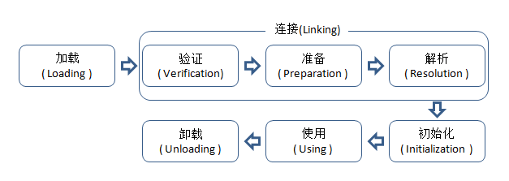

章节
====

类加载的时机
------------

类从被加载到虚拟机内存开始，到卸载出内存，整个生命周期分为：加载（loading）、验证（verification）、准备（preparation）、解析（resolution）、初始化（initialization）、使用（using）、卸载（unloading）7个阶段，其中验证、准备、解析统称连接（Linking）。

虚拟机严格规定有且只有5中情况必须立即对类进行"初始化"：

-   遇到new、getstaic、putstatic或者invokestatic这四个字节码指令，如果类没有初始化，则需要先触发其初始化。场景为：使用new关键字实例化对象时、读取或设置一个类的静态字段时（被final修饰、已在编译期把结果放入常量池的静态字段除外）、以及调用类的静态方法时。

-   使用java.lang.reflect包的方法对类进行反射调用的时候

-   初始化类时，先触发父类的初始化

-   当虚拟机启动时，它会先初始化指定的主类（有main方法的类）

-   当使用JDK1.7的动态语言支持时，如果一个java.lang.invoke.MethodHandle实例最后的解析结果是REF\_getStatic、REF\_putStatic、REF\_invokeStatic的方法句柄，并这个方法的句柄所对应的类没有实例化。

加载过程如下：

{:width="100%" :height="100%"}

1.  加载

 获取类的二进制流，转化为方法区的运行时数据结构，在内存中生成一个代表这个类的java.lang.Class对象，作为方法区这个类的各种数据的访问入口

2.  验证

 确保class文件字节流的信息符合虚拟机要求

	1.  文件格式验证

	2.  元数据验证

	3.  字节码验证

	4.  符号引用验证

3.  准备

	>为类变量分配内存并设置初始值，变量使用的内存都在方法区。例如（static int value=123）在这个阶段会被初始化为0，把value赋值运算的putstatic指令编译后放在了 clinit方法中，所以初始化阶段才会将value赋值为123。但如果value修饰为static final，则准备阶段就会赋值为123。

4.  解析

5.  初始化
> <clinit>()方法是由编译器收集类变量的赋值动作和静态语句块合并产生的，如果两个都没有，则不生成该方法。它不需要显示调用父类构造器，虚拟机自动执行（<init>不会）。父类的<clinit>先执行，所以父类的静态语句要优先于子类。但接口不需要执行父类的<clinit>方法。接口的实现和子接口在初始化时，接口都不会被初始化，除非调用了变量。（接口没有静态方法块）。虚拟机用锁保证了<clinit>的多线程安全，有阻塞的可能。

类加载器
--------

比较两个类是否"相等"，只有在这两个类是由同一个类加载器加载的前提下才有意义。这里的"相等"包括类的Class对象的equals()方法、isAssignableFrom()方法、isInstance()方法的返回结果，也包括使用instanceof关键字做对象所属关系判定等情况。

类加载器：

-   启动器加载器（Bootstrap classLoader）

 这个类加载器负责加载java\_home\\lib目录中的jar，或者被-Xbootclasspath参数所指定的路径的，如果需要把加载请求委派给它，直接使用null代替

-   扩展类加载器（Extension ClassLoader）

 这个加载器由sun.misc.Launcher\$ExtClassLoader实现，它负责加载java\_home\\lib\\ext目录中的，或者被java.ext.dirs系统变量指定路径的所有类库

-   应用程序类加载器（Application ClassLoader）或系统加载器

 这个类加载器有sun.misc.Launcher\$AppClassLoader实现，负责加载用户类路径（ClassPath）上所指定的类库。它是ClassLoader中的getSystemClassLoader()方法的返回值，所以也叫系统加载器，通常就是程序的默认加载器。

{:width="60%" :height="60%"}

图中这种关系被称为类加载器的双亲委派模型，除了bootstrap
classloader其他的类加载器都有自己的父类加载器。父子关系不是用继承，而是组合的方式复用父类加载器的代码。

它的工作过程是：如果有一个类加载器收到了类加载的请求，它首先不自己加载这个类，而是委托给父类去加载，每个层次的类加载都是如此，只有父加载器反馈自己无法完成加载请求（它的搜索范围没有找到这个类），子加载器才会自己加载。

protected synchronized Class<?> loadClass(String name,boolean resolve) throws ClassNotFoundException {
Class c = findLoaderClass(name);
if (c==null){
  try{
  if (parent != null){
    c = parent.loadClass(name,flase);
  }else{
  c = findBootstrapClassOrNull(name);
}
}catch(ClassNotFoundException e ){
}

if(c==null){
 c = findClass(name);
}
if(resolve){
  resolveClass(c);
}
return c;
}
}


破坏双亲委派
------------

破坏双亲委派最直接的例子就是OSGi和java的SPI（service provider
interface）了。

举个SPI的例子JDBC来说：

最简单的实现就是：

Class.forName("com.mysql.jdbc.Driver");
String url = "jdbc:mysql://localhost:3306/test?characterEncoding=UTF-8";
Connection conn = java.sql.DriverManager.getConnection(url, "root", "passwd");
//conn execute sql


先通过Class.forName进行注册

package com.mysql.jdbc;
public class Driver extends NonRegisteringDriver implements java.sql.Driver {
    // 注册到DriverManager
    static {
        try {
            java.sql.DriverManager.registerDriver(new Driver());
        } catch (SQLException E) {
            throw new RuntimeException("Can't register driver!");
        }
    }
    public Driver() throws SQLException {
        // Required for Class.forName().newInstance()
    }
}



然后就执行DriverManager.getConnection方法


package java.sql;
public class DriverManager {
static {
    //执行ServiceLoader.load(Driver.class);
        loadInitialDrivers();
        println("JDBC DriverManager initialized");
}
}



loadInitialDrivers方法会直接利用SPI加载Driver。因为驱动里面已经实现了SPI的配置。如下：

{width="5.768055555555556in"
height="1.640384951881015in"}

所以在loadInitialDrivers执行的时候，会通过ServiceLoader把他们加载器来。这时候问题来了，DriverManager的代码是在rt.jar
的java.sql包里面，根据上面双亲委派的图来看能加载它的也就只有Bootstarp
ClassLoder来加载DriverManager了，但是如果他要想加载mysql驱动的话是不可能的，它只能加载java\_home\\lib下的包，所以可以看到在ServiceLoader.load(Driver.class)的时候，有些技巧。

public static <S> ServiceLoader<S> load(Class<S> service) {
    ClassLoader cl = Thread.currentThread().getContextClassLoader();
    return ServiceLoader.load(service, cl);
}

通过代码可以看到，在加载Driver的时候指定了Thread.*currentThread*().getContextClassLoader()进行加载，而Thread在init的时候会将AppClassLoader设置ContentClassLoader，所以当进行JDBC进行加载的时候就又回到了加载器的最底层，加载的步骤为BootStrap-\Ext-\App。

有些容器（例如Glassfish）会将JDBC驱动放到lib\\ext下面，这样的话直接使用ExtClassLoader就加载成功了，而有的程序（main方法直接跑）加载就是用了AppClassLoader进行加载了。
