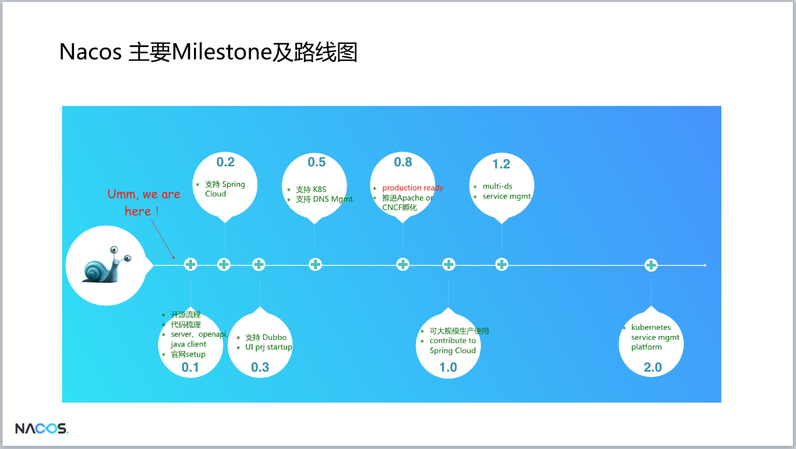
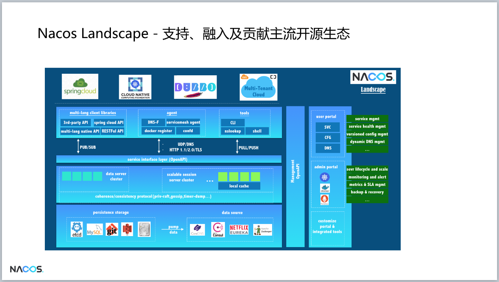
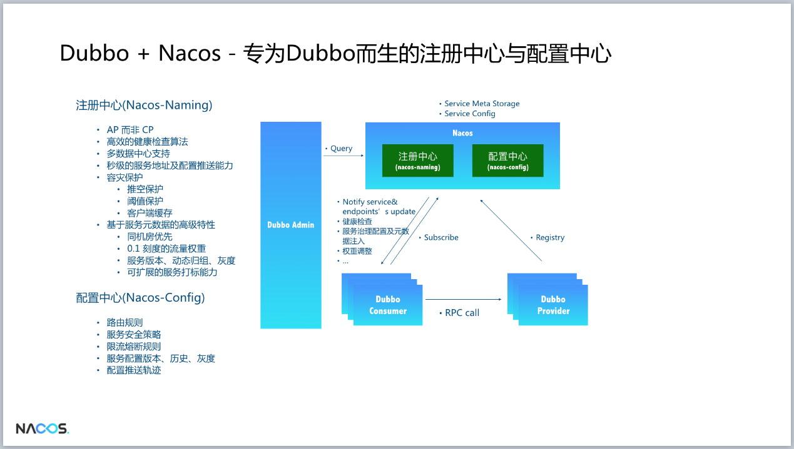
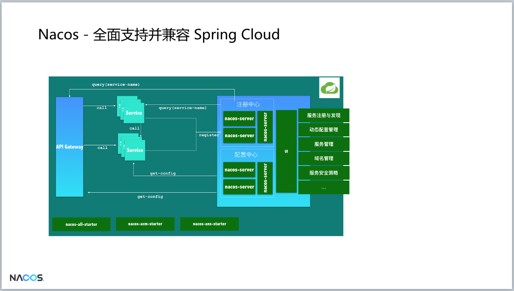
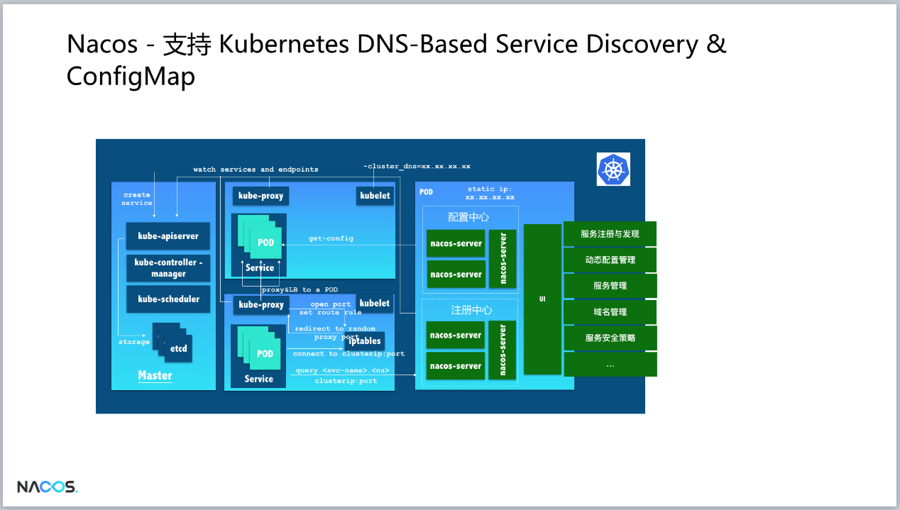
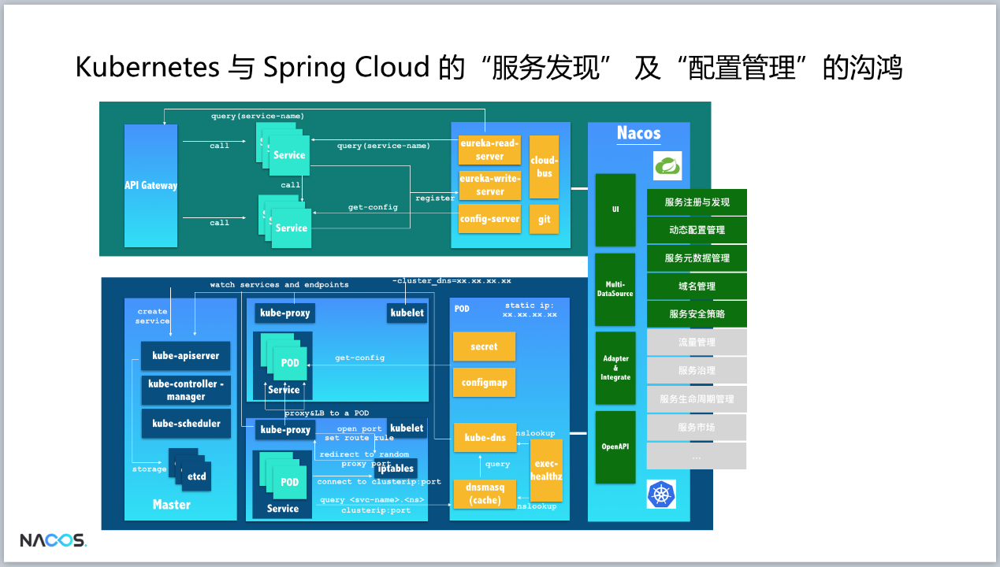
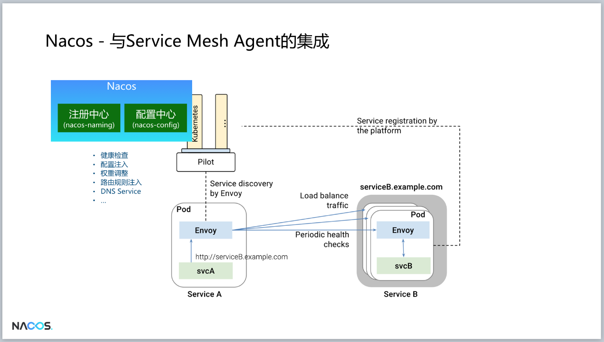
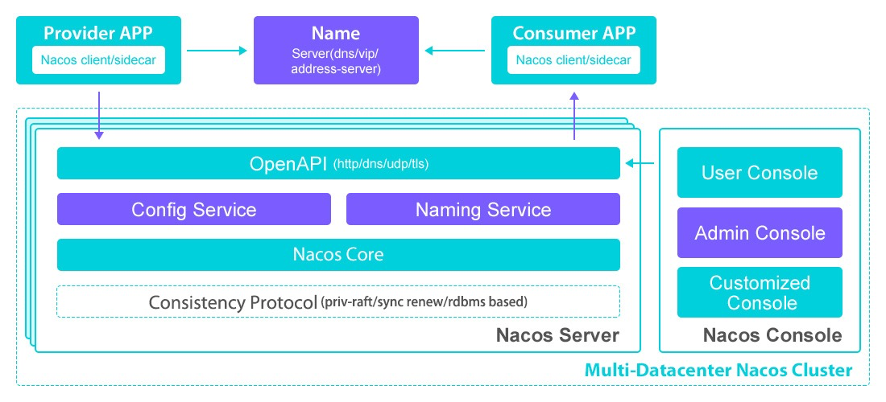

概述
====

Nacos是阿里巴巴开源的微服务注册中心与配置中心。Nacos
提供了一组简单易用的特性集，帮助您快速实现动态服务发现、服务配置、服务元数据及流量管理。Nacos
帮助您更敏捷和容易地构建、交付和管理微服务平台。 Nacos
是构建以"服务"为中心的现代应用架构 (例如微服务范式、云原生范式)
的服务基础设施。

-   服务发现与服务管理

 在采用以"服务(Service)"为中心的诸如微服务及云原生方式的现代应用架构时，动态服务发现至关重要。
 Nacos同时支持基于DNS和基于RPC（如Dubbo/gRPC）的服务发现，并为您提供服务的实时的健康检查以防止将请求发送给不健康的主机，基于Nacos您也可以更方便的实现服务断路器。Nacos提供的强大的服务的元数据管理，路由及流量管理策略也能够帮助您更好的构建更强壮的微服务平台。

-   动态配置管理

 动态配置服务允许您在所有环境中以集中和动态的方式管理所有应用程序或服务的配置。动态配置消除了配置更新时重新部署应用程序和服务的需要。可以更方便的帮助您实现无状态服务，更轻松地实现按需弹性扩展服务实例。

-   动态DNS服务

 支持权重路由的动态DNS服务使您可以更轻松地在数据中心内的生产环境中实施中间层负载平衡，灵活的路由策略，流量控制和简单的DNS解析服务，帮助您更容易的实现DNS-based服务发现。

以下是nacos的路线图，官方宣称0.8版本将能用于生产环境。

{width="5.768055555555556in"
height="3.2592268153980752in"}

与主流开源生态关系
==================

阿里开源生态体系如Dubbo等自身的支持，也非常强调融入其它的开源生态，这里就包括Java的微服务生态体系Spring
Cloud，Kubernetes/CNCF云原生生态体系，正如Nacos的未来全景图展示的那样。

{width="5.768055555555556in"
height="3.267014435695538in"}

Dubbo
-----

在阿里巴巴生产环境上，Dubbo和Nacos天然就是长在一起的，因为Nacos的缺失，传统的注册中心解决方案让Dubbo在服务治理、流量治理、服务运营和管理等方面的威力被限制和削弱了，Nacos的开源和开放会在采用Dubbo的用户环境中释放这些威力。

{width="5.768055555555556in"
height="3.267014435695538in"}

Spring Cloud
------------

{width="5.768055555555556in"
height="3.2700907699037622in"}

Kubernetes DNS-based Service Discovery
--------------------------------------

{width="5.768055555555556in"
height="3.2700907699037622in"}

未来会有越来越多java生态的用户会选择 Kubernetes+Spring Cloud
组合，但不幸的是，在服务发现和配置管理的解决方案上，这2个体系都采用了完全不同的方案，这给同时采用2个体系的用户在注册中心和配置中心的需求上带来了非常大的不必要的复杂性。Nacos会尝试填补2者的鸿沟，以便在2套体系下可以采用同一套服务发现和配置管理的解决方案，这将大大的简化使用和维护的成本。

{width="5.768055555555556in"
height="3.2743799212598423in"}

Service Mesh
------------

{width="5.768055555555556in"
height="3.2767235345581804in"}

架构
====

基本架构及概念
--------------

{width="5.768055555555556in"
height="2.6215277777777777in"}

-   服务 (Service)

服务是指一个或一组软件功能（例如特定信息的检索或一组操作的执行），其目的是不同的客户端可以为不同的目的重用（例如通过跨进程的网络调用）。Nacos
支持主流的服务生态，如 Kubernetes Service、gRPC\|Dubbo RPC Service 或者
Spring Cloud RESTful Service.

-   服务注册中心 (Service Registry)

服务注册中心，它是服务，其实例及元数据的数据库。服务实例在启动时注册到服务注册表，并在关闭时注销。服务和路由器的客户端查询服务注册表以查找服务的可用实例。服务注册中心可能会调用服务实例的健康检查
API 来验证它是否能够处理请求。

-   服务元数据 (Service Metadata)

服务元数据是指包括服务端点(endpoints)、服务标签、服务版本号、服务实例权重、路由规则、安全策略等描述服务的数据

-   服务提供方 (Service Provider)

是指提供可复用和可调用服务的应用方

-   服务消费方 (Service Consumer)

是指会发起对某个服务调用的应用方

-   配置 (Configuration)

在系统开发过程中通常会将一些需要变更的参数、变量等从代码中分离出来独立管理，以独立的配置文件的形式存在。目的是让静态的系统工件或者交付物（如
WAR，JAR
包等）更好地和实际的物理运行环境进行适配。配置管理一般包含在系统部署的过程中，由系统管理员或者运维人员完成这个步骤。配置变更是调整系统运行时的行为的有效手段之一。

-   配置管理 (Configuration Management)

在数据中心中，系统中所有配置的编辑、存储、分发、变更管理、历史版本管理、变更审计等所有与配置相关的活动统称为配置管理。

-   名字服务 (Naming Service)

提供分布式系统中所有对象(Object)、实体(Entity)的"名字"到关联的元数据之间的映射管理服务，例如
ServiceName -\ Endpoints Info, Distributed Lock Name -\ Lock
Owner/Status Info, DNS Domain Name -\ IP List, 服务发现和 DNS
就是名字服务的2大场景。

-   配置服务 (Configuration Service)

在服务或者应用运行过程中，提供动态配置或者元数据以及配置管理的服务提供者。

逻辑架构及其组件介绍
--------------------

{width="5.768055555555556in"
height="4.246773840769904in"}

-   服务管理：实现服务CRUD，域名CRUD，服务健康状态检查，服务权重管理等功能

-   配置管理：实现配置管CRUD，版本管理，灰度管理，监听管理，推送轨迹，聚合数据等功能

-   元数据管理：提供元数据CURD 和打标能力

-   插件机制：实现三个模块可分可合能力，实现扩展点SPI机制

-   事件机制：实现异步化事件通知，sdk数据变化异步通知等逻辑

-   日志模块：管理日志分类，日志级别，日志可移植性（尤其避免冲突），日志格式，异常码+帮助文档

-   回调机制：sdk通知数据，通过统一的模式回调用户处理。接口和数据结构需要具备可扩展性

-   寻址模式：解决ip，域名，nameserver、广播等多种寻址模式，需要可扩展

-   推送通道：解决server与存储、server间、server与sdk间推送性能问题

-   容量管理：管理每个租户，分组下的容量，防止存储被写爆，影响服务可用性

-   流量管理：按照租户，分组等多个维度对请求频率，长链接个数，报文大小，请求流控进行控制

-   缓存机制：容灾目录，本地缓存，server缓存机制。容灾目录使用需要工具

-   启动模式：按照单机模式，配置模式，服务模式，dns模式，或者all模式，启动不同的程序+UI

-   一致性协议：解决不同数据，不同一致性要求情况下，不同一致性机制。这里面用的raft

-   存储模块：解决数据持久化、非持久化存储，解决数据分片问题

-   Nameserver：解决namespace到clusterid的路由问题，解决用户环境与nacos物理环境映射问题

-   CMDB：解决元数据存储，与三方cmdb系统对接问题，解决应用，人，资源关系

-   Metrics：暴露标准metrics数据，方便与三方监控系统打通

-   Trace：暴露标准trace，方便与SLA系统打通，日志白平化，推送轨迹等能力，并且可以和计量计费系统打通

-   接入管理：相当于阿里云开通服务，分配身份、容量、权限过程

-   用户管理：解决用户管理，登录，sso等问题

-   权限管理：解决身份识别，访问控制，角色管理等问题

-   审计系统：扩展接口方便与不同公司审计系统打通

-   通知系统：核心数据变更，或者操作，方便通过SMS系统打通，通知到对应人数据变更

-   OpenAPI：暴露标准Rest风格HTTP接口，简单易用，方便多语言集成

-   Console：易用控制台，做服务管理、配置管理等操作

-   SDK：多语言sdk

-   Agent：dns-f类似模式，或者与mesh等方案集成

-   CLI：命令行对产品进行轻量化管理，像git一样好用

集群部署
--------

官方建议集群模式部署：

推荐用户把所有服务列表放到一个vip下面，然后挂到一个域名下面

[http://nacos.com](http://nacos.com/):port/openAPI 域名 +
VIP模式，可读性好，而且换ip方便，推荐模式：

{width="5.768055555555556in"
height="2.5017902449693787in"}

作为配置中心，nacos可将配置存放在mysql中。

作为注册中心，nacos使用底层的raft进行服务注册，保证数据一致性。

其他
====

Zookeeper同步工具
-----------------

在使用dubbo框架中，我们通常将zookeeper作为注册中心，但是zookeeper作为一个CP系统（CAP理论中的数据一致性为重点），不是一个AP系统（CAP中，A强调可用性）。作为注册中心，AP系统更加适合。

Zookeeper三个节点，挂两个之后不可用。

详情查看：<https://www.infoq.cn/article/why-doesnot-alibaba-use-zookeeper

官方提供了一个nacos和zookeeper数据同步的工具：

<https://github.com/nacos-group/nacos-sync

示例如下：

<https://github.com/paderlol/nacos-sync-example
