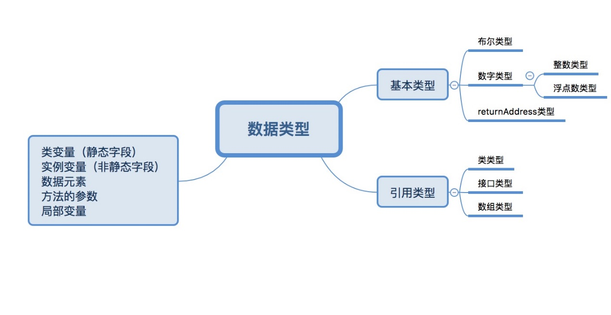

虚拟机结构
----------

{width="5.768055555555556in"
height="2.981540901137358in"}

Java虚拟机可操作的数据类型分为两类：原始类型（primitive
type）和引用类型（reference
type）。对应的也有原始值和引用值，他们也用于变量赋值、参数传递、方法返回和运算操作。基本类型的变量放的就是数据本身，引用类型的变量存放的是对象引用，真正数据存储在堆中。变量包括类变量（静态字段）、实例变量（非静态字段）、数据元素、方法的参数和局部变量。

原始数据类型包括数值类型（numeric
type）、boolean类型和returnAddress类型。数值类型又分为整数类型（integral
type）和浮点类型（floating-point type）。

整数类型包括：

-   byte类型：值为8位有符号二进制补码整数，默认为零，范围-2的7次方到2的7次方-1

-   short类型：16位有符号二进制补码整数

-   int类型：32位有符号

-   long类型：64位有符号

-   char类型：16位无符号

-   float类型：单精度浮点数集合中的元素

-   double类型：双精度浮点集合中的元素

returnAddress类型是指向某个操作码（opcode）的指针。

虚拟机中没有任何供boolean值专用的字节码指令，java语言表达是操作的boolean值，在编译之后都使用java虚拟机中的int数据类型来代替。boolean类型数组的访问与修改共用byte类型数组的baload和bastore指令。虚拟机会把boolean数组元素中的true用1表示，false用0来表示。

在oracle的虚拟机里，java语言中的boolean数值将会被编码成java虚拟机的byte数组，每个boolean元素占8位。

java虚拟机中有三种引用类型：类类型（class type），数组类型（array
type）和接口类型（interface type）。

数组类型最外面那一维元素的类型叫做该数组类型的组件类型。引用类型的值还有个特殊的值：null，当一个引用不指向任何对象的时候，他的值就是null来表示。一个为null的引用，起初并不具备任何实际的运行期类型，但是他可以转型为任意的引用类型，引用类型的默认值就是null。java虚拟机规范并没有规定null在虚拟机实现中应当怎样用编码表示。

{width="5.768055555555556in"
height="3.4212609361329833in"}

对上图做个简单的概述，在JVM中，有栈（stack）、非堆（non
heap）、堆（heap）的概念。栈存在于每个线程当中，非堆主要描述code cache
和 永久代（permanent generation），堆主要分为年轻代、老年代。

每个线程都有pc寄存器、java虚拟栈（stack）、本地方法栈（native
stack）。每执行一个方法就有new一个栈帧（frame），并且放在栈顶。每个栈帧里面又包含本地变量表（local
variable）、操作数栈（operand
stack）和指向当前方法所属的类的运行时常量池的引用和返回值（return
value）。

非堆包括code cache 和 永久带，永久带中包含 interned strings和
方法区（method area）。interned strings 是JVM为保证string
引入相同的实例，在永久代中存储为Hashtable\<oop, Symbol\>，即当(\"j\" +
\"v\" + \"m\").intern() == \"jvm\"。方法区中存储了栈帧中引用的class
信息。

堆分为年轻代、老年代。年轻代分为伊甸区（eden space）和幸存区（sunvivor
space），类在伊甸区生成，经过minor
gc后，要么被回收，要么会到幸存区，幸存区经过major gc后到达老年区。

更多查看：<http://blog.jamesdbloom.com/JVMInternals.html#jvm_system_threads>

运行时数据区：

-   pc寄存器

 每个线程都有自己的pc（program
 counter）寄存器，在任意时刻，一条java线程只会执行一个方法的代码，该方法被称为当前方法（current
 method）。如果该方法不是native的，那pc寄存器保存正在执行的字节码指令地址，如果是native的，值为undefined。

-   java虚拟机栈

 每个线程都有自己的java虚拟栈（java virtual machine
 stack），该栈与线程同时创建，用于存储栈帧（frame）。该栈用于存储局部变量和未计算好的结果。功能只能出栈入栈。

-   java堆

 堆（heap）是可供各线程共享的运行时内存区域，也是供所有类实例和数组对象分配内存的区域。

-   方法区（method area）

 它是可供各线程共享的运行时内存区域，存储了每个类的结构信息。例如：运行时常量池（runtime
 constant
 pool）、字段和方法数据、构造函数和普通方法的字节码内容，还包括类、实例、接口初始化时用到的特殊方法。它在虚拟机启动时创建，是堆的逻辑组成部分，可选择该区域不实现gc与压缩。

-   运行时常量（runtime constant pool）

 它是class文件或接口的常量池表（constant\_pool
 table）的运行时表示形式，包括了常量、编译期可知的数值字面量和编译后才能获得的方法或字段引用。它类似与符号表（symbol
 table）。常量池在方法区中分配，在类和接口加载后创建。主要存放：字面量（literal）和符号引用（symbolic
 reference），字面量包括整数、浮点数和字符串字面量；符号引用包括类符号引用、字段符号引用、方法符号引用和接口方法符号引用。

-   本地方法栈（native method stack）

 它是用于支持虚拟机实现使用到传统的栈（例如 c
 stack），用来支持native方法的执行。在线程创建时，按线程分配。

栈帧：

frame是用来存储数据和部分过程结果的数据结构，同时也用来处理动态链接（dynamic
linking）、方法返回值和异常分派（dispatch
exception）。它随方法创建而创建，随方法结束而销毁。它的存储空间由创建它的线程分配在java虚拟栈，每个都有本地变量表（local
variable）、操作数栈（operand
stack）和指向当前方法所属的类的运行时常量池的引用。

在线程执行过程总，只有正在执行的栈帧是活动的，它被称为当前栈帧（current
frame），对应的方法叫当前方法（current
method），方法的类叫当前类（current
class）。战争是线程私有数据，不可能在一个战争中引入另一个线程的栈帧。

-   局部变量表

 可保存类型为boolean、byte、char、short、int、float、reference、或returnAddress的数据，两个局部变量保存long或double。它用来完成方法调用时的参数传递，调用时从0位置开始，第0个一定是所在对象（this），后续参数从1开始。

-   操作数栈

 每个栈帧都包含一个操作数栈，它后进先出。

-   动态链接

 每个栈帧都包含一个指向当前方法所在类型的运行时常量池的引用，以便对当前方法的代码实现动态链接。在class文件里，一个方法要调用其他方法，或访问成员变量，需要通过符号引用（symbolic
 reference）来表示，动态链接就是将这些符号引用所表示的方法转换为对实现方法的引用。

-   方法调用正常完成

 这是指执行没有异常。栈帧承担恢复调用者状态的责任，包括恢复调用者的局部变量表和操作数栈，以及正确传递长须计数器。调用者代码在被调用方法的返回值压入调用者栈帧操作数栈后，继续执行。

-   方法调用异常完成

 是指执行时某些指令导致了虚拟机异常或athrow字节码指令。异常调用不会有返回值给调用者。

特殊方法：

构造器以名为\<init\>的特殊实例初始化方法的形式出现，它在实例初始化期间，通过invokespecial指令调用，并且是在没有初始化的实例上。

一个类或接口最多可以包换不超过一个类或接口的初始化方法，通过它完成初始化，该方法不包含参数、返回类型为void，名称为\<clinit\>。版本号大于51.0时，该方法必须设置ACC\_STATIC标志。

\<clinit\>被称为类构造器，java在编译之后会在字节码文件中生成该方法，它会将父类静态变量初始化、父类静态语句块、子类静态变量初始化、子类静态语句块放到\<clinit\>方法中，在类加载的过程中执行，且在\<init\>之前执行。

\<init\>被称为实例构造器，它会将父类变量初始化、父类语句块、父类构造器、子类变量初始化、子类语句块、子类构造器方法放入\<init\>方法中，在类实例被初始化时被执行。

异常：

使用Throwable或其子类表示，抛异常的本质是程序控制，从异常抛出地方转换到处理异常的地方。

异常有三种原因：

-   athrow字节码被执行

-   程序操作发生异常

-   虚拟机内部异常，线程异步异常

字节码指令集：

虚拟机指令由一个字节的操作码（opcode）和跟随其后0到多个代表参数的操作数（operand）构成。执行时是从pc寄存器中取出。

数据类型与助记符关系：


  符号   i     l      s       b      c      f       d        a
  ------ ----- ------ ------- ------ ------ ------- -------- -----------
  类型   int   long   short   byte   char   float   double   reference

 

例如iload，指将一个int变量从本地变量加载到操作数栈中。

指令分为：

-   加载与存储指令

 例如将本地变量加载到stack：lload。将stack的值存到局部变量表：istore。从常量池中提取并入stack：ldc，iconst\_m1等。扩充局部变量表的访问索引或立即数：wide。

-   算数指令

 例如加法：iadd，ladd。比较：dcmpg等。

-   类型转换指令

 例如i2l,f2d等。

-   对象的创建于操作

 例如：new、newarrary。访问字段getfield，putstatic等。把数组元素加载到stack：baload、aaload。将stack值存储到数组元素：bastore。取数组长度：arraylength。检查实例或数组类型：instanceof、checkcast。

-   操作数栈管理指令

 pop、dup、swap等。

-   控制转移指令

 条件分支：ifeq、iflt等。符合条件分支：taleswitch。无条件分支：got、ret。

-   方法调用和返回指令

 invokevirtual用于调用实例方法。

 invokeinterface调用接口方法。

 invokespecial调用特殊方法。

 invokestatic调用静态方法。

 invokedynamic调用以绑定了invokedynamic指令的调用点对象作为目标方法。

-   抛出异常

 athrow。

-   同步

 标识java语言中的synchronized块，指令为monitorenter和monitorexit两个指令。
