概述
====

本文讲述自定义固件相关操作。

自定义固件
==========

下载源代码
----------

<https://github.com/openwrt/openwrt

本文示例为17.0.6

申明镜像
--------

根据cpu选择相应的架构，例如我们选择ramips的mt7621 cpu。

vi openwrt-17.01.6/target/linux/ramips/image/mt7621.mk

添加如下自定义（xcv1）


define Device/unlto-g3
  DTS := UNLTO-G3
  IMAGE_SIZE := $(ralink_default_fw_size_16M)
  DEVICE_TITLE := unlto g3
  DEVICE_PACKAGES := kmod-usb3 kmod-usb-ledtrig-usbport kmod-ata-core kmod-ata-ahci
endef
TARGET_DEVICES += unlto-g3



添加板子基本配置
----------------

### 添加名称对应

在 target/linux/ramips/base-files/lib/ramips.sh 文件中添加新设备名称。

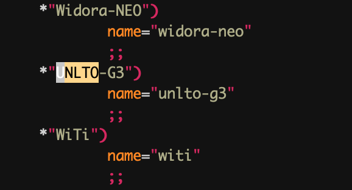{width="2.7in" height="1.4574398512685913in"}

### 添加led sys灯支持

编辑 target/linux/ramips/base-files/etc/diag.sh

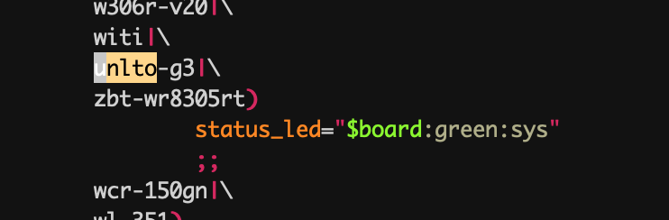{width="5.153042432195975in"
height="1.6945319335083115in"}

### Network设置

编辑 target/linux/ramips/base-files/etc/board.d/02\_network

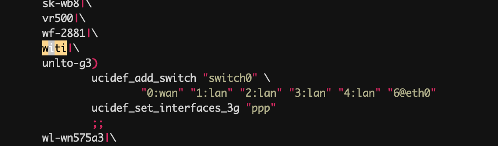{width="5.768055555555556in"
height="1.6916666666666667in"}

注意：因为我们主板的特殊性， 0是wan口，4是lan口，所以需要调整

### 添加

编辑openwrt-17.01.6/target/linux/ramips/image/mt7621.mk文件，添加内容

define Device/unlto-g3
  DTS := UNLTO-G3
  IMAGE_SIZE := $(ralink_default_fw_size_16M)
  DEVICE_TITLE := unlto g3
  DEVICE_PACKAGES := kmod-usb3 kmod-usb-ledtrig-usbport kmod-ata-core kmod-ata-ahci
endef
TARGET_DEVICES += unlto-g3


添加硬件配置
------------

在openwrt-17.01.6/target/linux/ramips/dts 目录中添加UNLTO-G3.dts

/dts-v1/;

#include "mt7621.dtsi"

#include <dt-bindings/input/input.h

/ {
	model = "UNLTO-G3";

	memory@0 {
		device_type = "memory";
        ## 内存大小
		reg = <0x0 0x8000000;
	};

	chosen {
        ## 115200 调试串口波特率
		bootargs = "console=ttyS0,115200";
	};

	gpio-leds {
                compatible = "gpio-leds";

                buzzer {
                        label = "buzzer";
                     gpios = <&gpio0 0 0;
                };
                aerial {
                        label = "aerial";
                     gpios = <&gpio0 26 0;
                };
                sim {
                        label = "sim";
                     gpios = <&gpio0 22 1;
                };
                modpower {
                     label = "modpower";
                     gpios = <&gpio0 24 0;
                };
                stormgreen {
                     label = "storm:green";
                     gpios = <&gpio0 16 0;
                };
                stormred {
                     label = "storm:red";
                     gpios = <&gpio0 28 0;
                };
                wangreen {
                     label = "wan:green";
                     gpios = <&gpio0 13 1;
                };
                wanred {
                     label = "wan:red";
                     gpios = <&gpio0 14 1;
                };
                4g1 {
                     label = "4g:1";
                     gpios = <&gpio0 29 1;
                };
                4g2 {
                     label = "4g:2";
                     gpios = <&gpio0 31 1;
                };
                ###每组gpio为32，4g3为32所以修改为gpio1 0 
                4g3 {
                     label = "4g:3";
                     gpios = <&gpio1 0 1;
                };
        };

	palmbus: palmbus@1E000000 {
		i2c@900 {
			status = "okay";

			pcf8563: rtc@51 {
				status = "okay";
				compatible = "nxp,pcf8563";
				reg = <0x51;
			};
		};
	};

	gpio-keys-polled {
		compatible = "gpio-keys-polled";
		#address-cells = <1;
		#size-cells = <0;
		poll-interval = <20;

		reset {
			label = "reset";
			gpios = <&gpio0 17 1;
			linux,code = <KEY_RESTART;
		};
	};
};

&sdhci {
	status = "okay";
};

&gpio1 {
	status = "okay";
};

&spi0 {
	status = "okay";

	m25p80@0 {
		#address-cells = <1;
		#size-cells = <1;
		compatible = "jedec,spi-nor";
		reg = <0;
		spi-max-frequency = <10000000;
		m25p,chunked-io = <32;

		partition@0 {
			label = "u-boot";
			reg = <0x0 0x30000;
			read-only;
		};

		partition@30000 {
			label = "u-boot-env";
			reg = <0x30000 0x10000;
			read-only;
		};

		factory: partition@40000 {
			label = "factory";
			reg = <0x40000 0x10000;
		};

		partition@50000 {
			label = "firmware";
			reg = <0x50000 0x1fb0000;
		};

        ##这里单独做了一份32m 的rootfs_data，是因为uboot要求会从0x2000000开始识别，用于存储uboot需要的数据
		partition@2000000 {
			label = "rootfs_data";
			reg = <0x2000000 0x2000000;
		};
	};
};

&pcie {
	status = "okay";

	pcie0 {
		mt76@0,0 {
			reg = <0x0000 0 0 0 0;
			device_type = "pci";
			mediatek,mtd-eeprom = <&factory 0x8000;
			ieee80211-freq-limit = <5000000 6000000;
			mtd-mac-address = <&factory 0xe000;
		};
	};

	pcie1 {
		mt76@1,0 {
			reg = <0x0000 0 0 0 0;
			device_type = "pci";
			mediatek,mtd-eeprom = <&factory 0x0000;
			ieee80211-freq-limit = <2400000 2500000;
			mtd-mac-address = <&factory 0xe000;
		};
	};
};

&ethernet {
	mtd-mac-address = <&factory 0xe000;
};

&pinctrl {
	state_default: pinctrl0 {
		gpio {
			ralink,group = "wdt", "rgmii2", "jtag", "mdio";
			ralink,function = "gpio";
		};
	};
};



执行
----

删除openwrt/tmp 执行make menuconfig

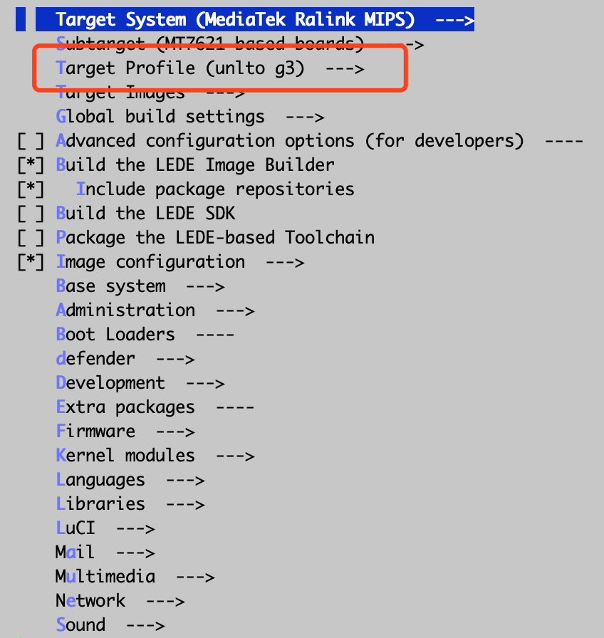{width="5.768055555555556in"
height="6.094444444444444in"}

编译自己的软件
==============

参考
《openwrt,Lede深入学习笔记v2.0.pdf》中编译软件的方法。这里描述了一个compile
c的方法并将代码打成安装包。

还有另外一种，直接将执行文件拷贝的方法，例如mwan3.

include $(TOPDIR)/rules.mk

PKG_NAME:=mwan3
PKG_VERSION:=2.0.2
PKG_RELEASE:=1
PKG_MAINTAINER:=Florian Eckert <fe@dev.tdt.de
PKG_LICENSE:=GPLv2

include $(INCLUDE_DIR)/package.mk

define Package/mwan3
   SECTION:=net
   CATEGORY:=Network
   SUBMENU:=Routing and Redirection
   DEPENDS:=+ip +ipset +iptables +iptables-mod-conntrack-extra +iptables-mod-ipopt
   TITLE:=Multiwan hotplug script with connection tracking support
   PKGARCH:=all
endef

define Package/mwan3/conffiles
/etc/config/mwan3
endef

define Build/Compile
endef

define Package/mwan3/install
$(CP) ./files/* $(1)
endef

$(eval $(call BuildPackage,mwan3))


打包基础固件
============

通过openwert编译后，会生成一个基本可用能上网的路由器固件，但是如果我们有一些特殊的业务需要持续增加的时候怎么办呢？例如向增加一个/etc/config/test

Openwrt提供了 image builder 的功能，make
menuconfig的时候，选择相应的选项后，会在bin/targets目录下生成镜像的同时，也生成一个builder。

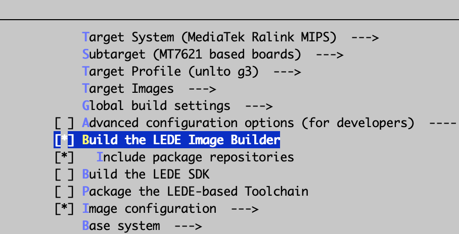{width="5.768055555555556in"
height="2.9472222222222224in"}

解压后，在文件夹下创建一个files目录，files/etc/config/test，并执行

make image FILES=files/ PROFILE=unlto-g3 PACKAGES=\" mwan3 \"

这个语句会将
files里面的文件直接覆盖到系统的/下，packages执行将那些软件打入image中。

编译成功后，会在bin/targets/ramips/mt7621/ 目录下生成相应的bin。

注意&问题
=========

设定一个大的可写空间
--------------------

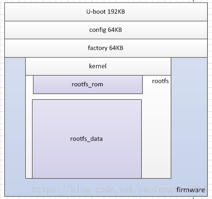{width="4.552777777777778in"
height="4.282638888888889in"}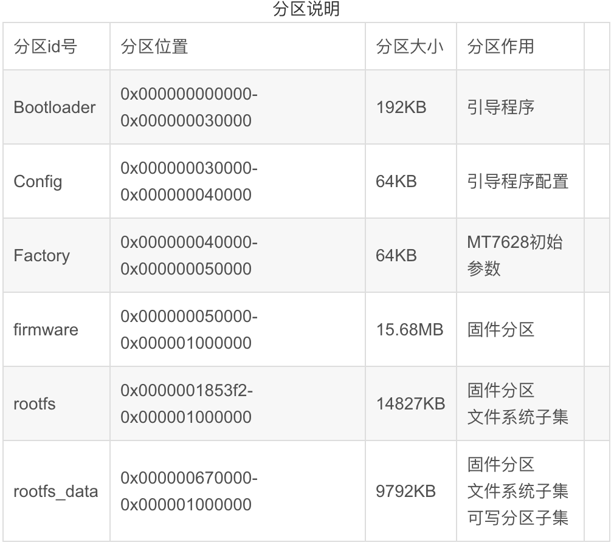{width="5.768055555555556in"
height="5.151388888888889in"}

在linux系统中对闪存类存储器是采用MTD（内存技术设备）类设备驱动实现的，MTD是用于访问闪存类设备(ROM,FLASH)的linux驱动子系统。在openwrt中会将flash进行分区，内容为上图。固件中只有rootfs\_data区域是可以写的。如果需要写入，并且重启不会消失。

这样就需要在dts配置里添加一个名字为rootfs\_data的32m的分区，但是由于在默认情况下，rootfs中就会包含一个rootfs\_data，所以就会出现两个rootfs\_data。

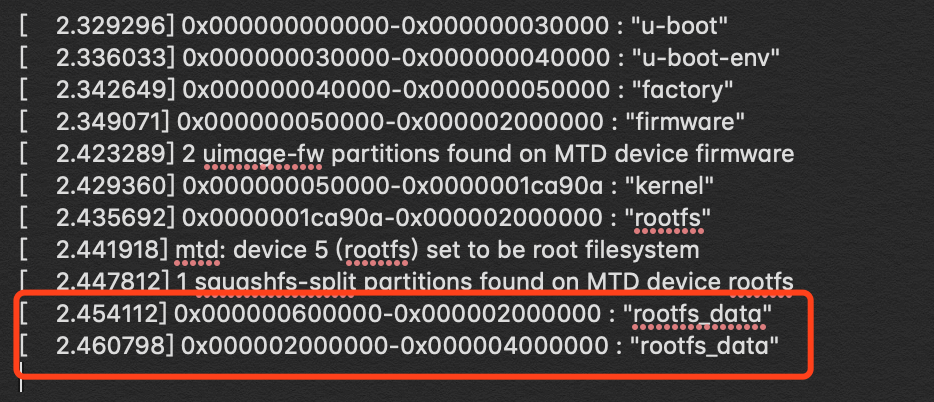{width="5.768055555555556in"
height="2.482638888888889in"}

这种情况下就需要修改配置 target/linux/ramips/mt7621/config-4.4
,添加如下配置，这样就明确申明不需要从rootfs中切分出一个小的rootfs\_data，而是用我们申明的32m空间。

  --------------------------------------------------
  \# CONFIG\_MTD\_SPLIT\_SQUASHFS\_ROOT is not set
  --------------------------------------------------

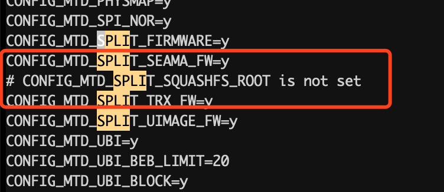{width="5.222490157480315in"
height="2.2640048118985128in"}

双镜像uboot
-----------

双镜像的uboot

<https://github.com/angusding/witi-uboot

Reboot 卡死问题
---------------

MT7621完美支持32M SPI Flash(W25Q256) 修复 soft reset fail

<https://blog.csdn.net/yubing_615/article/details/52649489

添加第三方包
------------

默认的openwrt只有核心源码，如果需要拓展新的功能，就需要导入packages，checkout到相应的版本，进行导入。

<https://github.com/openwrt/packages

模组上网方式不同
----------------

红茶的模组使用了移远和广和通的模组，启动模组后通过ifconfig -a
可进行查看。

  移远为usb0
  --------------
  广和同为eth1

为什么有这样的区别呢？猜测（）

广和通用的是 cdc Ethernet
support，系统分为为eth1（因为eth0已经给默认网卡了），而移远使用usb
support的 cdc acm，分配为usb0。

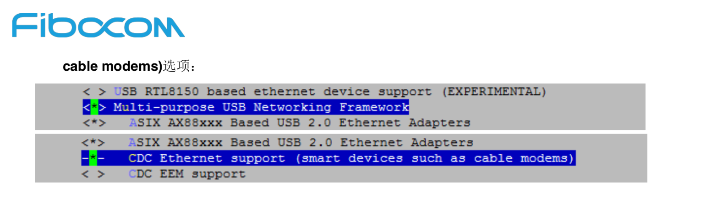{width="5.768055555555556in"
height="1.636111111111111in"}

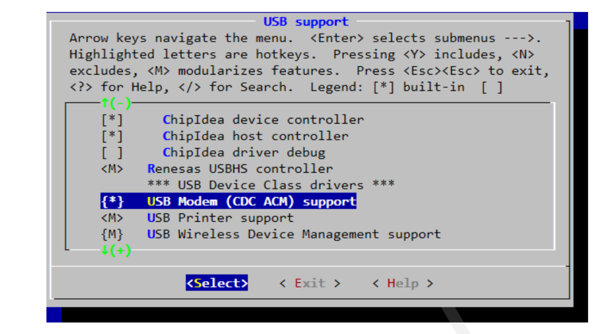{width="5.768055555555556in"
height="3.171527777777778in"}

Wan口也需要dhcp？
-----------------

平常我们接触到的是，电脑连接路由器，路由器会有dhcp服务，分给电脑一个ip。那问题来了，路由器的ip谁给分的呢？

所以不论是wan口插线，还是4g信号联网，很重要的一部也是需要发起dhcp
client请求，让server分配一个ip。对应到openwrt配置里面，就是proto=dhcp。

例如使用uci 设置。

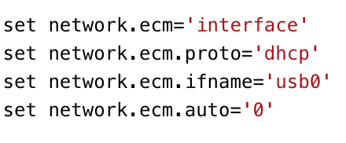{width="3.0557130358705162in"
height="1.2639534120734908in"}

主板相关信息
------------

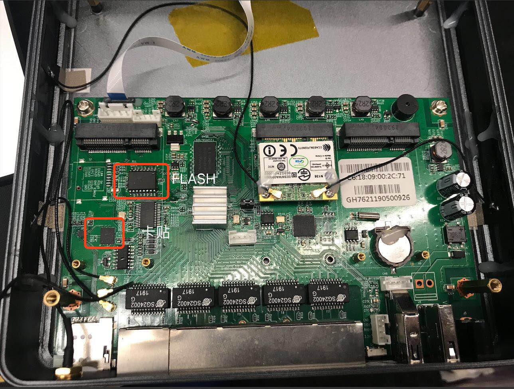{width="5.768055555555556in"
height="4.361805555555556in"}

刷机流程
========

1.  所有操作在windows上完成

2.  将设备的console口通过串口线与电脑连接，将lan口通过网线与电脑连接

3.  将电脑的IP地址设为固定IP:192.168.128.10,不要设置网关

4.  通过windows的设备管理理器器查看串口的编号地址，一般为COM3（查看硬件设备可获知）

5.  使用putty连接设备的串口连接

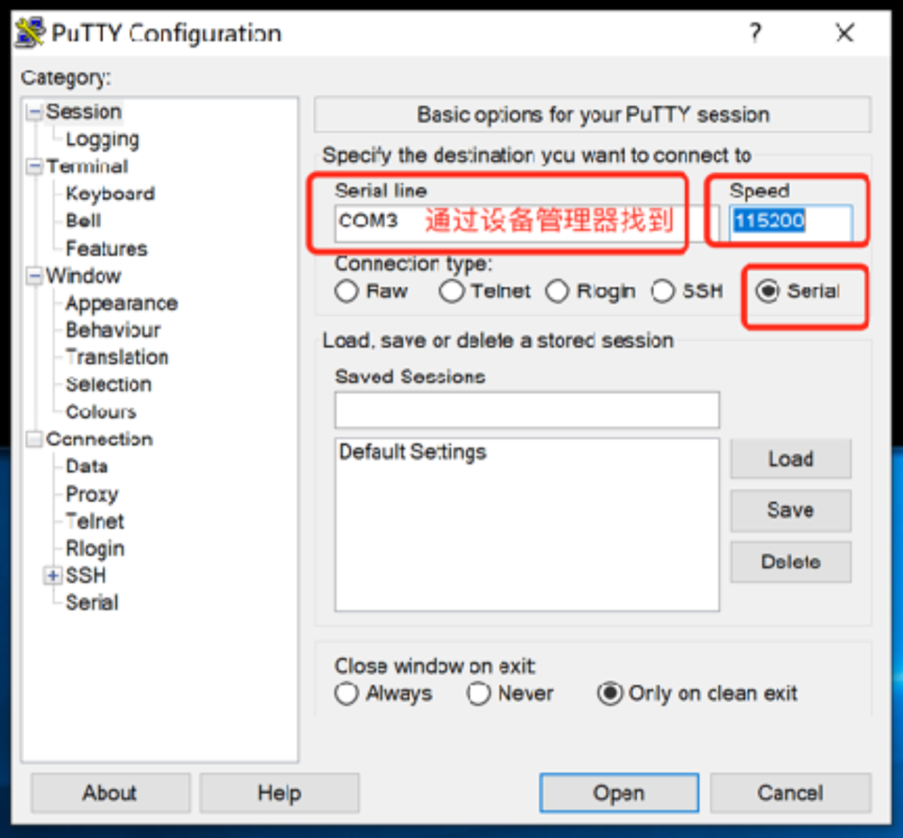{width="5.768055555555556in"
height="5.348611111111111in"}

6.  开启TFTP服务，设置IP和固件存放的目录

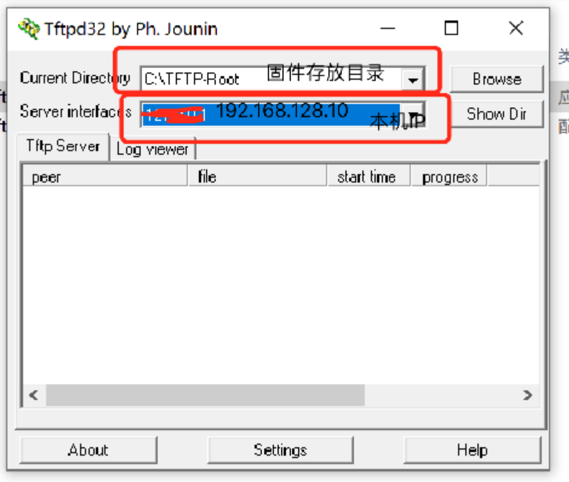{width="5.768055555555556in"
height="4.884722222222222in"}

7.  将设备断电重连，会在putty看到设备启动时候的日志，当出现数字选项时(0-9的数
    字)，快速输入9(快速输⼊入防⽌止⾃自动进⼊入默认的选项，9对应的应该是:Load
    U-Boot code then write to Flash via
    TFTP，以实际的显示为准)，回车，输入IP填
    192.168.128.1，输出IP填192.168.128.10，然后输入uboot固件的名称(与固件存放目
    录下的⽂文件名保持一致)。回车后开始刷uboot。

8.  uboot刷成功以后设备会⾃自动重启，再次进⼊入数字选项时输入4，回车进入命令模式，此时输入"erase
    linux"命令，擦出旧版本的系统，命令会处理理一段时间，处理完成后执行reset命令。

9.  重新启动后进入数字选项阶段，此时输入2选项"Load system code then
    write to Flash via
    TFTP"。操作步骤与刷入uboot相同，只有最后一步的⽂文件名需要改为系统固件的的名称

10. 刷机操作需要执行行几分钟，此后不不需要在做其他操作，putty会一直显示设备的操作日志。刷机完成后会进入默认选项，默认选项是启动系统，此时会显示设备启动的相关信
    息，包含4G模块，wifi状态及wan口lan口状态，等待一会日志不在刷新时，按回车进入新的系统。出现下图代表刷机成功

附件
----

Uboot刷完后配置参数
-------------------

ETH\_STATE\_ACTIVE!!

\*\*\* ERROR: \`ethaddr\' not set

刷完uboot后可能会报上面的错误，这是需要设置相关参数

1.  重新上电

2.  选择4 enter boot command line interface

3.  执行erase linux 擦除原系统

4.  执行setenv ethaddr "00:0c:43:0a:0b:0d"

5.  执行saveenv保存

6.  执行reset重启

刷看门狗
========

1.  设备先不上电，并且用串口连接看门狗的串口，并按上跳帽

 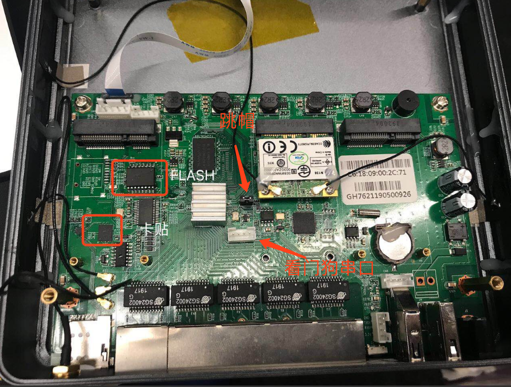{width="5.768055555555556in"
 height="4.368055555555555in"}

2.  先按照下图进行配置

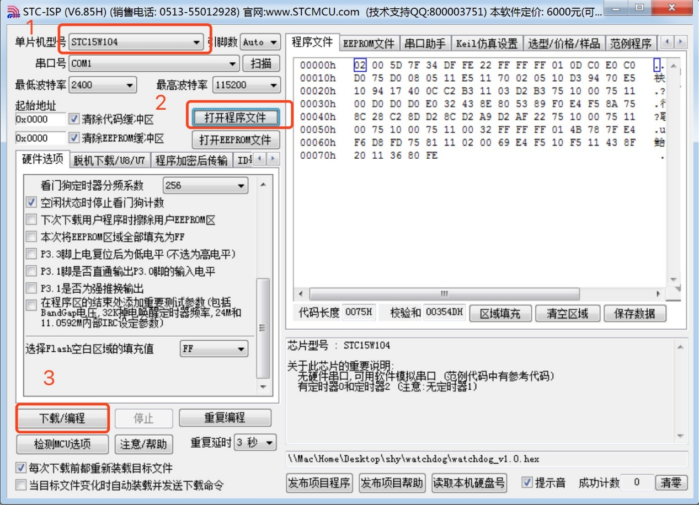{width="5.768055555555556in"
height="4.156944444444444in"}

3.  上电

附件中的pro\_1726\_2.hex设定时间为50秒，需要持续喂狗，50秒没有收到信息设备将会重启

附件
----
