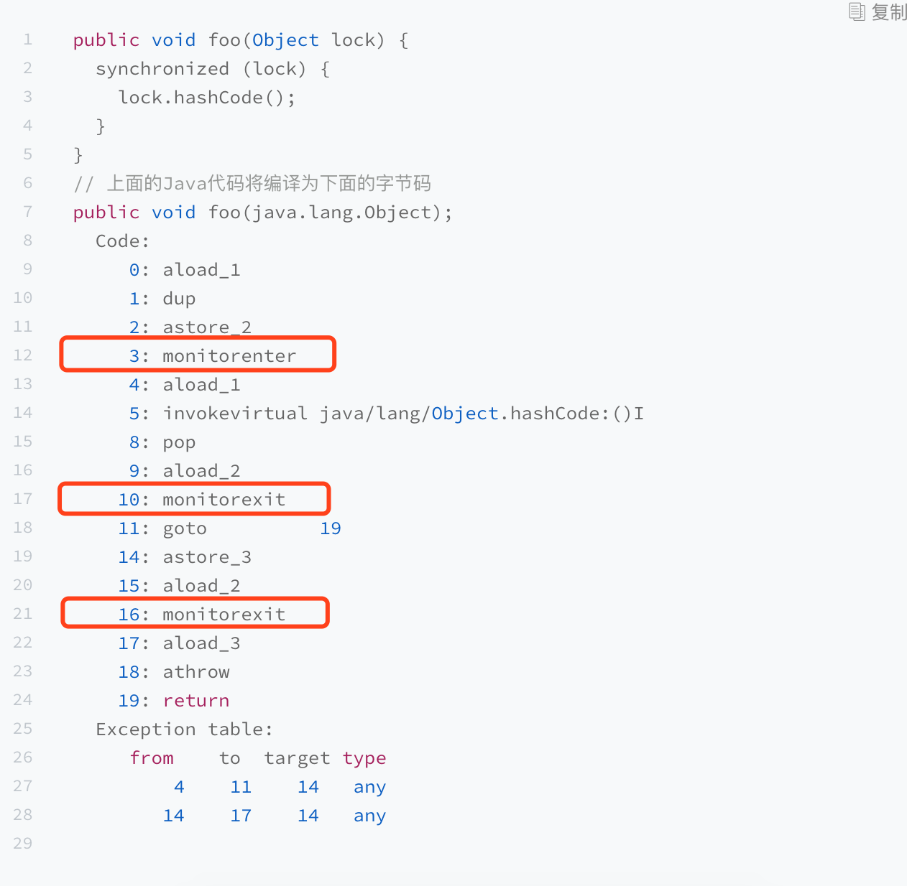

 锁的实现
---------

### Synchronized

当声明 synchronized 代码块时，编译而成的字节码将包含 monitorenter 和 monitorexit
指令。这两种指令均会消耗操作数栈上的一个引用类型的元素（也就是 synchronized
关键字括号里的引用），作为所要加锁解锁的锁对象。

为了保证正常和异常都能够释放锁，所以在在正常异常退出之前都增加了monitorexit。

当用 synchronized 标记方法时，你会看到字节码中方法的访问标记包括
ACC_SYNCHRONIZED。该标记表示在进入该方法时，Java 虚拟机需要进行 monitorenter
操作。而在退出该方法时，不管是正常返回，还是向调用者抛异常，Java
虚拟机均需要进行 monitorexit 操作。

关于 monitorenter 和 monitorexit
的作用，我们可以抽象地理解为每个锁对象拥有一个锁计数器和一个指向持有该锁的线程的指针。

当执行monitorenter时，如果目标锁对象计数器为0，那么就说明没有被其他线程持有，JVM会将锁对象持有线程的指针指向当前线程，并将计数器加1。

如果发现锁对象不为0，并且指针指向当前线程，表示当前线程持有锁，那就将计数器加1，就是可重入锁。当monitorexit的时候，再减1，减到0之后就释放了锁。

如果发现锁对象不为0，并且指针不是指向当前线程，那就进行阻塞等待。

Java的线程加锁阻塞和唤醒都是依靠操作系统完成的（重量级锁）。对于符合posix接口的操作系统，上述操作时通过pthread的互斥锁mutex来实现，并且涉及到系统用户态和内核态的切换，开销十分大。

所以JVM做了很多优化，防止直接进入重量级锁。例如自旋锁、偏向锁、轻量级锁。

### 自旋锁

为了尽量避免昂贵的重量级锁操作，JVM会在线程进入阻塞状态之前，以及被唤醒后竞争不到锁的情况下，进入自旋状态，在处理器上空跑并且轮询锁是否被释放。如果此时锁恰好被释放了，那么当前线程便无须进入阻塞状态，而是直接获得这把锁。

自旋的优点是解决了重量级锁的问题，但是缺点就是cpu空转也浪费了cpu，如果长时间自旋也是得不偿失，所以可以JDK1.6之后默认自旋10次（-XX:PreBlockSpin=10），如果还是无法获得锁，将回归到重量级锁。

### 轻量级锁

JVM存在着类似的情形：多个线程在不同的时间段请求同一把锁，也就是说没有锁竞争。针对这种情形，JVM采用了轻量级锁，来避免重量级锁的阻塞以及唤醒。

在对象的对象头中的标记字段（mark
word）。它的最后两位便被用来表示该对象的锁状态。其中，00 代表轻量级锁，01
代表无锁（或偏向锁），10 代表重量级锁，11 则跟垃圾回收算法的标记有关。

当进行加锁操作时，JVM会判断是否是已经重量级锁。如果不是，他会在当前线程的当前栈帧划出一个空间，作为锁的记录，并将锁对象标记字段复制到该锁记录中。然后JVM尝试CAS替换锁对象标记字段。

假设当前锁对象的标记字段为 X…XYZ，JVM就会比较该字段是否为
X…X01(无锁)。如果是，则替换为刚才分配的锁记录的地址。该线程成功获得这把锁。

如果不是 X…X01（无锁），那么有两种可能。

-   该线程重复获取同一把锁。此时，Java
    虚拟机会将锁记录插入一个值为0的记录，以代表该锁被重复获取。

-   第二，其他线程持有该锁。此时，JVM会将这把锁膨胀为重量级锁，并且阻塞当前线程。

当进行解锁操作时，如果当前锁记录的值为
0，则代表重复进入同一把锁，直接返回即可。否则，JVM会尝试用 CAS
操作，比较锁对象的标记字段的值是否为当前锁记录的地址。

-   如果是，则表示当前线程持有锁，就将锁对象的标记字段则替换为锁记录中的值，也就是锁对象原本的标记字段。此时，该线程已经成功释放这把锁。

-   如果不是，则意味着这把锁已经被膨胀为重量级锁。此时，JVM就会进入重量级锁的释放过程，唤醒因竞争该锁而被阻塞了的线程。

### 锁膨胀问题

Java6为了减少获得锁和释放锁带来的性能消耗，引入了偏向锁、轻量级锁，Java6中锁就有4个状态：无锁、偏向锁、轻量级锁和重量级锁。这几个状态会随着竞争情况逐渐升级，锁可以升级但是不能降级。

<https://www.zhihu.com/question/53826114>
