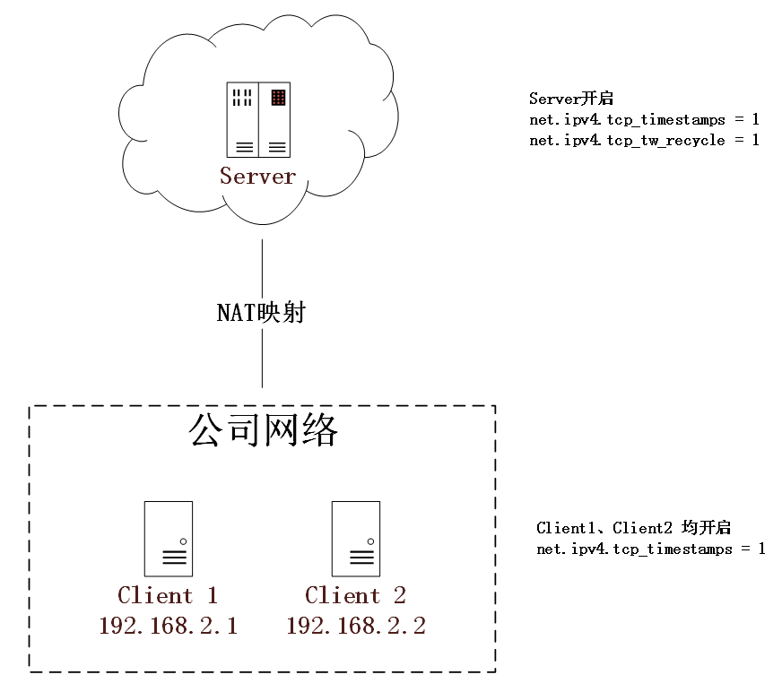
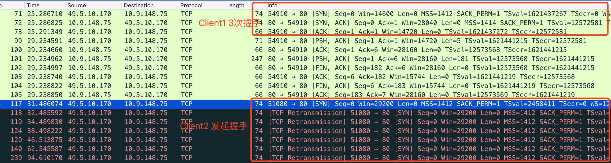
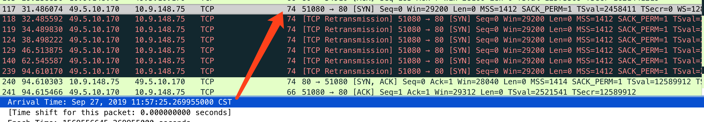
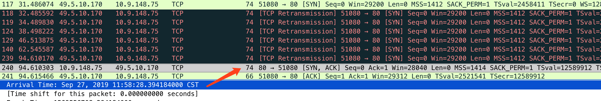
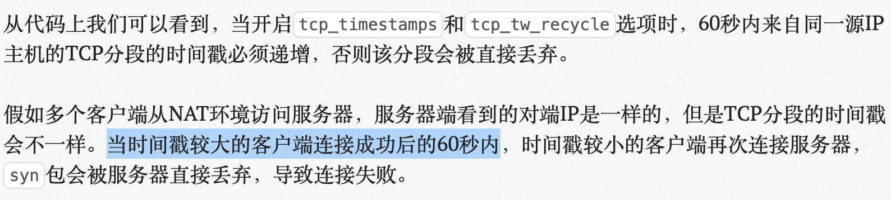
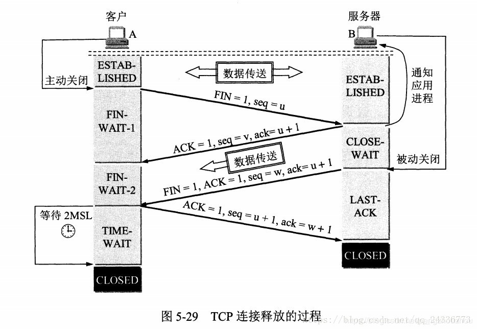

问题描述
========

两台内网机器，通过NAT映射访问一台公网服务器，公网服务器同时开启了tcp\_tw\_recycle和tcp\_timestamps。

{width="4.327160979877515in"
height="3.8306780402449694in"}

将会导致Client1 和 Client2
请求Server服务器时，其中一台（例如Client2）服务器会出现间歇性的连接不上。

通过在Server上抓包发现，Client1、Client2发送的请求均被Server收到，造成Client2连接不上的现象的原因是因为Server将Client2的SYN包收到后没有选择回复ACK，与Client2建立TCP，而是直接丢弃了。

{width="5.768055555555556in" height="1.55in"}

Google一下"tcp\_timestamps问题"或者"tcp\_tw\_recycle问题"，其实直接就能知道大概出了什么问题：

由于client1、client2都开启tcp\_timestamps，server开启了tcp\_timestampls、tcp\_tw\_recycle，导致了服务端会指挥收同一个IP，时间戳（TSval）较之前更大、递增的连接，否则将会把TSval值小的包当作旧包直接丢弃。

然而又因为TSval的值是每台机器根据系统启动而来计算的，所以必然Client1和Client2是不一样的。如果TSval大的先连接成功，TSval小的再连接就连接不上了。

解决方案：

Server端关闭tcp\_tw\_recycle即可。方法如下:

## 编辑sysctl.conf 修改配置或删除配置
## 该配置默认为0
## vi /etc/sysctl.conf
net.ipv4.tcp_timestamps = 0
## 使配置生效
sysctl -p


Timestamps计算：<https://www.cnblogs.com/good90/p/3911110.html>

其他思考
========

以上描述基本就是网上"快餐版"问题描述以及解决方案了，按照上面的操作即可解决问题，但是有些细节还是值得人思考的。

丢弃条件是什么？
----------------

不论是问题描述还是测试过程中都会发现，是"时不时"连接不上，并不是小的那台机器所有的SYN不能连接。

{width="5.768055555555556in"
height="1.0083333333333333in"}

{width="5.768055555555556in"
height="0.9736111111111111in"}

通过测试也能发现当11:57:25的时候发起SYN，期间server没有回包，client2重试了6次，在11:58:28的时候，server回复了ACK包，随后握手成功。再次连接成功间隔约63秒。

也就是TSval小的client 2 还是有机会连接成功的，并不是全部丢弃。

那么丢弃条件是什么呢？

Linux源码net/ipv4/tcp\_input.c的tcp\_v4\_conn\_request方法中有如下描述：

/* VJ's idea. We save last timestamp seen
     * from the destination in peer table, when entering
     * state TIME-WAIT, and check against it before
     * accepting new connection request.
     *
     * If "isn" is not zero, this request hit alive
     * timewait bucket, so that all the necessary checks
     * are made in the function processing timewait state.
     */
    if (tmp_opt.saw_tstamp &&
        tcp_death_row.sysctl_tw_recycle &&
        (dst = inet_csk_route_req(sk, req)) != NULL &&
        (peer = rt_get_peer((struct rtable *)dst)) != NULL &&
        peer-v4daddr == saddr) {
        if (get_seconds() < peer-tcp_ts_stamp + TCP_PAWS_MSL &&
            (s32)(peer-tcp_ts - req-ts_recent) 
                        TCP_PAWS_WINDOW) {
            NET_INC_STATS_BH(sock_net(sk), LINUX_MIB_PAWSPASSIVEREJECTED);
            goto drop_and_release;
        }
    }



#define TCP_PAWS_MSL    60      /* Per-host timestamps are invalidated
                     * after this time. It should be equal
                     * (or greater than) TCP_TIMEWAIT_LEN
                     * to provide reliability equal to one
                     * provided by timewait state.
                     */
#define TCP_PAWS_WINDOW 1       /* Replay window for per-host
                     * timestamps. It must be less than
                     * minimal timewait lifetime.
                     */


借用网络上的描述：

{width="5.768055555555556in"
height="1.3006944444444444in"}

网络文章：

<http://www.just4coding.com/blog/2017/11/09/timewait/>

<https://www.cnblogs.com/jdonson/p/4760130.html>

TSval大的成功后60秒，小的都不能连接？
-------------------------------------

通过以上描述对具体的原因也应该有了大致的理解了，但是在实际测试过程中，发现并不是只要TSVal大的连接连上后，TSval小的就连接不上。Server端起的nginx服务，分别使用curl和telnet，具体表现并不相同。

Client1 TSval 值比Client2的大。

使用curl测试情况如下:

1.  使用curl，无论client端谁先请求，推出都不会出现连接失败

使用telnet测试情况如下:

1.  同时使用Client1 Client2 进行telnet，均能连接成功

2.  Client 2 telnet连接成功后退出，Client1再连接，Client1连接成功

3.  Client 1 telnet连接成功后退出，Client2再连接，Client2连接失败

所以发现只有当telnet时间戳大的一方连接成功并且退出才会出现问题，并不是文章中描述的只要TSval大的连接成功后，TSval小的就连接失败。那原因是什么呢？

通过抓包可发现telnet关闭时，并不是client发起了四次挥手，而是server。并且telnet也给了相应的提示：


 [root\@automatic ~]# telnet 117.*.*.154 80 
 Trying 117.*.*.154..                         
 Connected to 117.*.*.154.                      
 Escape character is '^]'.                        
 ^C Connection closed by foreign host.                


{width="4.617835739282589in"
height="3.19371719160105in"}

和curl不同，curl是client发起了FIN，而telnet是server发起了FIN，只有发起方才会进入TIME\_WAIT状态，结合之前的源码上的注释，60秒范围的起始时间并不是上个连接成功的时间，而是TIME\_WAIT产生的时间。

服务器会拿到这个时间，和后续的连接请求发起比较，如果请求与上次的TIME\_WAIT间隔在60秒之内，并且timestamp还比上次的小，那么这个包将直接丢弃。


VJ\'s idea. We save last timestamp seen from the destination 
in peer table, when entering state TIME-WAIT, and check 
against it before accepting new connection request.


所以需要注意的是比较的时间是上次服务端的TIME\_WAIT发生的时间，而不是建立连接成功的时间。

其他：

1.  Server主动断开会产生TIME\_WAIT连接，通常可以通过netstat -n -t
    查看，但是可能很难看到，因为tcp\_tw\_recycle就是为了快速回收TIME\_WAIT的连接的。

2.  上面的示例（<http://www.just4coding.com/blog/2017/11/09/timewait/>）文章做测试的时候，将nginx的keepalive关闭，让server上的nginx主动断开，所以curl也能复现，但实际使用nginx不会这么用，带来了一定的误解。

其他
====

-   tcp\_tw\_recycle 已经不建议使用，4.12内核中被移除

-   客户端和服务端必须开启tw\_timestamp才会出现这种情况

引用文章
========

<https://blog.csdn.net/pengzhouzhou/article/details/85229437>

<https://git.kernel.org/pub/scm/linux/kernel/git/torvalds/linux.git/commit/?id=4396e46187ca5070219b81773c4e65088dac50cc>

<https://www.cnblogs.com/good90/p/3911110.html>
<https://www.iteye.com/blog/elf8848-2089414>
<https://www.cnblogs.com/10087622blog/p/11017455.html>
<https://www.cnblogs.com/jdonson/p/4760130.html>
<https://blog.51cto.com/fuyuan2016/1795998>
