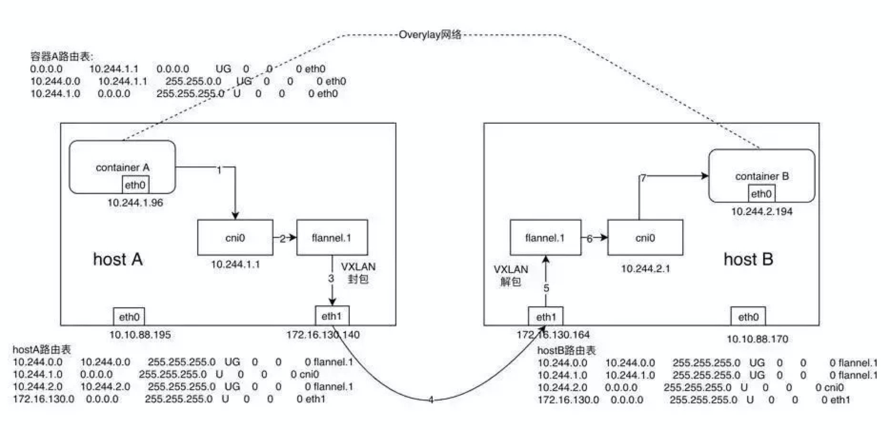
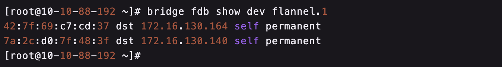
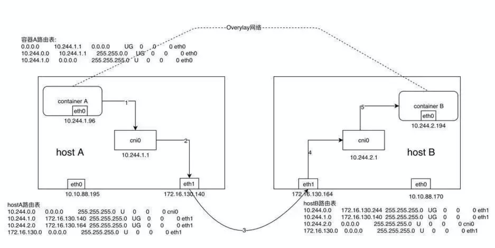
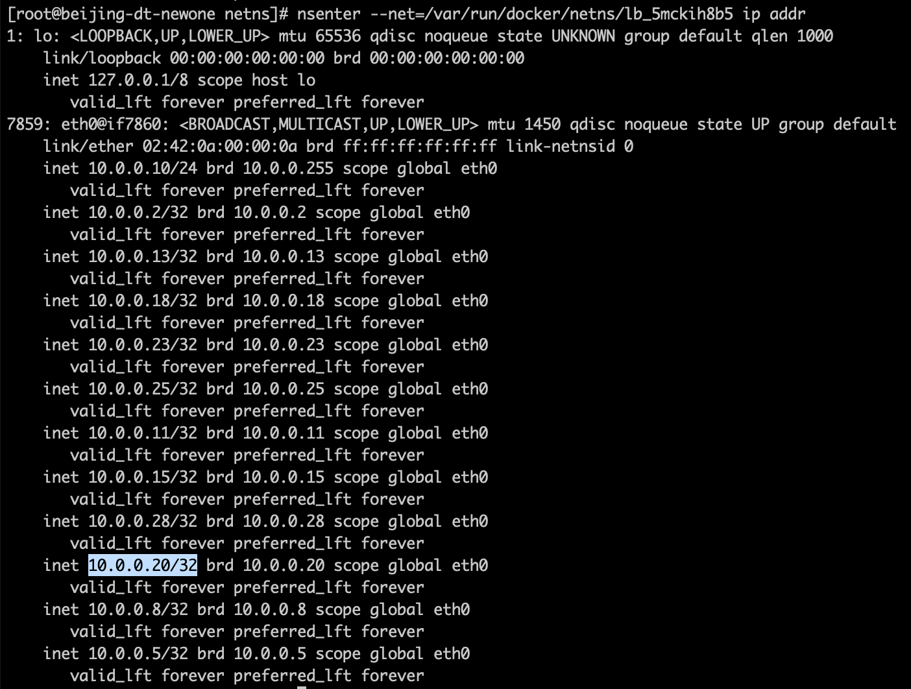
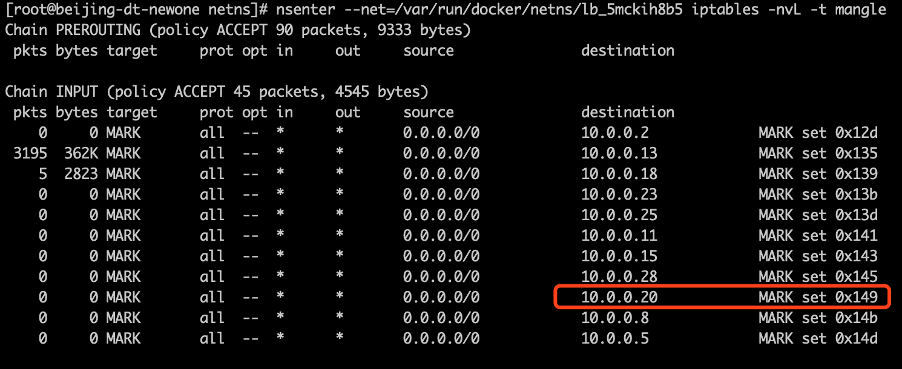
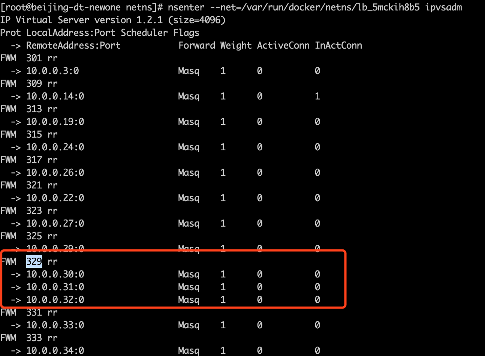
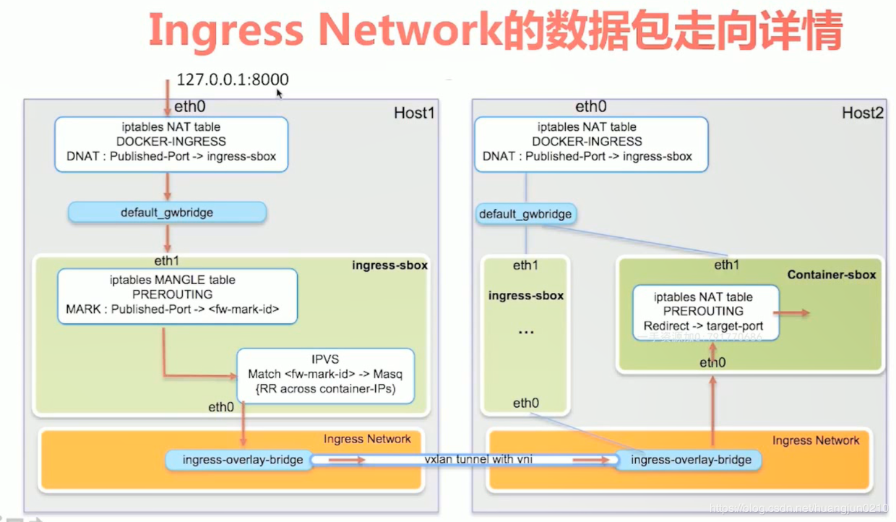

Docker网络

Flannel
=======

Flannel通过在每一个节点上启动一个叫flanneld的进程，负责每一个节点上的子网划分，并将相关的配置信息如各个节点的子网网段、外部IP等保存到etcd当中，而具体的网络包转发交给具体的Backend来实现。

flanneld可以在启动的时候通过配置文件来指定不同的Backend来进行网络通信，目前比较成熟的Backend有VXLAN、host-gw以及UDP三种方式，也已经有诸如AWS，GCE
and
AliVPC这些还在实验阶段的Backend。VXLAN是目前官方最推崇的一种Backend实现方式，host-gw一般用于对网络性能要求比较高的场景，但需要基础架构本身的支持，UDP则一般用于Debug和一些比较老的不支持VXLAN的Linux内核。

UDP
---

{width="5.768055555555556in"
height="2.8777777777777778in"}

假设在节点A上有容器A（10.244.1.96），在节点B上有容器B（10.244.2.194），此时容器A向容器发送一个ICMP请求报文（ping），我们来逐步分析一下ICMP报文是如何从容器A到达容器B的。

当采用UDP模式时，flanneld进程在启动时会通过打开/dev/net/tun的方式生成一个TUN设备，TUN设备可以简单理解为Linux当中提供的一种内核网络与用户空间（应用程序）通信的一种机制，即应用可以通过直接读写tun设备的方式收发RAW
IP包。

flanneld进程会对flannel0进行监听，会持续的从flannel0中poll数据，当有数据时会通过udp数据封装，并进行数据发送。

1.  容器A当中发出ICMP请求报文，通过IP封装后形式为：10.244.1.96 -\
    10.244.2.194，此时通过容器A内的路由表匹配到应该将IP包发送到网关10.244.1.1（cni0网桥）。

2.  此时到达cni0的IP包目的地IP
    10.244.2.194匹配到节点A上第一条路由规则（10.244.0.0），内核将RAW
    IP包发送给flannel0接口。

3.  flannel0为tun设备，发送给flannel0接口的RAW
    IP包（无MAC信息）将被flanneld进程接收到，flanneld进程接收到RAW
    IP包后在原有的基础上进行UDP封包，UDP封包的形式为：172.16.130.140:src
    port -\ 172.16.130.164:8285。

4.  flanneld将封装好的UDP报文经eth1发出，从这里可以看出网络包在通过eth1发出前先是加上了UDP头（8个字节），再然后加上了IP头（20个字节）进行封装，这也是为什么flannel0的MTU要比eth1的MTU小28个字节的原因（防止封装后的以太网帧超过eth1的MTU而在经过eth1时被丢弃）。

5.  网络包经节点A和节点B之间的网络连接到达host B

6.  host
    B收到UDP报文后经Linux内核通过UDP端口号8285将包交给正在监听的应用flanneld

7.  运行在host B当中的flanneld将UDP包解包后得到RAW IP包：10.244.1.96 -\
    10.244.2.194

8.  解封后的RAW IP包匹配到host B上的路由规则（10.244.2.0），内核将RAW
    IP包发送到cni0

9.  cni0将IP包转发给连接在cni0网桥上的container B

VXLAN
-----

{width="5.768055555555556in"
height="2.7916666666666665in"}

1.  同UDP Backend模式，容器A当中的IP包通过容器A内的路由表被发送到cni0

2.  到达cni0当中的IP包通过匹配host
    A当中的路由表（route）发现通往10.244.2.194的IP包应该交给flannel.1接口

3.  flannel.1作为一个VTEP设备，收到报文后将按照VTEP的配置进行封包，首先通过etcd得知10.244.2.194属于节点B，并得到节点B的IP，通过节点A当中的转发表(FDB)得到节点B对应的VTEP的MAC，根据flannel.1设备创建时的设置的参数（VNI、local
    IP、Port）进行VXLAN封包

4.  通过host A跟host B之间的网络连接，VXLAN包到达host B的eth1接口

5.  通过端口8472，VXLAN包被转发给VTEP设备flannel.1进行解包

6.  解封装后的IP包匹配host
    B当中的路由表（10.244.2.0），内核将IP包转发给cni0

7.  cni0将IP包转发给连接在cni0上的容器B

VXLAN替代了UDP模式下的程序封包处理，在内核中进行数据包的处理。当hostA的flannel.1要向hostB
的flannel.1发送数据时，会先ARP探测，HostB回应后记录到fdb中，当下次再进行向HostB的flannel.1发送消息时，会直接确定ip。例如CD:37为HostB的flannel.1的MAC地址，VXLAN是三层实现二层协议，构建的数据包通过MAC通讯。

{width="5.768055555555556in"
height="0.7784722222222222in"}

<http://www.just4coding.com/blog/2017/05/21/vxlan/>

HOST-GW
-------

{width="5.768055555555556in"
height="2.8993055555555554in"}

1.  同UDP、VXLAN模式一致，通过容器A的路由表IP包到达cni0

2.  到达cni0的IP包匹配到host
    A当中的路由规则（10.244.2.0），并且网关为172.16.130.164，即host
    B，所以内核将IP包发送给host B（172.16.130.164）

3.  IP包通过物理网络到达host B的eth1

4.  到达host B eth1的IP包匹配到host
    B当中的路由表（10.244.2.0），IP包被转发给cni0

5.  cni0将IP包转发给连接在cni0上的容器B

采用host-gw模式后flanneld的唯一作用就是负责主机上路由表的动态更新。

host-gw模式其中一个局限性就是，由于是通过节点上的路由表来实现各个节点之间的跨节点网络通信，那么就得保证两个节点是可以直接路由过去的。按照内核当中的路由规则，网关必须在跟主机当中至少一个IP处于同一网段，故造成的结果就是采用host-gw这种Backend方式时则集群中所有的节点必须处于同一个网络当中，这对于集群规模比较大时需要对节点进行网段划分的话会存在一定的局限性。另外一个则是随着集群当中节点规模的增大，flanneld需要维护主机上成千上万条路由表的动态更新也是一个不小的压力。

Docker Routing Mesh
===================

 Docker Swarm
------------

{width="5.768055555555556in"
height="2.5993055555555555in"}

Docker Swarm 为Docker 提供了集群服务，Swarm
集群的管理工作是由manager节点实现。如上图所示，manager节点实现的功能主要包括：node
discovery,scheduler,cluster管理等。同时，为了保证Manager
节点的高可用，Manager 节点需要时刻维护和保存当前 Swarm
集群中各个节点的一致性状态。Worker节点接收并执行从Manager节点分派的任务。默认情况下，Manager节点还将服务作为Worker节点运行，但也可以将它们配置为仅运行Manage任务。

 跨主机网络
----------

{width="5.768055555555556in"
height="4.4215277777777775in"}

所有的container都会接入到vxlan构建的br0网桥，组成一个局域网。

跨主机网络通过vxlan实现，下面以bjdt\_overlay为测试：

{width="5.768055555555556in"
height="1.4229166666666666in"}

通过执行以下命令，可以查看vxlan的id编号:


  --------------------------------------
  docker network inspect bjdt\_overlay
  --------------------------------------


{width="5.768055555555556in"
height="0.42430555555555555in"}

通过 docker stack
deploy构建出overlay后，可以通过查看network，获得network
id，例如5mckih8b5zq5，在相应的namespace目录下会生成一个以"1-"开头的namespace文件，/run/docker/netns/1-5mckih8b5zq5，通过nsenter
指令可进行该namespace的处理。可以看到编号为4097的vxlan已经生成。

{width="5.768055555555556in" height="1.8875in"}

通过 ip
addr可以看到，该namespace构建了一个ip为10.0.0.1的网桥，用于vxlan的通讯。在该overlay网络下，各个服务模块之间的通讯将会使用该网络的ip进行数据通讯。

{width="5.768055555555556in"
height="2.8986111111111112in"}

内部负载均衡
------------

以下描述为(docker stack
deploy模式下，单独启动servcie参考<https://anoyi.com/p/dba9342071d8> )

{width="5.768055555555556in"
height="2.9483792650918637in"}

Docker swarm 内部 service
的负载均衡默认是基于vip来实现的，例如当client请求多个web的时候，docker内部的DNS
server会解析出一个VIP。通过vip可以在client感知的情况下进行web的负载均衡。

如上图所示，具体实现：

1.  client通过内部的DSN server获得VIP，进行数据发送

2.  数据发往到vip，vip绑定到了一个loadbalance 的network sandbox的网卡中

3.  在该sandbox中，将会使用iptables
    对mangle表进行数据打标签，再通过ipvs进行数据转发

4.  最后走overlay网络到达实际容器进行业务处理

### 示例

以示例业务举例：

bjdt\_bjdt-dzwl-web
为web前端，后端业务为3个节点的bjdt\_bjdt-dzwl服务。他们都是基于bjdt\_overlay网络。

{width="5.768055555555556in"
height="1.4215277777777777in"}

通过以下指令可以看到服务的vip：


+-----------------------------------------------+
| docker service inspect bjdt\_bjdt-dzwl        | |
| \#\#\#\#\#输出内容\#\#\#\#\#\#\#\#            |
| \"VirtualIPs\": \[                            ||
| {                                             |
| \"NetworkID\": \"t17rqrj45unnb42hefovj68mh\", |
| \"Addr\": \"10.255.0.41/16\"                  |
| },                                            |
| {                                             |
| \"NetworkID\": \"5mckih8b5zq55feis4xheef5z\", |
| \"Addr\": \"10.0.0.20/24\"                    |
| }                                             |
| \]                                            |
+-----------------------------------------------+


使用docker stack
deploy后，系统会自动添加前缀为"lb\_"的负载namespace文件。

{width="5.768055555555556in"
height="3.6430555555555557in"}

在该namespace下通过执行ip addr 可以看到 bjdt\_bjdt-dzwl
的vip在该网卡下绑定。

{width="5.768055555555556in"
height="4.363194444444445in"}

通过iptables可以看到为目标地址为10.0.0.20的数据包添加了0X149(10进制为329)

{width="5.768055555555556in"
height="2.361111111111111in"}

通过ipvsadm可以看到对于有0X149标签的数据包会转发到以下三个ip中，而该三个ip分别为实际业务后台的ip地址。

{width="5.768055555555556in"
height="4.24375in"}

### 多负载

在一个我们实际业务场景中，会将一个stack部署在同一个overlay中，也可能会存在多个service，但是并不会产生多个loadbalance，而是统一会生成一个以"lb\_"为开头，后缀为overlay
id的network
namespace。而这个loadbalance负责了整个overlay网络的负载均衡。

 Routing Mesh
------------

Docker Swarm
的overlay网络解决了跨主机网络通讯的问题的同时，还提供了负载均衡。

以下面的图片示例：当请求负载到三台机器的任何一台机器，都会进行swarm load
balancer，即使请求到了没有实际应用的node3，swarm也会将数据负载到node2节点，完成业务处理。

{width="5.768055555555556in"
height="3.1595166229221348in"}

实际数据包的走向如下：

{width="5.768055555555556in"
height="3.3570253718285215in"}

1.  Host1的8000端口收到数据包后，通过iptables
    DNAT转发到ingress-sbox(network sandbox)

2.  Ingress-sbox使用iptables 进行打标签，并转发到vxlan组成的overlay网络

3.  请求通过overlay网络跨主机到达实际的处理容器

Routing mesh 和 业务overlay的网络组合如下：

{width="5.768055555555556in"
height="3.646311242344707in"}

可以简单的理解为：routing mesh（ingress
network）解决了服务在对外publish了端口之间的负载均衡，每个主机都会连接ingress
network，他负责将流量送达到前置服务。后续多个容器或服务之间的业务数据交换，将会在自定义的overlay网络进行网络包流转。

参考
====

<http://www.just4coding.com/blog/2017/05/21/vxlan/>

<https://jkzhao.github.io/2017/09/05/overlay%E5%AE%9E%E7%8E%B0%E5%AE%B9%E5%99%A8%E8%B7%A8%E4%B8%BB%E6%9C%BA%E9%80%9A%E4%BF%A1/>

<https://www.cnblogs.com/goldsunshine/p/10740928.html>

<https://blog.csdn.net/huangjun0210/article/details/86478157>

<http://blog.daocloud.io/docker1-12lb/>

<https://success.docker.com/article/ucp-service-discovery-swarm>

<https://zhoujinl.github.io/2018/09/20/docker-swarm-scheduler/>

<https://blog.51cto.com/jerry12356/2384159>

<https://mp.weixin.qq.com/s?__biz=MzIyMTUwMDMyOQ==&mid=2247492160&idx=1&sn=6ff4c4423f4834042e0ad3b476bafd9f&chksm=e8396486df4eed90bc1c401e2a20b070931e700b9e6f6931bdaf9820f3d0974fdac3cdf09c31&mpshare=1&scene=1&srcid=1014dpS7QNtyWCQ5uBg8fZXc&sharer_sharetime=1571068017820&sharer_shareid=5604a26ad45580769f078004811e0dc5&key=e224974e93afb4cc75358c6974746b3e9438b850e7120ca8338645c3298c01d5e11619cd726cb256c5983147aa2ec180fe77b69962fe6295a15e791f61c4ba4c4a18e46d56aa0b9ab4d318d81d1a4e7a&ascene=0&uin=NDEyMzAwMDgw&devicetype=iMac+MacBookPro12%2C1+OSX+OSX+10.15+build(19A583)&version=12020010&nettype=WIFI&lang=zh_CN&fontScale=100&pass_ticket=1PafF1oOL%2FoCfZqc5Sh0obHz6PGNO15q%2FGD4MvDPcv3pPTVOEXb5JOZ4vjFCbh8E>

问题
====

-   UDP模式，这里有一个问题就是flanneld怎么知道10.244.2.194这个容器到底是在哪个节点上呢？

 flanneld在启动时会将该节点的网络信息通过api-server保存到etcd当中，故在发送报文时可以通过查询etcd得到10.244.2.194这个容器的IP属于host
 B，且host B的IP为172.16.130.164。实现逻辑没有确认。

-   VXLAN的转发表作用

-   
