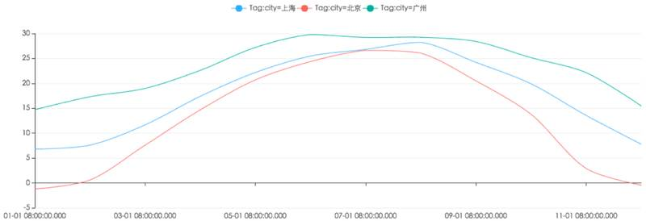
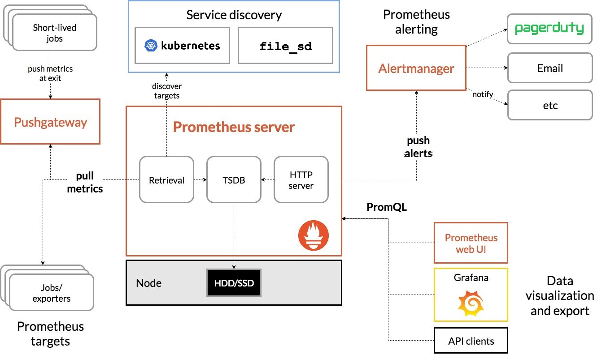
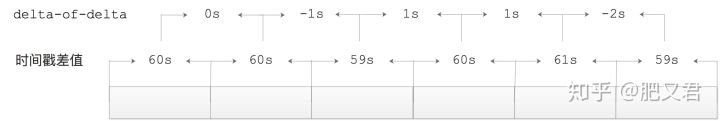
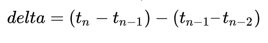
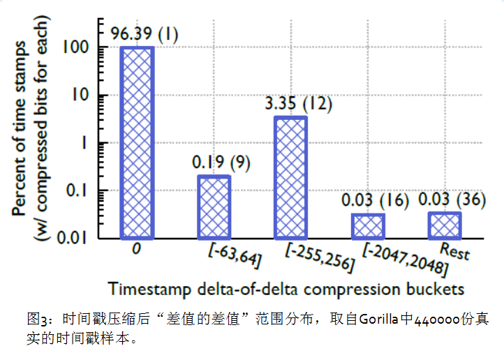
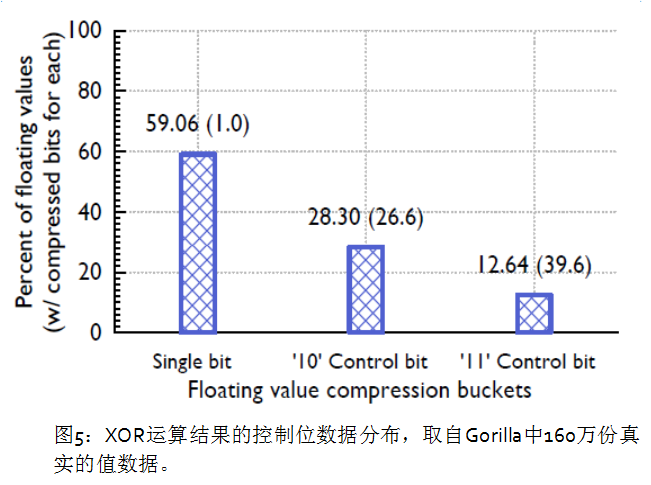
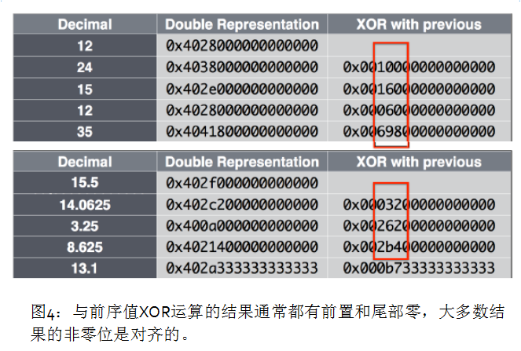
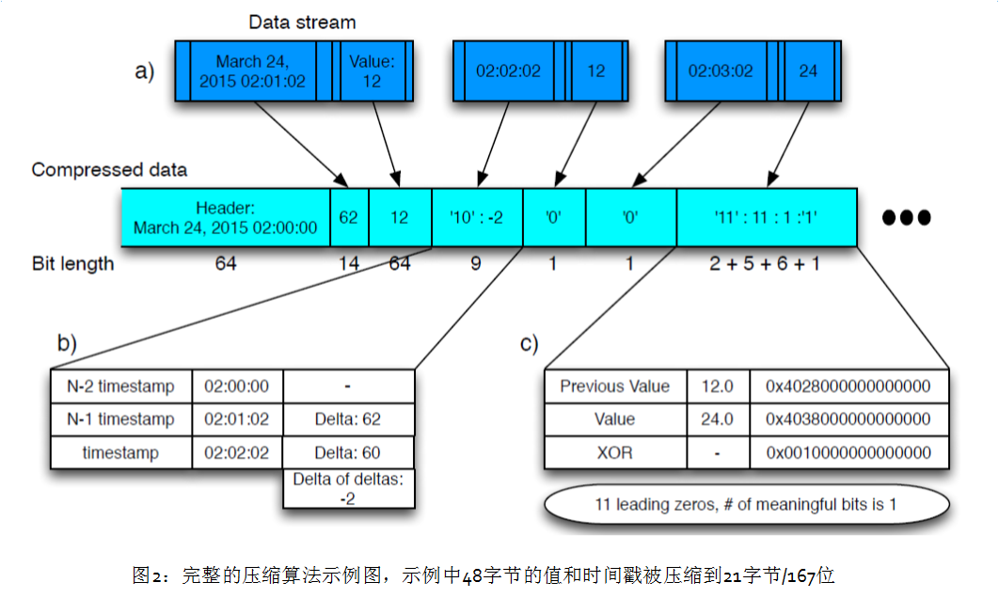
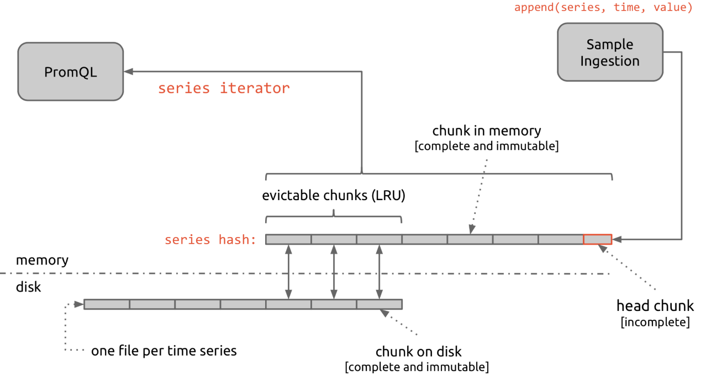
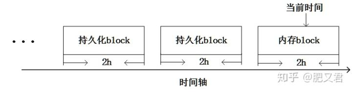

时序数据库
==========

时序数据是基于时间的一系列的数据。在有时间的坐标中将这些数据点连成线，往过去看可以做成多纬度报表，揭示其趋势性、规律性、异常性；往未来看可以做大数据分析，机器学习，实现预测和预警。

{width="5.768055555555556in"
height="1.9765201224846893in"}

时序数据库就是存放时序数据的数据库，并且需要支持时序数据的快速写入、持久化、多纬度的聚合查询等基本功能。

特点
----

-   数据模式： 时序数据随时间增长，相同维度重复取值，指标平滑变化。

-   写入：
    持续高并发写入，无更新操作：时序数据库面对的往往是百万甚至千万数量级终端设备的实时数据写入（如摩拜单车2017年全国车辆数为千万级），但数据大多表征设备状态，写入后不会更新。

-   查询：
    按不同维度对指标进行统计分析，且存在明显的冷热数据，一般只会频繁查询近期数据。

传统数据库的问题
----------------

很多人可能认为在传统关系型数据库上加上时间戳一列就能作为时序数据库。数据量少的时候确实也没问题。但时序数据往往是由百万级甚至千万级终端设备产生的，写入并发量比较高，属于海量数据场景。

MySQL在海量的时序数据场景下存在如下问题：

-   存储成本大：对于时序数据压缩不佳，需占用大量机器资源；

-   维护成本高：单机系统，需要在上层人工的分库分表，维护成本高；

-   写入吞吐低：单机写入吞吐低，很难满足时序数据千万级的写入压力；

-   查询性能差：适用于交易处理，海量数据的聚合分析性能差。

另外，使用Hadoop生态（Hadoop、Spark等）存储时序数据会有以下问题：

-   数据延迟高：离线批处理系统，数据从产生到可分析，耗时数小时、甚至天级；

-   查询性能差：不能很好的利用索引，依赖MapReduce任务，查询耗时一般在分钟级。

可以看到时序数据库需要解决以下几个问题：

-   时序数据的写入：如何支持每秒钟上千万上亿数据点的写入。

-   时序数据的读取：如何支持在秒级对上亿数据的分组聚合运算。

-   成本敏感：由海量数据存储带来的是成本问题。如何更低成本的存储这些数据，将成为时序数据库需要解决的重中之重。

概况
====

Prometheus 是由前 Google 工程师从 2012 年开始在 Soundcloud
以开源软件的形式进行研发的系统监控和告警工具包，自此以后，许多公司和组织都采用了
Prometheus 作为监控告警工具。Prometheus
的开发者和用户社区非常活跃，它现在是一个独立的开源项目，可以独立于任何公司进行维护。为了证明这一点，Prometheus
于 2016 年 5 月加入 CNCF 基金会，成为继 Kubernetes 之后的第二个 CNCF
托管项目。

优势
----

Prometheus 的主要优势有：

-   由指标名称和和键/值对标签标识的时间序列数据组成的多维数据模型。

-   强大的查询语言 PromQL。

-   不依赖分布式存储；单个服务节点具有自治能力。

-   时间序列数据是服务端通过 HTTP 协议主动拉取获得的。

-   也可以通过中间网关来推送时间序列数据。

-   可以通过静态配置文件或服务发现来获取监控目标。

-   支持多种类型的图表和仪表盘。

架构
----

{width="5.768055555555556in"
height="3.4635662729658794in"}

Prometheus Server
直接从监控目标中或者间接通过推送网关来拉取监控指标，它在本地存储所有抓取到的样本数据，并对此数据执行一系列规则，以汇总和记录现有数据的新时间序列或生成告警。可以通过
Grafana 或者其他工具来实现监控数据的可视化。

Prometheus 生态系统由多个组件组成，其中有许多组件是可选的：

-   Prometheus Server 作为服务端，用来存储时间序列数据。

-   客户端库用来检测应用程序代码。

-   用于支持临时任务的推送网关。

-   Exporter 用来监控 HAProxy，StatsD，Graphite 等特殊的监控目标，并向
    Prometheus 提供标准格式的监控样本数据。

-   alartmanager 用来处理告警。

适用场景
--------

Prometheus
适用于记录文本格式的时间序列，它既适用于以机器为中心的监控，也适用于高度动态的面向服务架构的监控。在微服务的世界中，它对多维数据收集和查询的支持有特殊优势。Prometheus
是专为提高系统可靠性而设计的，它可以在断电期间快速诊断问题，每个
Prometheus Server
都是相互独立的，不依赖于网络存储或其他远程服务。当基础架构出现故障时，你可以通过
Prometheus 快速定位故障点，而且不会消耗大量的基础架构资源。

不适用场景
----------

Prometheus
非常重视可靠性，即使在出现故障的情况下，你也可以随时查看有关系统的可用统计信息。如果你需要百分之百的准确度，例如按请求数量计费，那么
Prometheus
不太适合你，因为它收集的数据可能不够详细完整。这种情况下，你最好使用其他系统来收集和分析数据以进行计费，并使用
Prometheus 来监控系统的其余部分。

存储结构
========

Prometheus 1.0之前重度依赖LevelDB（V2版本存储实现），Prometheus
2.0版本之后，推出了V3版本存储实现，也就是这里要介绍的Prometheus
TSDB项目。Prometheus
TSDB的写入性能异常出众，在其原理博客中提到Prometheus
TSDB在单机上可以支撑每秒百万级时序点的写入。

Facebook Gorilla简介
--------------------

Prometheus TSDB实现参考了Facebook 2015年发表的论文《Gorilla: A Fast,
Scalable, In-Memory Time Series
DataBase》（http://citeseerx.ist.psu.edu/viewdoc/download?doi=10.1.1.718.197&rep=rep1&type=pdf），其中详细介绍了Gorilla时序数据库的原理，英文阅读吃力的读者可以参考一些翻译文章（<https://yq.aliyun.com/articles/72871）。

在时序场景中，每个时序点的核心本质是一对64位的值，一个表示该点的timestamp，另一个表示该点的value值。Prometheus
TSDB借鉴了Facebook Gorilla论文的压缩方式：

-   delta-of-delta方式压缩timestamp

-   XOR压缩时序点的value值

时间序列压缩
------------

在时序场景中，每条时序中的每个时序点都有一个对应的timestamp，一条时序中相邻时序点间隔是有规律，例如秒级、分钟级别。这样，相邻两点的timestamp差值是固定的。

Facebook
Gorill的相关论文中提出了delta-of-delta（差值的差值）压缩timestamp的方式，下面具体来看delta-of-delta时间戳压缩方式是什么含义。

由于网络延迟等原因，可能某两个时序点的timestamp差值会略大或略小于60秒。假设该实例中相邻时序点之间的timestamp差值分别为60、60、59、60、61、59，dod（delta-of-delta）就是用当前timestamp差值减去前一个timestamp差值得到的差值，那么得出的dod（delta-of-delta）为0、-1、1、1、-2，如图2-1所示：

{width="5.768055555555556in"
height="0.9698873578302712in"}

Prometheus TSDB对这些dod值（delta-of-delta）的变长编码规则如下：

-   在存储时序的第一个数据点的时间戳t0时，会将其完整的存储起来。

-   在存储时序第二个数据点对应的时间戳t1时，实际上存储的是t1-t0这个差值。

-   对于后续的时间戳tn，首先会计算dod（delta-of-delta）值：

 {width="3.805751312335958in"
 height="0.6111428258967629in"}

-   如果dod值为0，则使用一个单独的bit存储一个"0"。

-   如果dod值在\[-8191,
    8192\]范围中，则存储"10"这两位作为标识，然后使用14个bit位存储该dod值。

-   如果dod值在\[-65535,
    65536\]范围中，则存储"110"这三位作为标识，然后使用17个bit位存储该dod值。

-   如果dod值在\[-524287,
    524288\]范围中，则存储"1110"这四位作为标识，然后使用20个bit位存储该dod值。

-   如果dod值超出了上述返回，则存储"1111"这四位作为标识，然后使用64个bit位存储该dod值。

下图展示了Gorilla中时间戳最终值的分布情况，大约96%的timestamp能够按照dod值为0的条件分支进行存储，这样就可以大大减少timestamp的存储所占的空间以及IO。

{width="5.768055555555556in"
height="4.042750437445319in"}

值压缩
------

在很多监控场景中，同一条时序中相邻时序点的value值不会发生明显变化。时序点的value值大都是浮点类型，当两个value值非常接近的时候，这两个浮点数的符号位、指数位和尾数部分的前几位都是完全相同的，这一点也是Prometheus
TSDB对value值进行压缩的基础。

下面我们可以将时序中相邻两时序点的value值做如下操作，实现压缩效果。

-   时序中第一个时序点的value值不做压缩，直接保存。

-   从第二个时序点开始，将其value值与前一时序点的value值进行XOR运算。

-   如果XOR运算的结果为0，则表示这两个时序点的value值相同，只需要使用一个bit位存储"0"值即可。

-   如果XOR运算的结果不是0，则需要使用到2个bit值的控制位，这里首先将控制位的第一个bit存储为"1"，接下来看控制位的第二个bit值：

-   控制位第二个bit为"0"时，表示此次计算得到的XOR结果中间非0的部分被前一个XOR运算结果包含。例如，与前一个XOR运算结果相比，此次XOR运算结果也有同样多的前置0和同样多的尾部0，那么我们就只需要存储XOR结果中非0的部分即可。

-   控制位第二个bit位为"1"时，需要用5个bit位来存储XOR结果中前置0的数量，然后用6个bit位来存储XOR结果中间非0位的长度，最后再存储中间非0位。

下图描述了实际的数据分布情况，大约有59%值只用了1位存储，也就是当前值和前序值完全一样；28.3%控制位为'10'(上面提到的规则a)，平均占用26.6位；余下12.6%的控制位为'11'，平均占用36.9位，位数多是因为对前置0和中间非0位的长度编码需要额外13位。

{width="5.768055555555556in"
height="4.2976738845144355in"}

这种压缩算法同时使用了前序值和前序XOR值，这样会使最终的结果值具有更好的压缩率，这是因为一段连续XOR值的前置0和尾部0个数往往非常接近，见图4。这种算法对整型的压缩效果更好，整型值经过XOR运算后的中间段位的位置一般在整个时间序列中对齐的，意味着大多数XOR值有相同个数的尾部0。

{width="5.768055555555556in"
height="3.8886811023622045in"}

示例
----

{width="5.768055555555556in"
height="3.451388888888889in"}

第一块为时间（02:00:00），第二块为62秒，value为12.

02:02:02-02:01:02
时间间隔为60，在\[-63,64\]之间，存'10'。后面为7位，本次间隔60减去上次间隔62，结果为-2，value值也为12，所以记为0.

02:03:02-02:02:02
时间间隔为60，与上次间隔相同,记为0。本次值为浮点数24，上次值为浮点数12,Xor值为0x0010000000000000，XOR结果非0，控制位的第一位存'1'，前一个数据块的非0也不被前一个包含，记为11（2位表示）。十六进制换算后，前面有11个0，再记为11（5位表示），中间非0的长度（1位表示），最后再存储中间非0位'1'（本次1位）

问题：

为什么Xor值为0x0010000000000000，前面的0的位数是11？

{width="5.768055555555556in"
height="2.6555555555555554in"}

存储设计
========

{width="5.768055555555556in"
height="3.107275809273841in"}

整体流程是 抓取数据写到head chunk，写满120
sample或到达估算时间，就再生成新的块，完成的块，是不可再变更的根据配置文件的设置，有一部份chunk会被保留在内存里，按照LRU算法，定期将块写进磁盘文件内。

每一个head chunk 使用xxhash算法对labels进行hash，提供了16384大小的series
hash空间。新数据通过对label进行hash，找到对应的series进行append\[append(series,time,value)\]，每个chunk的头部是全量数据，后续为压缩数据，超过120个sample之后，新建立一个chunk。

这样保证了热数据都在内存中，并且相应需要聚合的数据都在一个chunk或相邻的chunk中，提高了聚合效率。

Prometheus
TSDB会将时序数据按照时间进行切分，默认配置中以2小时为一个单位。Prometheus
TSDB将最近一个时间单位的时序数据存储在内存中，再之前的每个单位中的时序数据会对应持久化到一个block目录下：

{width="5.768055555555556in"
height="1.5125120297462817in"}

之所以有这样的设计是因为时序数据的特点：越是距离当前时间近的时序数据，读写频率就越高；距离当前时间越远的时序数据，读写频率就越低。例如上述的机器监控场景中，机器上报的监控都是近期的数据，用户经常查询的也是近期的监控时序；而历史监控数据的修改和查询就比较少。从这个角度看，Prometheus
TSDB实际上是一个内存型+持久型的TSDB。

在每个持久化的block目录下，可能会包含如下文件（或目录）：

-   chunks目录：chunks目录中包含多个chunk文件，chunk文件用于保存时序数据。

-   index文件：index文件可以帮助我们通过metric
    name（指标名称）以及labels信息查找对应时序数据所在的chunk文件以及在chunk文件中的具体位置。

-   metadata文件：meta文件主要用于记录当前block目录涉及到一些元数据。

-   WAL日志文件:Prometheus
    TSDB默认将最新写入的时序数据保存在内存block中，当达到2小时后，Prometheus
    TSDB会将内存中的block直接持久化到磁盘中。为了防止程序崩溃导致内存block中的数据丢失，Prometheus
    TSDB实现了WAL（write-ahead-log）机制，即会在向内存block写入数据的同时向WAL日志文件追加日志。

-   tombstone文件：主要用于记录删除时序数据的信息。Prometheus
    TSDB在删除时序数据时并不会立即将时序数据从chunk文件中删除，而是在关联的tombstone文件中进行记录，在后续block压缩的时候，才会真正完成删除的操作。这种"懒删除"方式在很多场景中都会用到，例如Redis、Kafka的代码中都能看到该方案的影子。

随着Prometheus运行时间的推移，Prometheus
TSDB会将内存block持久化到磁盘，同时也会将磁盘上2小时的block目录压缩成更大的block目录（例如，5个2小时的block目录进行压缩，得到的block目录负责存储对应10小时范围的数据，具体的压缩行为可以根据用户需求进行配置），在上述压缩操作完成之后，会将原有的2小时block目录删除。当然，这里得到的10小时block目录还可以继续压缩，具体压缩层级也是可以配置的。Prometheus
TSDB的压缩方案实际上与LevelDB、RocksDB等基于LSM树实现存储思路一致。另外，在压缩过程中还会根据tombstone文件清理已删除的时序数据。

引用
====

<https://blog.csdn.net/liukuan73/article/details/79950329

<https://www.cnblogs.com/vovlie/p/7709312.html

<https://yq.aliyun.com/articles/174535

<https://zhuanlan.zhihu.com/p/59691668

<https://fabxc.org/tsdb/

<https://zhuanlan.zhihu.com/p/60212547
