背景
====

原文：<http://neoremind.com/2018/12/2018-polar-race-java-no-1/

参加天池大赛-阿里云第一届PolarDB数据库性能大赛，比赛以NVME Optane
SSD为背景，在此之上开发单机存储引擎比拼性能，支持C++和Java语言。完赛成绩是Java语言排名第一，总排名20（共1653人参赛，队伍名称：neoremind），与C++第一差距在2.1%（\<9s）。

赛题介绍
========

使用Intel Optane
SSD作为存储，cgroup限制内存3G（针对Java）。实现一个简化、高效的kv存储引擎，支持Write、Read、Range接口。

评测程序分为2个阶段：

1\. 正确性评测

此阶段评测程序会并发写入特定数据（key 8B、value 4KB）同时进行任意次kill
-9来模拟进程意外退出（参赛引擎需要保证进程意外退出时数据持久化不丢失），接着重新打开DB，调用Read、Range接口来进行正确性校验。

2\. 性能评测

2.1
随机写入：64个线程并发随机写入，每个线程使用Write各写100万次随机数据（key
8B、value 4KB）。

2.2
随机读取：64个线程并发随机读取，每个线程各使用Read读取100万次随机数据。

2.3
顺序读取：64个线程并发顺序读取，每个线程使用Range全局顺序迭代DB数据2次。

补充下：

1）每个阶段结束后都会清page cache，清理时间也算在总时长里。

2）Read、Range会验证key、value是否match，Range验证是否保序。

知识点
======

LSM-tree
--------

Log Structured Merge Tree，下面简称 LSM。

2006年，Google 发表了 BigTable 的论文。这篇论文提到 BigTable
单机上所使用的数据结构就是 LSM。目前，LSM
被很多存储产品作为存储结构，比如 Apache HBase, Apache Cassandra, MongoDB
的 Wired Tiger 存储引擎, LevelDB 存储引擎, RocksDB 存储引擎等。

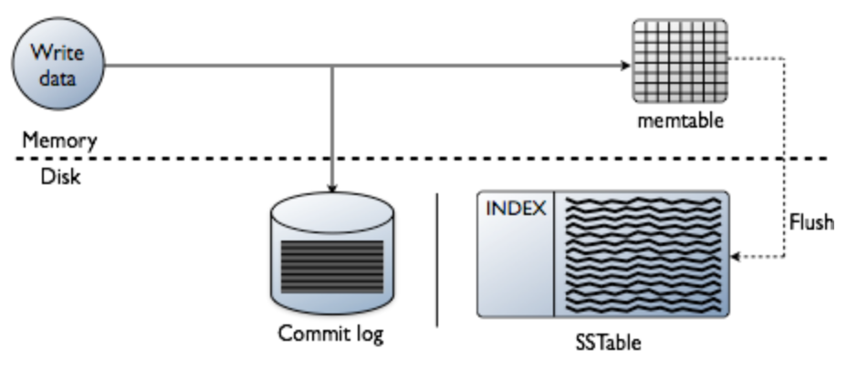{width="5.768055555555556in"
height="2.5236111111111112in"}

{width="5.5in"
height="4.323611111111111in"}

简单地说，LSM 的设计目标是提供比传统的 B+
树更好的写性能。LSM通过将磁盘的随机写转化为顺序写来提高写性能，而付出的代价就是牺牲部分读性能、写放大（B+树同样有写放大的问题）。LSM
相比 B+ 树能提高写性能的本质原因是无论磁盘还是
SSD，其随机读写都要慢于顺序读写。

随机读写比顺序读写慢？

随机读写比顺序读写慢
--------------------

在HDD（Hard Disk
Drive，硬件驱动器）的时代，要考虑磁头。Hdd的单位是扇区，通常是512byte，ssd是以页为单位，通常是4k。

SSD不是用的磁头了，那为什么相比之下随机读写还是慢呢？

{width="5.768055555555556in"
height="3.1631944444444446in"}

SSD以Page为单位做读写，以Block为单位做垃圾回收，Page一般有16KB大小，Block一般有几MB大小（例如256
KB and 4 MB），SSD写数据的逻辑是：

1）将该Block块数据所在的Page读出

2）修改该Page中该Block块数据的内容

3）找出一个新的空闲Block将2)中的Page写入，并将1)中提到的Page所在的Block中的Page标志为脏。

由于随机数据通常由多个应用程序写入，因此页面顺序写入闪存的各个块中。随机写会导致随机的页面失效，顺序写会导致连续的大块页面失效。页面随机失效时，要回收block，需要将block中的有效页面读出并写到新位置，然后erase
block，而连续的大块页面失效时，由于要erase的block中一般已没有有效页面，拷贝写到新位置的过程就没有了。

WiscKey
-------

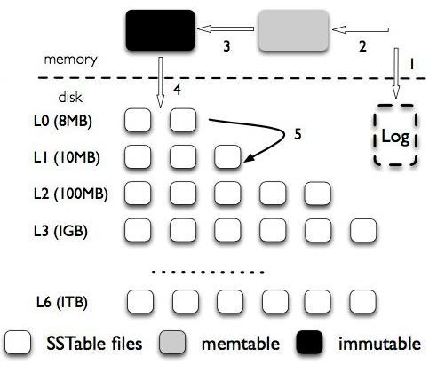{width="5.217361111111111in"
height="4.282638888888889in"}

LSM-tree的问题：

-   读放大。LSM-Tree
    的读操作需要从新到旧（从上到下）一层一层查找，直到找到想要的数据。这个过程可能需要不止一次
    I/O。特别是 range query 的情况，影响很明显。

-   空间放大。因为所有的写入都是顺序写（append-only）的，不是 in-place
    update ，所以过期数据不会马上被清理掉。

-   写放大。compaction 时为了保证数据有序进行大量数据（key 和
    value）重写。层层合并。

实际上，需要保持有序的只有 key，如果将 key 和 value 分开存储，compaction
重写数据的时候，就只需要重写 key（和 value 的位置，简称 vpos）。这在 key
size （简称 ksize）远小于 value size （简称
vsize）的场景（现实场景基本都是这样）降低写放大的效果十分明显。

-   LSM-Tree Compaction 不需要重写 value，大大减小写放大。

-   LSM-Tree 不存储 value，体积更小，一个 block 能存更多的
    key，有利于减少读 LSM-Tree 的 I/O。

-   LSM-Tree 的体积小，cache 效果应该会更好。LSM-Tree
    的上面几层基本都可以 cache 在内存中。

参赛者的设计结构
----------------

{width="5.768055555555556in"
height="4.663152887139107in"}

wal（Write Ahead
Log）存key和value在vlog中的offset，vlog是顺序写入的value，wal和vlog都是append-only的定长写入，所以wal只用存vlog的sequence，vlog
seq用4byte
Int表示存储，大尾端/小尾端程序自己定，然后乘以4096就是在vlog文件中的偏移量。wal和vlog都是顺序IO写入，不存在LSM-tree模型的写放大问题。

由于kv分离，写入必须lock，有锁就会限制性能，由于是随机写入，所以按照分治的思路，减少冲突即可，数据要分片sharding。我的策略是按照key的字典序分成1024个分片。把key的第一个字节8byte+第二个字节的前2个bit取出，转成int，经过分区函数就可以路由到正确的分片上。

{width="5.768055555555556in"
height="1.9387084426946632in"}

高速写入的实现
--------------

{width="5.768055555555556in" height="4.20625in"}

Mmap是程序写入到page
cache就算写成功了，默认系统调用刷盘，所以是写内存，速度很快。

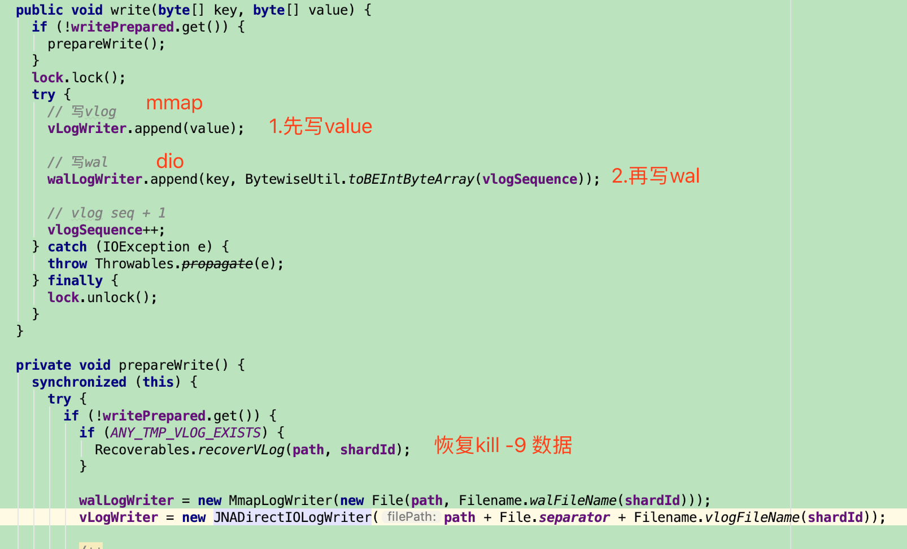{width="5.768055555555556in"
height="3.497916666666667in"}

这里面vlog是用mmap写入的，而wal使用dio+mmap实现的。

mmap写入快，所以vlog使用mmap进行数据操作，这个好理解。

但是wal为什么是dio+mmap？

先说一下为什么要DIO？

高速读取
--------

顺序读为什么会比随机读要快？

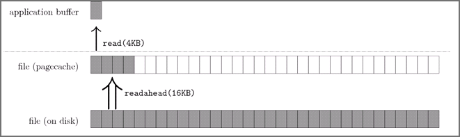{width="5.768055555555556in"
height="1.7203488626421697in"}

以顺序读为例，当用户发起一个 fileChannel.read(4kb)
之后，实际发生了两件事

操作系统从磁盘加载了 16kb 进入 PageCache，这被称为预读

操作通从 PageCache 拷贝 4kb 进入用户内存

最终我们在用户内存访问到了
4kb，为什么顺序读快？很容量想到，当用户继续访问接下来的\[4kb,16kb\]的磁盘内容时，便是直接从
PageCache 去访问了。试想一下，当需要访问 16kb
的磁盘内容时，是发生4次磁盘 IO 快，还是发生1次磁盘 IO+4 次内存 IO
快呢？答案是显而易见的，这一切都是 PageCache 带来的优化。

那如果是随机读怎么办呢？

当使用 fileChannel.read() 这类会触发 PageCache 预读的 IO
方式时，我们其实并不希望操作系统帮我们干太多事，除非真的踩了狗屎运，随机读都能命中
PageCache，但几率可想而知。

所以这种情况下，我们是希望绕过page cache的。

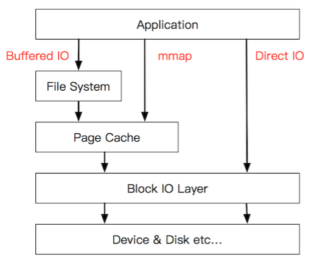{width="5.376388888888889in"
height="4.5in"}

为什么要DIO+MMAP
----------------

评测程序分为2个阶段中，第一阶段正确性评测中，提到进行任意次kill
-9来模拟进程意外退出（参赛引擎需要保证进程意外退出时数据持久化不丢失）。

Kill -9
只是杀了进程，但是mmap的内容是还在的，所以当写了vlog，所以value还在page
cache中，可以恢复，但是如果是wal只是dio操作，那数据就丢失了key
offsize了。

所以在wal写的时候，是先写了个tmp文件。

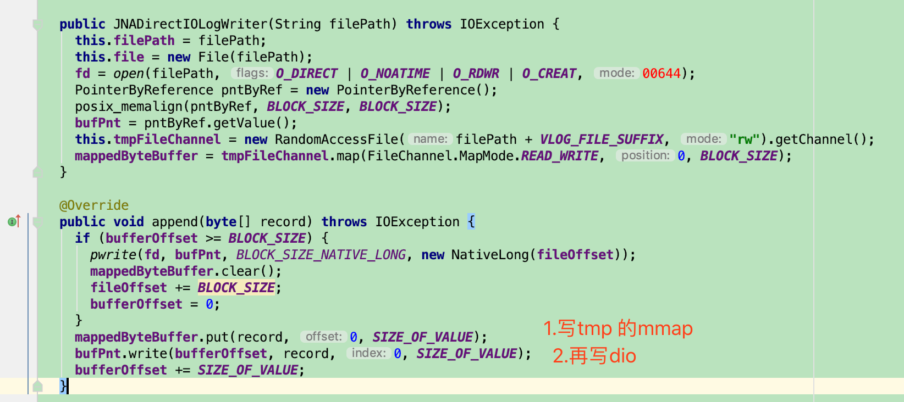{width="5.768055555555556in"
height="2.5680555555555555in"}

而在启动的时候，进行数据的恢复。也就是将page cache 的内容写到文件中。

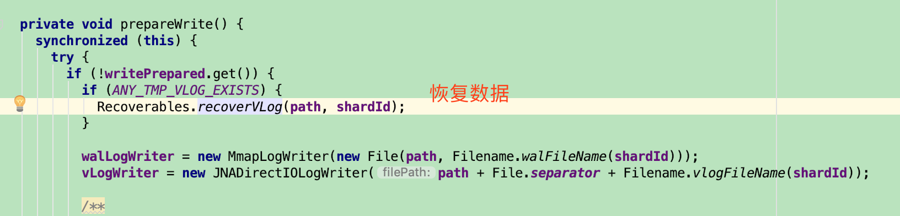{width="5.768055555555556in"
height="1.3854166666666667in"}

随机读的实现
------------

读取测试方法：

随机读取：64个线程并发随机读取，每个线程各使用Read读取100万次随机数据。

首先要创建索引，通过key查找value。

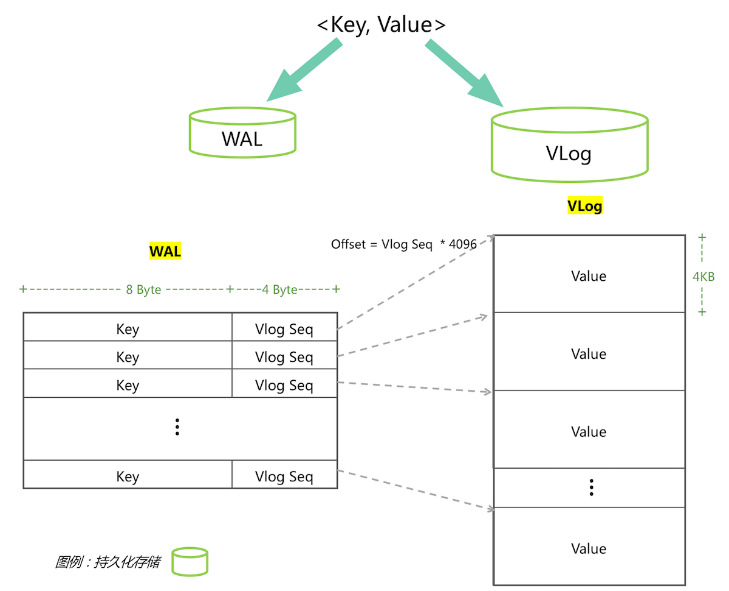{width="3.3176476377952757in"
height="2.682133639545057in"}

总的wal文件大小=（8byte key+4byte vlog
seq）\*64并发\*100w=768MB。完全可以放内存中。

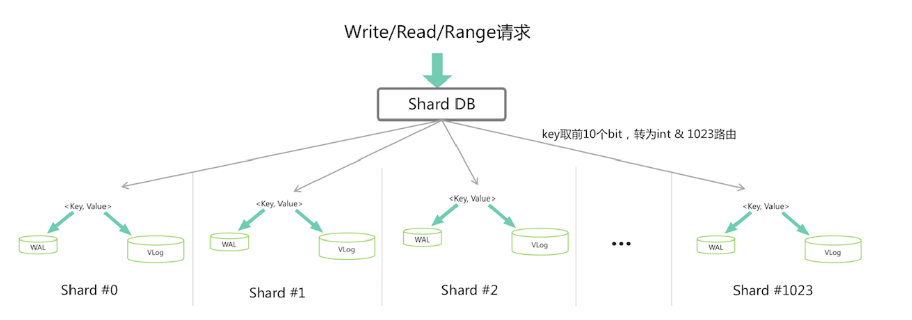{width="5.768055555555556in"
height="2.0277777777777777in"}

在读之前先进行初始化：

1.  多线程（10个线程）同时通过mmap加载1024个wal文件

2.  申请同样大小的堆外内存，通过堆外内存进行排序，构建出一个index，用于二分查找

3.  用DIO的方式初始化vlog

初始化完成后，就可以通过二分查找找到key，在通过偏移量找到value

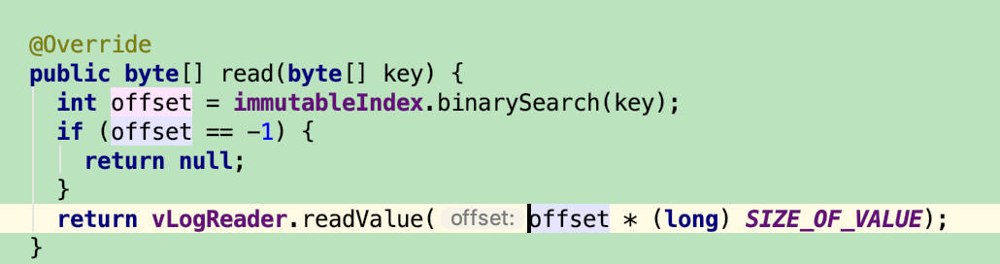{width="5.768055555555556in"
height="1.5229166666666667in"}

Scan扫描
--------

测试方法：

顺序读取：64个线程并发顺序读取，每个线程使用Range全局顺序迭代DB数据2次。

题目中会64并发Range2次，相当于128次全数据扫描，肯定是有问题的。

作者先描述了搭车模型，再使用了滑动窗口。但感觉事后先描述滑动窗口，再描述搭车模型就更加明白。

基本思想就是顺序遍历1024个分片，每个分片放到内存中访问，无缝的衔接每个分片，走完即可。每个分片的访问都分为3个步骤。

1）prefetch预读：wal排序好建立索引，vlog load到内存。

2）Range读取：iterate排序好的wal，针对每个key和vlog
seq找value，就变成了内存访问，也就是"并发内存查询"的精髓。

3）评测程序visit：评测程序需要验证有序、值正确等，也有一定消耗。

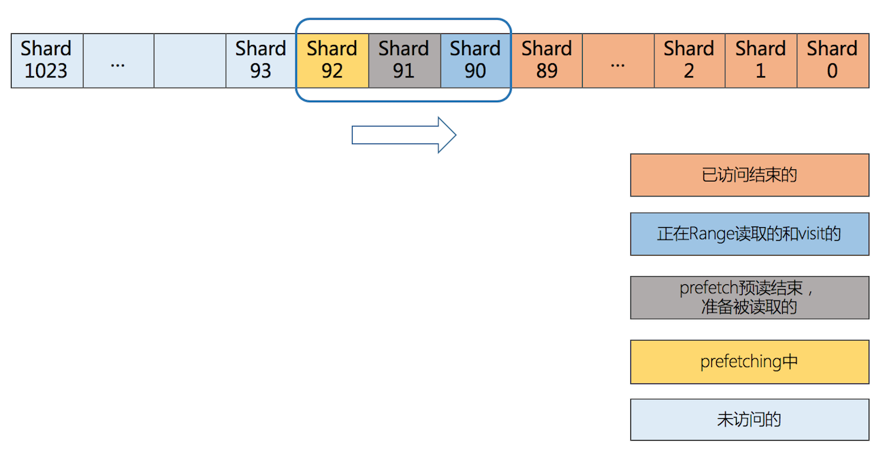{width="5.768055555555556in"
height="3.009304461942257in"}

为了无缝衔接1024个分片做上述3个步骤，使用滑动窗口，如下图，滑动窗口分为5类：

-- 已访问结束的

-- 正在Range读取的和visit的

-- prefetch预读结束，准备被读取的

-- prefetching中

-- 未访问的

滑动窗口最大容量是3个分片，占用内存最大=vlog（256MB\*3）+wal索引（750KB\*3）=770MB。

这样只要将64个并发线程控制在这滑动窗口中，就相当于全是内存操作了。所以搭车模型就可以运用如下了：

{width="5.768055555555556in"
height="2.1248239282589676in"}

扩展点
======

Kernel bypass
-------------

kernel
bypass(绕过内核)是解决系统网络栈和存储栈性能瓶颈的另外一种方式，与传统的中断机制不同，kernel
bypass的核心思想是：内核只用来处理控制流，所有数据流相关操作都在用户态进行处理，从而规避内核的包拷贝、线程调度、系统调用、中断等性能瓶颈，并辅以各种性能调优手段(如：CPU
pin、无锁队列)，从而达到更高的性能。

### DPDK

DPDK(Data Plane Development
Kit)是由Intel发起，主要基于Linux系统运行，用于快速数据包处理的函数库与驱动集合，可以极大提高数据处理性能和吞吐量，提高数据平面应用程序的工作效率。DPDK使用了轮询(polling)而不是中断来处理数据包。在收到数据包时，经DPDK重载的网卡驱动不会通过中断通知CPU，而是直接将数据包存入内存，交付应用层软件通过DPDK提供的接口来直接处理，这样节省了大量的CPU中断时间和内存拷贝时间。

<https://www.cnblogs.com/qcloud1001/p/9585724.html

### SPDK

众所周知，在Linux起源之初，文件系统io栈针对机械盘进行了众多优化，包括page、cache等多种优化方式。内核采用中断的方式进行DMA将数据从内核态拷贝回用户态，再交由用户程序处理，这是机械硬盘时代的io处理方式。而随着nvme-ssd的出现，如果再采用此种方式就会导致大量的硬盘空闲，浪费硬盘性能。为了帮助上游的应用厂商以及存储厂商更好的发挥ssd磁盘的性能，intel开发了一套基于nvme-ssd的开发套件，SPDK。SPDK的目标是通过使用Intel的网络，处理，存储技术，将固态存储介质出色的功效发挥到极致。

首先，将设备驱动代码运行在用户态，避免内核上下文切换和中断将会节省大量的处理开销，允许更多的时钟周期被用来做实际的数据存储。其次，采用轮询模式改变了传统I/O的基本模型。在传统的I/O模型中，应用程序提交读写请求后进入睡眠状态，一旦I/O完成，中断就会将其唤醒。轮询的工作方式则不同，应用程序提交读写请求后继续执行其他工作，以一定的时间间隔回头检查I/O是否已经完成。这种方式避免了中断带来的延迟和开销，并使得应用程序提高了I/O效率。

SPDK用于加速使用NVMe
SSD作为后端存储的应用软件加速库，该软件库的核心是用户态、异步、轮询方式的NVMe驱动。与内核态的NVMe驱动相比，它可以大幅度降低延迟，同时提升单CPU核的IOPS。

{width="5.768055555555556in"
height="1.6583333333333334in"}

<https://blog.csdn.net/zlarm/article/details/79140299

### RDMA

RDMA(Remote Direct Memory
Access)全称远程直接数据存取，就是为了解决网络传输中服务器端数据处理的延迟而产生的。RDMA通过网络把资料直接传入计算机的存储区，将数据从一个系统快速移动到远程系统存储器中，而不对操作系统造成任何影响，这样就不需要用到多少计算机的处理功能。它消除了外部存储器复制和上下文切换的开销，因而能解放内存带宽和CPU周期用于改进应用系统性能。下图直观的展示了传统模式和RDMA模式下的差异。

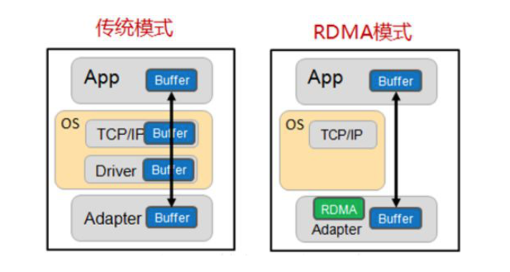{width="5.768055555555556in"
height="3.0756944444444443in"}

细节是魔鬼
----------

这里有一个小点可以避免频繁的Young GC，64个线程通过ThreadLocal读4k
value，避免频繁的分配内存。

DIO库
-----

<https://github.com/smacke/jaydio

据说java 10
会添加上（<https://bugs.openjdk.java.net/browse/JDK-8164900）

重点
----

作为Java选手要克服上面的困难，必然要使出一些大杀器，下面依次总结下。

1、mmap

写入阶段写wal，保证crash
consistency。JDK提供原生的API，但是释放相对麻烦。

2、direct io

JNA封装，或者使用jaydio，拼接小IO为大块IO写入。FileChannel在本次比赛都没有使用，原因就是内部有个position
lock并且走buffer
io，在这个场景不适合，但是大多数Java涉及IO的场景，NIO的FileChannel都是首选。

3、堆外内存

offheap可以用DirectBuffer，或者Unsafe的malloc、free。

4、gc控制

比赛用参数如下，

-server -XX:-UseBiasedLocking -Xms2000m -Xmx2000m -XX:NewSize=1400m
-XX:MaxMetaspaceSize=32m -XX:MaxDirectMemorySize=1G -XX:+UseG1GC

write和read阶段young
gc都很少，主要为range阶段使用，由于使用了多级流水线架构，所以吃内存比较严重，young
gc相对频繁，但没有full gc所以可接受。

5、池化技术

DirectMemory先分配好，然后池化，使用时候反复擦写，可以复用资源。read阶段用ThreadLocal复用value避免频繁young
gc。

6、锁控制

kv分离的写入，必然加锁。read阶段的direct io
load同一块内存，然后返回给user
space的过程也需要加锁，尽量小的控制锁粒度，分散锁的冲突，就像ConcurrentHashMap思想一样，就可以把锁的消耗降到最低。

7、并发利器

java.util.concurrent要用好，Range阶段的搭车模型，并行load
vlog，滑动窗口都用到了线程池、lock、condition、mutex等。同时一些无锁并发的类库例如ConcurrentLinkedQueue，jctools的MpmcArrayQueue，disruptor的无锁队列也可以尝试，比赛中都有实验，其实无锁就足够了，瓶颈在IO，这些可以忽略。

8、减少上下文切换

由于比赛使用了Alijdk，而Alijdk有个Wisp
API，可以做Java协程，在一些资源释放无需等待的场景可以使用，亲试后通过vmstat
-w 1命令看cs列确实少了一些，但是对提高成绩没有很大帮忙。
