概述
====

ubus为openwrt平台开发中的进程间通信提供了一个通用的框架，类似linux桌面操作系统的d-bus，目标是提供系统级的进程间通信（IPC）功能,它让进程间通信的实现变得非常简单，并且ubus具有很强的可移植性，可以很方便地移植到其他linux平台上使用。ubus是为进程间发送消息而设计的，不适合传输大量数据（进程间传输大量数据应采用共享内存）

ubus源码可通过Git库git://nbd.name/luci2/ubus.git获得，其依赖的ubox库的git库git://nbd.name/luci2/ubox.git。

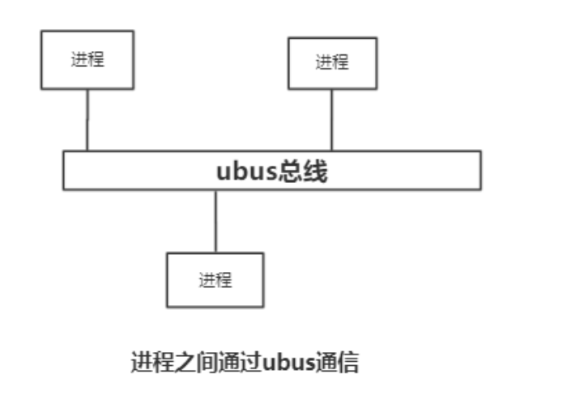{width="4.861360454943132in"
height="3.5696281714785654in"}

简单理解它就是一个消息总线，用来串联服务之间的通讯，所有的消息均通过ubus进行转发处理。

就是我们的消息 Route。

基本使用
========

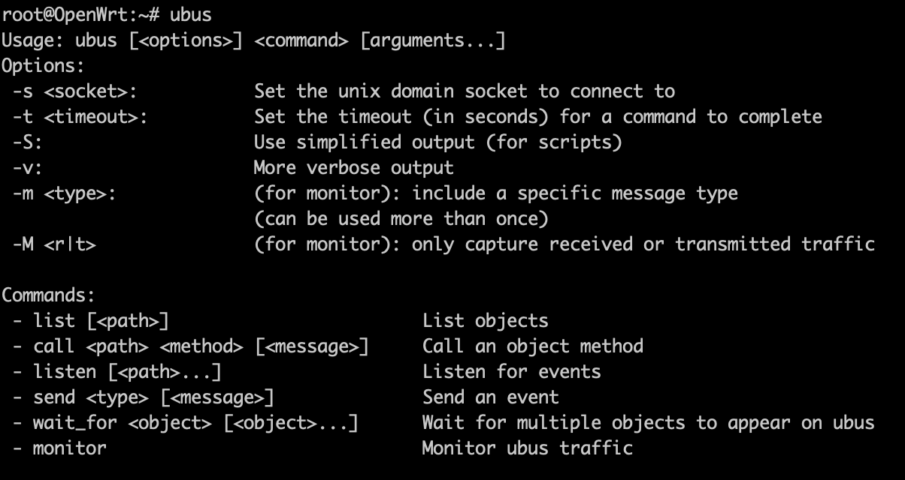{width="5.768055555555556in"
height="3.0659722222222223in"}

示例
----

列出已经注册的服务：

root@uplink:~# ubus list
network
network.device
network.interface.lan
network.interface.loopback
network.interface.wan


添加-v 指令，并查看具体可执行方法


root@uplink:~# ubus -v list network.interface.lan
'network.interface.lan' @099f0c8b
	"up": {  }
	"down": {  }
	"status": {  }
	"prepare": {  }
	"add_device": { "name": "String" }
	"remove_device": { "name": "String" }
	"notify_proto": {  }
	"remove": {  }
	"set_data": {  }

调用call方法进行跨进程rpc调用，并获得相应的返回值

root@uplink:~# ubus call network.interface.wan status
{
	"up": true,
	"pending": false,
	"available": true,
	"autostart": true,
	"uptime": 86017,
	"l3_device": "eth1",
	"device": "eth1",
	"address": [
		{
			"address": "178.25.65.236",
			"mask": 21
		}
	],
	"route": [
		{
			"target": "0.0.0.0",
			"mask": 0,
			"nexthop": "178.25.71.254"
		}
	],
	"data": {
		
	}
}


通过listen 监听所有的消息情况

root@uplink:~# ubus listen &
root@uplink:~# ubus call network.interface.wan down
{ "network.interface": { "action": "ifdown", "interface": "wan" } }
root@uplink:~# ubus call network.interface.wan up
{ "network.interface": { "action": "ifup", "interface": "wan" } }
{ "network.interface": { "action": "ifdown", "interface": "he" } }
{ "network.interface": { "action": "ifdown", "interface": "v6" } }
{ "network.interface": { "action": "ifup", "interface": "he" } }
{ "network.interface": { "action": "ifup", "interface": "v6" } }


通过send发送消息:

root\@uplink:\~\# ubus send foo \'{ \"bar\": \"baz\" }\'


结构
====

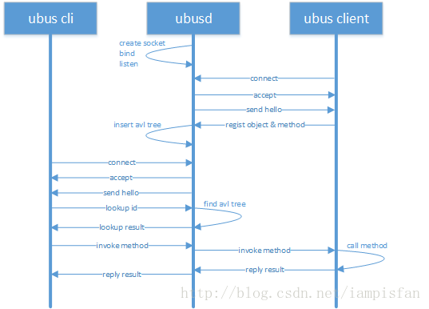{width="5.594444444444444in"
height="4.017361111111111in"}

工程的核心是ubusd精灵进程，它提供了一个总线层，在系统启动时运行，负责进程间的消息路由和传递。

Ubus
client注册到ubusd进程进行消息的发送和接收，它实际上是一个操作库或接口，相当于sdk。相对于ubusd它是一个客户端，所以称它为ubus
client（ubus service更贴切）。例如下图的session和uci。

这个接口是用linux文件socket和TVL（Type-length-value）实现的，每一个进程在指定命名空间下注册自己的路径。每一个路径都可以提供带有各种参数的多个函数处理过程。函数处理过程程序可以在完成处理后返回消息。

Ubus cli 是ubus提供的操作工具，我们通过它能够对ubus进行操作。例如 ubus
list就是中的ubus即为cli。

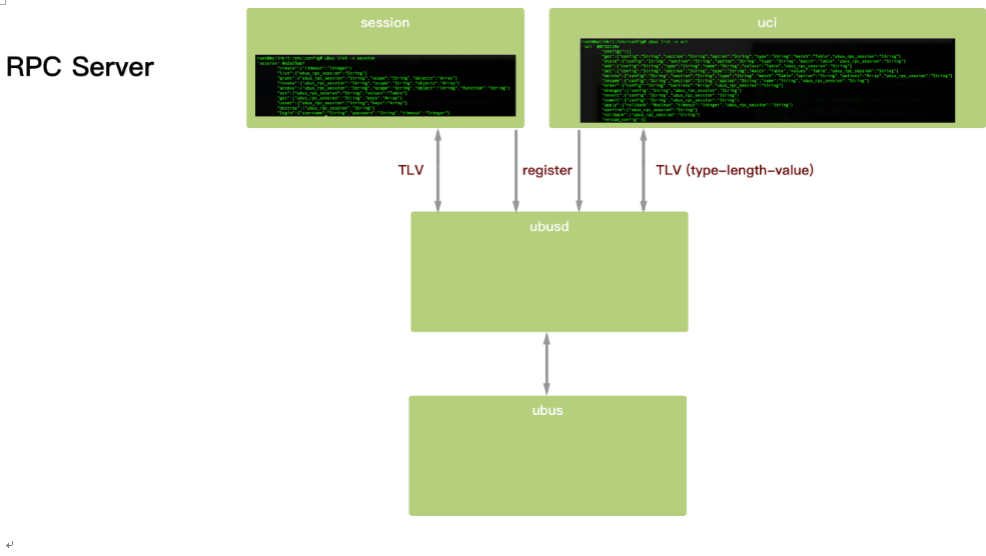{width="5.768055555555556in"
height="3.2527777777777778in"}

代码分析
========

代码地址：

根据代码分析可知，ubus是依赖了一个ubox的库，进行相应的socket操作。使得socket编程更为简单。

ubusd分析
---------

ubusd.c中入口


int main(int argc, char **argv)
{
	const char *ubus_socket = UBUS_UNIX_SOCKET;
	int ret = 0;
	int ch;

	signal(SIGPIPE, SIG_IGN);
	//uloop初始化
	uloop_init();

	while ((ch = getopt(argc, argv, "s:")) != -1) {
		switch (ch) {
		case 's':
			ubus_socket = optarg;
			break;
		default:
			return usage(argv[0]);
		}
	}
	unlink(ubus_socket);
	umask(0177);
	//建立一个非阻塞 sock 服务，并赋值给 server_df
	server_fd.fd = usock(USOCK_UNIX | USOCK_SERVER | USOCK_NONBLOCK, ubus_socket, NULL);
	if (server_fd.fd < 0) {
		perror("usock");
		ret = -1;
		goto out;
	}
	//添加read 事件监听
	uloop_fd_add(&server_fd, ULOOP_READ | ULOOP_EDGE_TRIGGER);
	//uloop 并阻塞 ，里面会回调 server_fd.cb 方法
	uloop_run();
	unlink(ubus_socket);
out:
	uloop_done();
	return ret;
}



在main函数中，可看到uloop相关都是ubox的标准接口，初始化、添加fd、run、done。按照上面的流程写也能写一个简单的socket
server。

上面很重要的一个uloop\_fd\_add(&server\_fd)方法。server\_fd是一个uloop\_fd结构里面需要设置callback方法，用于数据处理。

static struct uloop_fd server_fd = {
	.cb = server_cb,
};

struct uloop_fd
{
	uloop_fd_handler cb;
	int fd;
	bool eof;
	bool error;
	bool registered;
	uint8_t flags;
};



server\_cb 是 uloop\_fd\_handler ，该类型在uloop.h中已经定义。

 ##typedef void (*uloop_fd_handler)(struct uloop_fd *u, unsigned int events);

static void server_cb(struct uloop_fd *fd, unsigned int events)
{
	bool next;
	do {
		next = get_next_connection(fd-fd);
	} while (next);
}



uloop\_fd\_handler在什么时候被调用呢？可以在uloop\_run方法中看到，当事件触发时，会回调cb方法。

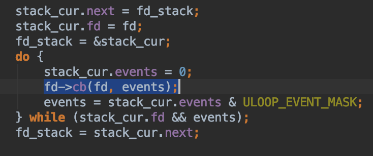{width="5.0974846894138235in"
height="2.138999343832021in"}

那么重点就是get\_next\_connection方法了。

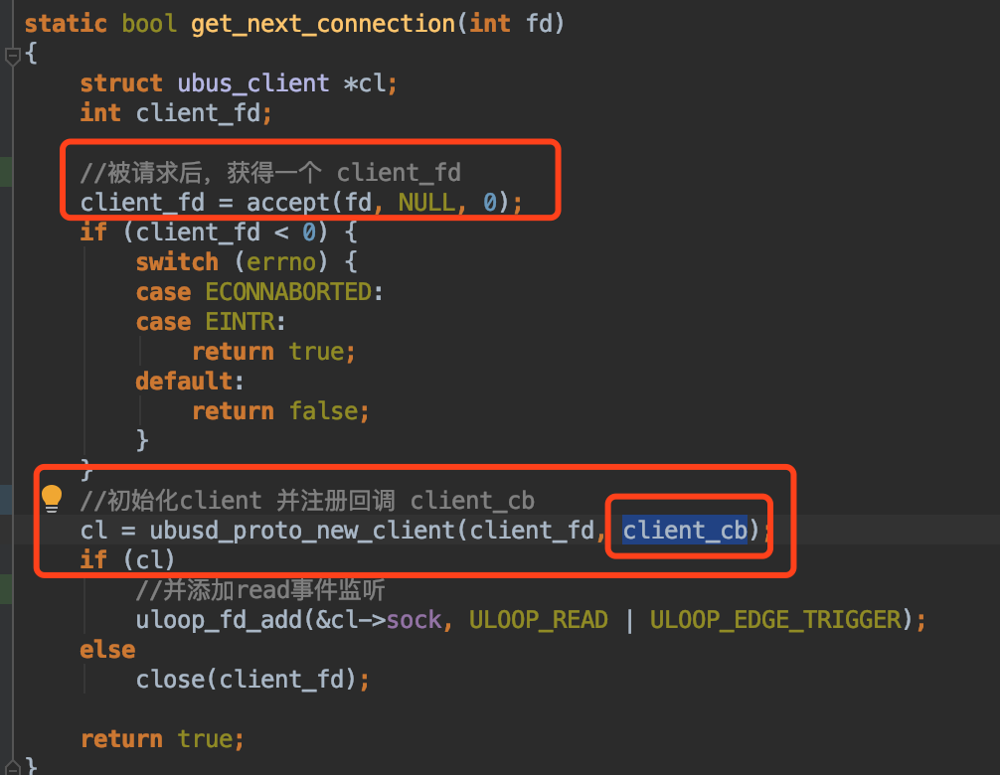{width="5.768055555555556in"
height="4.472222222222222in"}

accept是socket的方法，accpet之后，会建立一个socket连接,ubusd\_proto\_new\_client会将client\_fd添加到二叉树中，存储所有的client。并注册client\_cb。

client\_cb即描述了发送消息，接收消息、处理消息等方法。由于内容较多，这里只描述重要的方法，其他方法可自行查看。

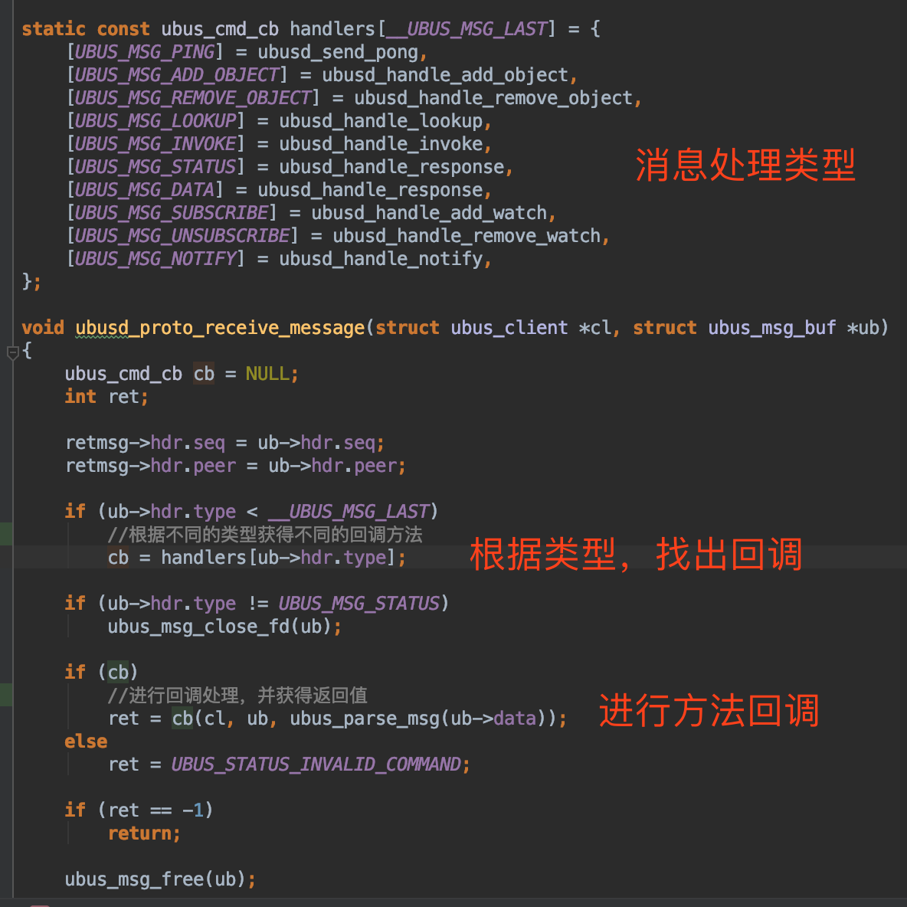{width="5.768055555555556in"
height="5.768055555555556in"}

我们挑选一个rpc的方法进行查看，即ubusd\_handle\_invoke方法。

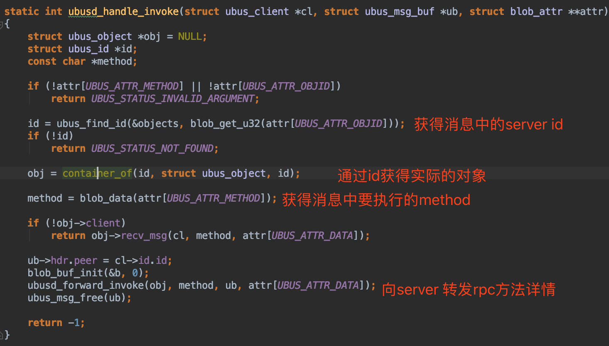{width="5.768055555555556in" height="3.28125in"}

由于ubusd是一个转发器，所以它并不处理真实的rpc请求，而是将它转发给实际要执行的client。

ubus service
------------

在ubus源码中example文件夹中有server.c，它就是一个ubus service的demo。

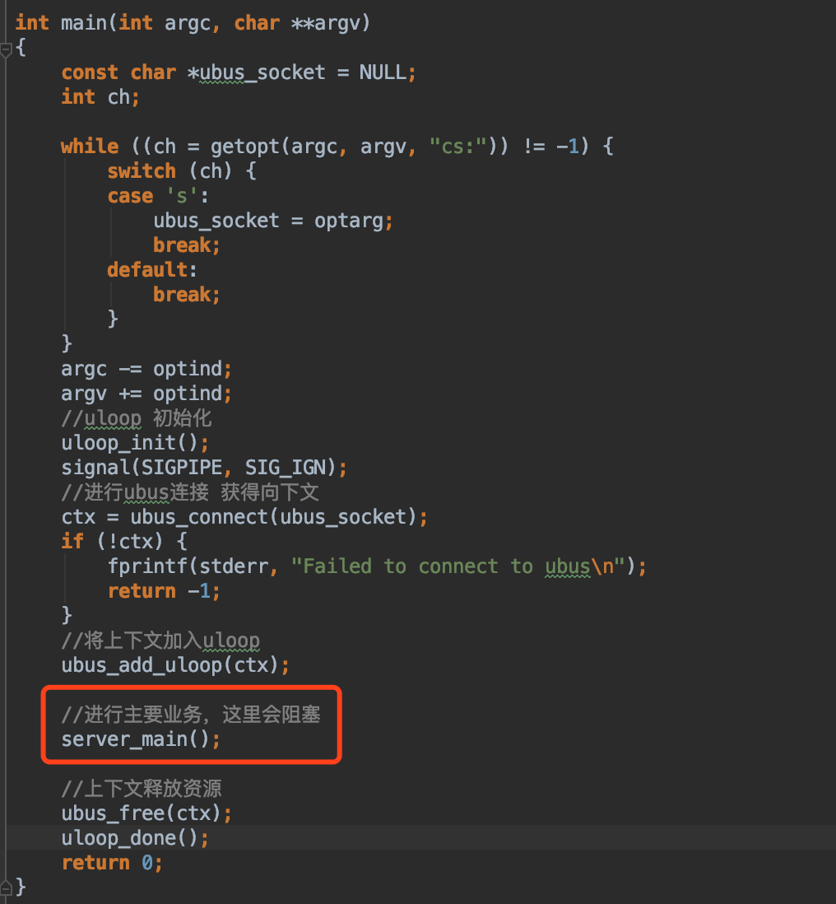{width="5.768055555555556in"
height="6.233333333333333in"}

可以看到同样适用了标准化的init
、add\_uloop、done等方法。最主要的是server\_main方法，

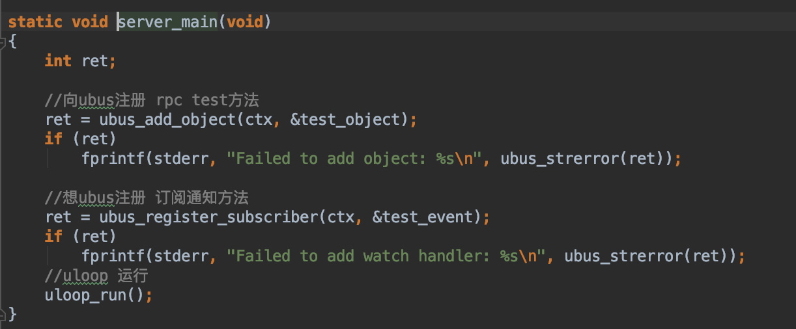{width="5.768055555555556in"
height="2.3881944444444443in"}

ubus\_add\_object方法进行服务的注册，test\_object则是个ubus\_object对象，里面定义了name、method等信息。

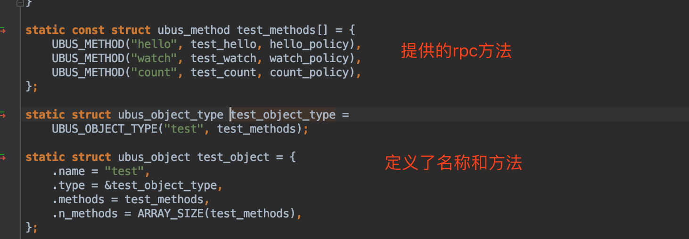{width="5.768055555555556in"
height="2.004166666666667in"}

这里挑选一个hello方法进行查看。Hello方法收到消息后，对数据进行解析，并组合需要返回的内容，由于本service的名字为test，即test
receiverd a message %s ,%s为具体接收到的数据。

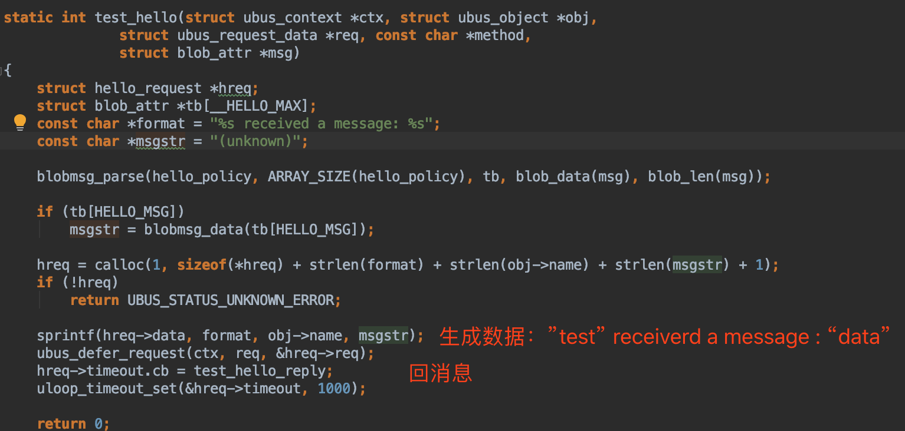{width="5.768055555555556in"
height="2.752083333333333in"}

ubus cli
--------

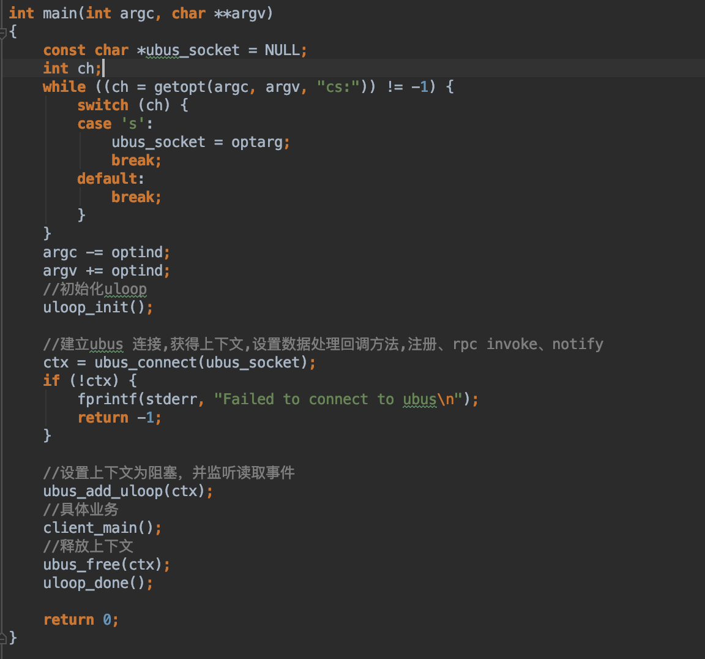{width="5.768055555555556in" height="5.3875in"}

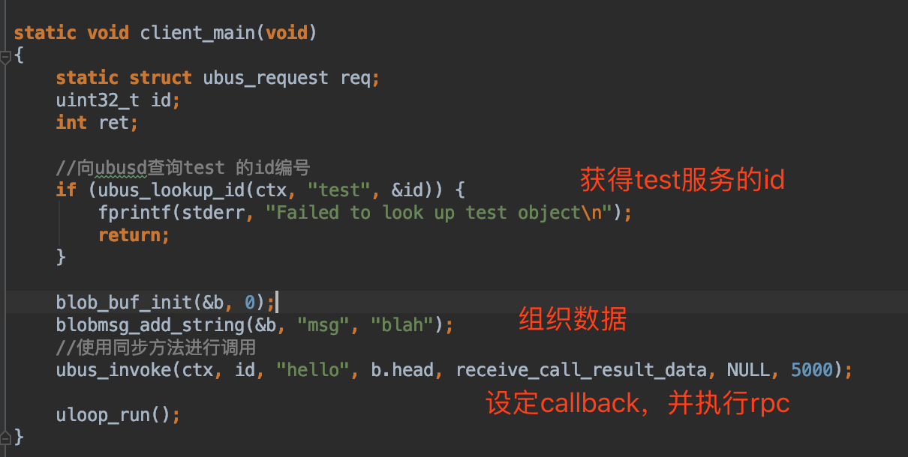{width="5.768055555555556in"
height="2.907638888888889in"}

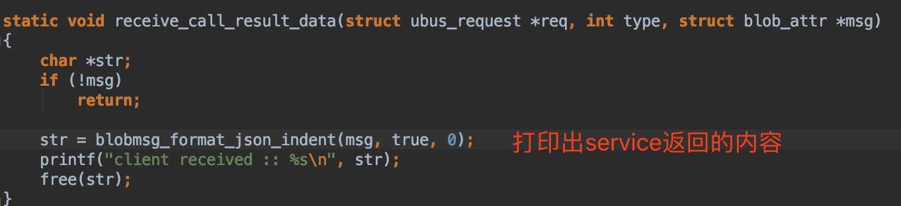{width="5.768055555555556in"
height="1.3215277777777779in"}

demo
----

将源码在openwrt的编译环境编译后，放到openwrt中，先执行service

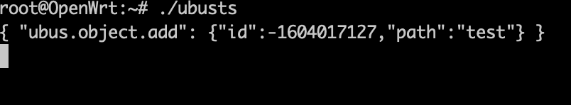{width="5.583619860017498in"
height="1.027830271216098in"}

再执行client

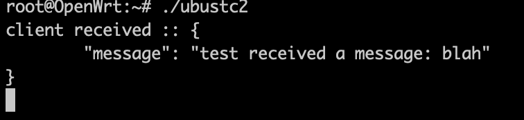{width="5.2502701224846895in"
height="1.2083956692913387in"}

 官方的log
---------

通过执行ubus --v list，可以看到log 有
read、write方法，我们可以借此来分析一下源码，以确认我们前面的推理。

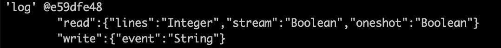{width="5.768055555555556in"
height="0.55625in"}

Log的service源码是在ubox中，名字为logd.c。

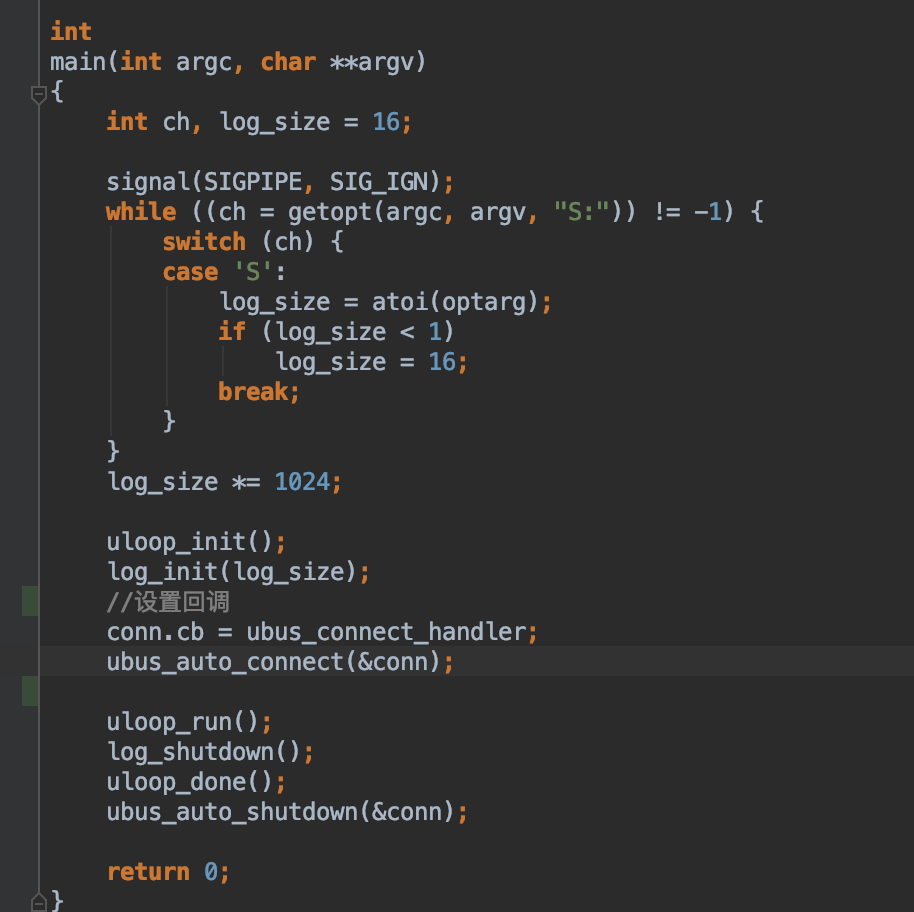{width="5.768055555555556in"
height="5.7555555555555555in"}

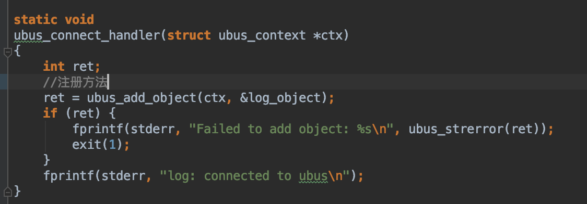{width="5.768055555555556in"
height="2.0118055555555556in"}

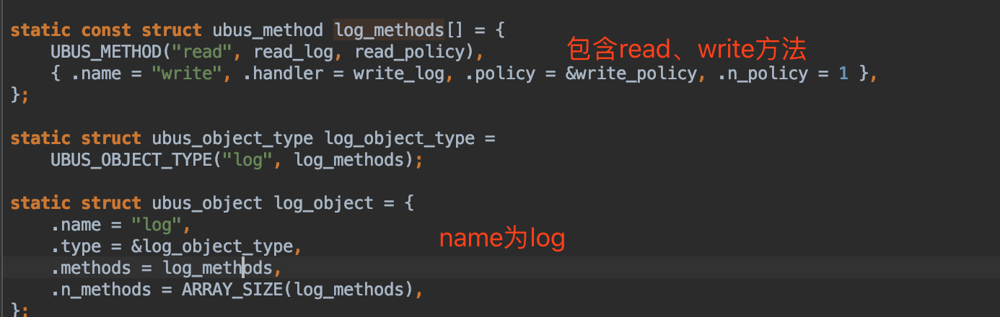{width="5.768055555555556in"
height="1.83125in"}

Rpcd
----

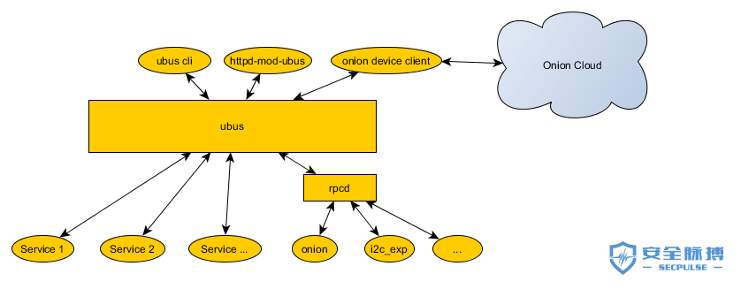{width="5.768055555555556in"
height="2.2503215223097115in"}

Rpcd是一个比较特殊的实现，它在实现了ubus
service的基础上，进行了扩展，可以实现通过 http 来访问 ubus
总线（luci实现），并且也支持了加载本地shell。

这里介绍一下本地shell的加载(mwan3的通过该方法实现ubus调用)

下载rpcd源码进行查看，发现session、uci、iwinfo、file是通过rpcd实现的。

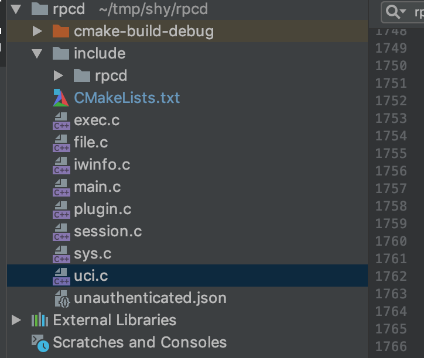{width="5.028035870516185in"
height="4.2502187226596675in"}

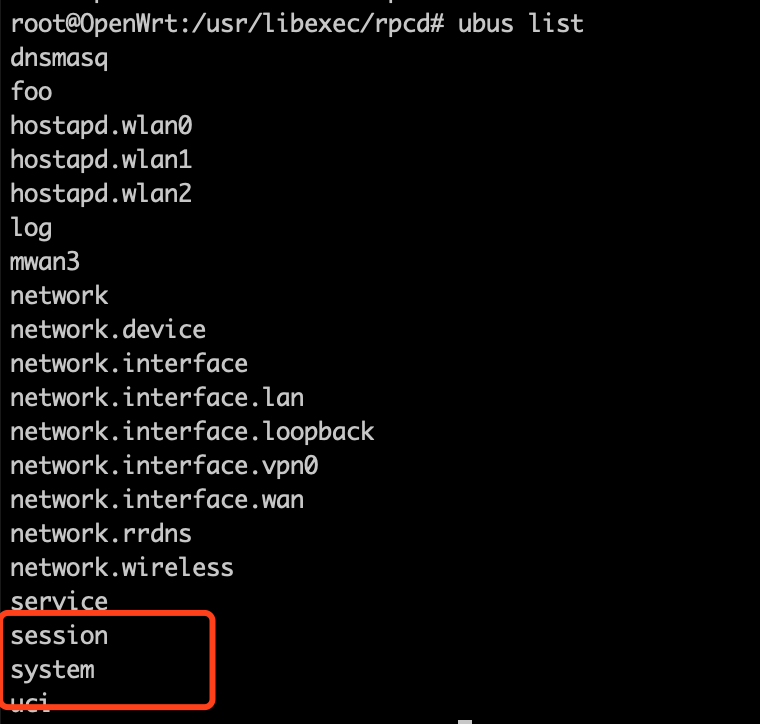{width="5.278048993875766in"
height="5.028035870516185in"}

Rpcd加载shell的目录如下：

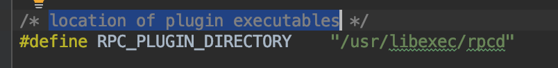{width="5.583619860017498in"
height="0.6805905511811023in"}

按照过则编辑一个脚本：/usr/libexec/rpcd/foo

#!/bin/sh

case "$1" in
        list)
                echo '{ "bar": { "arg1": true, "arg2": 32, "arg3": "str" }, "toto": { } }'
        ;;
        call)
                case "$2" in
                        bar)
                                # read the arguments
                                read input;
                                # optionally log the call
                                logger -t "foo" "call" "$2" "$input"
                                # return json object or an array
                                echo '{ "hello": "world" }'
                        ;;
                        toto)
                                # return json object or an array
                                echo '[ "item1", "item2", "item3" ]'
                        ;;
                esac
        ;;
esac



/etc/init.d/rpcd reload 或 重启。

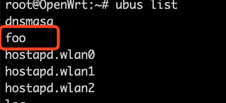{width="3.180718503937008in"
height="1.4584087926509186in"}

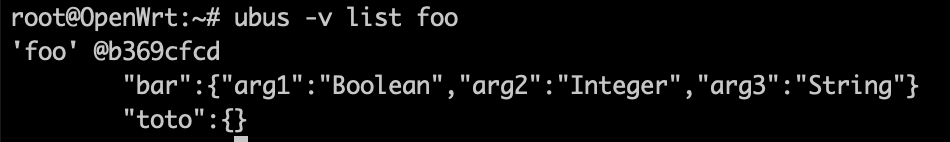{width="5.768055555555556in" height="0.8625in"}

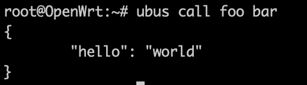{width="3.597407042869641in"
height="1.0000513998250218in"}

其他
====

什么是TVL
---------

<http://www.wtango.com/tlv%E7%BC%96%E7%A0%81%E9%80%9A%E4%BF%A1%E5%8D%8F%E8%AE%AE%E8%AE%BE%E8%AE%A1/

 Bus的意义是什么？
-----------------

有人整理了Unix/Linux IPC的七大分类：

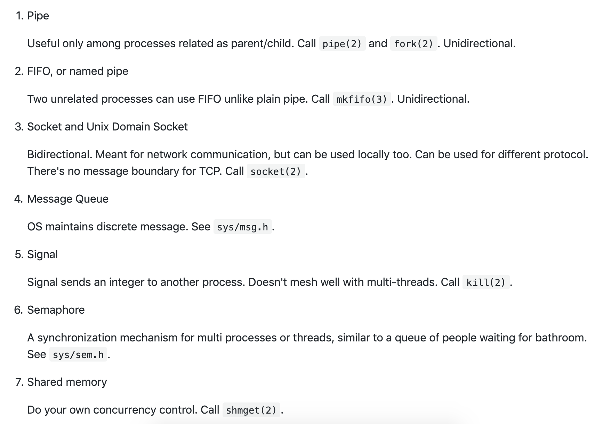{width="5.768055555555556in"
height="4.064583333333333in"}

原文：<https://github.com/robbie-cao/kb-openwrt/blob/master/UBUS.md

这有涉及到SOA中esb相关知识了。

<https://www.cnblogs.com/zdz8207/p/java-esb.html

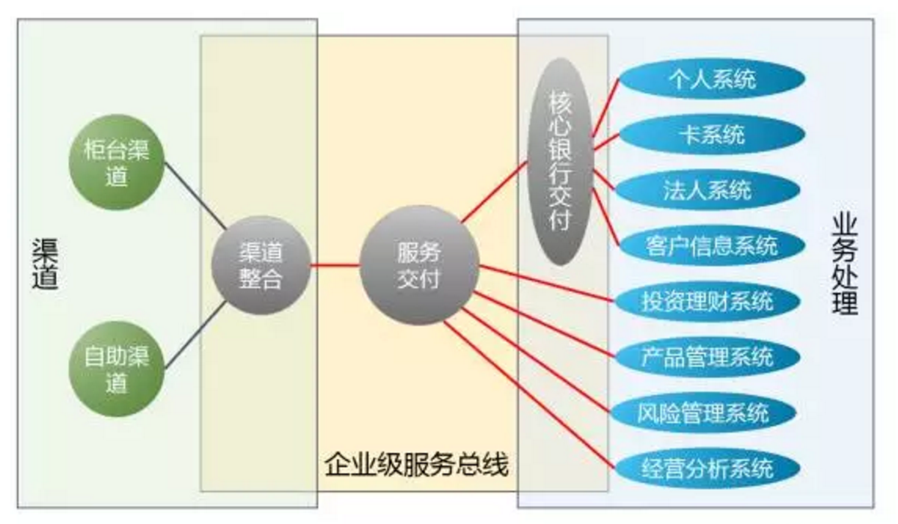{width="5.768055555555556in"
height="3.365980971128609in"}

我们怎么使用？
--------------

Mqtt
client可以参考之前的servcie进行实现，通过ubus进行跨进程间的通讯，将数据交付到mqtt
服务中，这样mqtt client与mqtt borker就只有一个连接了。
