背景
====

如何网络加速？网络加速的不是说固定宽带为10m，让你用出了20m的速度。而是10m的带宽不加速的情况下像是1m带宽，通过一些手段尽量提升到5m的体验。

Vpn
---

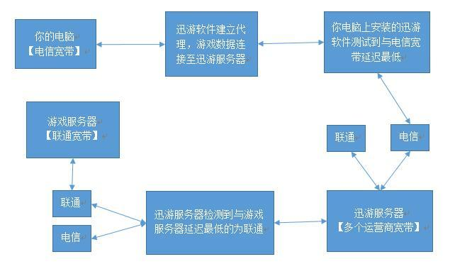{width="5.768055555555556in"
height="3.4079877515310586in"}

缩短客户端与服务器的链路，并且用更优的线路。

KCP
---

利用现有的链路，通过传输速率，网络加速的不是说固定宽带为10m，让你用出了20m的速度。而是10m的带宽不加速的情况下像是1m带宽，通过一些手段尽量提升到5m的体验。

如果网络永远不卡，那 KCP/TCP
表现类似，但是网络本身就是不可靠的，丢包和抖动无法避免（否则还要各种可靠协议干嘛）。在内网这种几乎理想的环境里直接比较，大家都差不多，但是放到公网上，放到3G/4G网络情况下，或者使用内网丢包模拟，差距就很明显了。公网在高峰期有平均接近10%的丢包，wifi/3g/4g下更糟糕，这些都会让传输变卡。

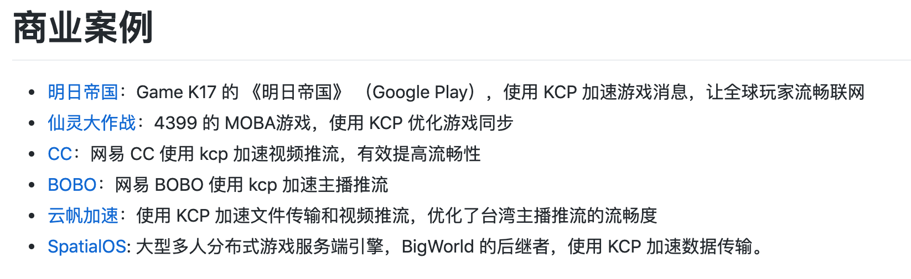{width="5.768055555555556in"
height="1.7729166666666667in"}

TCP基础
=======

在学习TCP协议之前，首先我们需要知道OSI模型，它是以太网最基本也是最重要的知识，如下图：

{width="5.768055555555556in"
height="3.123254593175853in"}

如图所示，OSI定义了网络互联的七层框架，每一层实现各自的功能和协议，并完成与相邻层的接口通信。OSI的服务定义详细说明了各层所提供的服务。某一层的服务就是该层及其下各层的一种能力，它通过接口提供给更高一层。各层所提供的服务与这些服务是怎么实现的无关。

而TCP/IP模型基于OSI模型，又构建了自己的5层模型，它与OSI模型的对应关系如下图：

{width="5.768055555555556in"
height="2.092962598425197in"}

其中，TCP 是以太网协议和 IP 协议的上层协议，也是应用层协议的下层协议。

TCP报文
-------

以太网数据包（packet）的大小是固定的，1500
字节是负载（payload），22字节是头信息（head）。IP
数据包在以太网数据包的负载里面，它也有自己的头信息，ipv4最少需要20字节，所以
IP 数据包的负载最多为1480字节。

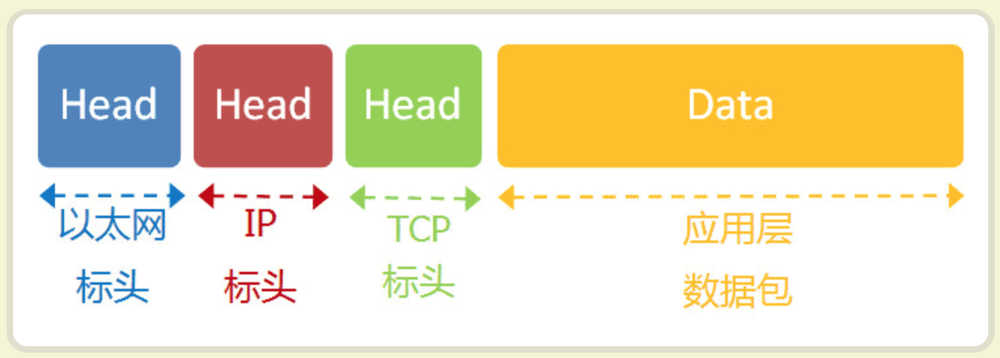{width="5.768055555555556in" height="2.06875in"}

TCP 数据包在 IP 数据包的负载里面。它的头信息最少也需要20字节，因此 TCP
数据包的最大负载是 1480 - 20 = 1460 字节。由于 IP 和 TCP
协议往往有额外的头信息（例如SACK），所以 TCP 负载实际为1400字节左右。

TCP头信息：

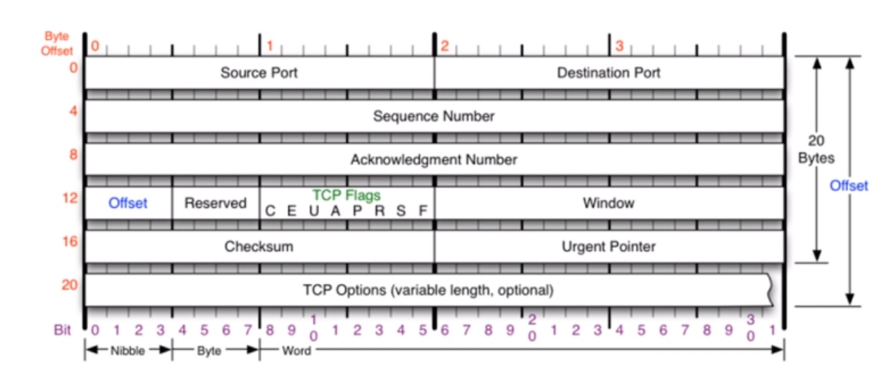{width="5.768055555555556in"
height="2.3680555555555554in"}

其中一些比较重要的字段含义如下：

source port和destination port用来定义一个tcp链接。

sequence number和acknowledgment
number是用于唯一标识一个tcp报文的，acknowledgment
number还用来确认报文的可达性。

tcp flags是在tcp连接过程中的一些状态标识，包括SYN, FIN, ACK, PSH, RST,
URG，分别表示：建立连接，关闭连接，响应，有无data传输，连接重置，紧急指针。

Window为滑动窗口，它是用来获得最优的连接速率，因为一般情况下我们的数据发送端和接收端处理速率不会相同，该字段用来控制传输流速率。

Tcp options一个可选的数据，它有如下一些类型：

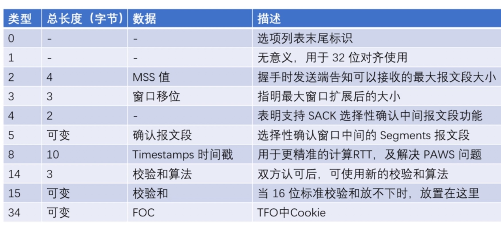{width="5.768055555555556in"
height="2.607075678040245in"}

滑动窗口
--------

以下例子我们忽略操作系统缓冲区的变化，假定client端和server端的可用窗口是不变的，但实际情况下，我们的可用窗口是和操作系统的缓冲区相关的，并不是一直不变的！

### 发送窗口

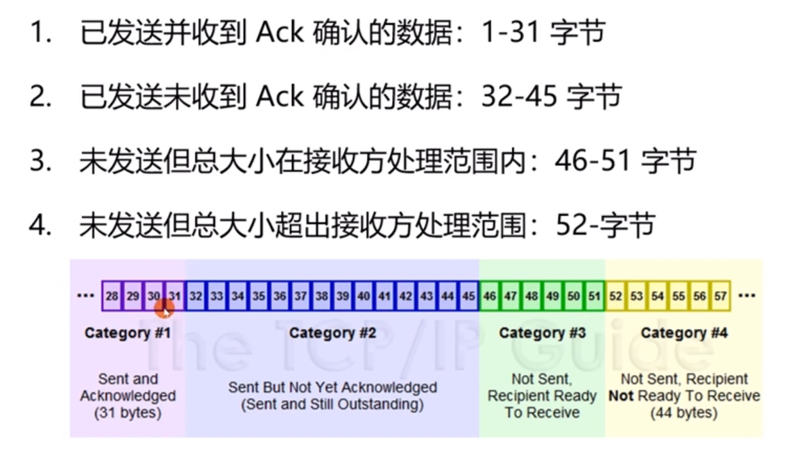{width="5.768055555555556in"
height="3.342361111111111in"}

如上图，\#1部分代表已发送并确认的数据，\#2代表已发送未收到，\#3代表未发送但总大小满足接收方的处理范围，\#4代表超出接收方处理范围的数据。

当我们将46\~51的字节数也发送给接收方后，如果过程中没有收到接收方的ack确认报文，我们将变为：

{width="5.768055555555556in" height="2.01875in"}

此时我们的可用窗口耗尽，此时不能再向接收方发送数据，知道收到ack确认：

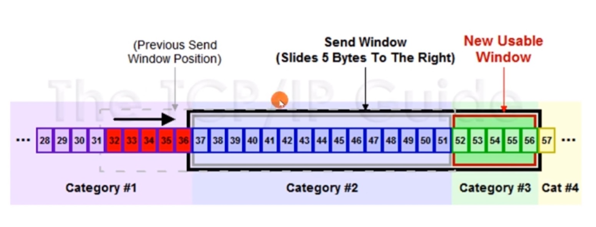{width="5.768055555555556in"
height="2.2104166666666667in"}

如上图，32\~36的数据收到了ack确认，并且发送窗口的大小没有改变时，我们的发送窗口发生移动，右移5个字节，此时52\~56字节成为了我们可用窗口。

### 接收窗口

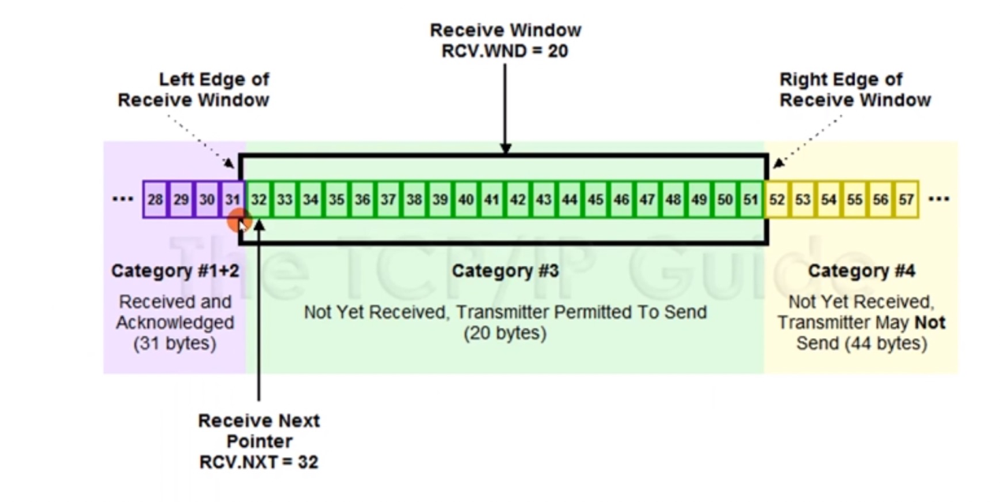{width="5.768055555555556in" height="2.9in"}

重传策略
--------

### 乐观发送

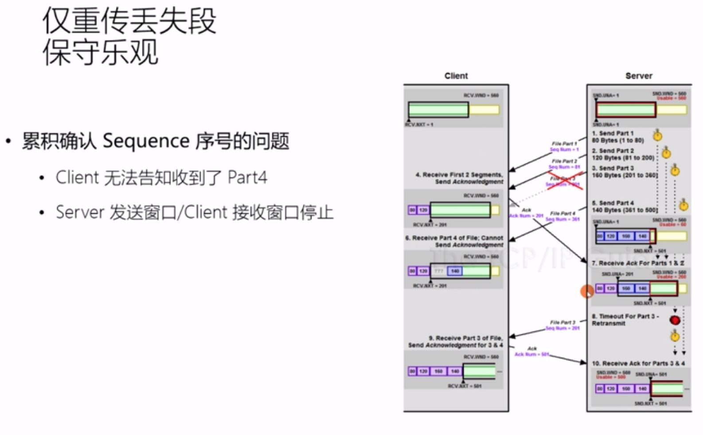{width="5.768055555555556in"
height="3.571527777777778in"}

为什么client无法告知收到了part4？

TCP的报文到达确认（ACK），是对接收到的数据的最高序列号的确认，并向发送端返回一个下次接收时期望的TCP数据包的序列号（Ack
Number）。

TCP数据包中的序列号（Sequence
Number）不是以报文段来进行编号的，而是将连接生存周期内传输的所有数据当作一个字节流，序列号就是整个字节流中每个字节的编号。

如果回复了part4，代表着part4之前的全部收到了。

### 悲观发送

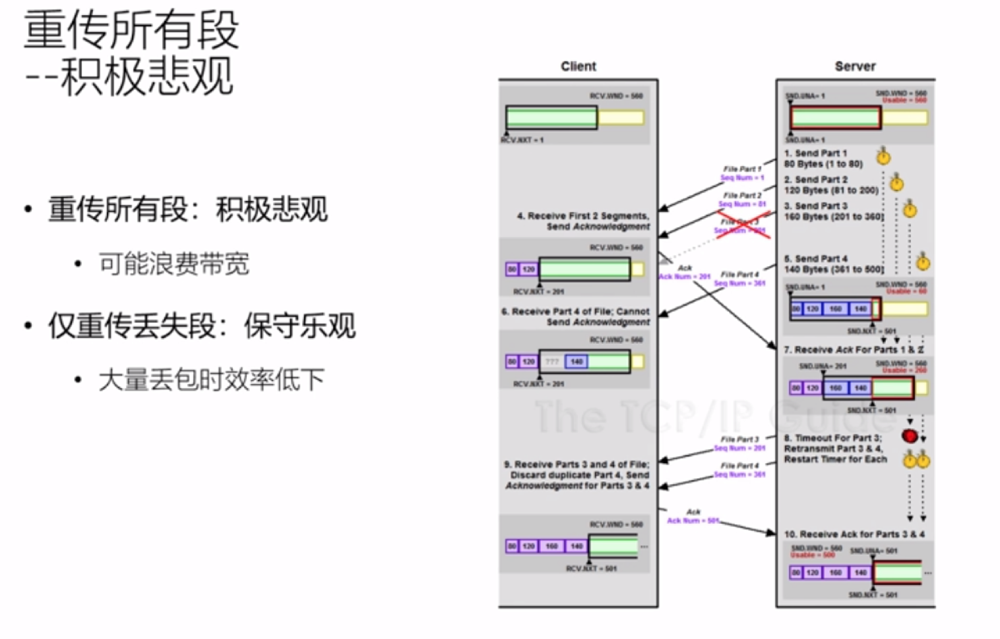{width="5.768055555555556in"
height="3.6909722222222223in"}

### 快速重传

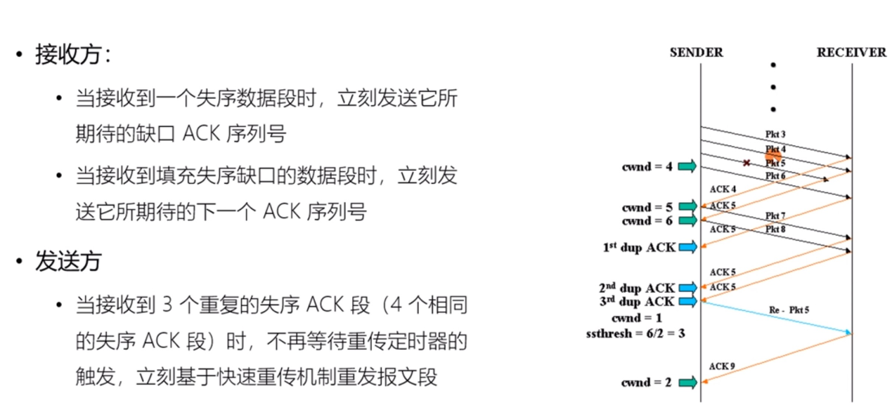{width="5.768055555555556in"
height="2.714583333333333in"}

失序ACK，ack的值是缺失的报文的编号。

### SACK

选择性重传：

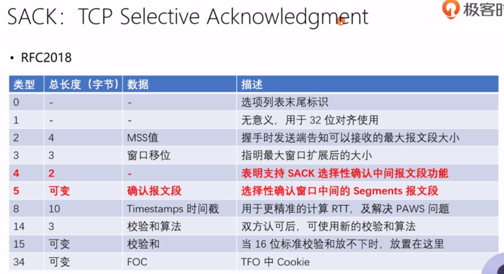{width="5.768055555555556in"
height="3.1368055555555556in"}

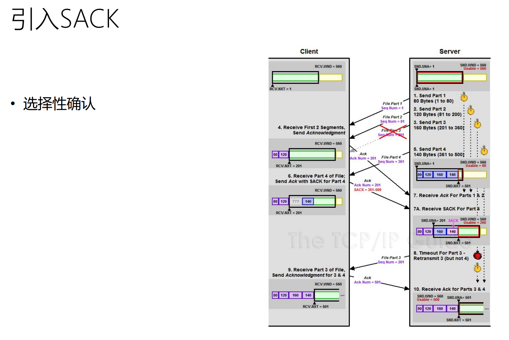{width="5.768055555555556in"
height="3.8583333333333334in"}

TCP的报文到达确认（ACK），是对接收到的数据的最高序列号的确认，并向发送端返回一个下次接收时期望的TCP数据包的序列号（Ack
Number）。SACK标识已经收到了哪些失序报文。

例如，server发送的当前数据序号是400，数据长度是100，则client收到后会返回一个确认号是501的确认号给client。但是700-800
已经到达了client，Client
的ack中会确认号为501，SACK标识失序报文为700-800。那么server就可以直接将500-700的重传就ok了。

TCP慢启动与拥塞避免
-------------------

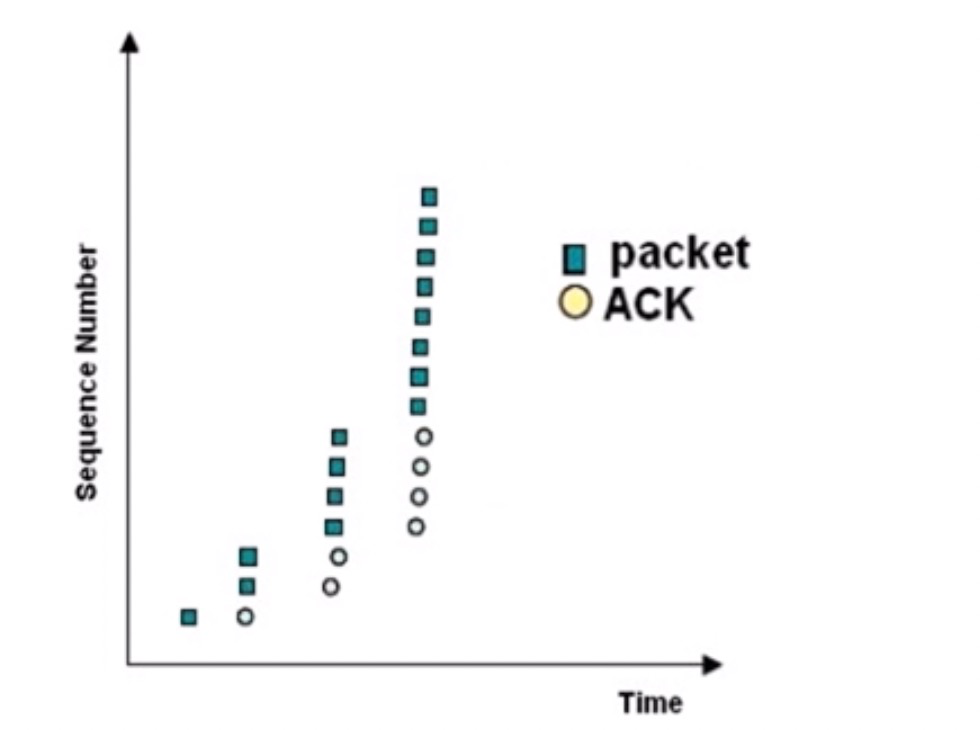{width="3.773480971128609in"
height="2.809440069991251in"}

最开始我们只发送一个mss，当我们收到ack后，第二次发送2个mss，收到ack并没有发生丢包后，我们发送4个mss，之后发送8个，以此类推，这是一个指数级增长的过程。它解决的问题是我们的tcp连接不清楚当前的网络状况，所以最开始我们试探性的发很小量的包，当我们确认网络中没有发生丢包之后，之后快速增长，当下我们慢启动的初始窗口是10个mss。

由于慢启动的过程中我们发送的mss是以指数形式上升的，如果发生丢包，那么丢包的数量将非常多，而拥塞避免就是为了解决这个问题。它解决问题的方式是定义了一个慢启动阈值，当我们的拥塞窗口到达阈值时，我们的增长速度变为线性增长。当发生丢包时，我们将之前的阈值取1/2，拥塞窗口再降为一个比较小的数重新指数增长，当到达新的阈值后，再次线性增长（拥塞避免算法），之后重复该过程。

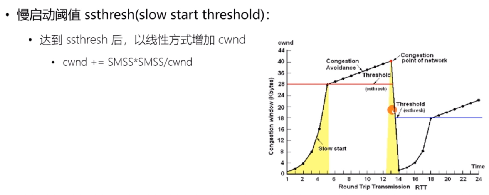{width="5.768055555555556in"
height="2.3048611111111112in"}

而当我们慢启动过程中如果还没到达我们的慢启动阈值时就发生了丢包，此时我们根据当前的拥塞窗口的值，取1/2生成新的阈值，重新开始慢启动.

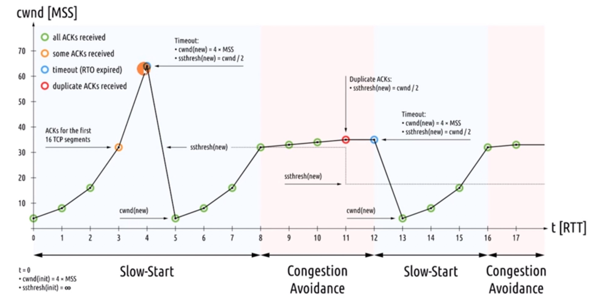{width="5.768055555555556in"
height="2.9520833333333334in"}

Nagle算法与延迟确认？
---------------------

Nagle算法：

是为了减少广域网的小分组数目，从而减小网络拥塞的出现；

该算法要求一个tcp连接上最多只能有一个未被确认的未完成的小分组，在该分组ack到达之前不能发送其他的小分组，tcp需要收集这些少量的分组，并在ack到来时以一个分组的方式发送出去；

如果不启用nagle算法，将是HELLO每个字符都一个请求。

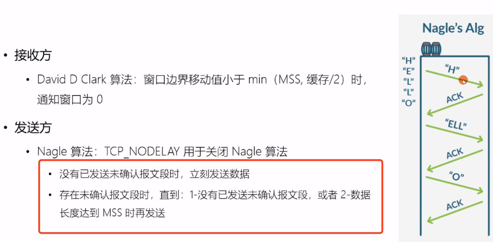{width="5.768055555555556in"
height="2.8354166666666667in"}

延迟确认：

如果tcp对每个数据包都发送一个ack确认，那么只是一个单独的数据包为了发送一个ack代价比较高，所以tcp会延迟一段时间，如果这段时间内有数据发送到对端，则捎带发送ack，如果在延迟ack定时器触发时候，发现ack尚未发送，则立即单独发送；

同时使用Nagle和延迟ACK的问题：

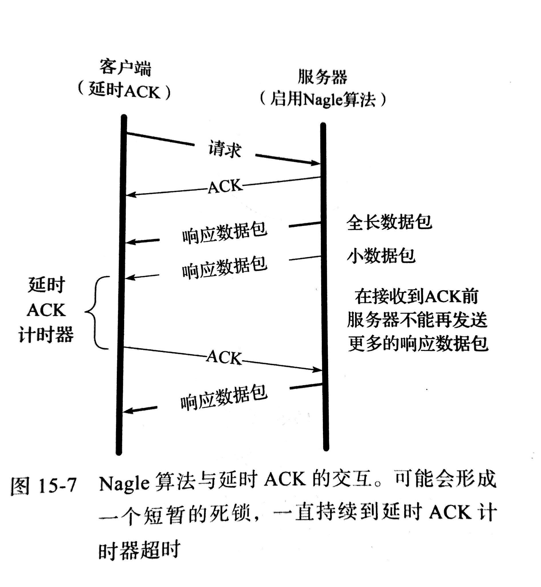{width="3.906464348206474in"
height="4.237568897637796in"}

TCP可通过配置进行延迟ACK和Nagle算法的关闭。

KCP可选择关闭延迟确认机制，并且没有使用Nagle算法。

RTO
---

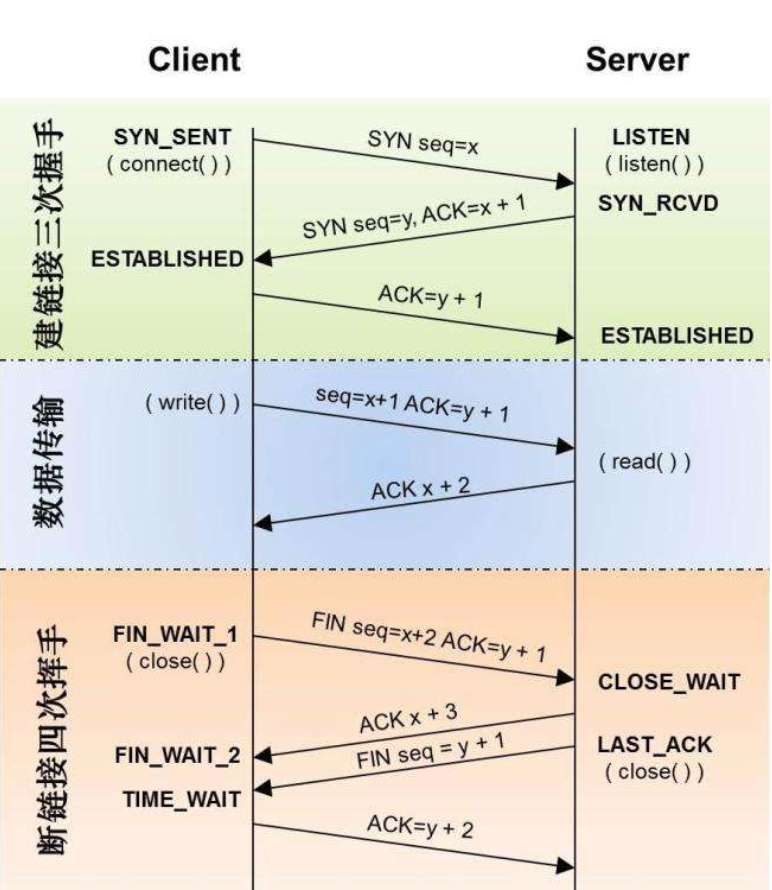{width="4.159762685914261in"
height="4.795580708661418in"}

TCP是一个很可靠的消息协议，建立连接和断开连接以及通讯过程中，会需要发送ack包用于消息的确认。

如果没有收到ACK会怎么样？重传。

RTO: TCP超时重传机制(RTO：Retransmission Timeout) 

RTT: 往返时延(Round-Trip Time):

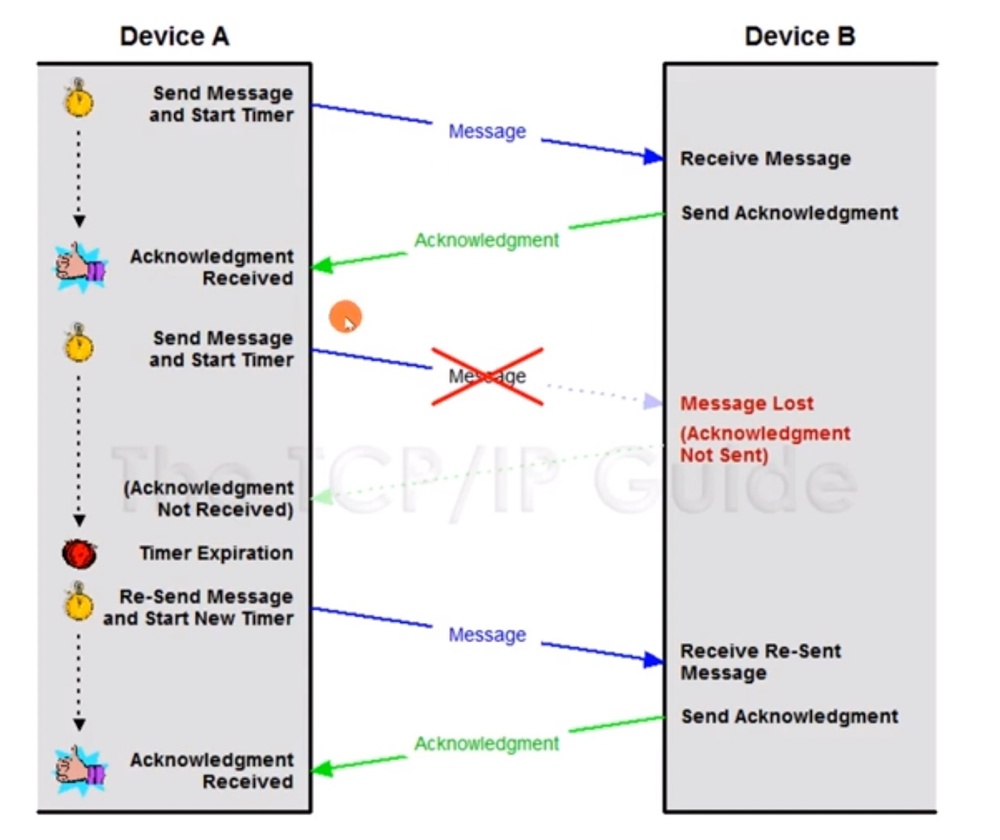{width="4.548202099737533in"
height="3.823205380577428in"}

超时重传指的是，发送数据包在一定的时间内没有收到相应的ACK，等待一定的时间，超时之后就认为这个数据包丢失，就会重新发送。这个等待时间被称为RTO，即重传超时时间。

TCP的默认RTO为上一次RTO的2倍，linux默认重试策略为3次，这样连续丢三次包就变成RTOx8了。

在TCP协议中，定义了发送窗口和接收窗口。

{width="4.845304024496938in"
height="2.807662948381452in"}

结合刚才的RTO，当32的ack包没有收到时，窗口将不会后移，接受新的数据。所以8RTO对于网速敏感的应用很不友好，KCP急速模式下把RTO将为1.5倍而不是8。

概述
====

KCP是一个快速可靠ARQ（自动重传请求Automatic
Repeat-reQuest，ARQ）协议，能以比
TCP浪费10%-20%的带宽的代价，换取平均延迟降低
30%-40%，且最大延迟降低三倍的传输效果。纯算法实现，并不负责底层协议（如UDP）的收发，需要使用者自己定义下层数据包的发送方式，以
callback的方式提供给 KCP。

KCP是通过UDP定制化用于网络加速的类TCP协议。

技术特性
========

TCP是为流量设计的（每秒内可以传输多少KB的数据），讲究的是充分利用带宽。而
KCP是为流速设计的（单个数据包从一端发送到一端需要多少时间），以10%-20%带宽浪费的代价换取了比
TCP快30%-40%的传输速度。

-   RTO翻倍vs不翻倍：

TCP超时计算是RTOx2，这样连续丢三次包就变成RTOx8了，十分恐怖，而KCP启动快速模式后不x2，只是x1.5（实验证明1.5这个值相对比较好），提高了传输速度。

-   选择性重传 vs 全部重传：

TCP丢包时会全部重传从丢的那个包开始以后的数据，KCP是选择性重传，只重传真正丢失的数据包。

-   快速重传：

发送端发送了1,2,3,4,5几个包，然后收到远端的ACK: 1, 3, 4,
5，当收到ACK3时，KCP知道2被跳过1次，收到ACK4时，知道2被跳过了2次，此时可以认为2号丢失，不用等超时，直接重传2号包，大大改善了丢包时的传输速度。

-   延迟ACK vs 非延迟ACK：

TCP为了充分利用带宽，延迟发送ACK（NODELAY都没用），这样超时计算会算出较大
RTT时间，延长了丢包时的判断过程。KCP的ACK是否延迟发送可以调节。

-   UNA vs ACK+UNA：

ARQ模型响应有两种，UNA（此编号前所有包已收到，如TCP）和ACK（该编号包已收到），光用UNA将导致全部重传，光用ACK则丢失成本太高，以往协议都是二选其一，而
KCP协议中，除去单独的 ACK包外，所有包都有UNA信息。

-   非退让流控：

KCP正常模式同TCP一样使用公平退让法则，即发送窗口大小由：发送缓存大小、接收端剩余接收缓存大小、丢包退让及慢启动这四要素决定。但传送及时性要求很高的小数据时，可选择通过配置跳过后两步，仅用前两项来控制发送频率。以牺牲部分公平性及带宽利用率之代价，换取了开着BT都能流畅传输的效果。

协议逻辑
========

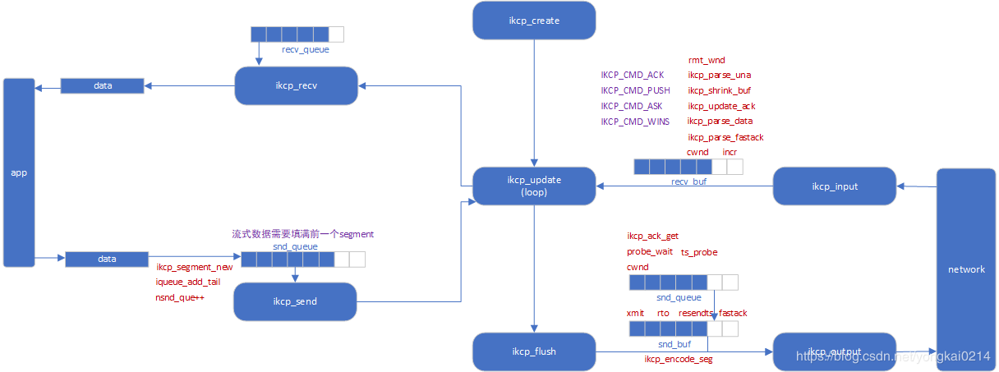{width="5.768055555555556in"
height="2.1475251531058617in"}

KCP通过ikcp\_create
创建一个KCP对象，每个不同的会话将产生不同的对象。因为KCP协议本身并没有提供网络部分的代码，所以需要将UDP发送函数的回调设置到KCP中，在有需要时，调用回调函数即可。KCP也支持外部的内存分配与日志回调，为用户提供了非常充分的自由度。

整个KCP协议主要依靠一个循环ikcp\_update来驱动整个算法的运转，所有的数据发送，接收，状态变化都依赖于此，所以如果有操作占用每一次update的周期过长，或者设置内部刷新的时间间隔过大，都会导致整个算法的效率降低。在ikcp\_update中最终调用的是ikcp\_flush，这是协议中的一个核心函数，将数据，确认包，以及窗口探测和应答发送到对端。

KCP使用ikcp\_send发送数据，该函数调用ikcp\_output发送数据，实际上最终调用事先注册的发送回调发送数据。KCP通过ikcp\_recv将数据接收出来，如果被分片发送，将在此自动重组，数据将与发送前保持一致。

<https://blog.csdn.net/yongkai0214/article/details/85156452

数据结构
========

下图是发送的数据结构。

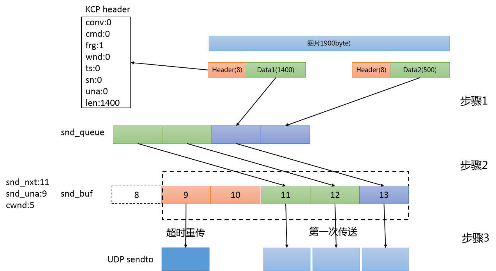{width="5.768055555555556in"
height="3.1633902012248467in"}

如上图中，snd\_queue待发送队列中有4个KCP包等待发送，这个时候snd\_nxt下一个发送的kcp包序列号为11，snd\_una下一个确认的KCP包为9（8已经确认，9，10已经发送但是还没得到接收方的确认）。因为cwnd=5，发送队列中还有2个发送了但是还未得到确认，所以可以从待发送队列中取前面的3个KCP包放入到发送队列中，序列号分别设置为11,12,13。

<https://www.cnblogs.com/wetest/p/9190786.html

KCPTUN
======

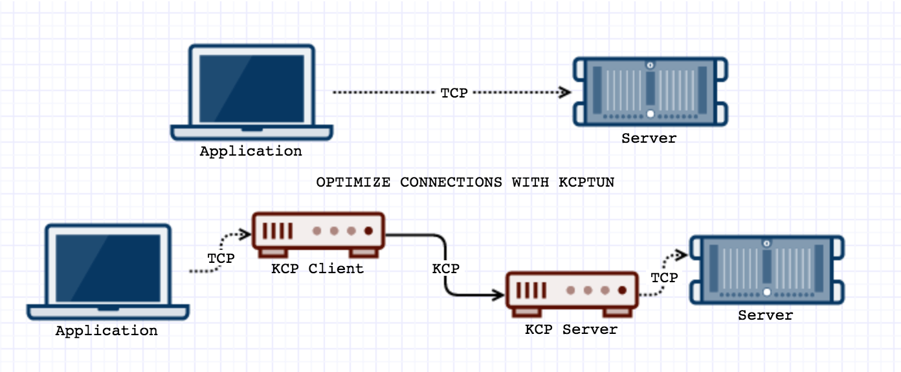{width="5.768055555555556in"
height="2.3868055555555556in"}

KCPTUN是一个使用KCP建立的安全和高效的隧道。

<https://github.com/xtaci/kcptun

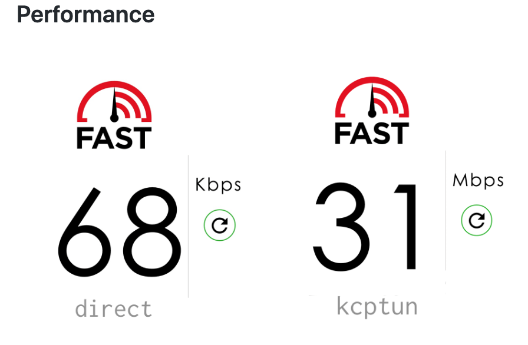{width="5.768055555555556in"
height="3.772222222222222in"}

其他
====

MTU 1500？576？
---------------

MTU是网络连接中允许在一个物理帧中传输的最大数据量，TCP/IP驱动程序需要知道这个数值以便设置合适的数据包长度，以避免出现不必要的拆分过程。不同网络的MTU缺省值不一样，以太网的标准值为1500，而多数ISP提供的拨号网络的标准值为576，原因是Internet上不少路由器也为576。原则上来说，只要网络连接稳定性高，MTU越大则传输效率越高。但是，如果接收机器所在网络或传输路径上路由器的MTU小的话，数据帧将不得不再次被拆分，这样反而降低了效率。

普遍使用的MTU以下可参考：

FDDI协议：4352字节

以太网（Ethernet）协议：1500字节

PPPoE（ADSL）协议：1492字节

X.25协议（Dial Up/Modem）：576字节

Point-to-Point：4470字节

ipv4协议规定ip层的最小重组缓冲区大小为576！，最小重组缓冲区大小 (minimum
reassembly buffer size) 是指 IPv4/IPv6
都必须保证支持的最小数据报大小，其值 IPv4 为 576
字节。比如，对于IPv4来说，目的主机小于576字节的数据报都可以被接受。

通常MTU 576
会与UDP一起讨论。UDP是一种不可靠的传输协议，所以当使用时尽量符合MTU小于576，避免一些链路上的问题，避免被丢包。

\*\*

X.25
是一个使用电话或者ISDN设备作为网络硬件设备来架构广域网的ITU-T网络协议。它的实体层，数据链路层和网络层（1－3层）都是按照OSI模型来架构的。在国际上X.25的提供者通常称X.25为分封交换网（Packet
switched
network），尤其是那些国营的电话公司。它们的复合网络从80年代到90年代覆盖全球，在现在仍然应用于交易系统中。\
<https://zh.wikipedia.org/wiki/X.25

Write写成功了？
---------------

Socket write阻塞写返回之后，是指什么？成功传输到对方网络？

对于发送数据来说，应用程序将数据拷贝到各自TCP发送缓冲区内（也就是发送滑动窗口），然后系统的所有TCP套接字上发送缓冲区（也就是发送滑动窗口）内的数据都将数据拷贝到内核发送缓冲区内，然后内核触发将内核缓冲区的数据经过网卡发送出去。

TCP的发送/接受缓冲区（也就是发送/接受滑动窗口），是针对某一个具体的TCP连接来说的，每一个TCP连接都会有相应的滑动窗口，但是内核的发送/接受缓冲区是针对整个系统的，里面存放着整个系统的所有TCP连接的接收/发送的数据。

UDP 有滑动窗口吗？
------------------

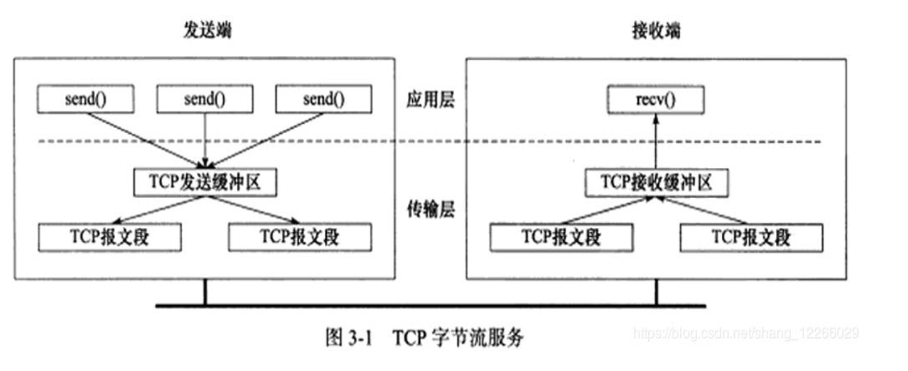{width="5.768055555555556in"
height="2.3645833333333335in"}

TCP有一个发送缓冲区，每次TCP发送数据的时候，都会先将数据发送到发送缓冲区里面，之后，发送缓冲区中的数据可能会被封装成一个或多个TCP报文段发出。

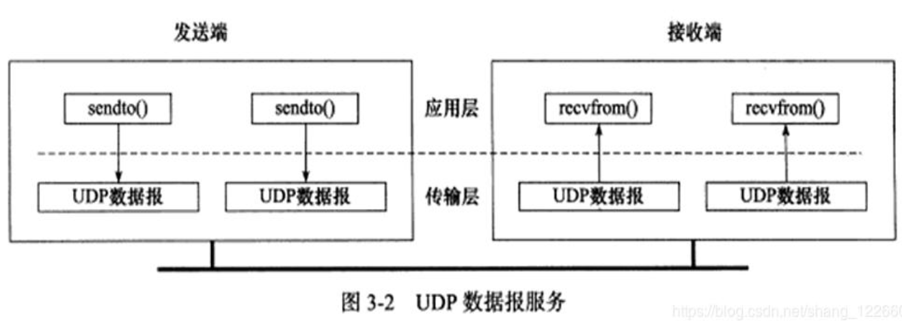{width="5.768055555555556in"
height="2.053472222222222in"}

它的发送端每次执行一次写操作，UDP就将其封装成一个数据报发送出去，接收端必须及时对每个UDP数据报进行写操作，否则将会丢包。此外，如果客户没有指定足够的应用程序缓冲区来读取UDP数据，则UDP数据将会被截断。

<https://blog.csdn.net/ljh0302/article/details/49738191

<http://www.pianshen.com/article/1818281353/

资源
====

<http://kaiyuan.me/2017/07/29/KCP%E6%BA%90%E7%A0%81%E5%88%86%E6%9E%90/

<https://github.com/skywind3000/kcp

<https://www.cnblogs.com/wetest/p/9190786.html

<https://github.com/xtaci/kcptun

<https://www.cnblogs.com/purpleraintear/p/6403053.html

<https://blog.csdn.net/yusiguyuan/article/details/28625129

<https://zhuanlan.zhihu.com/p/53849089
