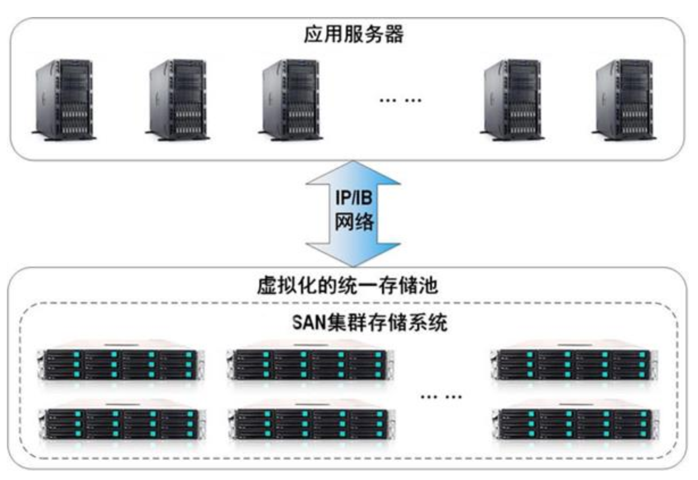
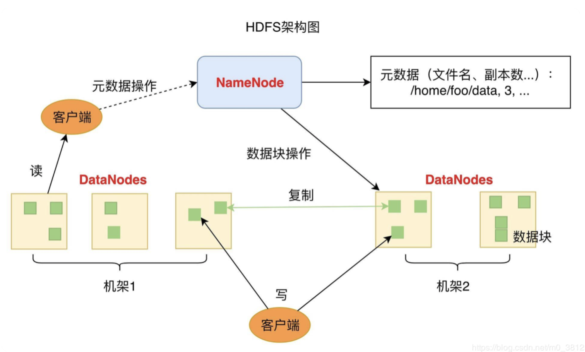
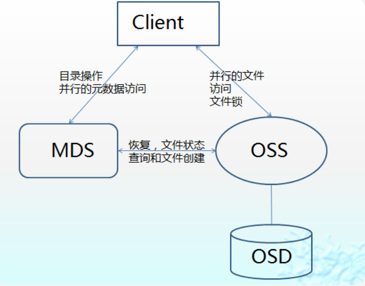
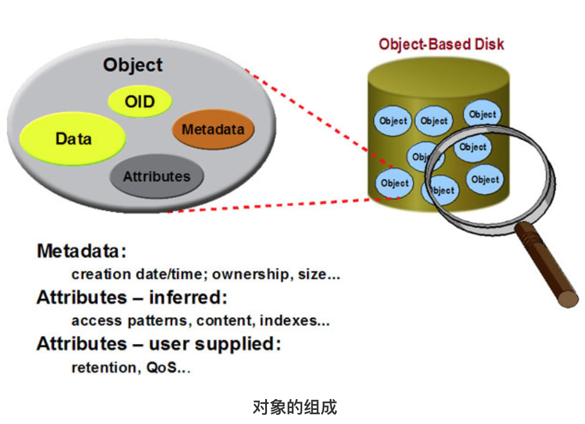
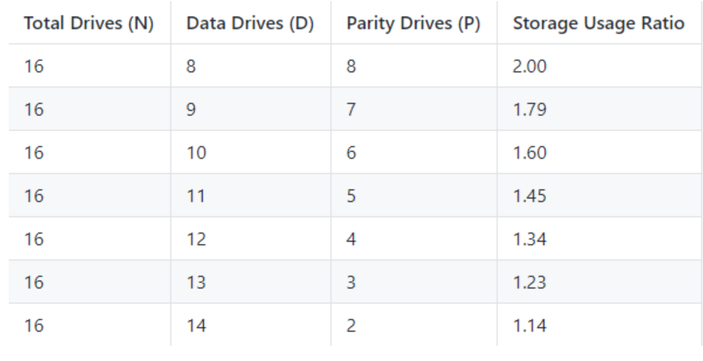
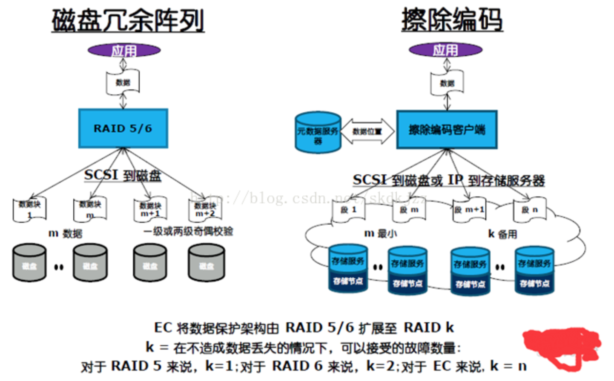

 概述
====

Minio
是一个基于Go语言的对象存储服务。它实现了大部分亚马逊S3云存储服务接口，可以看做是是S3的开源版本，非常适合于存储大容量非结构化的数据，例如图片、视频、日志文件、备份数据和容器/虚拟机镜像等，而一个对象文件可以是任意大小，从几kb到最大5T不等。

对象存储
========

计算机的存储，大致分为块存储、文件存储和对象存储。

 块存储
------

块存储又有两种常见的形式，DAS和SAN。

### DAS

DAS即直接连接存储（Direct Attached Storage）。

块存储是我们最常用的一种存储模式。比如个人PC上的硬盘，服务器上的硬盘。这种存储方式有一种很大的缺陷，其存储性能瓶颈来自于自家PC电脑或者服务器的卡槽的多少

{width="3.429738626421697in"
height="2.414773622047244in"}

### SAN

SAN即存储区域网络（Storage Area Network）。

SAN是一个采用网状通道（简称FC）技术，通过FC交换机连接存储阵列和服务器主机，建立专用于数据存储的区域网络。对于用户来说，SAN好比是一块大磁盘，用户可以根据需要随意将SAN格式化成想要的文件系统来使用。

{width="3.9341404199475067in"
height="2.7102274715660544in"}

从理论上来讲，SAN支持数以百计的磁盘，提供了海量的存储空间，解决了大容量存储问题，但SAN需要通过光纤交换机连接存储阵列和服务器，建立专用数据存储的网络。

### 总结

块存储需要格式化成文件系统（ext3、ext4、NTFS等）后才能被访问。它的优势是性能高、时延低，适合于OLTP数据库、NoSQL数据库等IO密集型的高性能、低时延应用工作负载。但是块存储无法容量弹性扩展，并且对共享访问的支持有限。因此，块存储主要还是针对单ECS的高性能，低时延的存储产品。

文件存储
--------

NAS（Network Attached
Storage）是一种通过网络达成存储目的的设备，NAS传输数据依靠的是TCP/IP网络协议栈，这是NAS存储于上文的DAS和SAN存储最大的不同之处。

{width="3.511363735783027in"
height="2.769776902887139in"}

实现文件存储的方式有很多，比如
ftp协议、nfs协议、samba协议等，还有HDFS、GFS等。

对象存储
--------

相对于文件存储目录树的组织形式，对象存储采用扁平的文件组织形式，采用RESTFul
API接口访问，不支持文件随机读写，主要适用于互联网架构的海量数据的上传下载和分发。非常适合于存储大容量非结构化的数据，例如图片、视频、日志文件、备份数据和容器/虚拟机镜像等，而一个对象文件可以是任意大小，从几kb到最大5T不等。

它核心是将数据通路（数据读或写）和控制通路（元数据）分离，并且基于对象存储设备（Object-based
Storage
Device，OSD）构建存储系统，每个对象存储设备具有一定的智能，能够自动管理其上的数据分布。

之所以出现了对象存储这种东西，是为了克服块存储与文件存储各自的缺点，发扬它俩各自的优点。简单来说块存储读写快，不利于共享，文件存储读写慢，利于共享。能否弄一个读写快，利于共享的出来呢。于是就有了对象存储。

总结
----

{width="5.768055555555556in"
height="3.2645833333333334in"}

核心
====

 存储架构
--------

Standalone，集群

### 分布元数据

####  Inode

inode(index
node)是指在许多"类Unix文件系统"，文件系统创建（格式化）时，就把存储区域分为两大连续的存储区域。一个用来保存文件系统对象的元信息数据，这是由inode组成的表，每个inode默认是256字节或者128字节。另一个用来保存"文件系统对象"的内容数据，划分为512字节的扇区，以及由8个扇区组成的4K字节的块。块是读写时的基本单位。

索引结点（Inode）对象存储了文件的相关元数据信息，如所有者、访问权限（读、写、执行）、类型（是文件还是目录）、内容修改时间、inode修改时间、上次访问时间、对应的文件系统存储块的地址，等等。知道了1个文件的inode号码，就可以在inode元数据中查出文件内容数据的存储地址。(<https://zh.wikipedia.org/wiki/Inode>)

由于每个文件都必须有一个inode，因此有可能发生inode已经用光，但是硬盘还未存满的情况。这时，就无法在硬盘上创建新文件。

以上能够了解元数据对存储系统的重要性。

####  分布式文件存储（HDFS）

{width="5.768055555555556in"
height="3.472916666666667in"}

NameNode
负责整个分布式文件系统的元数据（MetaData）管理，也就是文件路径名、数据块的
ID 以及存储位置等信息，DataNode 负责文件数据的存储和读写操作，HDFS
将文件数据分割成若干数据块。每个 DataNode
存储一部分数据块，这样文件就分布存储在整个 HDFS
服务器集群中。客户端可以对这些数据块进行并行访问，大大提高了访问速度。

目前的大多数文件系统，如XFS/Ext4、GFS、HDFS，在元数据管理、缓存管理等实现策略上都侧重大文件。这些文件系统在面临海量时在性能和存储效率方面都大幅降低。

在HDFS中，当小文件太多时，加重HDFS的namespace命名空间，因为过多的小文件意味着更多文件元数据信息需要NameNode来保存了。

对于该问题也提供了相应解决方案:\
<https://blog.csdn.net/Androidlushangderen/article/details/54176511>

-   文件归档

 文件归档在这里的意思是将文件再次进行整理和保存，使之更易管理和保存。通过二层索引文件的查找，进行最终文件的读取。

-   改变写入方式

 通过改变文件的写出方式，写入到SequenceFile格式的文件中。这主要是因为SequenceFile独有的存储格式决定了它可以很好的满足小文件存储的需求。SequenceFile文件内部存储数据的方式是以key-value的形式拼接而成。因为考虑到小文件中的内容少，在这里我们可以以文件名作为key，文件内容作为value，直接写到SequenceFile中。

-   依赖外部系统的数据访问模式进行数据的管理，比如HBase。

####  Taobao File System

对于海量小文件应用，常见的I/O流程复杂也是造成磁盘性能不佳的原因。对于小文件，磁盘的读写所占用的时间较少，而用于文件的open()操作占用了绝大部分系统时间，导致磁盘有效服务时间非常低，磁盘性能低下。针对于问题的根源，优化的思路大体上分为：

1.  针对数据布局低效，采用小文件合并策略，将小文件合并为大文件

2.  针对元数据管理低效，优化元数据的存储和管理

{width="5.768055555555556in" height="3.825in"}

-   小文件合并

小文件合并为大文件后，首先减少了大量元数据，提高了元数据的检索和查询效率，降低了文件读写的I/O操作延时。其次将可能连续访问的小文件一同合并存储，增加了文件之间的局部性，将原本小文件间的随机访问变为了顺序访问，大大提高了性能。

访问流程由原来许多的open操作转变为了seek操作，定位到大文件具体的位置即可。利用一个旁路数据库来记录每个小文件在这个大文件中的偏移量和长度等信息。其实小文件合并的策略本质上就是通过分层的思想来存储元数据。中控节点存储一级元数据，也就是大文件与底层块的对应关系；数据节点存放二级元数据，也就是最终的用户文件在这些一级大块中的存储位置对应关系，经过两级寻址来读写数据。(与HDFS的归档方案一致)

淘宝的TFS就采用了小文件合并存储的策略。TFS中默认Block大小为64M，每个块中会存储许多不同的小文件，但是这个块只占用一个Inode。假设一个Block为64M，数量级为1PB。那么NameServer上会有
1 1024 1024 \* 1024 / 64 =
16.7M个Block。假设每个Block的元数据大小为0.1K，则占用内存不到2G。在TFS中，文件名中包含了Block
ID和File ID，通过Block
ID定位到具体的DataServer上，然后DataServer会根据本地记录的信息来得到File
ID所在Block的偏移量，从而读取到正确的文件内容。

{width="5.768055555555556in"
height="2.7180555555555554in"}

-   元数据管理优化

一般来说元数据信息包括名称、文件大小、设备标识符、用户标识符、用户组标识符等等，在小文件系统中可以对元数据信息进行精简，仅保存足够的信息即可。元数据精简可以减少元数据通信延时，同时相同容量的Cache能存储更多的元数据，从而提高元数据使用效率。另外可以在文件名中就包含元数据信息，从而减少一个元数据的查询操作。最后针对特别小的一些文件，可以采取元数据和数据并存的策略，将数据直接存储在元数据之中，通过减少一次寻址操作从而大大提高性能。

TFS中文件命名就隐含了位置信息等部分元数据，从而减少了一个元数据的查询操作。在Rerserfs中，对于小于1KB的小文件，Rerserfs可以将数据直接存储在Inode中。

####  对象存储系统

{width="3.3522725284339456in"
height="2.629233377077865in"}

对象存储结构由对象(Object)、对象存储设备（Object-based Storage
Device，OSD）、元数据服务器（Metadata
Server，MDS）、对象存储服务（OSS）的客户端四部分组成。

按照上面业务发展的分析，目前对象存储的架构大致就可以为上图。

传统的存储结构元数据服务器通常提供两个主要功能：

1.  **为计算结点提供一个存储数据的逻辑视图（Virtual File
    System，VFS层），文件名列表及目录结构**

 MDS控制Client与OSD对象的交互，为客户端提供元数据，主要是为计算结点提供一个存储数据的逻辑视图（Virtual
 File
 System，VFS层），包括文件与目录的组织关系、每个文件所对应的OSD等。

{width="4.215908792650919in"
height="2.4074212598425198in"}

2.  **组织物理存储介质的数据分布（inode层）**

{width="3.21042104111986in"
height="2.3295450568678917in"}

 对象存储的数据存储服务中的Object也包含了元数据信息（TFS同样提到名字中就包含BlockID信息的思路）。元数据的VFS部分通常是元数据服务器的10％的负载，剩下的90％工作（inode部分）是在存储介质块的数据物理分布上完成的。在对象存储结构，inode工作分布到每个OSD，每个OSD负责管理数据分布和检索，这样90%的元数据管理工作分布到OSD，从而提高了系统元数据管理的性能。另外，分布的元数据管理，在增加更多的OSD到系统中时，可以同时增加元数据的性能和系统存储容量。

对象存储体系结构定义了一个新的、数据访问接口。OSD是与网络连接的设备，它自身包含存储介质，并具备元数据。计算结点直接与OSD通信，访问它存储的数据，不需要元数据服务器的介入。如果将文件系统的数据分布在多个OSD上，能支持并发数据访问。

<https://blog.csdn.net/liuaigui/article/details/17973039>

### Minio元数据管理

Minio的Metadata管理没有采用集中式的管理。

{width="5.768055555555556in"
height="1.0763888888888888in"}

在Minio白皮书中写到：Minio没有单独的元数据存储，所有的操作都和对象操作一致，同样都采用了纠删码和bitrot哈希进行数据保护，即使集群崩溃也不会丢数据。另一个优点是这个设计是强一致性，这对分布式机器学习和大数据工作负载很重要。

{width="5.768055555555556in"
height="3.1645833333333333in"}

在Minio白皮书中的线性扩展测试一章中描述：

测试结果表明，Minio集群的读写性能，随着服务器数量的增加而线性增加。具备这种线性扩展的能力的一个原因是因为minio它使用自身进行元数据的存储，而不是使用元数据服务器。这样的目的是避免了中央元数据服务器可能的瓶颈。结果是，在扩展minio对象存储时不需要考虑重要元数据服务器的性能对服务的影响。

数据安全
--------

在分布式系统中，都会采用数据冗余的方式保证数据安全性。比如mysql
主从复制，cassandra、elasticsearch的多副本存储策略。当任何一个副本损坏或丢失的情况下，其他副本都能保证系统整体数据安全。

但是采用副本的方式，会要求存储空间以倍数的方式增加。而RS纠错码冗余策略在保证数据安全的同时，对存储空间的要求更低。

例如：RS纠删码语序我们选择数据片和校验片的数量，可以将一个完整的对象平均分为4个数据片和2个校验片，共6个分片，其中4个数据分片是原始大小的25%，另外2个校验片也为25%。这6个分片将会存储在6个不同的数据服务节点上，只需要其中任意4个就可以恢复出完整的对象。也就是允许2块损坏。这样存储要求是150%，抵抗能力是2.

总体来说，对于一个M+N的RS码（M个数据片，N个校验片）对存储的要求是（M+N）/M\*100%，抵抗能力是N。

Minio使用了Reed-Solomon纠删码和校验和来保护数据免受硬件故障和无声数据损坏。在高级别的冗余下，可以在失去N/2的数据存储下恢复数据。

针对不同应用所需的数据安全级别不同，Minio还提供了存储级别（Storage
Class）的配置，调整数据块和校验块的比例，做到对空间的最佳使用。比如在将比例调整为14:2后，存储100M的数据占用的空间仅为114M

{width="5.768055555555556in"
height="2.9652777777777777in"}

纠删码的工作原理和RAID或者副本不同，像RAID6可以在损失两块盘的情况下不丢数据，而Minio纠删码可以在丢失一半的盘的情况下，仍可以保证数据安全。
而且Minio纠删码是作用在对象级别，可以一次恢复一个对象，而RAID是作用在卷级别，数据恢复时间很长。
Minio对每个对象单独编码，存储服务一经部署，通常情况下是不需要更换硬盘或者修复。

### Reed-Solomon纠删码

纠删码是一种恢复丢失和损坏数据的数学算法， Minio默认采用Reed-Solomon
code将数据拆分成N/2个数据块和N/2个奇偶校验块。这就意味着如果是16块盘，一个对象会被分成8个数据块、8个奇偶校验块，你可以丢失任意8块盘（不管其是存放的数据块还是校验块），你仍可以从剩下的盘中的数据进行恢复。

{width="5.768055555555556in"
height="3.5840277777777776in"}

开源的golang实现

<https://github.com/klauspost/reedsolomon>

### RAID技术

数据存储在单个磁盘上，存在一些缺陷：

-   访问速度慢：单一的IO接口，无法并发

-   容量小：单个磁盘的提升，无法满足爆发时增长的数据存储需求

-   安全性差：容易成为单个故障节点

RAID就是通过对多个磁盘进行联合提供存储服务，已解决上面的问题。

单个磁盘数据是以扇区为基本单位进行存储和访问，RADI抽象出一个类似于扇区的最小数据访问单位：条带（stripe），这是一种虚拟化的设计方法，他是在多个磁盘之间建立一个逻辑映射关系，将多个物理磁盘抽象为一个容量更大的、IO并发能力更高的虚拟硬盘，一条带作为基本单位进行管理。

{width="3.875in" height="3.735974409448819in"}

途中单个条带跨过的磁盘个数，成为条带宽度，单个条带在单个次攀升分配的字节数，成为条带深度，条带深度一版为磁盘基本块的整数倍。基本快指访问磁盘的最小粒度，例如扇区。

#### RAID0

RAID 0
并不是真正的RAID结构，没有数据冗余，没有数据校验的磁盘陈列。实现RAID
0至少需要两块以上的硬盘，它将两块以上的硬盘合并成一块，数据连续地分割在每块盘上。
因为带宽加倍，所以读/写速度加倍， 但RAID
0在提高性能的同时，并没有提供数据保护功能，只要任何一块硬盘损坏就会丢失所有数据。因此RAID
0 不可应用于需要数据高可用性的关键领域。

{width="3.2086745406824146in"
height="2.9479166666666665in"}

#### RAID1

RAID 1通过磁盘数据镜像实现数据冗余，在成对的独立磁盘上产生互
为备份的数据。当原始数据繁忙时，可直接从镜像拷贝中读取数据，因此RAID
1可以提高读取性能。RAID
1是磁盘阵列中单位成本最高的，但提供了很高的数据安全性和可用性。当一个磁盘失效时，系统可以自动切换到镜像磁盘上读写，而不需要重组失效的数据。

{width="1.2054199475065617in"
height="2.1979166666666665in"}

#### RAID5

RAID5以一个或者多个基本块作为条带深度均分数据，同时基于异或运算生成一个与数据块同等大小的校验块。因此RAID5提供的IO能力以及可用存储空间为所有磁盘的(N-1)/N，N为磁盘个数，亦即RAID5的条带宽度。

由异或运算性质，如果条带中任意一个数据块出错，都可以通过其他任然正常的数据块和校验块执行异或运算恢复数据。因此RAID5至多允许一块磁盘异常。

#### RAID6

RAID6在RAID5的基础上进一步提高了容错能力，在每一个条带增加了一个校验块，达到每个条带有两个校验块，具备最多允许两块磁盘异常。

#### RS-RAID

简单理解纠删的原理（实际实现复杂的多）：RAID5基于条带将数据均匀切分成多个数据块：d1,d2,d3..dn，然后将数据块建立联系，例如加法:d1+d2+d3+...dn=c。c就是基于加法的校验块，这样任意一个数据块损坏，都可以根据上面公式进行数据恢复。

RAID6或者更高的容忍方案，就是利用条带中N个数据块通过编码得到m个校验块（m为同时允许损坏磁盘个数），如果磁盘故障，通过编码逆向过程，可以还原所有缺失数据。

### 覆盖写问题

覆盖写就是针对对象已有的内容进行改写，普通磁盘数据操作并不需要特别注意，但当数据使用了纠删码情况就不一样了。

纠删码通过引入条带的概念，将条带变成了更新对象数据的最小单位，即更新条带中任意数据块的同时必须更新校验块，否则后续无法数据恢复，如果覆盖写的起始或结束地址没有尽心条带对其，那么对于不足一个完整条带的部分，写入只能通过"读取完整条带-\修改数据-\
基于条带重新计算校验数据-\ 写入"，这个过程被称为RMW（Read Modify
Write）。

RMW过程中的R，是为了和待改写的内容一起，再次拼凑出完整的条带，以完成纠删码所要求的重新编码计算，因此这个读也被称为补齐读，在RMW过程R最耗时。

对于覆盖写的场景，纠删码非常容易产生大量的RMW操作，这使得纠删码的综合写性能比多副本方案差，适合的场景为追加或者删除。

### 并发读

多副本方案实现中，因为副本间保存的内容相同，读取一个文件即可，这个过程是同步的。然而纠删码则不同，因为同一个对象的数据被分片并且存储在多个数据节点中，此时的读操作会是多个节点的并发读。

{width="5.768055555555556in"
height="2.8229166666666665in"}

读取数据过程中包括网络的耗时和纠删码的计算耗时，因此使用纠删码不适合时延敏感的应用。

拓展
====

Gateway
-------

消息通知
--------
<https://docs.min.io/docs/minio-bucket-notification-guide.html>

S3 Select
---------

S3 提供了select
API，可以让用户使用简单的sql语句，对csv、json、parquet格式的数据进行select
操作。

### 语法解析器
<https://github.com/alecthomas/participle>

NSQ
---
<https://nsq.io/>
<https://zhuanlan.zhihu.com/p/37081073>
参考
====
<https://github.com/jihonghe/fucking-algorithm>
<https://blog.csdn.net/Androidlushangderen/article/details/54176511>
<https://blog.csdn.net/liuaigui/article/details/17973039>
<https://blog.csdn.net/gui951753/article/details/82714065>
<https://www.zhihu.com/question/21536660>
<https://www.redhat.com/zh/topics/data-storage/file-block-object-storage>
<http://tech.dianwoda.com/2018/12/04/fen-bu-shi-cun-chu-xi-tong-miniojian-jie/>
