INNODB学习

问题
====

InnoDB如何保证了事务
--------------------

事务是数据库区别与文件系统的重要特征之一，在文件系统中，如果正在写文件，但是操作系统突然崩溃了，这个文件就很有可能损坏。在数据库中，事务会把数据库从一种一致性状态转换为另一种一致性状态。在数据库提交工作时，可以保证要么所有修改都已经保存了，要么所有修改都不保存。

-   Atomicity，原子性。整个数据库事务是不可分割的工作单位，只有使事务中所有的数据库操作都执行成功，才算整个事务成功。事务中任何一个SQL语句执行失败，已经执行成功的SQL语句也必须撤销，数据库应该退回到执行事务前的状态。

-   Consistency，一致性。一致性是指事务将数据库从一个状态转变为下一种一致性状态，在事务开始之前和事务结束之后，数据库的完整性约束没有被破坏。事务时一致性的单位，如果事务中某个动作失败了，系统可以自动此撤销事务（返回初始化的状态）

-   Isolation，隔离性。隔离性还有其他的称呼，如并发控制（concurrency
    control）、可串行化（serializability）、锁（locking）等。事务的隔离性要求每个读写事务的对象对其他事务操作对象能相互分离，即该事务提交前对其他事务都不可见，通常这使用锁来实现。

-   Durability，持久性。事务一旦提交，其结果就是永久性的。即使发生宕机等故障，数据库也能将数据恢复。

### 如何实现了原子性

原子性是只有使事务中所有的数据库操作都执行成功，才算整个事务成功。事务中任何一个SQL语句执行失败，已经执行成功的SQL语句也必须撤销，数据库应该退回到执行事务前的状态。

对于原子性是undo log 保证的还是redo
log保证的，书本上（《MYSQL技术内幕》）和网上有着不同的说法。个人理解，应该是redo
log 和undo log 结合实现的，redo log
通过COMMIT记录保证了所有数据都执行成功才算事务成功，undo log
保证了事务未COMMIT可以回退到执行前的状态。

在《数据库系统实现》一书中描述到，日志类型用到的几种形式：

1.  \<START T\>,表示事务T的开始

2.  \<COMMIT T\>,表示事务T已经完成并对数据库元素不再有修改

3.  \<ABORT T\>,表示事务T不能成功完成

当系统崩溃后需要做两件事：

-   按照从前往后做顺序，重做所有已提交的事务

> 使用redo log
> 恢复顺序为：1.确定已经提交的事务。2.从头扫描日志，如果T是已经COMMIT的事务，则将指写入到数据库3.如果T是未提交的事务，则在日志中写入\<ABORT
> T\>记录并刷新日志

-   按照从后往前做顺序，撤销所有未提交的事务

> 对于ABORT的事务，将通过undo log 进行回滚操作恢复数据

#### Undo log实现

在对数据库进行修改时，InnoDB存储引擎不但会生成redo log 还会生成undo
log。这样如果用户的事务或语句失败了或者调用ROLLBACK语句请求回滚，就可以利用这些undo
log将数据进行回滚。

Undo
log是逻辑日志，在回滚时，对于每个insert，引擎会执行一个delete，对于delete，引擎会执行一个insert。因此引擎回滚时他实际是做的与之前相反的工作。

### 如何实现了持久性

Mysql 使用WAL( Write-Ahead
Logging)来保证事务的持久性，它的关键点就是先写日志，再写引擎数据。具体来说，当有一条记录需要更新的时候，InnoDB
引擎就会先把记录写到 redo log里面，并更新内存，这个时候更新就算完成了。

有了 redo log，InnoDB
就可以保证即使数据库发生异常重启，之前提交的记录都不会丢失，这个能力称为
crash-safe。

Redo log 采用顺序写的操作，保证了写入速度。在具体的写redo
log过程中，为了保证日志能够安全的写入到磁盘中，引擎会调用一次fsync操作。这是因为redo
log没有使用O\_DIRECT，因此当写入时只是写入到文件系统缓存（pagecache）。这样fsync的效率就取决于磁盘的性能，同样决定了事务的处理性能。

参数innodb\_flush\_log\_at\_trx\_commit用来控制redo
log刷新到磁盘的策略：

-   默认值为1，表示事务提交必须调用fsync

-   0，表示事务提交时，重做日志缓存(redo log
    buffer)并不立即写入重做日志文件，而是随着Master
    Thread的间隔1秒进行fsync操作。

-   2，表示提交事务时，只写入文件缓存即可，不进行fsync操作。这种情况下能提升系统性能，但是无法保证数据安全。如果mysql宕机，系统没有宕机，数据不会丢失，但是如果系统也宕机了，那数据还在系统缓存中，没有刷如磁盘，数据将会丢失。

### 如何实现了隔离性

在看如何实现了隔离性之前，可以先问一个问题：为什么会有隔离性？

数据库作为提供数据管理、查询的系统，不可避免的需要提供并行处理的能力，数据库需要保证并行事务的准确执行，并且要保证数据的准确性。

如何并行处理还能保证数据的安全，最简单的就是通过加锁实现串行化了。而不同的业务，有不同的加锁需求，类似与java里面的读写锁，不同业务选择不同的数据安全程度，以控制数据在多个事务之间的可见度，所以数据库义了不同的"事务隔离等级"来控制锁的程度:

-   未提交读(Read Uncommitted)：能读取到其他会话中未提交事务修改的数据

-   提交读(Read Committed)：只能读取到已经提交的数据(不重复读)

-   可重复读(Repeated
    Read)：可重复读。在同一个事务内的查询都是事务开始时刻一致的，InnoDB默认级别。

-   串行读(Serializable)：完全串行化的读，每次读都需要获得表级共享锁，读写相互都会阻塞

首先来看并发情况下，读操作可能存在的三类问题：

-   脏读：当前事务(A)中可以读到其他事务(B)未提交的数据（脏数据），这种现象是脏读。举例如下（以账户余额表为例）

> 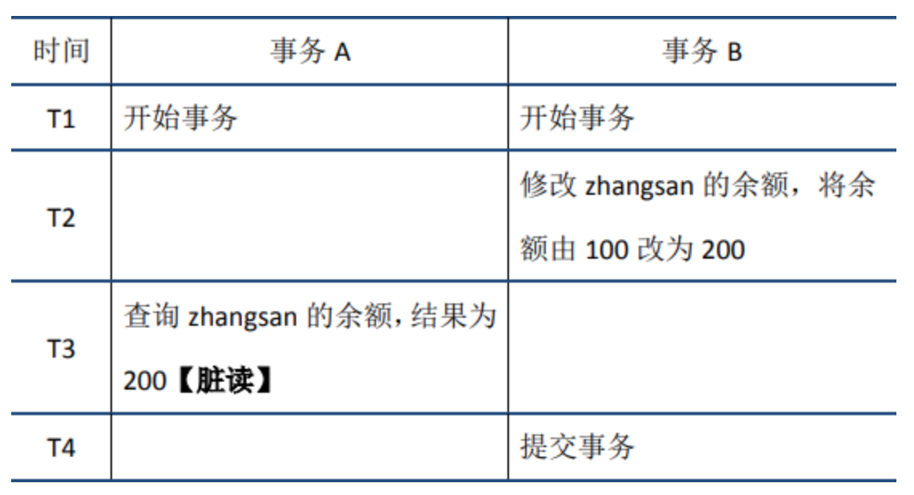{:width="50%" :height="50%"}

-   不可重复读：在事务A中先后两次读取同一个数据，两次读取的结果不一样，这种现象称为不可重复读。脏读与不可重复读的区别在于：前者读到的是其他事务未提交的数据，后者读到的是其他事务已提交的数据。举例如下

> 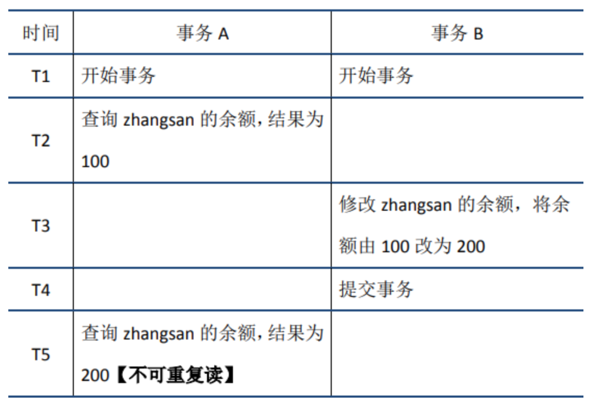{:width="50%" :height="50%"}

-   幻读：在事务A中按照某个条件先后两次查询数据库，两次查询结果的条数不同，这种现象称为幻读。不可重复读与幻读的区别可以通俗的理解为：前者是数据变了，后者是数据的行数变了（插入新的）。举例如下

> 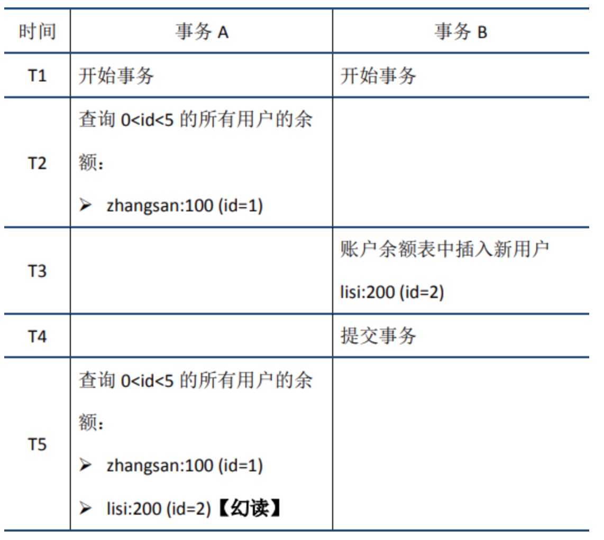{:width="50%" :height="50%"}

SQL标准中定义了四种隔离级别，并规定了每种隔离级别下上述几个问题是否存在。一般来说，隔离级别越低，系统开销越低，可支持的并发越高，但隔离性也越差。隔离级别与读问题的关系如下：

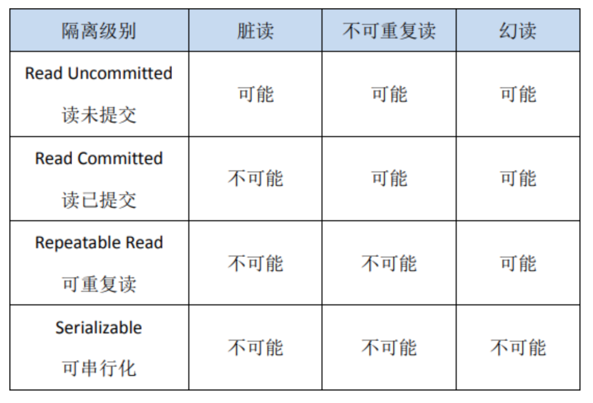{:width="50%" :height="50%"}

####  InnoDB如何解决的这3个问题？

这三个问题分别是脏读、不可重复读和幻读。

在这之前需要了解一下：

-   一致性非锁定读（consistent nonlocking read）

> Innodb引擎通过行多版本读取当前行数据。如果读取的行正在执行delete、update，这时的读取操作不会等待锁释放，而是读取行的快照数据。也叫快照读
> (snapshot read)例如使用"select \* from table ....;"语句。
>
> 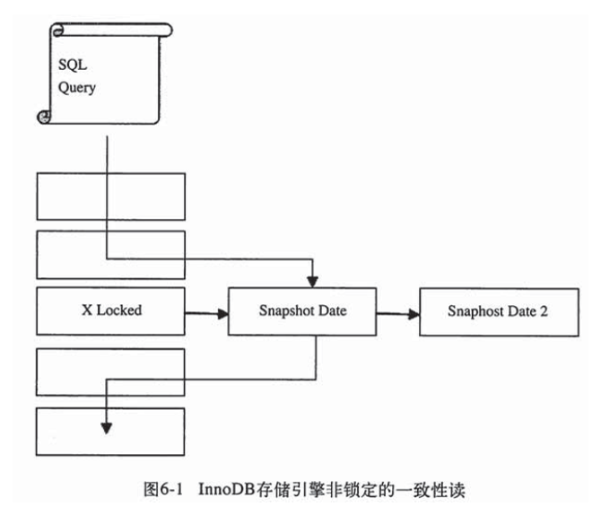{:width="50%" :height="50%"}

-   一致性锁定读（consistent locking read）

> 这种方式读取的是数据库当前版本数据也叫当前读 (current
> read)有下面两个select的同时还有修改操作(update/insert/delete)

1.select \* from table where ? lock in share mode;(共享锁:SLock)

2.select \* from table where ? for update;(排他锁:XLock)

InnoDB默认使用可重复读的隔离等级，解决脏读、不可重复读、幻读等问题，使用的是MVCC：MVCC全称Multi-Version
Concurrency
Control，即多版本的并发控制协议，也被称乐观锁。多个版本的数据可以共存，主要是依靠数据的隐藏列(也可以称之为标记位)和undo
log。其中数据的隐藏列包括了该行数据的版本号、删除时间、指向undo
log的指针等等；当读取数据时，MySQL可以通过隐藏列判断是否需要回滚并找到回滚需要的undo
log，从而实现MVCC；

原文5.5章：<https://www.cnblogs.com/kismetv/p/10331633.html>

注意：上面的原文中，描述的是一致性非锁定读，所以通过读取版本快照就解决了相关问题。但是在原文总结的时候，提出并不能innodb并不能保证完全隔离，事务B在T3插入了新记录，当事务A提交后余额还是被修改。**这个总结应该是错误的。**

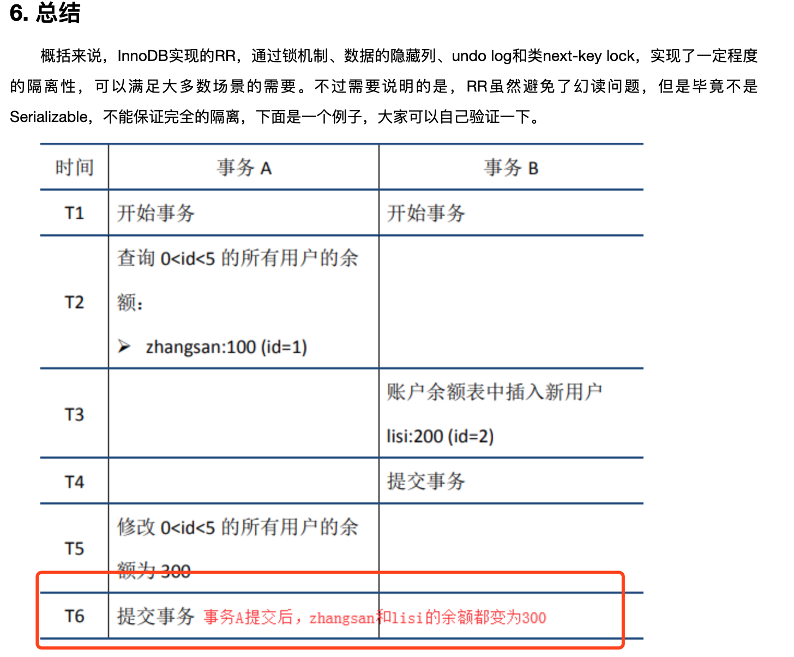{:width="60%" :height="50%"}
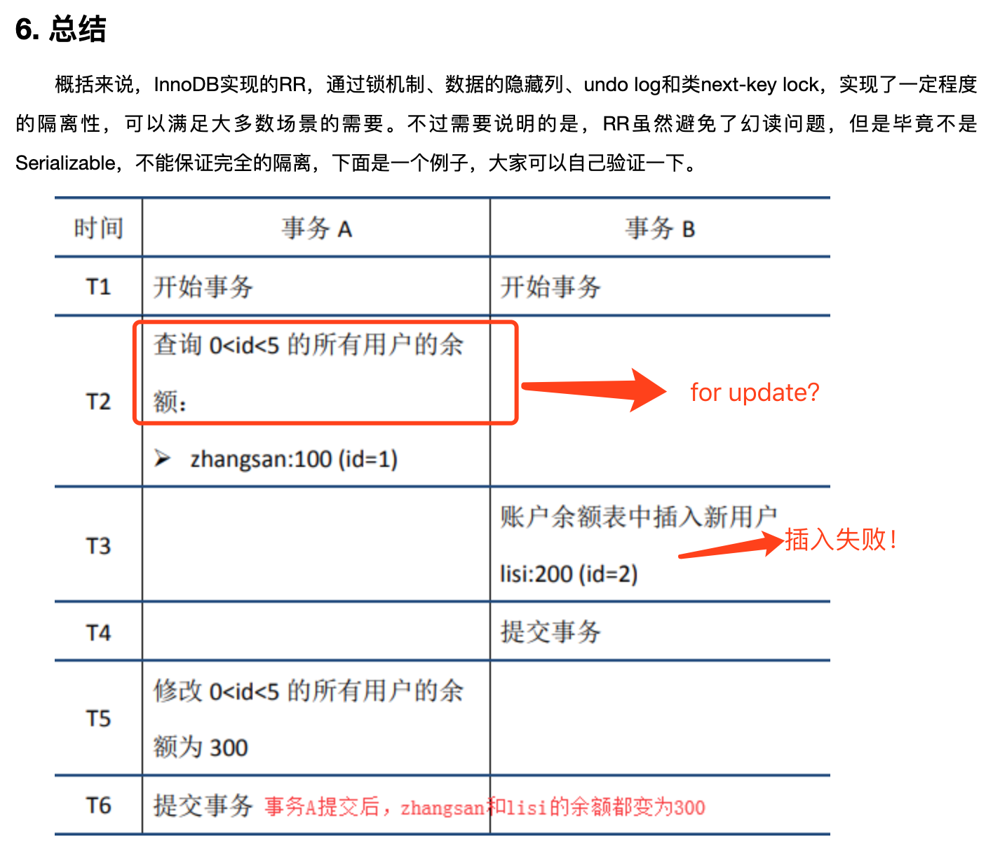{:width="60%" :height="50%"}

我理解是原文使用方式不对，因为如果使用一致性锁定读时，事务A将会使用Next-Key
Lock锁定相关范围（0-5），而事务B将插入失败。

上面的示例就是一个幻读(幻像)问题(phantom
problem)，在同一事物下，连续执行两次相同的sql导致不同的查询结果，第二次的sql可能回返之前不存在的行。

产生幻读的原因是，行锁只能锁住行，但是新插入记录这个动作，要更新的是记录之间的"间隙"。因此，为了解决幻读问题，InnoDB
只好引入新的锁，也就是间隙锁 (Gap
Lock)。间隙锁，锁的就是两个值之间的空隙。间隙锁和行锁合称 next-key
lock，每个 next-key lock 是前开后闭区间。

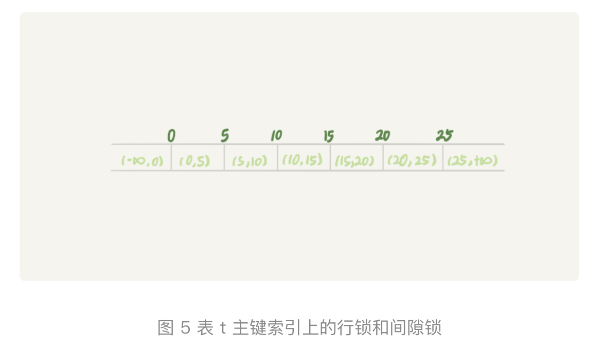{:width="50%" :height="50%"}

比如表 t，初始化插入了 6 个记录，这就产生了 7 个间隙。这样执行select \*
from t where d\<5 for
update的时候，0-5的间隙是被锁住的，事务B对这个范围的insert是不被允许的。这样就避免了幻读问题。

幻读的问题的描述(<https://time.geekbang.org/column/article/75173>)

##### 间隙锁在聚集索引和非聚集索引上的表现不同

锁的操作是建立在索引上的，如果共享锁（lock in share
mode）覆盖索引上，那它可以不锁定主键索引，所以其他事务操作范围内的主键可以update成功的。但是如果是for
update排他锁，那就会锁定主键索引，系统会猜测用户通过主键更新，所以相关记录会加上锁。

更多情况查看以下内容：

<https://time.geekbang.org/column/article/75659>

Redo log和Binlog区别是什么
--------------------------

### Binlog 是什么

Binary
log记录了对mysql数据库执行更改的所有操作。Binlog主要有以下几个作用：

-   Recovery恢复，用户可以通过日志进行point-in-time的恢复

-   Replication复制，slave或standby通过复制执行binlog，进行实时同步

-   Audit审计，通过日志进行审计，判断是否有对数据进行注入攻击

binlog
有statement模式、row模式、mixed模式（前两种的混合）。statement格式下，binlog记录的语句原文，可能遇到一个问题，备库同步完语句后，执行的效果（例如查询得索引选择）可能会不一样，导致同步数据有问题。这样可以选择使用row模式。row模式会明确指定主键id和内容。<https://time.geekbang.org/column/article/76446>

### Redo log和binlog的区别

因为最开始 MySQL 里并没有 InnoDB 引擎。MySQL 自带的引擎是 MyISAM，但是
MyISAM 没有 crash-safe 的能力，binlog 日志只能用于归档。而 InnoDB
是另一个公司以插件形式引入 MySQL 的，既然只依靠 binlog 是没有 crash-safe
能力的，所以 InnoDB 使用另外一套日志系统，也就是 redo log 来实现
crash-safe 能力。

这两种日志有以下三点不同：

1.  redo log 是 InnoDB 引擎特有的；binlog 是 MySQL 的 Server
    层实现的，所有引擎都可以使用。

2.  redo log 是物理日志，记录的是"在某个数据页上做了什么修改"；binlog
    是逻辑日志，记录的是这个语句的原始逻辑，比如"给 ID=2 这一行的 c
    字段加 1 "。

3.  redo log 是循环写的，空间固定会用完；binlog
    是可以追加写入的。"追加写"是指 binlog
    文件写到一定大小后会切换到下一个，并不会覆盖以前的日志。

### redo log和binlog的关系

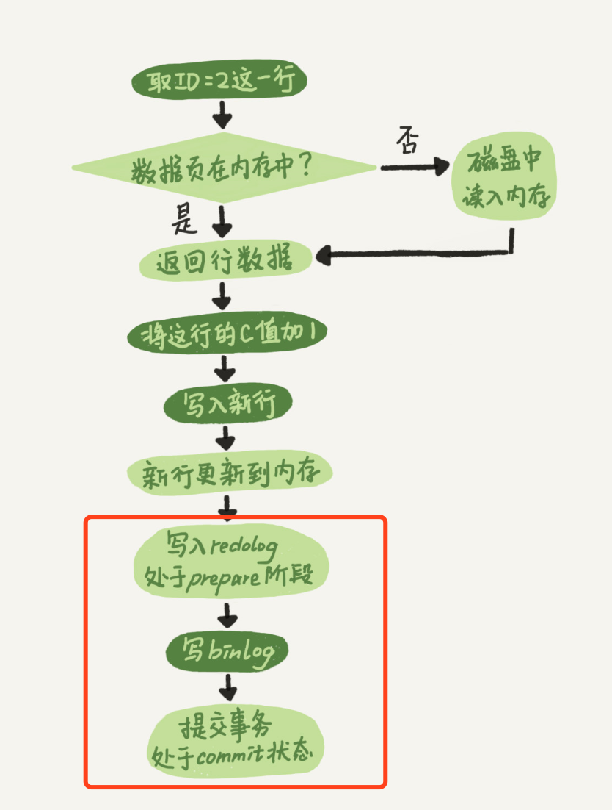{:width="50%" :height="50%"}

执行器和 InnoDB 引擎在执行这个简单的 update 语句时的内部流程如下：

1.  执行器先找引擎取 ID=2 这一行。ID
    是主键，引擎直接用树搜索找到这一行。如果 ID=2
    这一行所在的数据页本来就在内存中，就直接返回给执行器；否则，需要先从磁盘读入内存，然后再返回。

2.  执行器拿到引擎给的行数据，把这个值加上 1，比如原来是 N，现在就是
    N+1，得到新的一行数据，再调用引擎接口写入这行新数据。

3.  引擎将这行新数据更新到内存中，同时将这个更新操作记录到 redo log
    里面，此时 redo log 处于 prepare
    状态。然后告知执行器执行完成了，随时可以提交事务。

4.  执行器生成这个操作的 binlog，并把 binlog 写入磁盘。

5.  执行器调用引擎的提交事务接口，引擎把刚刚写入的 redo log
    改成提交（commit）状态，更新完成。

6.  如果没有commit就crash了，恢复时可以通过它们有共同的数据字段（XID）去查记录，如果binlog是完整的，那么就可以将redo
    log commit，这样主从都一致了。

提交方案为，先写redo log prepare 再写binlog，最后更新redo log
commit。为什么要两阶段提交？因为直接提交任意一个文件都有问题.

-   先写redo
    log，如果crash了，从库读取binlog读取不到这条，而master会通过redo
    log恢复，数据不一致。

-   如果先写binlog，crash了，备库会恢复这条数据，而master会从redo
    log中恢复，发现没有这条数据，无法恢复。

 Mysql逻辑架构
-------------

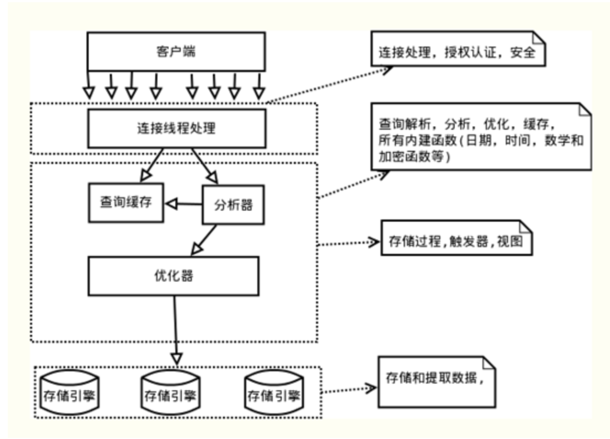{:width="50%" :height="50%"}

如上图所示，MySQL服务器逻辑架构从上往下可以分为三层：

（1）第一层：处理客户端连接、授权认证等。

（2）第二层：服务器层，负责查询语句的解析、优化、缓存以及内置函数的实现、存储过程等。

（3）第三层：存储引擎，负责MySQL中数据的存储和提取。MySQL中服务器层不管理事务，事务是由存储引擎实现的。MySQL支持事务的存储引擎有InnoDB、NDB
Cluster等，其中InnoDB的使用最为广泛；其他存储引擎不支持事务，如MyIsam、Memory等。

 InnoDB都有什么索引
------------------

### 自适应哈希索引

B+ tree 的查找取决于tree的高度，在生产环境中，B+
tree的高度一般为3\~4层，也就是3到4此查询，而Hash
的时间复杂度了O(1)，大多情况下只需查询1次。

InnoDB通过自动监控各个索引页的查询，判断热点页的条件符合程度建立相应的hash
index，这被称为自适应哈希索引（Adaptive Hash Index,AHI）。

{:width="60%" :height="50%"}

Innodb存储引擎会监控对表上二级索引的查找，如果发现某二级索引被频繁访问，二级索引成为热数据，建立哈希索引可以带来速度的提升。

需要注意的是，AHI只能用来所有等值查询，不支持范围查找。

通过下面的指令可以查看使用效果。


+--------------------------------------------------+
| mysql\> show engine innodb status\\G;            |
| ......                                           |
| Hash table size 34673, node heap has 0 buffer(s) |
| 0.00 hash searches/s, 0.00 non-hash searches/s   |
+--------------------------------------------------+


<https://www.cnblogs.com/geaozhang/p/7252389.html>

### B+ tree 索引

InnoDB使用的是B+ tree 当索引，B是balanced平衡的意思。B+
tree并不能找到一个给定值的具体行，它会找到数据行所在的页，数据库通过把页读到内存中，再在内存中进行查找，得到要查询的数据。

{:width="60%" :height="50%"}

B+树是为了磁盘或其他直接存取辅助设备设计的一种平衡查找树。所有的记录节点都是按照键值的大小顺序存放在同一层的叶子节点上，由各叶子节点指针进行连接。B+
tree有个特点是高扇出(fan
out，例如下面为3)，这样在树的高度就为2到4层，也就是查询记录只需要2到4次磁盘IO。

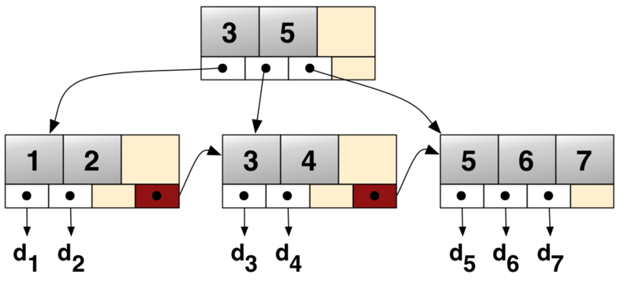{:width="60%" :height="50%"}

B+ tree索引可以分为聚集索引（clustered index）和辅助索引（secondary
index），他们不同的是，聚集索引叶子节点存放的是完整数据（数据页的形式），而辅助索引存储的是主键。

####  聚集索引 

InnoDB存储引擎是索引组织表，即表中数据按照主键顺序存放，而聚集索引就是按照每张表的主键构造一个B+树，同时叶子节点存放的即为整张表的行记录数据，也将聚集索引的叶子节点成为数据页。这个特性决定了索引组织表中的数据也是索引的一部分。

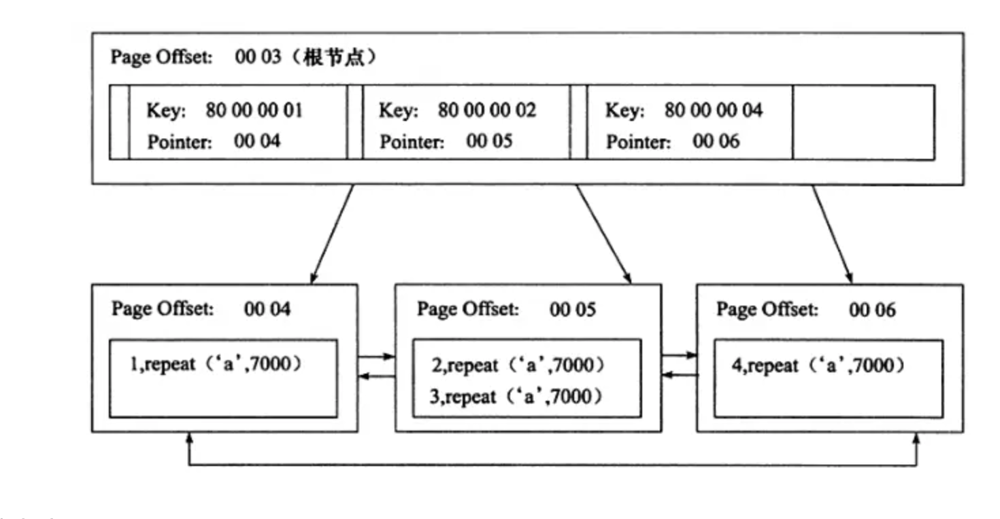{:width="60%" :height="50%"}

聚集索引使用主键构造树，可以在聚集索引的叶子节点上直接找到数据，由于定了数据的逻辑顺序，聚集索引能高效的针对范围值的查询。因此利用好主键实现业务逻辑能带来很高的查询效率。

####  非聚集索引

辅助索引（也成为了非聚集索引），叶子节点并不包含行记录的全部数据。叶子节点包含键值以外，还包含一个书签。该书签用来告诉InnoDB存储引擎哪里可以找到与索引相对应的行数据。由于InnDB存储引擎表示索引组织表，因此辅助索引的书签就是相对应的行数据的聚集索引键。每张表上可以有多个辅助索引。

{:width="60%" :height="50%"}

####  联合索引

联合索引是指对表上的多个列进行索引，他同样是B+
tree，和单个索引的区别是有多个索引列（键值数量大于1）。

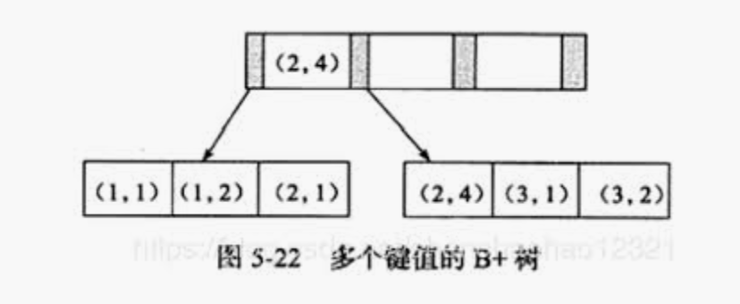{:width="60%" :height="50%"}

假定两个列分别为a,b。如图叶子节点是按照(a,b)字段的顺序进行存放。因此where
a=x and b=x 是可以利用上索引的，对于where
a=x也是可以利用上索引的，但是where b=x就不能利用上索引。

####  覆盖索引

覆盖索引（covering index
，或称为索引覆盖）即从非主键索引中就能查到的记录，而不需要查询主键索引中的记录，避免了回表的产生减少了树的搜索次数，显著提升性能。

例如下面的示例，name和age都不是主键索引，创建name和age的索引，在查询通过where
name=x即能查出age，而不需要回表。

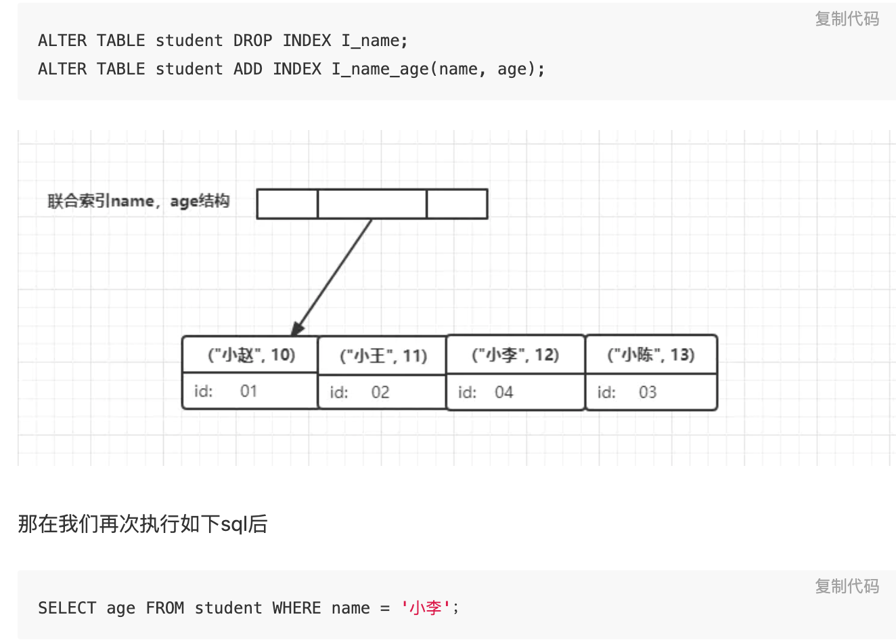{:width="60%" :height="50%"}

<https://juejin.im/post/5da5d1966fb9a04e252c94bf>

 对写有什么优化策略？
--------------------

{width="5.768055555555556in"
height="2.6284722222222223in"}

### WAL+MEM策略

在数据存储中，通常的写优化方案都是(WAL+内存)的方案：通过写内存保证插入速度，通过WAL解决内存容易丢失的问题。而WAL又是顺序写，所有速度能得到保证。redo
log 做WAL的实现。

### 减少资源竞争

{width="5.768055555555556in"
height="2.6284722222222223in"}

从InnoDB1.0.x开始，允许有多个缓冲池实例，每个页根据哈希值平均分配到不同的缓冲池实例，这样减少数据库内部的资源竞争。增加了并发处理能力。

### 减少磁盘写

前面提到InnoDB存储引擎是索引组织表，即表中数据按照主键顺序存放，聚集索引就是按照每张表的主键构造一个B+树，叶子节点就是数据。而非聚集索引是用来辅助的叶子节点是主键数据。

所以当一个表内既有聚集索引又有非聚集索引的情况下，磁盘操作不但要有写数据的IO还要有聚集索引写入的IO。这里就需要分两个情况

1.  **聚集索引操作（例如insert/update/delete自定义主键的数据）**

> 当操作记录时，要通过索引找到要插入范围的索引页，判断是否主键冲突然后在插入。如果这条数据的范围需要插入的目标页（数据页和索引页？）在内存中，那插入内存后返回（通过脏页刷新的策略写入磁盘）。如果不在内存中，则需要先将数据页加载到内存进行处理。

2.  **非聚集索引操作**

> 存储引擎对此设计了insert buffer
> ，当对非unique的索引插入或更新操作时，不是每一次直接插入索引页中，而是判断索引页是否在buffer
> pool，如果在则直接插入，如果不在则放到一个insert
> buffer对象中。然后再以一定的频率和情况对insert
> buffer和非聚集索引页子节点的merge操作。这能将多一个插入合并到一个操作(如果在一个索引页当中)。这样就提高了非聚集索引的插入性能。（change
> buffer是insert buffer的升级版，增加了delete buffer ,purge buffer）

### AIO+刷新临近页

在内存中被update之后的数据变成了脏页，当达到刷新到磁盘的条件时，引擎会检测该页所在区（extent）的所有页，如果是脏页那么一起进行刷新。这样通过AIO就将多个IO操作合并成了一个。

AIO（Asynchronous IO）相比Sync IO，不用等待每次IO完成，并且可以进行IO
Merge操作，将多个IO合并为一个，提高IOPS性能。在读取和写入都有一定的提升。

在机械硬盘下有显著的优势，但是如果是SSD存储，该特性可能没有太大帮助。1.2.x版本以后可以通过innodb\_flush\_neighbors参数进行关闭。

对读有什么优化策略？
--------------------

### B+树低IO

数据查询使用B+树本身就是为了磁盘或其他直接存储辅助设备设计的一种平衡查找树，数据结构决定了在查询磁盘数据时的高效性。

{:width="60%" :height="60%"}

B+树分为叶子节点和非叶子节点，叶子节点存储的是数据，非叶子节点存储的键值和指针。默认情况下页的大小为16k，粗略计算一条记录为1k，那每个叶子节点存储16条数据。

假设主键ID为bigint类型，长度为8字节，而指针大小在InnoDB源码中设置为6字节，这样一共14字节，即16k/14=1170。那么可以算出一棵高度为2的B+树，能存放1170\*16=18720
条这样的数据记录。高度为3的B+树可以存放 ：1170\*1170\*16=21902400
条这样的记录。

所以在InnoDB中B+树高度一般为1-3层，它就能满足千万级的数据存储。在查找数据时一次页的查找代表一次IO，所以通过主键索引查询通常只需要1-3次IO操作即可查找到数据。

<https://mp.weixin.qq.com/s/QmlVJJhHLVzjM7XMCOGPmg>

### 多种索引支持

覆盖索引、联合索引都是对具体业务根据不同的查询条件建立的索引，使用的当都能加快查询的速度。自适应哈希索引更是将热点页的数据将多次查询变为一次。

{:width="60%" :height="60%"}

### 内存查询

在磁盘之上增加内存来提升查询效率是最广泛的操作，mysql 的buffer
pool中存储了在写入时的最新数据，所以在数据查询时，如果内存中没有相关数据需要查询磁盘，加载数据也并返回，但是如果内存中有则能直接返回结果。

可以通过show engine innodb status查看内存命中效果。

#### 全表查询会不会替换热数据？

当进行数据查询时，会将数据加载到内存当中，如果内存中有相应的数据则可以直接返回，这样在查询热点数据的情况下，效率会提升很多。那执行一个全表查询会不会将热点数据全部替换掉导致真实的热点数据不能利用缓存呢？

InnoDB 内存管理用的是最近最少使用 (Least Recently Used, LRU)
算法，这个算法的核心就是淘汰最久未使用的数据。

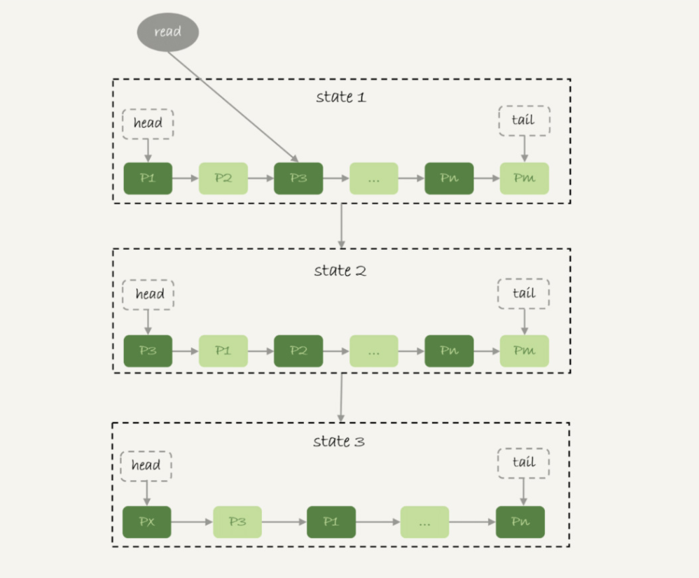{:width="60%" :height="60%"}

InnoDB 管理 Buffer Pool 的 LRU 算法，是用链表来实现的。

1.  在图 6 的状态 1 里，链表头部是 P1，表示 P1
    是最近刚刚被访问过的数据页；假设内存里只能放下这么多数据页；

2.  这时候有一个读请求访问 P3，因此变成状态 2，P3 被移到最前面；

3.  状态 3 表示，这次访问的数据页是不存在于链表中的，所以需要在 Buffer
    Pool 中新申请一个数据页
    Px，加到链表头部。但是由于内存已经满了，不能申请新的内存。于是，会清空链表末尾
    Pm 这个数据页的内存，存入 Px 的内容，然后放到链表头部。

4.  从效果上看，就是最久没有被访问的数据页 Pm，被淘汰了。

那么，按照这个算法扫描的话，就会把当前的 Buffer Pool
里的数据全部淘汰掉，存入扫描过程中访问到的数据页的内容。对于一个正在做业务服务的库，这可不妙。你会看到，Buffer
Pool 的内存命中率急剧下降，磁盘压力增加，SQL 语句响应变慢。

所以，InnoDB 不能直接使用这个 LRU 算法。实际上，InnoDB 对 LRU
算法做了改进。

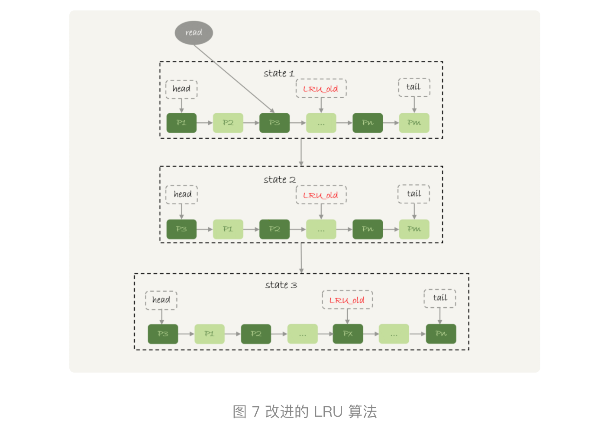{:width="80%" :height="80%"}

在 InnoDB 实现上，按照 5:3 的比例把整个 LRU 链表分成了 young 区域和 old
区域。图中 LRU\_old 指向的就是 old 区域的第一个位置，是整个链表的 5/8
处。也就是说，靠近链表头部的 5/8 是 young 区域，靠近链表尾部的 3/8 是
old 区域。

改进后的 LRU 算法的操作逻辑：

1.  扫描过程中，需要新插入的数据页，都被放到 old 区域 ;

2.  一个数据页里面有多条记录，这个数据页会被多次访问到，但由于是顺序扫描，这个数据页第一次被访问和最后一次被访问的时间间隔不会超过
    1 秒，因此还是会被保留在 old 区域；

3.  再继续扫描后续的数据，之前的这个数据页之后也不会再被访问到，于是始终没有机会移到链表头部（也就是
    young 区域），很快就会被淘汰出去。

可以看到，这个策略最大的收益，就是在扫描这个大表的过程中，虽然也用到了
Buffer Pool，但是对 young 区域完全没有影响，从而保证了 Buffer Pool
响应正常业务的查询命中率。

<https://time.geekbang.org/column/article/79407>

参考
====

<https://www.cnblogs.com/kismetv/p/10331633.html>

<https://time.geekbang.org/column/article/68633>

<https://www.cnblogs.com/geaozhang/p/7252389.html>

<https://segmentfault.com/a/1190000008545713>

<https://mp.weixin.qq.com/s/QmlVJJhHLVzjM7XMCOGPmg>

<https://time.geekbang.org/column/article/79407>

<https://zh.wikipedia.org/wiki/%E4%BA%8B%E5%8B%99%E9%9A%94%E9%9B%A2>

<https://time.geekbang.org/column/article/75173>
