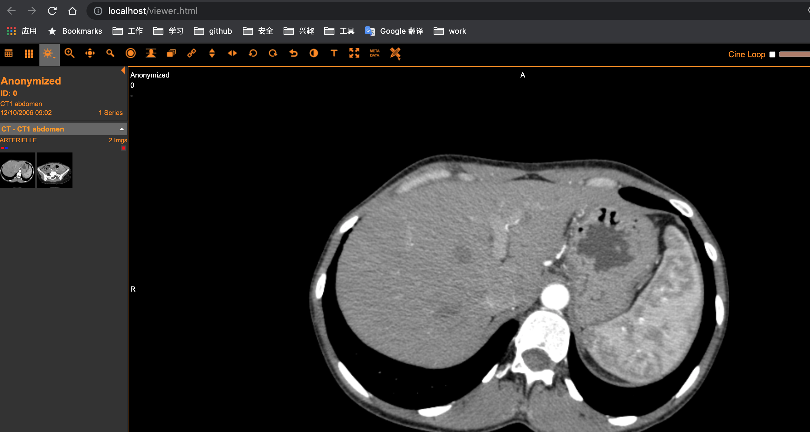

DICOM 扫盲

 
# DICOM介绍
 根据《医用电气设备DICOM在放射治疗中的应用指南》中描述到，在飞速增长的图像采集系统、显示工作站、归档系统与医院放射信息系统之间的互联和互相操作变得至关重要。为了简化和改善设备的互联性，专业医疗组织[美国放射学会(ACR)]联合医疗设备制造商们[美国国家电气制造商协会(NEMA)]国际化合作，共同开发DICOM(医学数字影像与通讯标准)。
 
 

* * *
  目前，DICOM标准提供下列服务：

  - **网络图像传输**：
    提供了两个设备间通讯发送对象的功能，诸如放射图像(例如CT、MR、CR、X射线血管造影与RF、PET、NM、US等)或RT图像与数据（RT结构集、计划、图像、剂量与治疗记录）。同事也可以识别和获取/传输远程设备上的图像/数据.网络传输是目前DICOM产品支持的最常用的互联特性。
  - **在线图像检查管理**：
    提供了医疗设备通过网络与各种信息系统想整合的功能，如医院信息系统（HIS）中的临床与管理数据，放射治疗信息系统（RIS）中的放射和放射治疗图像/数据。
  - **网络打印管理**：
    提供了通过网络连接的打印机/相机打印图像的功能。这样的一个示例是多个扫描机或工作站在单个共享的硬拷贝介质上打印图像。
  - **开放式介质交换**：
    提供了手工交换对象(图像或RT对象)与相关信息(例如报告或胶片信息)的功能，DICOM实现了通过文件格式、医疗目录结构与物理介质(例如CD、软盘)的标准化。示例包括用于出版的图像交换和用于远程会诊而发送患者图像序列。
  - **工作流程管理**：
    DICOM标准经过扩展，能够定义设备工作列表和通用目标工作列表，该列表设计用于请求、规划与描述成像性能和其他过程操作。这些过程的整合可以和其他标准化机构保持一直。在这方面更进一步的服务正在考虑中。
 
# DCM4CHE 
dcm4che 是面向医疗保健企业的开源应用程序和实用工具集合。项目使用java编写，实现了DICOM的标准。
dcm4che项目中包含了dcm4chee(额外的e代表‘enterprise’)，它是一个图像管理存储程序，该应用程序包含为医疗保健环境提供存储、检索和工作流所需的 DICOM、HL7 服务和接口。

## DCM4CHE demo
由于当前(2021-08)网络中存在的版本较老，部分搭建攻略也失效或不友好，这里记录一下如何快速搭建demo环境。
#### 使用docker运行minimum版本dcm4che.
详情如下:
[minimum版本运行](https://github.com/dcm4che/dcm4chee-arc-light/wiki/Run-minimum-set-of-archive-services-on-a-single-host)

运行起来后可以看到如下服务:

#### 导入DCM数据
通过storescu工具进行数据导入:
[storescu工具](https://github.com/dcm4che/dcm4che/blob/master/dcm4che-tool/dcm4che-tool-storescu/README.md)

```java
storescu -c DCM4CHEE@localhost:11112 test.dcm
```
DCM4CHEE是指定的AET,需要提前设定才能通过验证进行通讯.(该安装版本默认已经添加)


#### 查阅数据
在Navigation -> studies 菜单中,以DCM4CHE进行搜索,便可以将上一步上传数据查阅出


通过查询出的结果工具中，可以查看相关图形数据。


#### 使用oviyam查看图形
oviyam是一款开源的DICOM数据浏览器，可以使用docker进行部署。例如对刚刚的docker-compose.yml追加oviyam服务，将他们部署在同一套集群中

```java
  oviyam:
    image: informaticamedica/oviyam:2.8
    ports:
      - "80:8080"
      - "1025:1025"
    depends_on:
      - arc
```
重新启动集群后,可以进入到oviyam管理端(admin:adm1n),添加相应的配置，并进行配置验证。


这样就可以将DCOM4CHEE中的数据查询出来。




# 名词解释
  - PACS:Picture Archiving and Communication Systems的缩写，意思为影像归档和通信系统。
    是近年来随着数字成像技术、计算机技术和网络技术的进步而迅速发展起来的、旨在全面解决医学图像的获取、显示、存贮、传送和管理的综合系统。
  - DICOM:Digital Imaging and Communications in Medicine的英文缩写，即医学数字成像和通信标准
    DICOM标准以计算机网络的工业化标准为基础，它能帮助更有效地在医学影像设备之间传输交换数字影像，这些设备不仅包括CT、MR、核医学和超声检查，而且还包括CR、胶片数字化系统、视频采集系统和HIS／RIS信息管理系统等
  - ACR（American College of Radiology,美国放射学会）
  - NEMA（National Electrical Manufactorers Association,国家电子制造商协会）
  - HIS:医院信息系统(Hospital Information System, HIS)
    利用电子计算机和通讯设备，为医院所属各部门提供病人诊疗信息和行政管理信息的收集、存储、处理、提取和数据交换的能力，并满足所有授权用户的功能需求。
  - LIS:实验室信息管理系统(Laboratory Information Management System, LIS)
    是专为医院检验科设计的一套信息管理系统，能将实验仪器与计算机组成网络，使病人样品登录、实验数据存取、报告审核、打印分发，实验数据统计分析等繁杂的操作过程实现了智能化、自动化和规范化管理。有助于提高实验室的整体管理水平，减少漏洞，提高检验质量。
  - RIS:放射信息管理系统(Radioiogy information system, RIS)
    是优化医院放射科工作流程管理的软件系统,一个典型的流程包括登记预约、就诊、产生影像、出片、报告、审核、发片等环节
  - HL7:卫生信息交换标准（Health Level 7）
    标准化的卫生信息传输协议，是医疗领域不同应用之间电子传输的协议。HL7汇集了不同厂商用来设计应用软件之间接口的标准格式，它将允许各个医疗机构在异构系统之间，进行数据交互。HL7的主要应用领域是HIS/RIS，主要是规范HIS/RIS系统及其设备之间的通信，它涉及到病房和病人信息管理、化验系统、药房系统、放射系统、收费系统等各个方面。
  - IHE:Integrating the Healthcare Enterprise整合医疗保健企业

 


# 其他
<https://www.dicomserver.co.uk/WADO/>
<https://www.dicomstandard.org/current/>
<https://zhuanlan.zhihu.com/p/74966427>
 